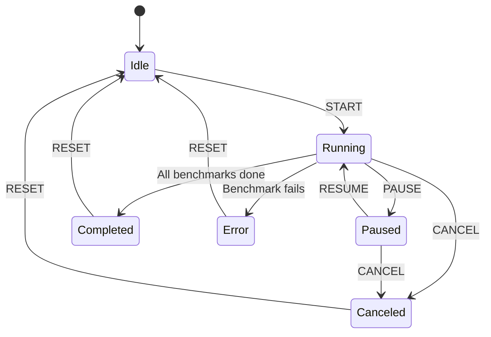
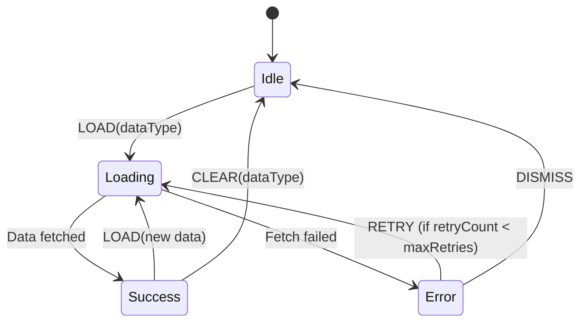
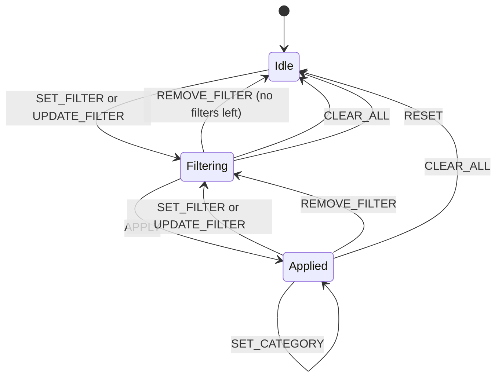

# XState v5.28.0 Integration

This document describes the XState v5.28.0 integration for the JOTP benchmark dashboard.

## Installation

```bash
npm install xstate@5.28.0 @xstate/react
```

**CRITICAL:** The XState version must be exactly v5.28.0. Do not downgrade.

## State Machines

### 1. Benchmark State Machine

**Location:** `/lib/benchmark-machine.ts`

**Purpose:** Manages the lifecycle of benchmark execution.

#### State Diagram



#### States

| State | Description |
|-------|-------------|
| `idle` | No benchmarks are running |
| `running` | Benchmarks are executing |
| `paused` | Execution is paused |
| `completed` | All benchmarks finished successfully |
| `canceled` | Execution was canceled |
| `error` | An error occurred |

#### Events

| Event | Payload | Description |
|-------|---------|-------------|
| `START` | `benchmarks?: Benchmark[]` | Start benchmark execution |
| `PAUSE` | - | Pause execution |
| `RESUME` | - | Resume from pause |
| `RESET` | - | Reset to idle state |
| `CANCEL` | - | Cancel execution |

#### Context

```typescript
interface BenchmarkMachineContext {
  benchmarks: Benchmark[];        // Benchmarks to run
  results: BenchmarkResult[];     // Collected results
  progress: Progress;             // Current progress
  errors: Array<{                 // Error log
    benchmark: string;
    error: string;
  }>;
  currentBenchmark?: string;      // Currently running
  startTime?: Date;               // Start timestamp
  endTime?: Date;                 // End timestamp
}
```

#### Usage

```typescript
import { useBenchmarkMachine } from '@/hooks/useBenchmarkMachine';

function BenchmarkDashboard() {
  const {
    isRunning,
    isCompleted,
    results,
    progress,
    start,
    pause,
    resume,
    reset,
  } = useBenchmarkMachine({
    onComplete: (results) => console.log('Done:', results),
  });

  return (
    <div>
      <button onClick={() => start(benchmarks)}>Start</button>
      <button onClick={pause}>Pause</button>
      <button onClick={resume}>Resume</button>
      <button onClick={reset}>Reset</button>
      <p>Progress: {progress.percentage}%</p>
    </div>
  );
}
```

---

### 2. Data Loading State Machine

**Location:** `/lib/data-loading-machine.ts`

**Purpose:** Manages asynchronous data loading with retry logic.

#### State Diagram



#### States

| State | Description |
|-------|-------------|
| `idle` | No data loading in progress |
| `loading` | Fetching data from API |
| `success` | Data loaded successfully |
| `error` | Error occurred, can retry |

#### Events

| Event | Payload | Description |
|-------|---------|-------------|
| `LOAD` | `dataType: DataType` | Load data type |
| `RETRY` | - | Retry failed request |
| `DISMISS` | - | Dismiss error |
| `CLEAR` | `dataType: DataType` | Clear cached data |

#### Context

```typescript
interface DataLoadingContext {
  data: Map<DataType, unknown>;   // Cached data
  error: string | null;            // Error message
  timestamp: Date | null;          // Load timestamp
  loadingType: DataType | null;    // Currently loading
  retryCount: number;              // Retry attempts
  maxRetries: number;              // Max retries (3)
}
```

#### Usage

```typescript
import { useDataLoading } from '@/hooks/useDataLoading';

function DataPanel() {
  const {
    isLoading,
    isSuccess,
    data,
    error,
    canRetry,
    load,
    retry,
    dismiss,
  } = useDataLoading({
    onSuccess: (type, data) => console.log(`Loaded ${type}:`, data),
  });

  return (
    <div>
      <button onClick={() => load('benchmarks')}>Load Benchmarks</button>
      {isLoading && <p>Loading...</p>}
      {isSuccess && <pre>{JSON.stringify(data, null, 2)}</pre>}
      {error && (
        <div>
          <p>Error: {error}</p>
          {canRetry && <button onClick={retry}>Retry</button>}
          <button onClick={dismiss}>Dismiss</button>
        </div>
      )}
    </div>
  );
}
```

---

### 3. Filter State Machine

**Location:** `/lib/filter-machine.ts`

**Purpose:** Manages filter application for benchmark results.

#### State Diagram



#### States

| State | Description |
|-------|-------------|
| `idle` | No filters active |
| `filtering` | Filters modified, not applied |
| `applied` | Filters applied to data |

#### Events

| Event | Payload | Description |
|-------|---------|-------------|
| `SET_FILTER` | `filter: Filter` | Add new filter |
| `UPDATE_FILTER` | `id, updates` | Update existing filter |
| `REMOVE_FILTER` | `id: string` | Remove filter |
| `CLEAR_ALL` | - | Clear all filters |
| `APPLY` | - | Apply filters |
| `RESET` | - | Reset to initial state |
| `SET_CATEGORY` | `category: FilterCategory` | Set active category |

#### Context

```typescript
interface FilterMachineContext {
  filters: Filter[];               // Active filters
  results: unknown[];              // Filtered results
  matchCount: number;              // Matched items count
  totalCount: number;              // Total items count
  activeCategory: FilterCategory;  // Active category
}
```

#### Filter Types

```typescript
type FilterOperator =
  | 'equals'
  | 'contains'
  | 'greaterThan'
  | 'lessThan'
  | 'between';

type FilterCategory = 'name' | 'performance' | 'date' | 'custom';

interface Filter {
  id: string;
  field: string;
  operator: FilterOperator;
  value: unknown;
  enabled: boolean;
}
```

#### Usage

```typescript
import { useFilters } from '@/hooks/useFilters';

function FilterPanel() {
  const {
    filters,
    results,
    matchCount,
    totalCount,
    setFilter,
    updateFilter,
    removeFilter,
    clearAll,
    apply,
    reset,
  } = useFilters({
    data: benchmarkResults,
    onFilterChange: (filters, results) => {
      console.log('Filters applied:', filters);
      console.log('Results:', results);
    },
  });

  const addPerformanceFilter = () => {
    setFilter({
      id: 'perf-1',
      field: 'opsPerSecond',
      operator: 'greaterThan',
      value: 1000,
      enabled: true,
    });
  };

  return (
    <div>
      <button onClick={addPerformanceFilter}>Add Filter</button>
      {filters.map((filter) => (
        <div key={filter.id}>
          <span>{filter.field}</span>
          <button onClick={() => updateFilter(filter.id, { enabled: false })}>
            Disable
          </button>
          <button onClick={() => removeFilter(filter.id)}>Remove</button>
        </div>
      ))}
      <button onClick={apply}>Apply</button>
      <button onClick={clearAll}>Clear All</button>
      <p>{matchCount} of {totalCount} results</p>
    </div>
  );
}
```

---

## React Hooks

### useBenchmarkMachine

Hook for benchmark state machine.

**Returns:**

| Property | Type | Description |
|----------|------|-------------|
| `state` | `string` | Current state value |
| `isIdle` | `boolean` | True if in idle state |
| `isRunning` | `boolean` | True if running |
| `isPaused` | `boolean` | True if paused |
| `isCompleted` | `boolean` | True if completed |
| `isCanceled` | `boolean` | True if canceled |
| `isError` | `boolean` | True if error |
| `results` | `BenchmarkResult[]` | Collected results |
| `progress` | `Progress` | Current progress |
| `errors` | `Array` | Error log |
| `start` | `(benchmarks?) => void` | Start benchmarks |
| `pause` | `() => void` | Pause execution |
| `resume` | `() => void` | Resume execution |
| `reset` | `() => void` | Reset to idle |
| `cancel` | `() => void` | Cancel execution |

### useDataLoading

Hook for data loading state machine.

**Returns:**

| Property | Type | Description |
|----------|------|-------------|
| `isLoading` | `boolean` | True if loading |
| `isSuccess` | `boolean` | True if success |
| `isError` | `boolean` | True if error |
| `data` | `Map` | Cached data |
| `error` | `string \| null` | Error message |
| `load` | `(type) => void` | Load data type |
| `retry` | `() => void` | Retry failed request |
| `dismiss` | `() => void` | Dismiss error |
| `getData` | `(type) => data` | Get cached data |
| `hasData` | `(type) => boolean` | Check if cached |

### useFilters

Hook for filter state machine.

**Returns:**

| Property | Type | Description |
|----------|------|-------------|
| `filters` | `Filter[]` | Active filters |
| `results` | `unknown[]` | Filtered results |
| `matchCount` | `number` | Matched count |
| `totalCount` | `number` | Total count |
| `setFilter` | `(filter) => void` | Add filter |
| `updateFilter` | `(id, updates) => void` | Update filter |
| `removeFilter` | `(id) => void` | Remove filter |
| `clearAll` | `() => void` | Clear all |
| `apply` | `() => void` | Apply filters |
| `reset` | `() => void` | Reset state |

---

## Utilities

**Location:** `/lib/xstate-utils.ts`

### Guards

- `hasData` - Check if context has data
- `hasErrors` - Check if context has errors
- `canRetry` - Check if retry count below max
- `isLoadingType` - Check loading type matches
- `hasItems` - Check if array has items

### Actions

- `logTransition` - Log transition (dev)
- `logError` - Log error (dev)
- `setLoading` - Set loading state
- `setSuccess` - Set success state
- `setError` - Set error state
- `reset` - Reset to initial
- `mergeData` - Merge data into context
- `pushToArray` - Push to array
- `removeFromArray` - Remove from array
- `updateInArray` - Update in array

### Services

- `fetchJSON` - Fetch JSON from API
- `withTimeout` - Execute with timeout
- `retryWithBackoff` - Retry with backoff
- `batch` - Batch operations

### Utilities

- `createMachine` - Create machine with config
- `createEventSender` - Create type-safe sender
- `createSelector` - Create selector
- `composeSelectors` - Compose selectors

---

## Testing

XState machines can be tested without React:

```typescript
import { createActor } from 'xstate';
import { benchmarkMachine } from '@/lib/benchmark-machine';

describe('Benchmark Machine', () => {
  it('should start running on START event', () => {
    const actor = createActor(benchmarkMachine);
    actor.start();
    actor.send({ type: 'START', benchmarks: [] });
    expect(actor.getSnapshot().value).toBe('running');
  });

  it('should pause on PAUSE event', () => {
    const actor = createActor(benchmarkMachine);
    actor.start();
    actor.send({ type: 'START', benchmarks: [] });
    actor.send({ type: 'PAUSE' });
    expect(actor.getSnapshot().value).toBe('paused');
  });
});
```

---

## Best Practices

1. **Always use the hooks** - They provide TypeScript types and convenience methods
2. **Handle all states** - Check state flags before showing UI
3. **Use callbacks** - Provide `onComplete`, `onSuccess`, `onError` for side effects
4. **Keep machines pure** - Don't add side effects inside machines; use callbacks instead
5. **Test without React** - Test machines directly using `createActor`
6. **Use guards** - Guards prevent invalid state transitions
7. **Document states** - Keep state diagrams updated with code changes

---

## Version Lock

**CRITICAL:** XState version is locked to v5.28.0. Do not change this version without explicit approval.

```json
{
  "dependencies": {
    "xstate": "5.28.0",
    "@xstate/react": "^6.1.0"
  }
}
```

To verify the version:

```bash
npm list xstate
```

Expected output:

```
benchmark-site@ /Users/sac/jotp/benchmark-site
├─┬ @xstate/react@6.1.0
│ └── xstate@5.28.0 deduped
└── xstate@5.28.0
```
