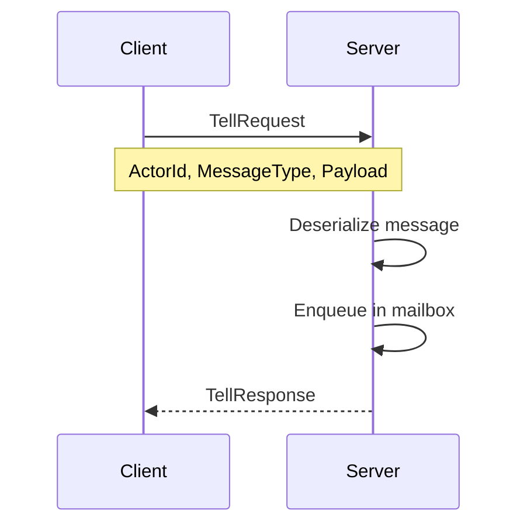
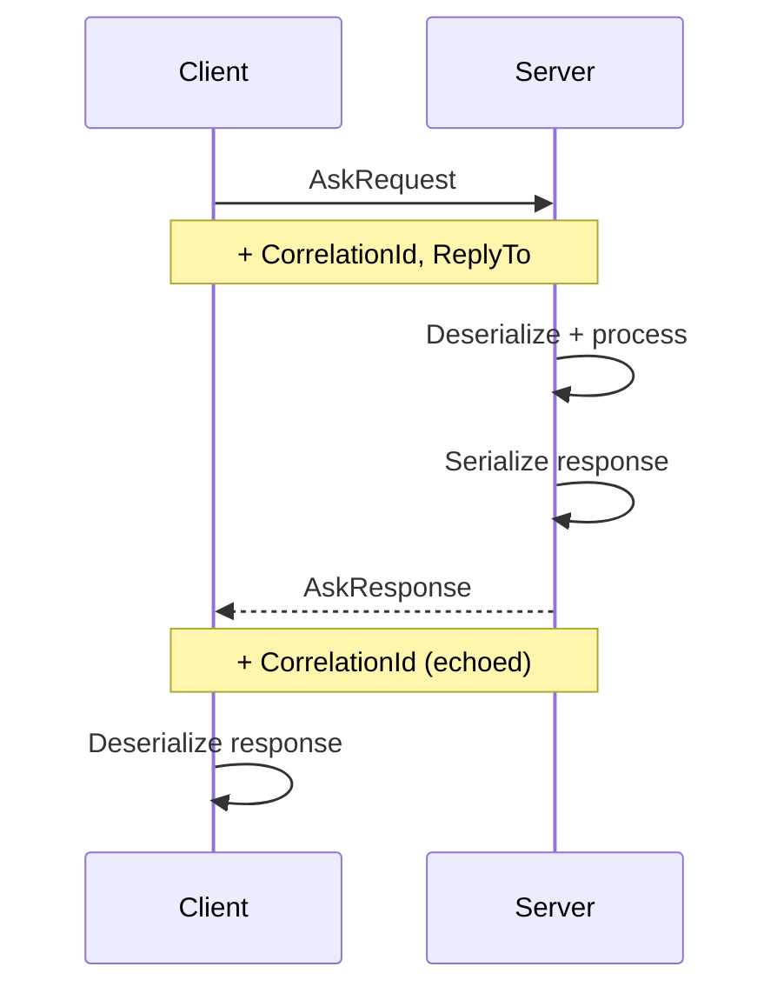

# Communication Protocols in JOTP Distributed Systems

**Version:** 1.0.0
**Last Updated:** 2026-03-16

## Table of Contents

1. [TCP Health Check Protocol](#tcp-health-check-protocol)
2. [gRPC Actor Messaging Protocol](#grpc-actor-messaging-protocol)
3. [Service Discovery Integration](#service-discovery-integration)
4. [Message Serialization](#message-serialization)
5. [Transport Layer Security](#transport-layer-security)

---

## TCP Health Check Protocol

### Overview

JOTP uses a simple newline-terminated TCP protocol for node health monitoring and cluster coordination.

### Protocol Specification

```
PING                                → PONG
STATUS appName                      → RUNNING | STOPPED
START appName normal                → OK | ERROR reason
START appName failover fromWire     → OK | ERROR reason
START appName takeover fromWire     → OK | ERROR reason
STOP appName                        → OK | ERROR reason
```

### Message Formats

#### PING/PONG

**Request:**
```
PING\n
```

**Response:**
```
PONG\n
```

**Purpose:** Liveness check between nodes

**Timing:**
- Connection timeout: 300ms
- Read timeout: 300ms
- Total round-trip: ~60-600µs (LAN)

#### STATUS

**Request:**
```
STATUS <appName>\n
```

**Response:**
```
RUNNING\n
```
or
```
STOPPED\n
```

**Purpose:** Query application status on remote node

**Use Case:** Standby nodes check if leader is still running the application

#### START (Normal)

**Request:**
```
START <appName> normal\n
```

**Response:**
```
OK\n
```
or
```
ERROR <reason>\n
```

**Purpose:** Start application normally (highest-priority node)

**Example:**
```
START telemetry-processor normal
→ OK
```

#### START (Failover)

**Request:**
```
START <appName> failover <fromWire>\n
```

**Response:**
```
OK\n
```
or
```
ERROR <reason>\n
```

**Purpose:** Start application after detecting leader failure

**Parameters:**
- `fromWire`: NodeId of crashed leader (format: `name@host:port`)

**Example:**
```
START telemetry-processor failover node1@10.0.1.10:5432
→ OK
```

#### START (Takeover)

**Request:**
```
START <appName> takeover <fromWire>\n
```

**Response:**
```
OK\n
```
or
```
ERROR <reason>\n
```

**Purpose:** Higher-priority node reclaims application from lower-priority node

**Parameters:**
- `fromWire`: NodeId of node yielding leadership

**Example:**
```
START telemetry-processor takeover node2@10.0.1.11:5432
→ OK
```

#### STOP

**Request:**
```
STOP <appName>\n
```

**Response:**
```
OK\n
```
or
```
ERROR <reason>\n
```

**Purpose:** Coordinated stop (prevents spurious failover)

**Behavior:**
- Sets `coordinatedStop` flag on all nodes
- Stops monitor threads
- Calls `onStop()` callback on running node

### Implementation Details

#### Server Side

```java
private void handleConnection(Socket socket) {
    try (socket;
         var reader = new BufferedReader(
             new InputStreamReader(socket.getInputStream()));
         var writer = new PrintWriter(
             new BufferedWriter(
                 new OutputStreamWriter(socket.getOutputStream())),
             true)) {

        String line = reader.readLine();
        if (line == null) return;

        String[] parts = line.split(" ", 4);
        String response = switch (parts[0]) {
            case "PING" -> "PONG";
            case "STATUS" -> handleStatus(parts[1]);
            case "START" -> handleStart(parts[1], parts[2], parts[3]);
            case "STOP" -> handleStop(parts[1]);
            default -> "ERROR unknown-command";
        };

        writer.println(response);
    } catch (IOException ignored) {
    }
}
```

#### Client Side

```java
private String send(NodeId target, String command) {
    try (Socket socket = new Socket()) {
        socket.connect(
            new InetSocketAddress(target.host(), target.port()),
            (int) CONNECT_TIMEOUT.toMillis()
        );
        socket.setSoTimeout((int) CONNECT_TIMEOUT.toMillis());

        var writer = new PrintWriter(
            new BufferedWriter(
                new OutputStreamWriter(socket.getOutputStream())),
            true
        );
        var reader = new BufferedReader(
            new InputStreamReader(socket.getInputStream())
        );

        writer.println(command);
        return reader.readLine();
    } catch (IOException e) {
        return null;  // Node unreachable
    }
}
```

### Performance Characteristics

| Metric | Value |
|--------|-------|
| Connection establishment | ~50-200µs (LAN) |
| Round-trip time (PING/PONG) | ~60-600µs (LAN) |
| Throughput | ~5K requests/sec/node |
| Memory per connection | ~8 KB (socket buffers) |

### Error Handling

#### Connection Timeout

```java
// 300ms connection timeout
socket.connect(address, 300);
```

**Behavior:**
- Returns `null` on timeout
- Triggers failure detection in monitor loop

#### Read Timeout

```java
// 300ms read timeout
socket.setSoTimeout(300);
```

**Behavior:**
- Throws `SocketTimeoutException`
- Caught and returns `null`

#### Malformed Requests

```java
// Invalid command format
ERROR unknown-command
```

**Behavior:**
- Returns error to client
- No state change on server

---

## gRPC Actor Messaging Protocol

### Overview

gRPC is used for location-transparent actor messaging across JVMs. The protocol provides request-response (ask) and fire-and-forget (tell) semantics.

### Protocol Definition

```protobuf
syntax = "proto3";

package jotp;

service ActorService {
  // Fire-and-forget message send
  rpc Tell (TellRequest) returns (TellResponse);

  // Request-response message send
  rpc Ask (AskRequest) returns (AskResponse);

  // Graceful actor stop
  rpc Stop (StopRequest) returns (StopResponse);
}

message TellRequest {
  string actor_id = 1;           // Target actor name
  string message_type = 2;       // Fully-qualified class name
  bytes payload = 3;             // Serialized message
  string trace_parent = 4;       // W3C trace context (optional)
}

message TellResponse {
  bool success = 1;
  string error_message = 2;      // Present if success=false
}

message AskRequest {
  string actor_id = 1;
  string message_type = 2;
  bytes payload = 3;
  string correlation_id = 4;     // For response matching
  string reply_to = 5;           // NodeId of sender
  string trace_parent = 6;
}

message AskResponse {
  bool success = 1;
  bytes payload = 2;             // Serialized response
  string error_message = 3;
  string correlation_id = 4;     // Echo request ID
}

message StopRequest {
  string actor_id = 1;
}

message StopResponse {
  bool success = 1;
  string error_message = 2;
}
```

### Message Flow

#### Tell (Fire-and-Forget)



**Timing:**
- Serialize: ~10-50µs
- Network: ~100-500µs (LAN)
- Deserialize: ~10-50µs
- Total: ~120-600µs

#### Ask (Request-Response)



**Timing:**
- Round-trip: ~240-1200µs (LAN)
- Includes processing time on server

### Implementation

#### Server Implementation

```java
public class ActorServiceImpl extends ActorServiceGrpc.ActorServiceImplBase {
    private final MessageCodec<?> codec;

    @Override
    public void tell(
        TellRequest request,
        StreamObserver<TellResponse> responseObserver
    ) {
        try {
            // Deserialize message
            Object message = codec.decode(request.getPayload());

            // Lookup actor
            Optional<Proc<?, ?>> proc = ProcRegistry.whereis(
                request.getActorId()
            );

            if (proc.isEmpty()) {
                responseObserver.onNext(
                    TellResponse.newBuilder()
                        .setSuccess(false)
                        .setErrorMessage("Actor not found")
                        .build()
                );
                responseObserver.onCompleted();
                return;
            }

            // Send message
            proc.get().tell(message);

            // Acknowledge
            responseObserver.onNext(
                TellResponse.newBuilder()
                    .setSuccess(true)
                    .build()
            );
            responseObserver.onCompleted();

        } catch (Exception e) {
            responseObserver.onNext(
                TellResponse.newBuilder()
                    .setSuccess(false)
                    .setErrorMessage(e.getMessage())
                    .build()
            );
            responseObserver.onCompleted();
        }
    }

    @Override
    public void ask(
        AskRequest request,
        StreamObserver<AskResponse> responseObserver
    ) {
        try {
            // Deserialize message
            Object message = codec.decode(request.getPayload());

            // Lookup actor
            Optional<Proc<?, ?>> proc = ProcRegistry.whereis(
                request.getActorId()
            );

            if (proc.isEmpty()) {
                responseObserver.onNext(
                    AskResponse.newBuilder()
                        .setSuccess(false)
                        .setErrorMessage("Actor not found")
                        .build()
                );
                responseObserver.onCompleted();
                return;
            }

            // Send message and wait for response
            CompletableFuture<?> response = proc.get().ask(message);

            response.thenAccept(state -> {
                try {
                    // Serialize response
                    byte[] payload = codec.encode(state);

                    responseObserver.onNext(
                        AskResponse.newBuilder()
                            .setSuccess(true)
                            .setPayload(ByteString.copyFrom(payload))
                            .setCorrelationId(request.getCorrelationId())
                            .build()
                    );
                    responseObserver.onCompleted();
                } catch (Exception e) {
                    responseObserver.onNext(
                        AskResponse.newBuilder()
                            .setSuccess(false)
                            .setErrorMessage(e.getMessage())
                            .build()
                    );
                    responseObserver.onCompleted();
                }
            });

        } catch (Exception e) {
            responseObserver.onNext(
                AskResponse.newBuilder()
                    .setSuccess(false)
                    .setErrorMessage(e.getMessage())
                    .build()
            );
            responseObserver.onCompleted();
        }
    }
}
```

#### Client Implementation

```java
public class RemoteActorHandle<S, M> {
    private final ActorServiceGrpc.ActorServiceBlockingStub stub;
    private final MessageCodec<M> codec;

    public void tell(M msg) {
        try {
            byte[] payload = codec.encode(msg);

            TellRequest request = TellRequest.newBuilder()
                .setActorId(actorId)
                .setMessageType(msg.getClass().getName())
                .setPayload(ByteString.copyFrom(payload))
                .build();

            TellResponse response = stub.tell(request);

            if (!response.getSuccess()) {
                throw new RuntimeException(
                    "Tell failed: " + response.getErrorMessage()
                );
            }
        } catch (Exception e) {
            throw new RuntimeException("Tell failed", e);
        }
    }

    public CompletableFuture<S> ask(M msg) {
        return CompletableFuture.supplyAsync(() -> {
            try {
                byte[] payload = codec.encode(msg);
                String correlationId = UUID.randomUUID().toString();

                AskRequest request = AskRequest.newBuilder()
                    .setActorId(actorId)
                    .setMessageType(msg.getClass().getName())
                    .setPayload(ByteString.copyFrom(payload))
                    .setCorrelationId(correlationId)
                    .setReplyTo(localNodeId.wire())
                    .build();

                AskResponse response = stub.ask(request);

                if (!response.getSuccess()) {
                    throw new RuntimeException(
                        "Ask failed: " + response.getErrorMessage()
                    );
                }

                @SuppressWarnings("unchecked")
                S result = (S) codec.decode(
                    response.getPayload().toByteArray()
                );

                return result;
            } catch (Exception e) {
                throw new RuntimeException("Ask failed", e);
            }
        });
    }
}
```

### Performance Optimization

#### Connection Pooling

```java
// Reuse gRPC channels instead of creating new ones
private static final Map<NodeId, ManagedChannel> channelCache =
    new ConcurrentHashMap<>();

public ManagedChannel getChannel(NodeId node) {
    return channelCache.computeIfAbsent(node, n ->
        ManagedChannelBuilder.forAddress(n.host(), n.port())
            .usePlaintext()  // Use TLS in production
            .build()
    );
}
```

#### Message Batching

```java
// Combine multiple messages into single request
message BatchTellRequest {
  repeated TellRequest requests = 1;
}

message BatchTellResponse {
  repeated TellResponse responses = 1;
}
```

#### Compression

```java
// Enable gzip compression for large payloads
ManagedChannel channel = ManagedChannelBuilder
    .forAddress(host, port)
    .enableCompression()
    .build();
```

---

## Service Discovery Integration

### Kubernetes DNS

```java
public class K8sServiceDiscovery {
    private final String serviceName;
    private final String namespace;

    public List<NodeId> discoverNodes() {
        try {
            String dnsName = serviceName + "." + namespace + ".svc.cluster.local";
            InetAddress[] addresses = InetAddress.getAllByName(dnsName);

            return Arrays.stream(addresses)
                .map(addr -> new NodeId(
                    "node-" + addr.getHostAddress(),
                    addr.getHostAddress(),
                    5432
                ))
                .toList();
        } catch (UnknownHostException e) {
            logger.error("DNS lookup failed for {}", serviceName, e);
            return List.of();
        }
    }
}
```

### Consul

```java
public class ConsulServiceDiscovery {
    private final String consulUrl;
    private final String serviceName;

    public List<NodeId> discoverNodes() {
        try {
            HttpClient client = HttpClient.newHttpClient();
            HttpRequest request = HttpRequest.newBuilder()
                .uri(URI.create(consulUrl + "/v1/health/service/" + serviceName))
                .GET()
                .build();

            HttpResponse<String> response = client.send(
                request,
                HttpResponse.BodyHandlers.ofString()
            );

            // Parse JSON response
            JsonNode nodes = objectMapper.readTree(response.body());

            List<NodeId> result = new ArrayList<>();
            for (JsonNode node : nodes) {
                JsonNode service = node.get("Service");
                String address = service.get("Address").asText();
                int port = service.get("Port").asInt();

                result.add(new NodeId(
                    "consul-" + address,
                    address,
                    port
                ));
            }

            return result;
        } catch (Exception e) {
            logger.error("Consul discovery failed", e);
            return List.of();
        }
    }
}
```

### Static Configuration

```java
public class StaticServiceDiscovery {
    private final List<NodeId> nodes;

    public StaticServiceDiscovery(List<NodeId> nodes) {
        this.nodes = List.copyOf(nodes);
    }

    public List<NodeId> discoverNodes() {
        return nodes;
    }
}

// Usage
var discovery = new StaticServiceDiscovery(List.of(
    new NodeId("node1", "10.0.1.10", 5432),
    new NodeId("node2", "10.0.1.11", 5432),
    new NodeId("node3", "10.0.1.12", 5432)
));
```

---

## Message Serialization

### Java Serialization (Default)

```java
public class JavaSerializationCodec<M> implements MessageCodec<M> {
    @Override
    public String encode(M msg) throws IOException {
        ByteArrayOutputStream baos = new ByteArrayOutputStream();
        ObjectOutputStream oos = new ObjectOutputStream(baos);
        oos.writeObject(msg);
        oos.close();
        return Base64.getEncoder().encodeToString(baos.toByteArray());
    }

    @Override
    public M decode(String encoded) throws IOException, ClassNotFoundException {
        byte[] decoded = Base64.getDecoder().decode(encoded);
        ByteArrayInputStream bais = new ByteArrayInputStream(decoded);
        ObjectInputStream ois = new ObjectInputStream(bais);
        @SuppressWarnings("unchecked")
        M msg = (M) ois.readObject();
        ois.close();
        return msg;
    }
}
```

**Pros:**
- Built into Java
- Works with any Serializable object

**Cons:**
- Verbose output
- Security concerns
- Version-sensitive

### JSON (Jackson)

```java
public class JsonMessageCodec<M> implements MessageCodec<M> {
    private final ObjectMapper mapper;
    private final Class<M> messageType;

    public JsonMessageCodec(Class<M> messageType) {
        this.mapper = new ObjectMapper();
        this.messageType = messageType;
    }

    @Override
    public String encode(M msg) throws IOException {
        return mapper.writeValueAsString(msg);
    }

    @Override
    public M decode(String encoded) throws IOException {
        return mapper.readValue(encoded, messageType);
    }
}
```

**Pros:**
- Human-readable
- Debuggable
- Language-agnostic

**Cons:**
- Slower than binary
- Larger payload size

### Protobuf

```protobuf
// message.proto
syntax = "proto3";

package jotp.example;

message OrderMessage {
  string order_id = 1;
  double amount = 2;
  string customer_id = 3;
}
```

```java
public class ProtobufMessageCodec<M extends Message> implements MessageCodec<M> {
    private final Parser<M> parser;

    public ProtobufMessageCodec(Parser<M> parser) {
        this.parser = parser;
    }

    @Override
    public String encode(M msg) throws IOException {
        return Base64.getEncoder().encodeToString(msg.toByteArray());
    }

    @Override
    public M decode(String encoded) throws IOException {
        byte[] decoded = Base64.getDecoder().decode(encoded);
        return parser.parseFrom(decoded);
    }
}
```

**Pros:**
- Smallest payload size
- Fastest serialization
- Schema-enforced

**Cons:**
- Requires .proto file
- Code generation step
- Less human-readable

---

## Transport Layer Security

### TLS Configuration

```java
// Server-side
SSLContext sslContext = SSLContext.getInstance("TLSv1.3");
KeyManagerFactory kmf = KeyManagerFactory.getInstance(
    KeyManagerFactory.getDefaultAlgorithm()
);
kmf.init(keyStore, keyPassword);

TrustManagerFactory tmf = TrustManagerFactory.getInstance(
    TrustManagerFactory.getDefaultAlgorithm()
);
tmf.init(trustStore);

sslContext.init(kmf.getKeyManagers(), tmf.getTrustManagers(), null);

Server server = ServerBuilder.forPort(port)
    .sslContext(sslContext)
    .addService(new ActorServiceImpl())
    .build();

// Client-side
ManagedChannel channel = ManagedChannelBuilder
    .forAddress(host, port)
    .sslContext(sslContext)
    .build();
```

### mTLS (Mutual TLS)

```java
// Require client certificates
Server server = ServerBuilder.forPort(port)
    .sslContext(sslContext)
    .useTransportSecurity()
    .build();
```

### Certificate Rotation

```java
public class CertificateRotator {
    private final KeyStore keyStore;
    private final long certExpiryMs;

    public void startRotationScheduler() {
        ScheduledExecutorService scheduler = Executors.newScheduledThreadPool(1);
        scheduler.scheduleAtFixedRate(() -> {
            if (isCertificateExpiringSoon()) {
                logger.warn("Certificate expiring soon, initiating rotation");
                rotateCertificate();
            }
        }, 1, 1, TimeUnit.DAYS);
    }

    private boolean isCertificateExpiringSoon() {
        // Check if certificate expires within 30 days
        return false;
    }

    private void rotateCertificate() {
        // Load new certificate from PKI
        // Reload SSLContext
        // Gracefully restart server
    }
}
```

---

## Performance Comparison

| Transport | Latency p50 | Throughput | Bandwidth | Complexity |
|-----------|-------------|------------|-----------|------------|
| TCP PING/PONG | ~60µs | ~5K req/s | ~1 Mbps | Low |
| gRPC (plaintext) | ~200µs | ~500K msg/s | ~600 Mbps | Medium |
| gRPC (TLS) | ~250µs | ~400K msg/s | ~500 Mbps | High |
| UDP (custom) | ~80µs | ~1.2M msg/s | ~1 Gbps | Medium |

---

## Best Practices

### Protocol Selection

1. **Use TCP for health checks** - Simple, reliable
2. **Use gRPC for actor messaging** - Type-safe, efficient
3. **Use protobuf for serialization** - Smallest size, fastest

### Security

1. **Enable TLS in production** - Never use plaintext in production
2. **Implement mTLS** - Authenticate both client and server
3. **Rotate certificates** - Every 90 days

### Performance

1. **Reuse connections** - Connection pooling
2. **Batch messages** - Combine small messages
3. **Enable compression** - For large payloads

### Reliability

1. **Set appropriate timeouts** - Based on network conditions
2. **Implement retries** - With exponential backoff
3. **Monitor latency** - Detect performance degradation

---

## Further Reading

- [Multi-JVM Architecture Guide](./MULTI-JVM-ARCHITECTURE.md)
- [Deployment Patterns](./DEPLOYMENT-PATTERNS.md)
- [Security Best Practices](./SECURITY.md)
