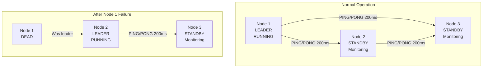
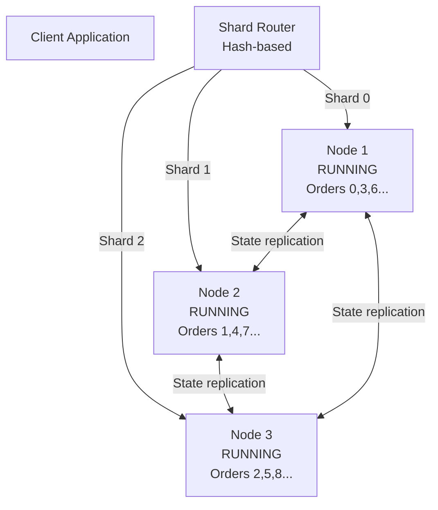
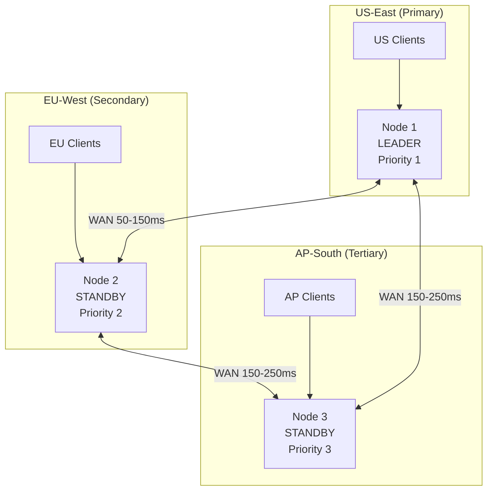
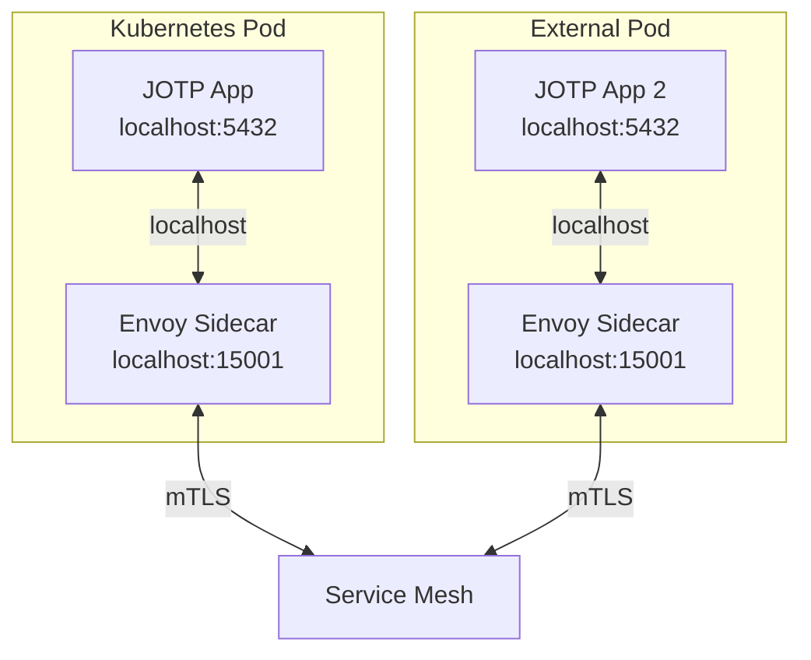

# Deployment Patterns for Distributed JOTP

**Version:** 1.0.0
**Last Updated:** 2026-03-16

## Table of Contents

1. [Active-Passive Pattern](#active-passive-pattern)
2. [Active-Active Pattern](#active-active-pattern)
3. [Geo-Distributed Pattern](#geo-distributed-pattern)
4. [Service Mesh Integration](#service-mesh-integration)
5. [Hybrid Patterns](#hybrid-patterns)
6. [Configuration Examples](#configuration-examples)

---

## Active-Passive Pattern

### Overview

The active-passive pattern uses leader election to ensure only one node runs the application at a time. Standby nodes monitor the leader and take over on failure.

### Architecture



### Implementation

```java
// Create distributed nodes
var node1 = new DistributedNode("cp1", "10.0.1.10", 5432, NodeConfig.defaults());
var node2 = new DistributedNode("cp2", "10.0.1.11", 5432, NodeConfig.defaults());
var node3 = new DistributedNode("cp3", "10.0.1.12", 5432, NodeConfig.defaults());

// Define application spec with priority order
var spec = new DistributedAppSpec(
    "payment-processor",
    List.of(
        List.of(node1.nodeId()),  // Tier 1: primary
        List.of(node2.nodeId()),  // Tier 2: first backup
        List.of(node3.nodeId())   // Tier 3: second backup
    ),
    Duration.ofSeconds(5)  // Failover after 5 seconds
);

// Register callbacks at all nodes
node1.register(spec, new PaymentProcessorCallbacks());
node2.register(spec, new PaymentProcessorCallbacks());
node3.register(spec, new PaymentProcessorCallbacks());

// Start application (only node1 will actually run it)
node1.start("payment-processor");
node2.start("payment-processor");
node3.start("payment-processor");
```

### Callbacks Example

```java
public class PaymentProcessorCallbacks implements ApplicationCallbacks {
    private Supervisor supervisor;

    @Override
    public void onStart(StartMode mode) {
        System.out.println("Starting payment processor in mode: " + mode);

        // Initialize supervisor tree
        supervisor = Supervisor.oneForOne(
            "payment-supervisor",
            ChildSpec.spec(
                "payment-coordinator",
                () -> new Proc<PaymentState, PaymentMsg>(
                    new PaymentState(),
                    this::handlePayment
                )
            )
        );
    }

    @Override
    public void onStop() {
        System.out.println("Stopping payment processor");
        if (supervisor != null) {
            supervisor.shutdown();
        }
    }

    private PaymentState handlePayment(PaymentState state, PaymentMsg msg) {
        // Business logic here
        return switch (msg) {
            case PaymentMsg.Charge(var id, var amount) -> processCharge(state, id, amount);
            case PaymentMsg.Refund(var id, var amount) -> processRefund(state, id, amount);
        };
    }
}
```

### Kubernetes Deployment

```yaml
apiVersion: apps/v1
kind: StatefulSet
metadata:
  name: jotp-payment-processor
spec:
  serviceName: jotp-payment-headless
  replicas: 3
  selector:
    matchLabels:
      app: jotp-payment
  template:
    metadata:
      labels:
        app: jotp-payment
    spec:
      containers:
      - name: jotp
        image: jotp:26.0.0
        env:
        - name: POD_NAME
          valueFrom:
            fieldRef:
              fieldPath: metadata.name
        - name: NODE_PRIORITY
          value: "$(echo $POD_NAME | sed 's/jotp-payment-processor-//')"
        ports:
        - containerPort: 5432
          name: gossip
        livenessProbe:
          tcpSocket:
            port: 5432
          initialDelaySeconds: 30
          periodSeconds: 10
        readinessProbe:
          exec:
            command:
            - /bin/sh
            - -c
            - "jotp-cli status payment-processor"
          initialDelaySeconds: 10
          periodSeconds: 5

---
apiVersion: v1
kind: Service
metadata:
  name: jotp-payment-headless
spec:
  clusterIP: None
  selector:
    app: jotp-payment
  ports:
  - port: 5432
    name: gossip
```

### Pros and Cons

**Pros:**
- Simple to understand and operate
- No split-brain risk
- Fast failover (200ms detection + configurable timeout)
- Clear ownership (one node responsible)

**Cons:**
- Standby nodes idle during normal operation
- Maximum throughput limited to single node
- Underutilized resources

**Best For:**
- Stateful services that cannot be easily sharded
- Applications requiring strong consistency
- Low to moderate throughput requirements
- Simple operational model

---

## Active-Active Pattern

### Overview

The active-active pattern runs the application on all nodes simultaneously, distributing load via sharding or consistent hashing.

### Architecture



### Implementation

```java
// Shard router for distributing requests
public class ShardedActorRouter {
    private final List<DistributedActorBridge> bridges;
    private final int shardCount;

    public ShardedActorRouter(List<DistributedNode> nodes) {
        this.bridges = nodes.stream()
            .map(node -> new DistributedActorBridge(
                node.nodeId().host(),
                node.nodeId().port()
            ))
            .toList();
        this.shardCount = nodes.size();
    }

    public RemoteActorHandle<OrderState, OrderMsg> route(String orderId) {
        int shard = Math.abs(orderId.hashCode()) % shardCount;
        DistributedActorBridge bridge = bridges.get(shard);
        return bridge.remoteRef(
            bridge.getHost(),
            bridge.getPort(),
            "order-processor-" + shard
        );
    }
}

// Initialize each node independently
for (int i = 0; i < nodes.size(); i++) {
    DistributedNode node = nodes.get(i);
    String shardName = "order-processor-" + i;

    // Start local actor for this shard
    var proc = new Proc<>(
        new OrderState(),
        this::handleOrder
    );
    ProcRegistry.register(shardName, proc);

    // Export to distributed bridge
    var bridge = new DistributedActorBridge(
        node.nodeId().host(),
        node.nodeId().port()
    );
    bridge.exportActor(shardName, proc);
    bridge.startServer();
}
```

### Client Usage

```java
// Client uses router transparently
var router = new ShardedActorRouter(nodes);

// Route to appropriate shard based on order ID
var orderRef = router.route("order-12345");
orderRef.tell(new OrderMsg.Charge(100.0));

// All requests for the same order go to the same shard
orderRef.tell(new OrderMsg.GetStatus());
```

### State Replication (Optional)

```java
// For eventual consistency across shards
public class ReplicatedOrderState {
    private final DistributedStateActor<OrderState, OrderMsg> replicatedState;

    public ReplicatedOrderState(DistributedActorBridge bridge) {
        this.replicatedState = bridge.lookupReplicated("order-state");
    }

    public void replicateOrder(String orderId, OrderState state) {
        // Replicate to quorum
        replicatedState.write(new OrderMsg.Update(orderId, state));
    }

    public OrderState getOrder(String orderId) {
        // Read from local replica (eventually consistent)
        return replicatedState.read();
    }
}
```

### Kubernetes Deployment

```yaml
apiVersion: apps/v1
kind: Deployment
metadata:
  name: jotp-order-processor
spec:
  replicas: 3  # Scale horizontally
  selector:
    matchLabels:
      app: jotp-order
  template:
    metadata:
      labels:
        app: jotp-order
    spec:
      containers:
      - name: jotp
        image: jotp:26.0.0
        env:
        - name: POD_NAME
          valueFrom:
            fieldRef:
              fieldPath: metadata.name
        - name: SHARD_ID
          valueFrom:
            fieldRef:
              fieldPath: metadata.uid
        ports:
        - containerPort: 5432
        resources:
          requests:
            memory: "512Mi"
            cpu: "500m"
          limits:
            memory: "2Gi"
            cpu: "2000m"

---
apiVersion: v1
kind: Service
metadata:
  name: jotp-order-service
spec:
  selector:
    app: jotp-order
  ports:
  - port: 5432
  type: ClusterIP
```

### Pros and Cons

**Pros:**
- Linear scalability (add nodes = add throughput)
- No single point of failure
- Maximum resource utilization
- Low latency (local processing)

**Cons:**
- Client-side routing complexity
- Rebalancing required when nodes join/leave
- Eventual consistency (if state replication used)
- Higher operational complexity

**Best For:**
- Stateless services or easily partitionable data
- High-throughput requirements
- Horizontal scaling needs
- Read-heavy workloads

---

## Geo-Distributed Pattern

### Overview

The geo-distributed pattern deploys nodes across multiple geographic regions for low-latency access and disaster recovery.

### Architecture



### Implementation

```java
// Create nodes in different regions
var usNode = new DistributedNode(
    "us-east-1",
    "jotp-us-east.example.com",
    5432,
    NodeConfig.defaults()
);

var euNode = new DistributedNode(
    "eu-west-1",
    "jotp-eu-west.example.com",
    5432,
    NodeConfig.defaults()
);

var apNode = new DistributedNode(
    "ap-south-1",
    "jotp-ap-south.example.com",
    5432,
    NodeConfig.defaults()
);

// Geo-distributed spec with longer failover timeout
var spec = new DistributedAppSpec(
    "global-payment-service",
    List.of(
        List.of(usNode.nodeId()),  // Primary: US-East
        List.of(euNode.nodeId()),  // Secondary: EU-West
        List.of(apNode.nodeId())   // Tertiary: AP-South
    ),
    Duration.ofSeconds(15)  // Longer timeout for WAN
);

// Register at all nodes
usNode.register(spec, new GlobalPaymentCallbacks());
euNode.register(spec, new GlobalPaymentCallbacks());
apNode.register(spec, new GlobalPaymentCallbacks());

// Start (US node becomes leader)
usNode.start("global-payment-service");
euNode.start("global-payment-service");
apNode.start("global-payment-service");
```

### Multi-Region Client Routing

```java
public class GeoAwareClient {
    private final DistributedActorBridge usBridge;
    private final DistributedActorBridge euBridge;
    private final DistributedActorBridge apBridge;

    public GeoAwareClient() {
        this.usBridge = new DistributedActorBridge(
            "jotp-us-east.example.com", 5432
        );
        this.euBridge = new DistributedActorBridge(
            "jotp-eu-west.example.com", 5432
        );
        this.apBridge = new DistributedActorBridge(
            "jotp-ap-south.example.com", 5432
        );
    }

    public RemoteActorHandle<?, ?> getNearestNode(String clientRegion) {
        return switch (clientRegion) {
            case "us-east", "us-west" -> usBridge.remoteRef(
                usBridge.getHost(), usBridge.getPort(),
                "global-payment-service"
            );
            case "eu-west", "eu-central" -> euBridge.remoteRef(
                euBridge.getHost(), euBridge.getPort(),
                "global-payment-service"
            );
            case "ap-south", "ap-southeast" -> apBridge.remoteRef(
                apBridge.getHost(), apBridge.getPort(),
                "global-payment-service"
            );
            default -> usBridge.remoteRef(  // Default to US
                usBridge.getHost(), usBridge.getPort(),
                "global-payment-service"
            );
        };
    }
}
```

### DNS-Based Routing

```yaml
# GeoDNS configuration (Route53, Cloudflare, etc.)
# Example: Route53 latency-based routing

resource "aws_route53_record" "jotp_global" {
  zone_id = aws_route53_zone.main.zone_id
  name    = "jotp-global.example.com"
  type    = "A"

  alias {
    name                   = aws_elb.us_east.dns_name
    zone_id                = aws_elb.us_east.zone_id
    evaluate_target_health = true
  }

  # Latency-based routing
  latency_routing_policy {
    region = "us-east-1"
  }
}

# EU endpoint
resource "aws_route53_record" "jotp_eu" {
  zone_id = aws_route53_zone.main.zone_id
  name    = "jotp-global.example.com"
  type    = "A"

  alias {
    name                   = aws_elb.eu_west.dns_name
    zone_id                = aws_elb.eu_west.zone_id
    evaluate_target_health = true
  }

  latency_routing_policy {
    region = "eu-west-1"
  }
}
```

### Pros and Cons

**Pros:**
- Low latency for regional users
- Disaster recovery capability
- Compliance with data sovereignty laws
- High availability across regions

**Cons:**
- Higher operational complexity
- Increased infrastructure costs
- Network partition risk (split-brain)
- Data consistency challenges

**Best For:**
- Global user base
- Compliance requirements (data residency)
- Disaster recovery needs
- Low-latency requirements

---

## Service Mesh Integration

### Overview

Integrate JOTP with Kubernetes service mesh (Istio, Linkerd) for mTLS, observability, and traffic management.

### Architecture



### Implementation

```java
// JOTP connects to sidecar proxy instead of remote nodes directly
public class ServiceMeshBridge {
    private final DistributedActorBridge localBridge;

    public ServiceMeshBridge() {
        // Connect to local sidecar proxy
        this.localBridge = new DistributedActorBridge(
            "localhost",  // Local sidecar
            15001         // Sidecar's inbound port
        );
        localBridge.startServer();
    }

    public RemoteActorHandle<?, ?> getRemoteActor(String serviceName) {
        // Service mesh handles routing via Kubernetes service DNS
        String dnsName = serviceName + ".default.svc.cluster.local";

        return localBridge.remoteRef(
            dnsName,  // Service mesh routes this to appropriate pod
            5432,     // Sidecar forwards to application's port
            "my-actor"
        );
    }
}
```

### Istio Configuration

```yaml
# Istio ServiceEntry for external JOTP cluster
apiVersion: networking.istio.io/v1beta1
kind: ServiceEntry
metadata:
  name: jotp-external-cluster
spec:
  hosts:
  - jotp-external.example.com
  ports:
  - number: 5432
    name: grpc
    protocol: GRPC
  location: MESH_EXTERNAL
  resolution: DNS

---
# Istio DestinationRule for traffic policies
apiVersion: networking.istio.io/v1beta1
kind: DestinationRule
metadata:
  name: jotp-traffic-policy
spec:
  host: "jotp-cluster.default.svc.cluster.local"
  trafficPolicy:
    tls:
      mode: ISTIO_MUTUAL  # mTLS for all traffic
    connectionPool:
      tcp:
        maxConnections: 100
      http:
        http2MaxRequests: 1000
    loadBalancer:
      simple: LEAST_CONN  # Distribute load to least busy node

---
# Istio VirtualService for routing
apiVersion: networking.istio.io/v1beta1
kind: VirtualService
metadata:
  name: jotp-routing
spec:
  hosts:
  - "jotp-cluster.default.svc.cluster.local"
  http:
  - match:
    - headers:
        x-jotp-shard:
          exact: "0"
    route:
    - destination:
        host: jotp-cluster
        subset: v1
      weight: 100
  - route:
    - destination:
        host: jotp-cluster
        subset: v1
      weight: 100
```

### Observability Integration

```java
// OpenTelemetry integration for distributed tracing
public class TracingActorBridge {
    private final DistributedActorBridge delegate;
    private final Tracer tracer;

    public <S, M> CompletableFuture<S> ask(
        String actorName,
        M message,
        Duration timeout
    ) {
        Span span = tracer.spanBuilder("jotp.ask")
            .setSpanKind(SpanKind.CLIENT)
            .setAttribute("jotp.actor", actorName)
            .setAttribute("jotp.message_type", message.getClass().getSimpleName())
            .startSpan();

        try (Scope scope = span.makeCurrent()) {
            return delegate.remoteRef(
                delegate.getHost(),
                delegate.getPort(),
                actorName
            ).ask(message).orTimeout(timeout.toMillis(), TimeUnit.MILLISECONDS)
              .whenComplete((result, error) -> {
                  if (error != null) {
                      span.recordException(error);
                      span.setStatus(StatusCode.ERROR, error.getMessage());
                  } else {
                      span.setStatus(StatusCode.OK);
                  }
                  span.end();
              });
        }
    }
}
```

### Pros and Cons

**Pros:**
- Automatic mTLS encryption
- Rich observability (metrics, traces, logs)
- Traffic management without code changes
- Polyglot service support

**Cons:**
- Additional latency (sidecar hop)
- Increased operational complexity
- Resource overhead (proxy per pod)
- Vendor lock-in (Istio-specific features)

**Best For:**
- Kubernetes deployments
- Multi-language service meshes
- Compliance requirements (encryption)
- Complex traffic management needs

---

## Hybrid Patterns

### Pattern 1: Active-Active with Leader Election

Combine horizontal scaling with leader election for different components:

```java
// Active-active for stateless services
var orderRouter = new ShardedActorRouter(orderNodes);

// Active-passive for stateful services
var paymentSpec = new DistributedAppSpec(
    "payment-processor",
    List.of(
        List.of(paymentNodes.get(0).nodeId()),
        List.of(paymentNodes.get(1).nodeId())
    ),
    Duration.ofSeconds(5)
);
```

### Pattern 2: Geo-Active-Active

Run active-active within each region, active-passive across regions:

```java
// Region 1: 3-node active-active cluster
var usRouter = new ShardedActorRouter(usNodes);

// Region 2: 3-node active-active cluster
var euRouter = new ShardedActorRouter(euNodes);

// Cross-region leader election for coordinator
var coordinatorSpec = new DistributedAppSpec(
    "global-coordinator",
    List.of(
        List.of(usNodes.get(0).nodeId()),  // US primary
        List.of(euNodes.get(0).nodeId())   // EU standby
    ),
    Duration.ofSeconds(10)
);
```

---

## Configuration Examples

### Docker Compose

```yaml
version: '3.8'

services:
  jotp-node1:
    image: jotp:26.0.0
    container_name: jotp-node1
    environment:
      - NODE_NAME=node1
      - PORT=5432
      - JAVA_OPTS=-Xmx2g -Xms2g
    ports:
      - "5432:5432"
    networks:
      - jotp-network
    restart: unless-stopped

  jotp-node2:
    image: jotp:26.0.0
    container_name: jotp-node2
    environment:
      - NODE_NAME=node2
      - PORT=5432
      - JAVA_OPTS=-Xmx2g -Xms2g
    ports:
      - "5433:5432"
    networks:
      - jotp-network
    depends_on:
      - jotp-node1
    restart: unless-stopped

  jotp-node3:
    image: jotp:26.0.0
    container_name: jotp-node3
    environment:
      - NODE_NAME=node3
      - PORT=5432
      - JAVA_OPTS=-Xmx2g -Xms2g
    ports:
      - "5434:5432"
    networks:
      - jotp-network
    depends_on:
      - jotp-node1
    restart: unless-stopped

networks:
  jotp-network:
    driver: bridge
```

### Terraform (AWS)

```hcl
# VPC for JOTP cluster
resource "aws_vpc" "jotp_vpc" {
  cidr_block           = "10.0.0.0/16"
  enable_dns_hostnames = true
  enable_dns_support   = true

  tags = {
    Name = "jotp-vpc"
  }
}

# Subnets in multiple AZs
resource "aws_subnet" "jotp_subnets" {
  count                   = 3
  vpc_id                  = aws_vpc.jotp_vpc.id
  cidr_block              = "10.0.${count.index}.0/24"
  availability_zone       = data.aws_availability_zones.available.names[count.index]
  map_public_ip_on_launch = true

  tags = {
    Name = "jotp-subnet-${count.index}"
  }
}

# Security group for JOTP nodes
resource "aws_security_group" "jotp_sg" {
  name_prefix = "jotp-"
  vpc_id      = aws_vpc.jotp_vpc.id

  # Allow intra-node communication
  ingress {
    from_port = 5432
    to_port   = 5432
    protocol  = "tcp"
    self      = true
  }

  # Allow health checks
  ingress {
    from_port   = 8080
    to_port     = 8080
    protocol    = "tcp"
    cidr_blocks = ["0.0.0.0/0"]
  }

  egress {
    from_port   = 0
    to_port     = 0
    protocol    = "-1"
    cidr_blocks = ["0.0.0.0/0"]
  }

  tags = {
    Name = "jotp-security-group"
  }
}

# EC2 instances for JOTP nodes
resource "aws_instance" "jotp_nodes" {
  count                  = 3
  ami                    = data.aws_ami.ubuntu.id
  instance_type          = "t3.medium"
  subnet_id              = aws_subnet.jotp_subnets[count.index].id
  vpc_security_group_ids = [aws_security_group.jotp_sg.id]

  tags = {
    Name = "jotp-node-${count.index}"
  }
}
```

---

## Best Practices

### Deployment

1. **Use odd-numbered clusters** for clear majority
2. **Spread nodes across AZs** for fault tolerance
3. **Configure appropriate timeouts** based on network conditions
4. **Test failover regularly** in staging environments
5. **Monitor leader election** for performance issues

### Configuration

1. **Set heap size to 2-4x** expected per-actor memory
2. **Enable GC logging** for memory troubleshooting
3. **Use container resource limits** to prevent node starvation
4. **Configure liveness/readiness probes** for Kubernetes
5. **Set appropriate replication factors** for stateful services

### Operations

1. **Rolling upgrades** - upgrade standbys first, then leader
2. **Graceful shutdown** - call `node.stop()` before terminating
3. **Monitor message queues** for backpressure
4. **Set up alerts** for failover events
5. **Test disaster recovery** procedures regularly

---

## Further Reading

- [Multi-JVM Architecture Guide](./MULTI-JVM-ARCHITECTURE.md)
- [Failure Handling](./FAILURE-HANDLING.md)
- [Security Best Practices](./SECURITY.md)
- [Monitoring and Observability](./MONITORING.md)
