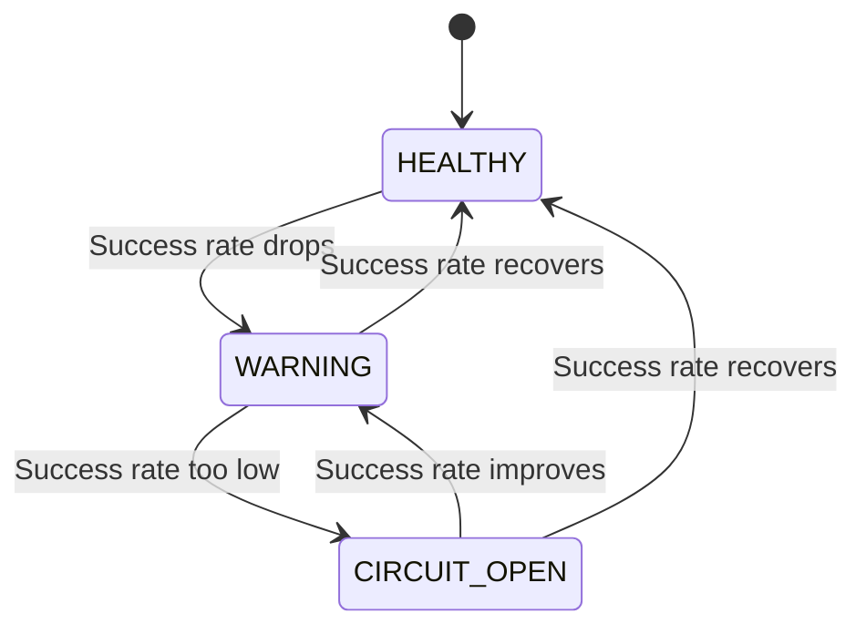

# Backpressure Pattern

## Overview

The Backpressure pattern prevents queue explosion when downstream services are slow or failing. It implements timeout-based flow control with adaptive timeout adjustment based on success rates.

**Purpose**: Protect systems from overload by controlling request rates and preventing buffer overflow.

**State Machine**:
- `HEALTHY`: All requests completing within timeout
- `WARNING`: Some timeouts but service still responding (adjust timeout upward)
- `CIRCUIT_OPEN`: Too many timeouts, reject requests

## Architecture



The backpressure coordinator tracks a sliding window of request results and adapts timeout values dynamically.

## Public API

### Configuration

```java
public record BackpressureConfig(
    String serviceName,                    // Name of the service being protected
    Duration initialTimeout,               // Initial timeout for requests
    Duration maxTimeout,                   // Maximum timeout (adaptive upper bound)
    int windowSize,                        // Size of sliding result window
    double successRateThreshold            // Success rate % for HEALTHY (0.0-1.0)
)

public sealed interface BackpressureEvent {
    record RequestCompleted(String requestId, long durationMs) implements BackpressureEvent {}
    record RequestTimedOut(String requestId) implements BackpressureEvent {}
    record StatusChanged(Status from, Status to) implements BackpressureEvent {}
    enum Status { HEALTHY, WARNING, CIRCUIT_OPEN }
}
```

### Creating a Backpressure Coordinator

```java
BackpressureConfig config = new BackpressureConfig(
    "payment-gateway",
    Duration.ofSeconds(3),    // initialTimeout
    Duration.ofSeconds(30),   // maxTimeout
    100,                      // windowSize
    0.95                      // successRateThreshold (95%)
);

Backpressure backpressure = Backpressure.create(config);
```

### Executing Requests

```java
Result<String> result = backpressure.execute(
    timeout -> {
        // Your service call here
        return paymentGateway.charge(card, amount);
    },
    Duration.ofSeconds(3)  // Default timeout
);

// Handle result
if (result instanceof Result.Success<String> s) {
    System.out.println("Payment: " + s.value());
} else if (result instanceof Result.Failure<String> f) {
    System.err.println("Failed: " + f.error().getMessage());
}
```

### Event Listeners

```java
backpressure.addListener((from, to) -> {
    logger.info("Backpressure status changed: {} → {}", from, to);

    if (to == BackpressureState.Status.CIRCUIT_OPEN) {
        // Alert operations
        alertingService.alert("Backpressure circuit OPEN for " + config.serviceName());

        // Stop accepting new requests
        requestLimiter.disable();
    } else if (to == BackpressureState.Status.HEALTHY) {
        // Resume normal operation
        requestLimiter.enable();
    }
});
```

### Shutdown

```java
backpressure.shutdown();
```

## Usage Examples

### Basic Backpressure

```java
// Create backpressure coordinator
BackpressureConfig config = new BackpressureConfig(
    "external-api",
    Duration.ofSeconds(2),    // Start with 2s timeout
    Duration.ofSeconds(10),   // Max 10s timeout
    50,                       // Track last 50 requests
    0.90                      // Require 90% success rate
);

Backpressure backpressure = Backpressure.create(config);

// Make requests with backpressure
for (Request request : requests) {
    Result<Response> result = backpressure.execute(
        timeout -> {
            // Timeout is automatically adjusted based on success rate
            return httpClient.send(request, timeout);
        },
        Duration.ofSeconds(2)
    );

    switch (result) {
        case Success(var response) -> handleResponse(response);
        case Failure(var e) -> {
            if (e.getMessage().contains("timeout")) {
                // Backpressure is increasing timeout
                logger.warn("Request timed out, backpressure adjusting");
            }
        }
    }
}

backpressure.shutdown();
```

### Backpressure with Adaptive Timeouts

```java
Backpressure backpressure = Backpressure.create(config);

// Listen for timeout changes
AtomicReference<Duration> currentTimeout = new AtomicReference<>(config.initialTimeout());

backpressure.addListener((from, to) -> {
    if (to == BackpressureState.Status.WARNING) {
        logger.warn("Backpressure WARNING - increasing timeouts");
    } else if (to == BackpressureState.Status.CIRCUIT_OPEN) {
        logger.error("Backpressure CIRCUIT OPEN - rejecting requests");
    }
});

// Execute with current timeout
Result<Response> result = backpressure.execute(
    timeout -> {
        logger.debug("Using timeout: {}", timeout);
        return apiClient.call(endpoint, timeout);
    },
    currentTimeout.get()
);
```

### Backpressure with Circuit Breaker Integration

```java
// Backpressure protects circuit breaker
Backpressure backpressure = Backpressure.create(
    new BackpressureConfig(
        "database",
        Duration.ofSeconds(1),
        Duration.ofSeconds(5),
        100,
        0.95
    )
);

CircuitBreakerPattern breaker = CircuitBreakerPattern.create(
    CircuitBreakerConfig.of("database")
);

// Execute through both layers
Result<Data> result = backpressure.execute(
    timeout -> breaker.execute(
        breakerTimeout -> database.query(query),
        timeout
    ),
    Duration.ofSeconds(2)
);
```

## Configuration Options

### Timeout Settings

| Parameter | Purpose | Recommended |
|-----------|---------|-------------|
| `initialTimeout` | Starting timeout | Based on p50 latency |
| `maxTimeout` | Upper bound | 5-10x initial timeout |
| `windowSize` | Result window size | 50-200 requests |
| `successRateThreshold` | Success rate for HEALTHY | 0.90-0.99 (90-99%) |

### Tuning Guidelines

**Fast services** (low latency):
```java
new BackpressureConfig(
    "cache",
    Duration.ofMillis(100),   // 100ms initial
    Duration.ofSeconds(1),    // 1s max
    100,
    0.99                      // 99% success rate
);
```

**Slow services** (high latency):
```java
new BackpressureConfig(
    "batch-job",
    Duration.ofSeconds(10),   // 10s initial
    Duration.ofMinutes(2),    // 2min max
    50,
    0.90                      // 90% success rate
);
```

**External APIs**:
```java
new BackpressureConfig(
    "external-api",
    Duration.ofSeconds(3),    // 3s initial
    Duration.ofSeconds(15),   // 15s max
    100,
    0.95                      // 95% success rate
);
```

## Performance Considerations

### Memory Overhead
- **Per coordinator**: ~2 KB (state, sliding window)
- **Per window entry**: ~16 bytes (boolean result)

### CPU Overhead
- **Request tracking**: O(1) per request
- **Window calculation**: O(windowSize) per request
- **Status calculation**: O(windowSize) per request

### Throughput
- **HEALTHY**: Full throughput
- **WARNING**: Full throughput, timeouts increasing
- **CIRCUIT_OPEN**: Zero throughput (requests rejected)

### Adaptive Behavior

Timeout doubles on each failure:
```
Initial: 3s
After 1 failure: 6s
After 2 failures: 12s
After 3 failures: 24s (max)
```

Timeout resets on success:
```
Current: 24s
After success: 3s (back to initial)
```

## Anti-Patterns to Avoid

### 1. Ignoring Backpressure Status

```java
// BAD: Execute regardless of status
Result<R> result = backpressure.execute(task, timeout);

// GOOD: Check status before executing
if (backpressure.getStatus() == BackpressureState.Status.CIRCUIT_OPEN) {
    // Don't execute, return immediately
    return Result.failure(new BackpressureException("Circuit open"));
}
Result<R> result = backpressure.execute(task, timeout);
```

### 2. Setting Timeouts Too High

```java
// BAD: Effectively no timeout
new BackpressureConfig(
    "service",
    Duration.ofHours(1),
    Duration.ofDays(1),
    ...
);

// GOOD: Realistic timeouts
new BackpressureConfig(
    "service",
    Duration.ofSeconds(3),
    Duration.ofSeconds(30),
    ...
);
```

### 3. Not Handling Timeouts

```java
// BAD: Ignoring timeouts
backpressure.execute(task, timeout);

// GOOD: Handling timeout failures
switch (backpressure.execute(task, timeout)) {
    case Success(var v) -> handleSuccess(v);
    case Failure(var e) -> {
        if (e.getMessage().contains("timeout")) {
            // Backpressure is working - increase timeout or queue for later
            queueForRetry(task);
        }
    }
}
```

### 4. Small Window Sizes

```java
// BAD: Too small, erratic behavior
new BackpressureConfig("service", timeout, maxTimeout, 5, ...);
// Status changes too frequently

// GOOD: Larger window for stability
new BackpressureConfig("service", timeout, maxTimeout, 100, ...);
// Smooth transitions
```

## When to Use

✅ **Use Backpressure when**:
- Calling external services with variable latency
- Preventing queue overflow in async systems
- Implementing flow control in pipelines
- Protecting against slow/downstream services
- Need adaptive timeout behavior

❌ **Don't use Backpressure when**:
- Service latency is constant and predictable
- You need retry logic (use Retry pattern instead)
- Backpressure adds unnecessary complexity
- You can control downstream service directly

## Related Patterns

- **Circuit Breaker**: For failure detection and fail-fast
- **Bulkhead**: For resource isolation
- **Rate Limiter**: For request throttling
- **Retry**: For transient failure handling

## Integration with Rate Limiting

```java
// Backpressure + Rate Limiter
Backpressure backpressure = Backpressure.create(config);
RateLimiter rateLimiter = RateLimiter.create(10.0);  // 10 req/sec

Result<Response> result = backpressure.execute(
    timeout -> {
        // Wait for rate permit
        if (!rateLimiter.tryAcquire(timeout.toMillis(), TimeUnit.MILLISECONDS)) {
            throw new RuntimeException("Rate limited");
        }

        // Execute request
        return apiClient.call(endpoint, timeout);
    },
    Duration.ofSeconds(3)
);
```

## Monitoring and Metrics

### Key Metrics

```java
// Status (gauge)
BackpressureState.Status status = backpressure.getStatus();
metricsService.gauge("backpressure.status", status.ordinal());

// Success rate (gauge)
double successRate = calculateSuccessRate(backpressure);
metricsService.gauge("backpressure.success_rate", successRate);

// Current timeout (gauge)
// Track how timeout adapts over time

// Request counts (counter)
metricsService.counter("backpressure.requests",
    "status", "success"
).increment();
metricsService.counter("backpressure.requests",
    "status", "timeout"
).increment();
```

### Distributed Tracing

```java
// Add backpressure info to traces
backpressure.execute(
    timeout -> {
        Span span = tracer.nextSpan()
            .name("external-request")
            .tag("backpressure.timeout", timeout.toString())
            .tag("backpressure.status", backpressure.getStatus().toString())
            .start();

        try {
            return apiClient.call(endpoint, timeout);
        } finally {
            span.end();
        }
    },
    Duration.ofSeconds(3)
);
```

## References

- Reactive Streams Specification
- [JOTP Circuit Breaker Documentation](./circuit-breaker.md)
- [Backpressure in Reactive Systems](https://www.reactivemanifesto.org/)

## See Also

- `/Users/sac/jotp/src/main/java/io/github/seanchatmangpt/jotp/enterprise/backpressure/Backpressure.java`
- `/Users/sac/jotp/src/main/java/io/github/seanchatmangpt/jotp/enterprise/backpressure/BackpressureConfig.java`
- `/Users/sac/jotp/src/main/java/io/github/seanchatmangpt/jotp/enterprise/backpressure/BackpressurePolicy.java`
- `/Users/sac/jotp/src/test/java/io/github/seanchatmangpt/jotp/enterprise/backpressure/BackpressureTest.java`
