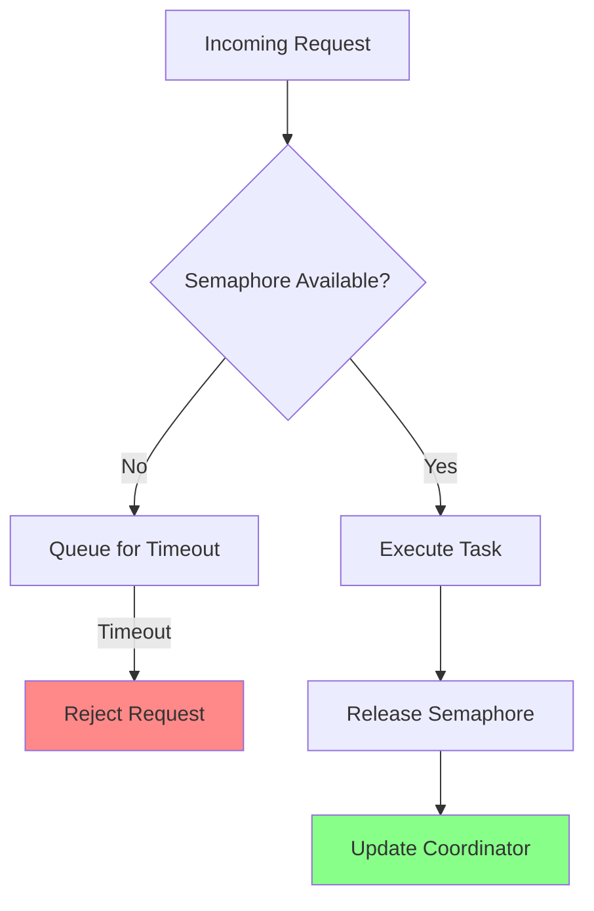

# Bulkhead Isolation Pattern

## Overview

The Bulkhead Isolation pattern prevents one feature from starving others by enforcing per-feature resource limits. It implements process-based resource limiting using semaphores for concurrent request control.

**Purpose**: Isolate feature resources to prevent cascading failures and ensure fair resource allocation.

**State Machine**:
- `HEALTHY`: Resources available (< 80% utilization)
- `DEGRADED`: High utilization (80-99%)
- `EXHAUSTED`: At capacity (100%, requests rejected)

## Architecture



The bulkhead uses a `Semaphore` to limit concurrent executions and a `Proc`-based coordinator to track utilization metrics.

## Public API

### Configuration

```java
public record BulkheadConfig(
    String featureName,              // Name of the protected feature
    Duration queueTimeout,           // Max time to wait for capacity
    double alertThreshold,           // Utilization % for DEGRADED state (0.0-1.0)
    List<ResourceLimit> limits       // Resource constraints
)

public sealed interface ResourceLimit {
    record MaxConcurrentRequests(int maxCount) implements ResourceLimit;
    record MaxMemoryBytes(long maxBytes) implements ResourceLimit;
    record MaxCpuPercent(double maxPercent) implements ResourceLimit;
}
```

**Factory Methods**:
```java
// Create configuration
BulkheadConfig config = new BulkheadConfig(
    "image-processing",
    Duration.ofSeconds(5),     // queueTimeout
    0.8,                       // alertThreshold (80%)
    List.of(
        new ResourceLimit.MaxConcurrentRequests(10),
        new ResourceLimit.MaxMemoryBytes(512_000_000)  // 512MB
    )
);
```

### Creating a Bulkhead

```java
BulkheadIsolationEnterprise bulkhead = BulkheadIsolationEnterprise.create(config);
```

### Executing Tasks

```java
Result<ImageData> result = bulkhead.execute(() -> {
    // Your task here
    return imageProcessor.process(image);
});

// Handle result
if (result instanceof Result.Success<ImageData> s) {
    System.out.println("Processed: " + s.value());
} else if (result instanceof Result.Failure<ImageData> f) {
    System.err.println("Failed: " + f.error().getMessage());
}
```

### Status Queries

```java
// Get current status
BulkheadState.Status status = bulkhead.getStatus();
System.out.println("Status: " + status);  // HEALTHY, DEGRADED, EXHAUSTED

// Get utilization percentage
int utilization = bulkhead.getUtilizationPercent();
System.out.println("Utilization: " + utilization + "%");
```

### Shutdown

```java
bulkhead.shutdown();
```

## Usage Examples

### Basic Bulkhead

```java
// Create bulkhead limiting concurrent image processing
BulkheadConfig config = new BulkheadConfig(
    "image-processing",
    Duration.ofSeconds(5),
    0.8,
    List.of(new ResourceLimit.MaxConcurrentRequests(10))
);

BulkheadIsolationEnterprise bulkhead = BulkheadIsolationEnterprise.create(config);

// Process images with bulkhead protection
for (Image image : images) {
    Result<Processed> result = bulkhead.execute(() -> {
        return imageProcessor.process(image);
    });

    switch (result) {
        case Success(var processed) -> handleSuccess(processed);
        case Failure(var e) -> {
            if (e.getMessage().contains("timeout")) {
                // Queue timeout - capacity exhausted
                logger.warn("Bulkhead full, rejecting image");
            } else {
                logger.error("Processing failed", e);
            }
        }
    }
}

bulkhead.shutdown();
```

### Bulkhead with Multiple Limits

```java
BulkheadConfig config = new BulkheadConfig(
    "data-import",
    Duration.ofSeconds(10),
    0.7,  // Alert at 70%
    List.of(
        new ResourceLimit.MaxConcurrentRequests(5),
        new ResourceLimit.MaxMemoryBytes(1024_000_000),  // 1GB
        new ResourceLimit.MaxCpuPercent(0.5)  // 50% CPU
    )
);

BulkheadIsolationEnterprise bulkhead = BulkheadIsolationEnterprise.create(config);
```

### Monitoring Bulkhead Status

```java
BulkheadIsolationEnterprise bulkhead = BulkheadIsolationEnterprise.create(config);

// Poll status (in production, use metrics)
ScheduledExecutorService scheduler = Executors.newScheduledThreadPool(1);
scheduler.scheduleAtFixedRate(() -> {
    int utilization = bulkhead.getUtilizationPercent();
    BulkheadState.Status status = bulkhead.getStatus();

    metricsService.gauge("bulkhead.utilization", utilization);
    metricsService.gauge("bulkhead.status", status.ordinal());

    if (status == BulkheadState.Status.EXHAUSTED) {
        logger.warn("Bulkhead {} is EXHAUSTED at {}%", config.featureName(), utilization);
    }
}, 0, 10, TimeUnit.SECONDS);
```

## Configuration Options

### Resource Limits

| Limit Type | Purpose | Example |
|------------|---------|---------|
| `MaxConcurrentRequests` | Limit parallel executions | `new MaxConcurrentRequests(10)` |
| `MaxMemoryBytes` | Limit heap memory usage | `new MaxMemoryBytes(512_000_000)` |
| `MaxCpuPercent` | Limit CPU usage | `new MaxCpuPercent(0.5)` |

### Alert Threshold

The `alertThreshold` determines when the bulkhead transitions to `DEGRADED` state:

```java
// Alert at 80% utilization
new BulkheadConfig("feature", timeout, 0.8, limits);

// Alert at 50% utilization (more sensitive)
new BulkheadConfig("feature", timeout, 0.5, limits);

// Alert at 95% utilization (less sensitive)
new BulkheadConfig("feature", timeout, 0.95, limits);
```

### Queue Timeout

Controls how long to wait for available capacity:

```java
// Short timeout (fail fast)
Duration.ofSeconds(1)

// Moderate timeout (wait a bit)
Duration.ofSeconds(5)

// Long timeout (queue extensively)
Duration.ofSeconds(30)
```

## Performance Considerations

### Memory Overhead
- **Per-instance**: ~2 KB (semaphore + coordinator state)
- **Per-request**: Minimal (UUID, timestamp)

### CPU Overhead
- **Acquisition**: O(1) - semaphore tryAcquire
- **Execution**: No overhead (direct execution)
- **Release**: O(1) - semaphore release + message send

### Throughput
- **HEALTHY**: Limited only by maxConcurrent setting
- **DEGRADED**: Same throughput, but alerts triggered
- **EXHAUSTED**: Requests rejected (fail-fast)

### Contention
- High contention when utilization > 90%
- Semaphore ensures fair ordering
- Queue timeout prevents indefinite blocking

## Anti-Patterns to Avoid

### 1. Setting Limits Too High
```java
// BAD: Effectively unlimited
List.of(new ResourceLimit.MaxConcurrentRequests(100_000))

// GOOD: Realistic limit
List.of(new ResourceLimit.MaxConcurrentRequests(50))
```

### 2. Ignoring Rejections
```java
// BAD: Ignoring failures
bulkhead.execute(task);

// GOOD: Handling rejections
switch (bulkhead.execute(task)) {
    case Success(var v) -> handleSuccess(v);
    case Failure(var e) -> {
        if (e.getMessage().contains("timeout")) {
            // Capacity exhausted - queue or retry later
            queueForLater(task);
        }
    }
}
```

### 3. Not Tuning Queue Timeout
```java
// BAD: Indefinite waiting
Duration.ofSeconds(Long.MAX_VALUE)

// GOOD: Reasonable timeout
Duration.ofSeconds(5)
```

### 4. Sharing Bulkheads Across Features
```java
// BAD: One bulkhead for everything
BulkheadIsolationEnterprise sharedBulkhead = ...;

// GOOD: Separate bulkheads per feature
BulkheadIsolationEnterprise imageBulkhead = ...;
BulkheadIsolationEnterprise importBulkhead = ...;
BulkheadIsolationEnterprise exportBulkhead = ...;
```

## When to Use

✅ **Use Bulkhead Isolation when**:
- Feature can overload shared resources (CPU, memory, connections)
- Need to prevent noisy neighbor problems in multi-tenant systems
- Want to guarantee resource availability for critical features
- Implementing fair resource allocation across features
- Protecting against runaway processes or memory leaks

❌ **Don't use Bulkhead Isolation when**:
- Feature is low-volume and predictable
- Resources are overprovisioned
- Bulkhead adds unnecessary complexity
- You need global resource management (use different pattern)

## Related Patterns

- **Circuit Breaker**: For failure detection and fail-fast
- **Backpressure**: For flow control
- **Multi-Tenant Supervisor**: For tenant isolation
- **Supervisor**: For process lifecycle management

## Integration with Supervision Trees

```java
// Create supervisor for feature
Supervisor featureSupervisor = Supervisor.create(
    Supervisor.Strategy.ONE_FOR_ONE,
    5,
    Duration.ofMinutes(1)
);

// Add bulkhead-protected worker
featureSupervisor.supervise(
    "worker-1",
    new WorkerState(),
    (state, msg) -> handleMessage(state, msg)
);

// Bulkhead limits concurrent executions
BulkheadIsolationEnterprise bulkhead = BulkheadIsolationEnterprise.create(config);

// Execute tasks through bulkhead
bulkhead.execute(() -> {
    // Worker execution
    return doWork();
});
```

## Monitoring and Metrics

### Key Metrics

```java
// Utilization percentage
int utilization = bulkhead.getUtilizationPercent();
metricsService.gauge("bulkhead.utilization", utilization);

// Status (0=HEALTHY, 1=DEGRADED, 2=EXHAUSTED)
BulkheadState.Status status = bulkhead.getStatus();
metricsService.gauge("bulkhead.status", status.ordinal());

// Request count (from coordinator state)
// Request durations (from coordinator state)
```

### Alerts

```java
// Alert when bulkhead is exhausted
if (status == BulkheadState.Status.EXHAUSTED) {
    alertingService.alert(
        "Bulkhead {} EXHAUSTED at {}% utilization",
        config.featureName(),
        utilization
    );
}

// Alert when sustained degradation
if (utilization > config.alertThreshold() * 100) {
    alertingService.warn(
        "Bulkhead {} DEGRADED at {}% utilization",
        config.featureName(),
        utilization
    );
}
```

## References

- Enterprise Integration Patterns (EIP) - Bulkhead Pattern
- [JOTP Supervisor Documentation](../supervisor.md)
- [Circuit Breaker Pattern](./circuit-breaker.md)

## See Also

- `/Users/sac/jotp/src/main/java/io/github/seanchatmangpt/jotp/enterprise/bulkhead/BulkheadIsolationEnterprise.java`
- `/Users/sac/jotp/src/main/java/io/github/seanchatmangpt/jotp/enterprise/bulkhead/BulkheadConfig.java`
- `/Users/sac/jotp/src/test/java/io/github/seanchatmangpt/jotp/enterprise/bulkhead/BulkheadIsolationEnterpriseTest.java`
