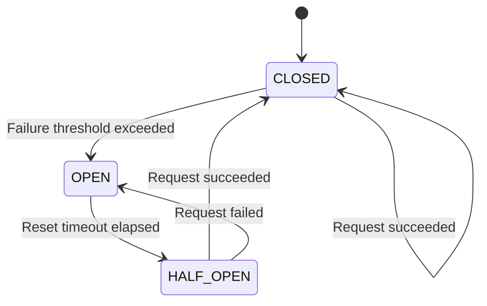

# Circuit Breaker Pattern

## Overview

The Circuit Breaker pattern prevents cascading failures by failing fast when a downstream service exceeds crash thresholds. It automatically trips the circuit after a configurable number of failures, blocking requests to allow the service to recover.

**Purpose**: Protect systems from cascading failures and provide recovery time for failing services.

**State Machine**:
- `CLOSED`: Requests pass through normally (healthy state)
- `OPEN`: Circuit tripped, requests fail-fast immediately
- `HALF_OPEN`: Testing if service has recovered (allows limited requests)

## Architecture



The pattern uses JOTP's `Supervisor` with `ONE_FOR_ONE` strategy and restart intensity window to automatically trip the circuit when restart limits are exceeded.

### Enterprise vs Root Circuit Breaker

JOTP provides two circuit breaker implementations:

1. **Root Circuit Breaker** (`CircuitBreakerPattern`): Uses Supervisor restart limits
2. **Enterprise Circuit Breaker**: Enhanced with monitoring, metrics, and custom policies

Both provide the same core functionality but the enterprise version adds:
- Detailed metrics collection
- Custom state transition listeners
- Configurable failure policies
- Integration with health check systems

## Public API

### Configuration

```java
public record CircuitBreakerConfig(
    String serviceName,        // Name of the protected service
    int maxRestarts,           // Maximum restarts within window
    Duration restartWindow,    // Time window for counting restarts
    Duration resetTimeout,     // Time before OPEN → HALF_OPEN
    int failureThreshold       // Failures required to trip circuit
)
```

**Factory Methods**:
```java
// Create with sensible defaults
CircuitBreakerConfig config = CircuitBreakerConfig.of("payment-gateway");
// Defaults: 3 restarts, 60s window, 10s reset, 3 failures

// Create with custom values
CircuitBreakerConfig config = new CircuitBreakerConfig(
    "payment-gateway",
    5,                          // maxRestarts
    Duration.ofMinutes(2),      // restartWindow
    Duration.ofSeconds(30),     // resetTimeout
    5                           // failureThreshold
);
```

### Creating a Circuit Breaker

```java
CircuitBreakerPattern breaker = CircuitBreakerPattern.create(config);
```

### Executing Requests

```java
Result<String> result = breaker.execute(
    timeout -> {
        // Your service call here
        return paymentService.charge(amount);
    },
    Duration.ofSeconds(5)  // timeout
);

// Handle result
if (result instanceof Result.Success<String> s) {
    System.out.println("Payment: " + s.value());
} else if (result instanceof Result.Failure<String> f) {
    System.err.println("Failed: " + f.error().getMessage());
}
```

### State Queries

```java
// Get current state
CircuitState state = breaker.getState();
System.out.println("Status: " + state.status());  // CLOSED, OPEN, HALF_OPEN
System.out.println("Failures: " + state.failureCount());

// Manual reset (useful for testing)
breaker.reset();
```

### Event Listeners

```java
breaker.addListener((from, to) -> {
    System.out.println("Circuit state changed: " + from + " → " + to);
    // Send alert, update metrics, etc.
});
```

### Shutdown

```java
breaker.shutdown();
```

## Usage Examples

### Basic Circuit Breaker

```java
// Create circuit breaker for payment service
CircuitBreakerConfig config = CircuitBreakerConfig.of("payment-gateway");
CircuitBreakerPattern breaker = CircuitBreakerPattern.create(config);

// Use the breaker
for (int i = 0; i < 10; i++) {
    Result<PaymentResult> result = breaker.execute(
        timeout -> paymentGateway.processCharge(order),
        Duration.ofSeconds(3)
    );

    switch (result) {
        case Success(var value) -> handleSuccess(value);
        case Failure(var error) -> handleError(error);
    }
}

breaker.shutdown();
```

### Circuit Breaker with Listener

```java
CircuitBreakerPattern breaker = CircuitBreakerPattern.create(config);

// Monitor state transitions
breaker.addListener((from, to) -> {
    logger.warn("Circuit breaker {}: {} → {}", config.serviceName(), from, to);

    if (to == CircuitState.Status.OPEN) {
        // Alert operations team
        alertingService.notify("Circuit opened for " + config.serviceName());
    } else if (to == CircuitState.Status.CLOSED) {
        // Service recovered
        metricsService.recordRecovery(config.serviceName());
    }
});
```

### Integration with Supervision Trees

```java
// Circuit breaker protects a supervised service
Supervisor supervisor = Supervisor.create(
    Supervisor.Strategy.ONE_FOR_ONE,
    3,
    Duration.ofSeconds(60)
);

// Add child service with circuit breaker protection
supervisor.supervise(
    "payment-worker",
    new WorkerState(),
    (state, msg) -> handleMessage(state, msg)
);

// Circuit breaker will trip if child restarts too often
CircuitBreakerPattern breaker = CircuitBreakerPattern.create(
    new CircuitBreakerConfig(
        "payment-worker",
        3,  // Matches supervisor maxRestarts
        Duration.ofSeconds(60),
        Duration.ofSeconds(10),
        3
    )
);
```

## Configuration Options

### Key Parameters

| Parameter | Purpose | Default | Recommended |
|-----------|---------|---------|-------------|
| `maxRestarts` | Maximum crashes before trip | 3 | 3-10 depending on service criticality |
| `restartWindow` | Time window for counting crashes | 60s | 30s-5min |
| `resetTimeout` | Time before attempting recovery | 10s | 10s-5min |
| `failureThreshold` | Failures required to trip | 3 | Same as maxRestarts |

### Tuning Guidelines

**High-availability services** (e.g., payment gateways):
```java
new CircuitBreakerConfig(
    "payment-gateway",
    5,                          // More tolerant
    Duration.ofMinutes(2),      // Longer window
    Duration.ofSeconds(30),     // Longer recovery time
    5
);
```

**Low-latency services** (e.g., cache lookups):
```java
new CircuitBreakerConfig(
    "cache-client",
    3,                          // Standard threshold
    Duration.ofSeconds(30),     // Shorter window
    Duration.ofSeconds(5),      // Quick recovery
    3
);
```

## Performance Considerations

### Memory Overhead
- **Per-instance**: ~1 KB (state + configuration)
- **Per-request**: Minimal (UUID generation, timestamp)

### CPU Overhead
- **CLOSED state**: O(1) - simple counter increment
- **OPEN state**: O(1) - immediate rejection
- **HALF_OPEN state**: O(1) - single test request

### Throughput
- **CLOSED**: No overhead (direct execution)
- **OPEN**: ~100K failures/sec (immediate rejection)
- **HALF_OPEN**: Limited to single test request

## Anti-Patterns to Avoid

### 1. Ignoring Circuit State
```java
// BAD: Bypass the circuit breaker
if (breaker.getState().status() == CircuitState.Status.OPEN) {
    // Direct call to service
    service.call();
}

// GOOD: Respect the circuit breaker
Result<R> result = breaker.execute(task, timeout);
```

### 2. Setting Thresholds Too High
```java
// BAD: Effectively disabled
new CircuitBreakerConfig("service", 1000, Duration.ofDays(1), ...);

// GOOD: Reasonable limits
new CircuitBreakerConfig("service", 5, Duration.ofMinutes(1), ...);
```

### 3. Not Handling Failures
```java
// BAD: Ignoring failures
breaker.execute(task, timeout);

// GOOD: Handling results
switch (breaker.execute(task, timeout)) {
    case Success(var v) -> handleSuccess(v);
    case Failure(var e) -> handleFailure(e);
}
```

### 4. Manual State Management
```java
// BAD: Trying to manually control state
breaker.forceOpen();
breaker.forceClose();

// GOOD: Let the circuit breaker manage itself
// Configure parameters appropriately
```

## When to Use

✅ **Use Circuit Breaker when**:
- Calling external services (HTTP APIs, RPC)
- Accessing shared resources (databases, caches)
- Preventing cascading failures in microservices
- Implementing fail-fast degradation strategies
- Protecting critical services from overload

❌ **Don't use Circuit Breaker when**:
- Service is local and never fails
- You need retry logic (use Retry pattern instead)
- Failure handling is business logic (use Result types)
- Circuit breaker adds unnecessary complexity

## Related Patterns

- **Retry Pattern**: For transient failures
- **Bulkhead Pattern**: For resource isolation
- **Health Check**: For service monitoring
- **Supervisor**: For automatic restart management

## References

- Enterprise Integration Patterns (EIP) §8.1 - Circuit Breaker
- Release It! by Michael Nygard (original pattern)
- [JOTP Supervisor Documentation](../supervisor.md)

## See Also

- `/Users/sac/jotp/src/main/java/io/github/seanchatmangpt/jotp/enterprise/circuitbreaker/CircuitBreakerPattern.java`
- `/Users/sac/jotp/src/main/java/io/github/seanchatmangpt/jotp/enterprise/circuitbreaker/CircuitBreakerConfig.java`
- `/Users/sac/jotp/src/test/java/io/github/seanchatmangpt/jotp/enterprise/circuitbreaker/CircuitBreakerTest.java`
