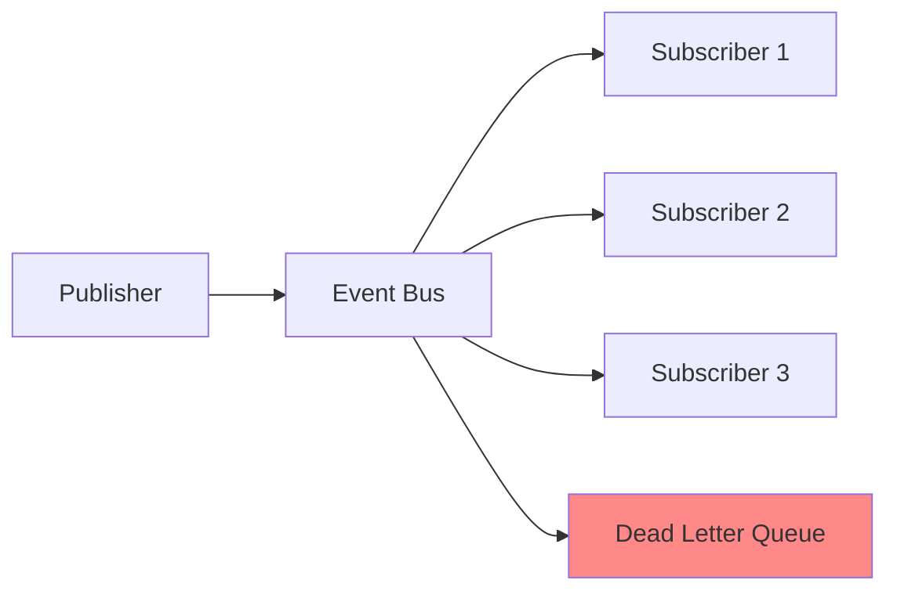

# Event Bus Pattern

## Overview

The Event Bus pattern provides a typed event broadcasting system with configurable delivery guarantees, batching, and deduplication. It implements publish-subscribe messaging with support for fire-and-forget, at-least-once, and exactly-once semantics.

**Purpose**: Enable loose coupling between components through event-driven communication.

**State Machine**:
- `RUNNING`: Accepting and delivering events
- `DEGRADED`: Some subscribers failing (collecting in DLQ)
- `PAUSED`: Manual pause (backpressure)

## Architecture



The event bus uses `EventManager` for pub-sub functionality and a coordinator process for tracking metrics and state.

## Public API

### Configuration

```java
public record EventBusConfig(
    DeliveryPolicy deliveryPolicy,      // FireAndForget, AtLeastOnce, ExactlyOnce
    boolean deadLetterQueueEnabled,     // Enable DLQ for failed events
    int batchSize,                      // Batch size for batching mode
    Duration batchTimeout,              // Max wait for batch completion
    Duration deduplicationWindow        // ExactlyOnce dedup window
)

public enum DeliveryPolicy {
    FIRE_AND_FORGET,    // No retries
    AT_LEAST_ONCE,      // Retry with backoff
    EXACTLY_ONCE,       // Deduplication window
    PARTITIONED         // Per-partition ordering
}
```

### Creating an Event Bus

```java
EventBusConfig config = new EventBusConfig(
    EventBusConfig.DeliveryPolicy.AT_LEAST_ONCE,
    true,                       // DLQ enabled
    100,                        // Batch size
    Duration.ofMillis(100),     // Batch timeout
    Duration.ofMinutes(5)       // Dedup window
);

EventBus eventBus = EventBus.create(config);
```

### Publishing Events

```java
// Publish an event
OrderEvent event = new OrderEvent(orderId, customerId, items);
EventBus.PublishResult result = eventBus.publish(event);

// Check result
if (result.status() == EventBus.PublishResult.Status.ACCEPTED) {
    System.out.println("Event published: " + result.eventId());
} else {
    System.err.println("Event rejected: " + result.errorMessage());
}
```

### Subscribing to Events

```java
// Subscribe to events
EventBus.Subscription subscription = eventBus.subscribe(
    "order-processor",
    event -> {
        if (event instanceof OrderEvent order) {
            processOrder(order);
        }
    }
);

// Later, unsubscribe
subscription.unsubscribe();
```

### Managing Subscribers

```java
// Get all subscribers
List<EventBus.SubscriberInfo> subscribers = eventBus.getSubscribers();
subscribers.forEach(sub -> {
    System.out.println("Subscriber: " + sub.id());
});

// Pause event publishing
eventBus.pause();

// Resume event publishing
eventBus.resume();
```

### Event Listeners

```java
eventBus.addListener(new EventBus.EventBusListener() {
    @Override
    public void onSubscribed(String subscriberId) {
        logger.info("New subscriber: {}", subscriberId);
    }

    @Override
    public void onUnsubscribed(String subscriberId, String reason) {
        logger.info("Subscriber {} unsubscribed: {}", subscriberId, reason);
    }

    @Override
    public void onEventPublished(String eventId) {
        logger.debug("Event published: {}", eventId);
    }

    @Override
    public void onEventFailed(String eventId, String reason) {
        logger.error("Event {} failed: {}", eventId, reason);
    }
});
```

### Shutdown

```java
eventBus.shutdown();
```

## Usage Examples

### Basic Event Bus

```java
// Create event bus
EventBus eventBus = EventBus.create(
    new EventBusConfig(
        EventBusConfig.DeliveryPolicy.FIRE_AND_FORGET,
        false,
        1,
        Duration.ofMillis(0),
        Duration.ZERO
    )
);

// Subscribe to events
eventBus.subscribe("logger", event -> {
    logger.info("Received: {}", event);
});

eventBus.subscribe("metrics", event -> {
    metricsService.count("events.received", 1);
});

// Publish events
for (int i = 0; i < 10; i++) {
    eventBus.publish(new UserEvent("user-" + i));
}

eventBus.shutdown();
```

### Event Bus with Typed Events

```java
// Define event types
sealed interface DomainEvent permits OrderEvent, PaymentEvent, ShipmentEvent {}

record OrderEvent(String orderId, String customerId, List<Item> items) implements DomainEvent {}
record PaymentEvent(String orderId, BigDecimal amount) implements DomainEvent {}
record ShipmentEvent(String orderId, String address) implements DomainEvent {}

// Subscribe to specific event types
eventBus.subscribe("order-handler", event -> {
    if (event instanceof OrderEvent order) {
        orderService.process(order);
    }
});

eventBus.subscribe("payment-handler", event -> {
    if (event instanceof PaymentEvent payment) {
        paymentService.process(payment);
    }
});

// Publish typed events
eventBus.publish(new OrderEvent("order-1", "customer-1", items));
eventBus.publish(new PaymentEvent("order-1", new BigDecimal("99.99")));
```

### Event Bus with Dead Letter Queue

```java
EventBusConfig config = new EventBusConfig(
    EventBusConfig.DeliveryPolicy.AT_LEAST_ONCE,
    true,  // DLQ enabled
    1,
    Duration.ofMillis(0),
    Duration.ZERO
);

EventBus eventBus = EventBus.create(config);

// Subscribe with potential failures
eventBus.subscribe("flaky-handler", event -> {
    // May throw exceptions
    if (Math.random() < 0.1) {
        throw new RuntimeException("Random failure");
    }
    processEvent(event);
});

// Failed events go to DLQ
// Later, process DLQ
eventBus.addListener(new EventBus.EventBusListener() {
    @Override
    public void onEventFailed(String eventId, String reason) {
        logger.warn("Event {} failed, sent to DLQ: {}", eventId, reason);
        // Retry or process DLQ
        deadLetterProcessor.retry(eventId);
    }
});
```

### Event Bus with Backpressure

```java
EventBus eventBus = EventBus.create(config);

// Pause when overloaded
if (systemLoad > 0.9) {
    eventBus.pause();
    logger.info("Event bus paused due to high load");
}

// Resume when load reduces
if (systemLoad < 0.7) {
    eventBus.resume();
    logger.info("Event bus resumed");
}

// Check status before publishing
if (eventBus.getCurrentStatus() == BusState.Status.RUNNING) {
    eventBus.publish(event);
} else {
    // Queue or reject
    queueForLater(event);
}
```

## Configuration Options

### Delivery Policies

| Policy | Description | Use Case |
|--------|-------------|----------|
| `FIRE_AND_FORGET` | No retries, best-effort | Logging, metrics, non-critical events |
| `AT_LEAST_ONCE` | Retry with backoff | Critical business events |
| `EXACTLY_ONCE` | Deduplication window | Idempotent consumers required |
| `PARTITIONED` | Per-partition ordering | Ordered events by key |

### Batching

```java
// Batch events for efficiency
EventBusConfig config = new EventBusConfig(
    EventBusConfig.DeliveryPolicy.FIRE_AND_FORGET,
    false,
    100,                        // Batch up to 100 events
    Duration.ofMillis(100),     // Wait up to 100ms for batch
    Duration.ZERO
);

// Events are delivered in batches of up to 100
// Or after 100ms, whichever comes first
```

### Deduplication

```java
// Exactly-once semantics
EventBusConfig config = new EventBusConfig(
    EventBusConfig.DeliveryPolicy.EXACTLY_ONCE,
    false,
    1,
    Duration.ofMillis(0),
    Duration.ofMinutes(5)  // Dedup for 5 minutes
);

// Events with same ID within 5 minutes are deduplicated
```

## Performance Considerations

### Memory Overhead
- **Per event**: ~200 bytes (event object + metadata)
- **Per subscriber**: ~100 bytes (handler reference)
- **DLQ**: Unbounded (needs monitoring)

### CPU Overhead
- **Publish**: O(n) where n = subscriber count
- **Delivery**: O(1) per subscriber (async)

### Throughput
- **Fire-and-forget**: Highest throughput (~1M events/sec)
- **At-least-once**: Lower throughput (retries)
- **Exactly-once**: Lowest throughput (deduplication)

### Latency
- **In-process**: < 1ms per subscriber
- **Cross-process**: Network latency

## Anti-Patterns to Avoid

### 1. Blocking in Subscribers

```java
// BAD: Blocking operation in subscriber
eventBus.subscribe("handler", event -> {
    Thread.sleep(5000);  // Blocks all other deliveries!
});

// GOOD: Async or non-blocking
eventBus.subscribe("handler", event -> {
    CompletableFuture.runAsync(() -> {
        processEvent(event);
    });
});
```

### 2. Throwing Exceptions

```java
// BAD: Exception propagates and kills event bus
eventBus.subscribe("handler", event -> {
    throw new RuntimeException("Error");
});

// GOOD: Handle exceptions gracefully
eventBus.subscribe("handler", event -> {
    try {
        processEvent(event);
    } catch (Exception e) {
        logger.error("Event processing failed", e);
    }
});
```

### 3. Unbounded DLQ

```java
// BAD: DLQ grows without bound
eventBus.publish(events);  // Never clear DLQ

// GOOD: Monitor and process DLQ
eventBus.addListener(new EventBusListener() {
    @Override
    public void onEventFailed(String eventId, String reason) {
        deadLetterQueue.add(eventId);
        // Process DLQ periodically
    }
});
```

### 4. Tight Coupling

```java
// BAD: Subscriber knows about publisher
eventBus.subscribe("handler", event -> {
    if (event instanceof SpecificEvent) {
        // Tightly coupled to specific event type
    }
});

// GOOD: Generic handling
eventBus.subscribe("handler", event -> {
    // Handle any event type
    handleEvent(event);
});
```

## When to Use

✅ **Use Event Bus when**:
- Decoupling components via events
- Broadcasting to multiple subscribers
- Implementing event-driven architecture
- Need pub/sub messaging
- Building reactive systems

❌ **Don't use Event Bus when**:
- Point-to-point communication is sufficient
- Need request/response pattern
- Events must be processed in order (use partitioned)
- Only one subscriber needed (use direct messaging)

## Related Patterns

- **Point-to-Point Channel**: For single consumer
- **Content-Based Router**: For event routing
- **Event Sourcing**: For event persistence
- **CQRS**: For read/write separation

## Integration with Event Sourcing

```java
// Event bus as event dispatcher
EventStore eventStore = new EventStore();
EventBus eventBus = EventBus.create(config);

// Load events from event store
List<DomainEvent> events = eventStore.load(aggregateId);

// Dispatch through event bus
events.forEach(eventBus::publish);

// Subscribers update projections
eventBus.subscribe("read-model", event -> {
    readModelUpdater.apply(event);
});

eventBus.subscribe("search-index", event -> {
    searchIndexer.index(event);
});
```

## Monitoring and Metrics

### Key Metrics

```java
eventBus.addListener(new EventBusListener() {
    @Override
    public void onEventPublished(String eventId) {
        metricsService.counter("eventbus.published").increment();
    }

    @Override
    public void onSubscribed(String subscriberId) {
        metricsService.gauge("eventbus.subscribers",
            eventBus.getSubscribers().size()
        );
    }

    @Override
    public void onEventFailed(String eventId, String reason) {
        metricsService.counter("eventbus.failed",
            "reason", reason
        ).increment();
    }
});
```

## References

- Enterprise Integration Patterns (EIP) §6.2 - Publish-Subscribe Channel
- Reactive Messaging Patterns with the Actor Model (Vaughn Vernon)
- [JOTP EventManager Documentation](../eventmanager.md)

## See Also

- `/Users/sac/jotp/src/main/java/io/github/seanchatmangpt/jotp/enterprise/eventbus/EventBus.java`
- `/Users/sac/jotp/src/main/java/io/github/seanchatmangpt/jotp/enterprise/eventbus/EventBusConfig.java`
- `/Users/sac/jotp/src/main/java/io/github/seanchatmangpt/jotp/enterprise/eventbus/EventBusPolicy.java`
- `/Users/sac/jotp/src/test/java/io/github/seanchatmangpt/jotp/enterprise/eventbus/EventBusTest.java`
