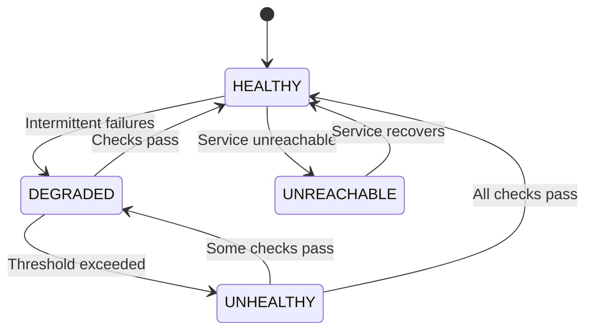

# Health Check Pattern

## Overview

The Health Check pattern provides non-invasive monitoring of service health without killing the service if checks fail (unlike link/1 semantics). It runs periodic health checks against target services and tracks status transitions.

**Purpose**: Monitor service liveness and health without affecting service lifecycle.

**State Machine**:
- `HEALTHY`: All checks pass
- `DEGRADED`: Some checks fail (< failThreshold consecutive failures)
- `UNHEALTHY`: Critical failure (>= failThreshold consecutive failures)
- `UNREACHABLE`: Service unreachable

## Architecture



The health check manager uses `ProcMonitor` internally for liveness checks and a coordinator process to track state transitions.

## Public API

### Configuration

```java
public record HealthCheckConfig(
    String serviceName,                    // Name of the service being monitored
    Duration checkInterval,                // How often to run checks
    int failThreshold,                     // Consecutive failures for UNHEALTHY
    List<HealthCheck> checks               // Individual health checks
)

public interface HealthCheck {
    String name();
    HealthCheckResult check();
    boolean isCritical();  // If true, failure immediately marks service UNHEALTHY
}

public record HealthCheckResult(
    String checkName,
    boolean healthy,
    String message,
    Duration responseTime,
    Map<String, Object> details
)
```

### Creating a Health Check Manager

```java
// Define health checks
List<HealthCheck> checks = List.of(
    new DatabaseHealthCheck("database", dataSource),
    new CacheHealthCheck("cache", cacheClient),
    new ApiHealthCheck("external-api", apiClient, "https://api.example.com/health")
);

// Create configuration
HealthCheckConfig config = new HealthCheckConfig(
    "payment-service",
    Duration.ofSeconds(30),  // Check every 30 seconds
    3,                       // 3 consecutive failures = UNHEALTHY
    checks
);

// Create health check manager
HealthCheckManager manager = HealthCheckManager.create(config);
```

### Status Queries

```java
// Get current status
HealthStatus status = manager.getStatus();
System.out.println("Status: " + status);

// Status details:
switch (status) {
    case HealthStatus.Healthy h ->
        System.out.println("Service healthy since: " + h.since());
    case HealthStatus.Degraded d ->
        System.out.println("Service degraded: " + d.reason());
    case HealthStatus.Unhealthy u ->
        System.out.println("Service unhealthy: " + u.reason());
    case HealthStatus.Unreachable u ->
        System.out.println("Service unreachable");
}

// Get last result for specific check
HealthCheckResult result = manager.getLastResult("database");
System.out.println("Database: " + result.healthy());
System.out.println("Response time: " + result.responseTime());
```

### Event Listeners

```java
manager.addListener((from, to) -> {
    logger.info("Health status changed: {} → {}", from, to);

    if (to instanceof HealthStatus.Unhealthy) {
        // Alert operations team
        alertingService.alert("Service " + config.serviceName() + " is UNHEALTHY");
    } else if (from instanceof HealthStatus.Unhealthy && to instanceof HealthStatus.Healthy) {
        // Service recovered
        alertingService.recovery("Service " + config.serviceName() + " recovered");
    }
});
```

### Shutdown

```java
manager.shutdown();
```

## Usage Examples

### Basic Health Checks

```java
// Database health check
record DatabaseHealthCheck(String name, DataSource dataSource) implements HealthCheck {
    @Override
    public HealthCheckResult check() {
        long start = System.nanoTime();
        try (Connection conn = dataSource.getConnection()) {
            boolean isValid = conn.isValid(1);
            long duration = Duration.ofNanos(System.nanoTime() - start).toMillis();

            return new HealthCheckResult(
                name(),
                isValid,
                isValid ? "Database reachable" : "Database timeout",
                Duration.ofMillis(duration),
                Map.of("valid", isValid)
            );
        } catch (SQLException e) {
            return new HealthCheckResult(
                name(),
                false,
                "Database error: " + e.getMessage(),
                Duration.ofMillis(Duration.ofNanos(System.nanoTime() - start).toMillis()),
                Map.of("error", e.getMessage())
            );
        }
    }

    @Override
    public boolean isCritical() {
        return true;  // Database is critical
    }
}

// Cache health check
record CacheHealthCheck(String name, CacheClient cache) implements HealthCheck {
    @Override
    public HealthCheckResult check() {
        long start = System.nanoTime();
        try {
            boolean isHealthy = cache.ping();
            long duration = Duration.ofNanos(System.nanoTime() - start).toMillis();

            return new HealthCheckResult(
                name(),
                isHealthy,
                isHealthy ? "Cache reachable" : "Cache timeout",
                Duration.ofMillis(duration),
                Map.of("ping", isHealthy)
            );
        } catch (Exception e) {
            return new HealthCheckResult(
                name(),
                false,
                "Cache error: " + e.getMessage(),
                Duration.ofMillis(Duration.ofNanos(System.nanoTime() - start).toMillis()),
                Map.of("error", e.getMessage())
            );
        }
    }

    @Override
    public boolean isCritical() {
        return false;  // Cache is not critical
    }
}

// Create health check manager
List<HealthCheck> checks = List.of(
    new DatabaseHealthCheck("database", dataSource),
    new CacheHealthCheck("cache", cacheClient)
);

HealthCheckConfig config = new HealthCheckConfig(
    "my-service",
    Duration.ofSeconds(30),
    3,
    checks
);

HealthCheckManager manager = HealthCheckManager.create(config);

// Check status
HealthStatus status = manager.getStatus();
if (status instanceof HealthStatus.Unhealthy) {
    logger.error("Service is unhealthy");
}
```

### HTTP API Health Check

```java
record ApiHealthCheck(String name, HttpClient client, URI url) implements HealthCheck {
    @Override
    public HealthCheckResult check() {
        long start = System.nanoTime();
        try {
            HttpRequest request = HttpRequest.newBuilder()
                .uri(url)
                .timeout(Duration.ofSeconds(5))
                .GET()
                .build();

            HttpResponse<String> response = client.send(
                request,
                HttpResponse.BodyHandlers.ofString()
            );

            long duration = Duration.ofNanos(System.nanoTime() - start).toMillis();
            boolean healthy = response.statusCode() == 200;

            return new HealthCheckResult(
                name(),
                healthy,
                healthy ? "API healthy" : "API returned " + response.statusCode(),
                Duration.ofMillis(duration),
                Map.of(
                    "statusCode", response.statusCode(),
                    "body", response.body()
                )
            );
        } catch (Exception e) {
            return new HealthCheckResult(
                name(),
                false,
                "API error: " + e.getMessage(),
                Duration.ofMillis(Duration.ofNanos(System.nanoTime() - start).toMillis()),
                Map.of("error", e.getMessage())
            );
        }
    }

    @Override
    public boolean isCritical() {
        return true;
    }
}
```

### Health Check with Listener

```java
HealthCheckManager manager = HealthCheckManager.create(config);

// Listen for status changes
manager.addListener((from, to) -> {
    logger.info("Health transition: {} → {}", from, to);

    // Send metrics
    metricsService.gauge("health.status",
        to instanceof HealthStatus.Healthy ? 1 :
        to instanceof HealthStatus.Degraded ? 0.5 :
        to instanceof HealthStatus.Unreachable ? 0.2 : 0
    );

    // Alert on critical changes
    if (to instanceof HealthStatus.Unhealthy) {
        alertingService.critical(
            "Service {} is UNHEALTHY",
            config.serviceName()
        );
    }

    // Log recovery
    if (from instanceof HealthStatus.Unhealthy && to instanceof HealthStatus.Healthy) {
        logger.info("Service {} recovered", config.serviceName());
    }
});

// Periodically log status
ScheduledExecutorService scheduler = Executors.newScheduledThreadPool(1);
scheduler.scheduleAtFixedRate(() -> {
    HealthStatus status = manager.getStatus();
    logger.debug("Health status: {}", status);

    // Log individual check results
    for (HealthCheck check : config.checks()) {
        HealthCheckResult result = manager.getLastResult(check.name());
        if (result != null) {
            logger.debug("  {}: {} ({}ms)",
                check.name(),
                result.healthy() ? "OK" : "FAIL",
                result.responseTime().toMillis()
            );
        }
    }
}, 0, 30, TimeUnit.SECONDS);
```

## Configuration Options

### Check Interval

How often to run health checks:

```java
// High-frequency monitoring (development/testing)
Duration.ofSeconds(10)

// Standard production monitoring
Duration.ofSeconds(30)

// Lower overhead (production with many checks)
Duration.ofMinutes(1)

// Infrequent checks (non-critical services)
Duration.ofMinutes(5)
```

### Fail Threshold

Consecutive failures before marking service UNHEALTHY:

```java
// Strict: Fail immediately
1

// Standard: 3 consecutive failures
3

// Lenient: Tolerate intermittent failures
5

// Very lenient
10
```

### Critical vs Non-Critical Checks

```java
// Critical check: Failure immediately marks service UNHEALTHY
@Override
public boolean isCritical() {
    return true;
}

// Non-critical check: Contributes to DEGRADED state
@Override
public boolean isCritical() {
    return false;
}
```

## Performance Considerations

### Memory Overhead
- **Per manager**: ~2 KB (configuration, state, listeners)
- **Per check result**: ~500 bytes (result record)

### CPU Overhead
- **Per check**: Determined by check implementation
- **Manager coordination**: O(1) per check interval

### Network Overhead
- One request per check per interval
- Use appropriate check intervals to avoid overwhelming services

### Check Duration
- Keep checks fast (< 5 seconds)
- Use timeouts to prevent hanging checks
- Consider async checks for slow services

## Anti-Patterns to Avoid

### 1. Expensive Health Checks

```java
// BAD: Expensive check that runs frequently
new HealthCheck() {
    @Override
    public HealthCheckResult check() {
        // Runs full table scan!
        return new HealthCheckResult(..., runFullScan(), ...);
    }
}

// GOOD: Lightweight check
new HealthCheck() {
    @Override
    public HealthCheckResult check() {
        // Simple ping
        return new HealthCheckResult(..., conn.isValid(1), ...);
    }
}
```

### 2. Missing Timeouts

```java
// BAD: No timeout, can hang forever
HttpResponse<String> response = client.send(request, handler);

// GOOD: Explicit timeout
HttpRequest request = HttpRequest.newBuilder()
    .uri(url)
    .timeout(Duration.ofSeconds(5))  // Timeout!
    .GET()
    .build();
```

### 3. Not Handling Exceptions

```java
// BAD: Exception propagates and kills health checker
@Override
public HealthCheckResult check() {
    return new HealthCheckResult(..., someOperation(), ...);
    // If someOperation() throws, health checker crashes
}

// GOOD: Catch and report exceptions
@Override
public HealthCheckResult check() {
    try {
        boolean healthy = someOperation();
        return new HealthCheckResult(..., healthy, ...);
    } catch (Exception e) {
        return new HealthCheckResult(..., false, e.getMessage(), ...);
    }
}
```

### 4. Ignoring Health Status

```java
// BAD: Checking but not acting
HealthStatus status = manager.getStatus();
// Ignored!

// GOOD: Act on status
HealthStatus status = manager.getStatus();
if (status instanceof HealthStatus.Unhealthy) {
    // Take action: alert, stop accepting traffic, etc.
    circuitBreaker.trip();
    loadBalancer.disable();
}
```

## When to Use

✅ **Use Health Checks when**:
- Monitoring service liveness in production
- Implementing graceful degradation
- Driving circuit breakers and load balancers
- Providing health endpoints for orchestration
- Observability and alerting

❌ **Don't use Health Checks when**:
- Service is ephemeral/short-lived
- Health check is more expensive than service itself
- You need active supervision (use Supervisor instead)
- Health checks add no value (e.g., local-only services)

## Related Patterns

- **Circuit Breaker**: For fail-fast based on health
- **Supervisor**: For automatic restart on failure
- **ProcMonitor**: For unilateral DOWN notifications
- **Event Bus**: For broadcasting health events

## Integration with Load Balancers

```java
// Health check endpoint for load balancers
@GetMapping("/health")
public ResponseEntity<Map<String, Object>> health() {
    HealthStatus status = healthManager.getStatus();

    if (status instanceof HealthStatus.Healthy) {
        return ResponseEntity.ok(Map.of(
            "status", "healthy",
            "checks", getCheckResults()
        ));
    } else if (status instanceof HealthStatus.Degraded) {
        // Return 200 but with degraded status
        return ResponseEntity.ok(Map.of(
            "status", "degraded",
            "checks", getCheckResults()
        ));
    } else {
        // Return 503 for unhealthy/unreachable
        return ResponseEntity.status(503).body(Map.of(
            "status", "unhealthy",
            "checks", getCheckResults()
        ));
    }
}
```

## Monitoring and Metrics

### Key Metrics

```java
// Health status (gauge)
metricsService.gauge("health.status",
    status instanceof HealthStatus.Healthy ? 1.0 :
    status instanceof HealthStatus.Degraded ? 0.5 :
    status instanceof HealthStatus.Unhealthy ? 0.0 :
    status instanceof HealthStatus.Unreachable ? 0.2 : -1.0
);

// Individual check results
for (HealthCheck check : config.checks()) {
    HealthCheckResult result = manager.getLastResult(check.name());
    if (result != null) {
        metricsService.gauge("health.check." + check.name(),
            result.healthy() ? 1.0 : 0.0
        );

        metricsService.timer("health.check.duration",
            "check", check.name()
        ).record(result.responseTime());
    }
}

// Status transitions
manager.addListener((from, to) -> {
    metricsService.counter("health.transitions",
        "from", from.getClass().getSimpleName(),
        "to", to.getClass().getSimpleName()
    ).increment();
});
```

## References

- [Kubernetes Health Probes](https://kubernetes.io/docs/tasks/configure-pod-container/configure-liveness-readiness-startup-probes/)
- [AWS ELB Health Checks](https://docs.aws.amazon.com/elasticloadbalancing/latest/application/target-group-health-checks.html)
- [JOTP ProcMonitor Documentation](../procmonitor.md)

## See Also

- `/Users/sac/jotp/src/main/java/io/github/seanchatmangpt/jotp/enterprise/health/HealthCheckManager.java`
- `/Users/sac/jotp/src/main/java/io/github/seanchatmangpt/jotp/enterprise/health/HealthCheckConfig.java`
- `/Users/sac/jotp/src/main/java/io/github/seanchatmangpt/jotp/enterprise/health/HealthCheck.java`
- `/Users/sac/jotp/src/test/java/io/github/seanchatmangpt/jotp/enterprise/health/HealthCheckManagerTest.java`
