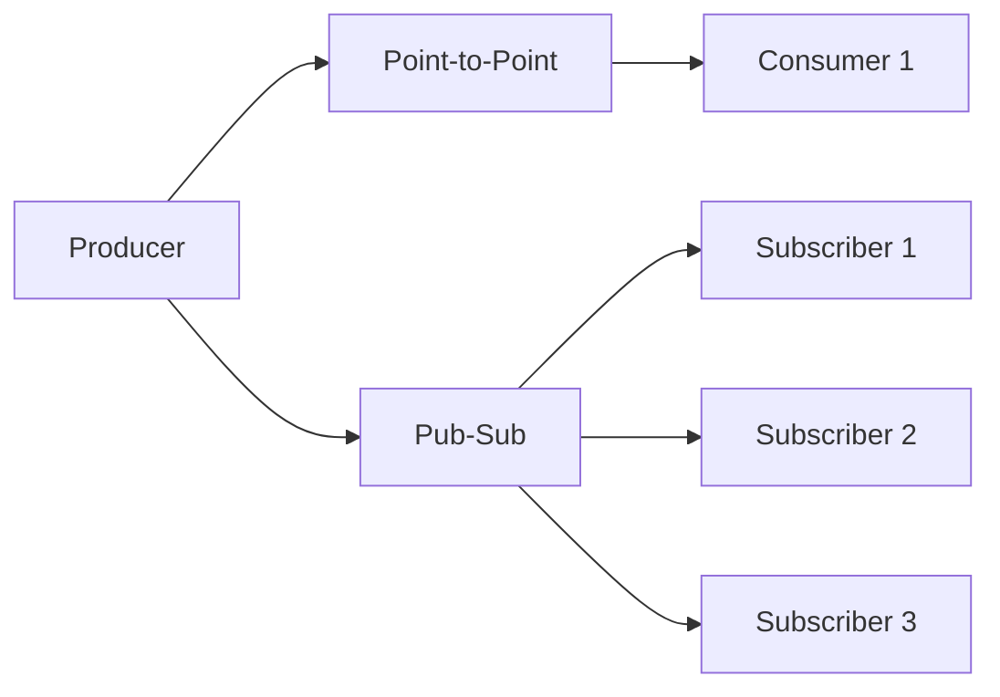

# Messaging Channels - Vaughn Vernon Patterns

## Overview

Messaging channels provide the fundamental communication patterns for message-passing systems. JOTP implements Vaughn Vernon's Reactive Messaging Patterns (ported from Scala/Akka) using Java 26 virtual threads and processes.

**Patterns Covered**:
1. **Point-to-Point Channel**: One consumer receives each message
2. **Publish-Subscribe Channel**: All subscribers receive each message
3. **Datatype Channel**: Type-safe message routing

## Architecture



## Pattern 1: Point-to-Point Channel

### Overview

Exactly one consumer receives each message. Messages are delivered in FIFO order to a single consumer.

**Erlang Analog**: Direct process-to-process send via `Pid ! Message`

**Enterprise Integration Pattern**: EIP §6.1 - Point-to-Point Channel

### Public API

```java
public final class PointToPoint<T> {
    // Create with simple consumer
    public static <T> PointToPoint<T> create(Consumer<T> consumer);

    // Create with stateful processing
    public static <S, T> Proc<S, T> createStateful(S initial, BiFunction<S, T, S> handler);

    // Send message
    public void send(T message);

    // Stop channel
    public void stop() throws InterruptedException;

    // Get underlying process
    public Proc<Void, T> proc();
}
```

### Usage Examples

#### Basic Point-to-Point

```java
// Create point-to-point channel
PointToPoint<String> channel = PointToPoint.create(
    message -> System.out.println("Received: " + message)
);

// Send messages
channel.send("Hello");
channel.send("World");

// Stop channel
channel.stop();
```

#### Stateful Point-to-Point

```java
// State to track message count
record MessageState(int count) {}

// Create stateful channel
Proc<MessageState, String> channel = PointToPoint.createStateful(
    new MessageState(0),
    (state, message) -> {
        int newCount = state.count() + 1;
        System.out.println("Message " + newCount + ": " + message);
        return new MessageState(newCount);
    }
);

// Send messages
channel.tell("First");
channel.tell("Second");
channel.tell("Third");

// Stop channel
channel.stop();
```

#### Worker Queue

```java
// Create worker queue
PointToPoint<WorkItem> queue = PointToPoint.create(
    workItem -> {
        System.out.println("Processing: " + workItem);
        workProcessor.process(workItem);
    }
);

// Submit work items
for (int i = 0; i < 100; i++) {
    queue.send(new WorkItem(i, "Task-" + i));
}

// Workers process sequentially
queue.stop();
```

### When to Use

✅ **Use Point-to-Point when**:
- Need exactly one consumer per message
- Messages must be processed in order
- Simple producer-consumer scenario
- Work queue pattern

❌ **Don't use Point-to-Point when**:
- Need multiple consumers
- Need broadcast/publish-subscribe
- Need content-based routing

## Pattern 2: Publish-Subscribe Channel

### Overview

Every subscriber receives every message. Subscribers can be added or removed dynamically.

**Erlang Analog**: `gen_event` - one event manager, arbitrarily many handlers

**Enterprise Integration Pattern**: EIP §6.2 - Publish-Subscribe Channel

### Public API

```java
public final class PublishSubscribe<T> {
    // Subscribe to events
    public void subscribe(Consumer<T> subscriber);

    // Unsubscribe
    public boolean unsubscribe(Consumer<T> subscriber);

    // Publish event (async)
    public void publish(T message);

    // Publish event (sync, wait for all subscribers)
    public void publishSync(T message) throws InterruptedException;

    // Stop channel
    public void stop() throws InterruptedException;
}
```

### Usage Examples

#### Basic Pub-Sub

```java
// Create publish-subscribe channel
PublishSubscribe<String> pubSub = new PublishSubscribe<>();

// Add subscribers
pubSub.subscribe(message -> System.out.println("Subscriber 1: " + message));
pubSub.subscribe(message -> System.out.println("Subscriber 2: " + message));
pubSub.subscribe(message -> System.out.println("Subscriber 3: " + message));

// Publish messages
pubSub.publish("Hello");
pubSub.publish("World");

// All subscribers receive all messages

// Stop channel
pubSub.stop();
```

#### Event Logging

```java
// Create event bus
PublishSubscribe<SystemEvent> eventBus = new PublishSubscribe<>();

// Subscribe logger
eventBus.subscribe(event ->
    logger.info("Event: {}", event)
);

// Subscribe metrics collector
eventBus.subscribe(event ->
    metricsService.count("events." + event.type(), 1)
);

// Subscribe alerting
eventBus.subscribe(event -> {
    if (event.isCritical()) {
        alertingService.alert(event);
    }
});

// Publish events
eventBus.publish(new SystemEvent("user-login", Map.of("userId", "123")));
eventBus.publish(new SystemEvent("payment-failed", Map.of("orderId", "456")));
```

#### Dynamic Subscriptions

```java
PublishSubscribe<String> pubSub = new PublishSubscribe<>();

// Add subscriber
Consumer<String> subscriber1 = message ->
    System.out.println("Sub 1: " + message);
pubSub.subscribe(subscriber1);

// Publish
pubSub.publish("Message 1");  // subscriber1 receives

// Add another subscriber
Consumer<String> subscriber2 = message ->
    System.out.println("Sub 2: " + message);
pubSub.subscribe(subscriber2);

// Publish
pubSub.publish("Message 2");  // Both subscribers receive

// Remove subscriber
pubSub.unsubscribe(subscriber1);

// Publish
pubSub.publish("Message 3");  // Only subscriber2 receives
```

### When to Use

✅ **Use Publish-Subscribe when**:
- Need to broadcast to multiple consumers
- Event-driven architecture
- Loose coupling between producers and consumers
- Need dynamic subscriber management

❌ **Don't use Publish-Subscribe when**:
- Need point-to-point messaging
- Need message filtering (use Content-Based Router)
- Need guaranteed ordering across subscribers

## Pattern 3: Datatype Channel

### Overview

Routes messages based on their type. Different message types go to different channels.

**Enterprise Integration Pattern**: EIP §6.3 - Datatype Channel

### Public API

```java
public final class DatatypeChannel {
    // Channel for specific type
    public <T> void subscribe(Class<T> type, Consumer<T> handler);

    // Publish message
    public void publish(Object message);

    // Stop all channels
    public void stop() throws InterruptedException;
}
```

### Usage Examples

#### Type-Based Routing

```java
// Define message types
sealed interface Message permits OrderMessage, PaymentMessage, ShipmentMessage {}
record OrderMessage(String orderId, List<Item> items) implements Message {}
record PaymentMessage(String orderId, BigDecimal amount) implements Message {}
record ShipmentMessage(String orderId, String address) implements Message {}

// Create datatype channel
DatatypeChannel channel = new DatatypeChannel();

// Subscribe to specific types
channel.subscribe(OrderMessage.class, order -> {
    orderService.process(order);
});

channel.subscribe(PaymentMessage.class, payment -> {
    paymentService.process(payment);
});

channel.subscribe(ShipmentMessage.class, shipment -> {
    shippingService.process(shipment);
});

// Publish messages
channel.publish(new OrderMessage("order-1", items));
channel.publish(new PaymentMessage("order-1", new BigDecimal("99.99")));
channel.publish(new ShipmentMessage("order-1", "123 Main St"));
```

#### Event Processing

```java
// Define event types
sealed interface DomainEvent permits UserCreated, UserUpdated, UserDeleted {}
record UserCreated(String userId, String email) implements DomainEvent {}
record UserUpdated(String userId, Map<String, Object> changes) implements DomainEvent {}
record UserDeleted(String userId) implements DomainEvent {}

// Create event channel
DatatypeChannel eventChannel = new DatatypeChannel();

// Subscribe to events
eventChannel.subscribe(UserCreated.class, event -> {
    emailService.sendWelcome(event.userId(), event.email());
    notificationService.notify("User created: " + event.userId());
});

eventChannel.subscribe(UserUpdated.class, event -> {
    auditService.log("User updated: " + event.userId());
    cacheService.invalidate("user:" + event.userId());
});

eventChannel.subscribe(UserDeleted.class, event -> {
    archiveService.archive(event.userId());
    notificationService.notify("User deleted: " + event.userId());
});

// Publish events
eventChannel.publish(new UserCreated("user-1", "user@example.com"));
eventChannel.publish(new UserUpdated("user-1", Map.of("name", "John Doe")));
```

### When to Use

✅ **Use Datatype Channel when**:
- Messages have different types
- Need type-safe routing
- Want to avoid instanceof checks
- Clean separation of message types

❌ **Don't use Datatype Channel when**:
- Messages are all same type
- Need content-based routing (not type-based)
- Simple point-to-point is sufficient

## Performance Considerations

### Point-to-Point
- **Throughput**: High (single consumer, no copying)
- **Latency**: Low (< 1ms in-process)
- **Memory**: Minimal (one message in flight)

### Publish-Subscribe
- **Throughput**: Medium (O(n) where n = subscriber count)
- **Latency**: Low (< 1ms per subscriber)
- **Memory**: O(n) (one copy per subscriber)

### Datatype Channel
- **Throughput**: High (direct dispatch)
- **Latency**: Low (< 1ms)
- **Memory**: Minimal

## Anti-Patterns to Avoid

### 1. Blocking in Subscribers

```java
// BAD: Blocks all deliveries
pubSub.subscribe(message -> {
    Thread.sleep(5000);  // Blocks!
});

// GOOD: Async processing
pubSub.subscribe(message ->
    CompletableFuture.runAsync(() -> processMessage(message))
);
```

### 2. Throwing Exceptions

```java
// BAD: Exception crashes subscriber
pubSub.subscribe(message -> {
    throw new RuntimeException("Error");
});

// GOOD: Handle exceptions
pubSub.subscribe(message -> {
    try {
        processMessage(message);
    } catch (Exception e) {
        logger.error("Processing failed", e);
    }
});
```

### 3. Forgetting to Unsubscribe

```java
// BAD: Subscriber leaks memory
pubSub.subscribe(subscriber);
// Never unsubscribed

// GOOD: Clean up
Consumer<String> subscriber = message -> process(message);
pubSub.subscribe(subscriber);

try {
    // Use subscriber
} finally {
    pubSub.unsubscribe(subscriber);
}
```

## Related Patterns

- **Content-Based Router**: For content-based routing
- **Message Filter**: For filtering messages
- **Wire Tap**: For observing messages
- **Splitter**: For decomposing messages

## References

- Enterprise Integration Patterns (EIP) - Chapter 6: Messaging Channels
- Reactive Messaging Patterns with the Actor Model (Vaughn Vernon)
- [JOTP EventManager Documentation](../eventmanager.md)
- [JOTP Proc Documentation](../proc.md)

## See Also

- `/Users/sac/jotp/src/main/java/io/github/seanchatmangpt/jotp/messagepatterns/channel/PointToPoint.java`
- `/Users/sac/jotp/src/main/java/io/github/seanchatmangpt/jotp/messagepatterns/channel/PublishSubscribe.java`
- `/Users/sac/jotp/src/main/java/io/github/seanchatmangpt/jotp/messagepatterns/channel/DatatypeChannel.java`
- `/Users/sac/jotp/src/test/java/io/github/seanchatmangpt/jotp/messagepatterns/channel/ChannelPatternsTest.java`
