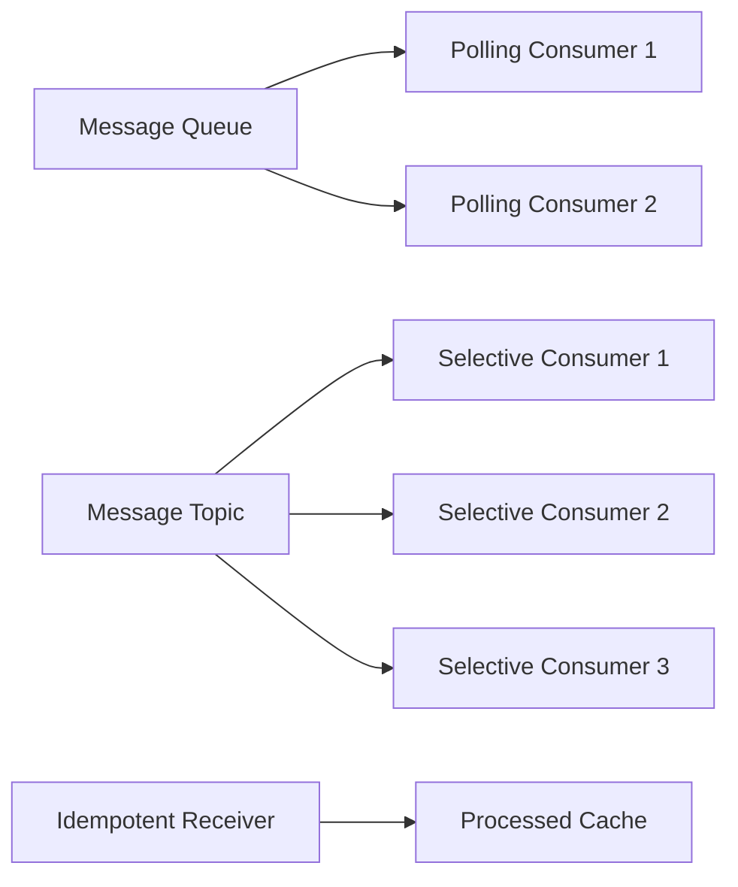

# Messaging Endpoints - Vaughn Vernon Patterns

## Overview

Messaging endpoints are the interface between applications and messaging systems. JOTP implements Vaughn Vernon's endpoint patterns for consuming messages, competing for resources, and ensuring idempotency.

**Patterns Covered**:
1. **Polling Consumer**: Actively pull messages
2. **Competing Consumer**: Multiple consumers compete
3. **Selective Consumer**: Filter messages
4. **Idempotent Receiver**: Handle duplicate messages safely

## Architecture



## Pattern 1: Polling Consumer

### Overview

The consumer actively pulls messages from a source on a schedule, rather than having messages pushed to it. Provides backpressure and flow control.

**Erlang Analog**: Process that periodically sends itself a `poll` message via `timer:send_interval/2`

**Enterprise Integration Pattern**: EIP §10.2 - Polling Consumer

### Public API

```java
public final class PollingConsumer<T> {
    // Create polling consumer
    public PollingConsumer(
        Supplier<T> source,           // Message source (returns null when empty)
        Consumer<T> handler,          // Message handler
        Duration pollInterval         // How often to poll
    );

    // Stop polling
    public void stop();

    // Get underlying process
    public Proc<Long, String> proc();
}
```

### Usage Examples

#### Basic Polling

```java
// Create polling consumer
PollingConsumer<WorkItem> consumer = new PollingConsumer<>(
    () -> workQueue.poll(),  // Returns null if empty
    workItem -> processWork(workItem),
    Duration.ofSeconds(5)     // Poll every 5 seconds
);

// Consumer polls automatically
// Stop when done
consumer.stop();
```

#### Database Polling

```java
// Poll database for new records
PollingConsumer<Record> consumer = new PollingConsumer<>(
    () -> {
        List<Record> records = database.query(
            "SELECT * FROM records WHERE processed = false LIMIT 10"
        );
        return records.isEmpty() ? null : records.get(0);
    },
    record -> {
        processRecord(record);
        database.update("UPDATE records SET processed = true WHERE id = ?", record.id());
    },
    Duration.ofMinutes(1)  // Poll every minute
);
```

#### API Polling

```java
// Poll external API for updates
PollingConsumer<ApiResult> consumer = new PollingConsumer<>(
    () -> {
        try {
            return httpClient.get("https://api.example.com/updates")
                .body(ApiResult.class);
        } catch (Exception e) {
            return null;  // No updates available
        }
    },
    result -> processUpdate(result),
    Duration.ofSeconds(30)  // Poll every 30 seconds
);
```

### When to Use

✅ **Use Polling Consumer when**:
- Need to control message consumption rate
- Implementing backpressure
- Source doesn't support push notifications
- Want to avoid overwhelming the source

❌ **Don't use Polling Consumer when**:
- Source supports push notifications
- Need real-time processing
- Polling adds unnecessary latency

## Pattern 2: Competing Consumer

### Overview

Multiple consumers compete for messages from the same channel. Each message goes to exactly one consumer, enabling parallel processing.

**Erlang Analog**: Multiple processes receiving from same queue

**Enterprise Integration Pattern**: EIP §10.3 - Competing Consumers

### Usage Examples

#### Work Queue

```java
// Create multiple workers competing for same queue
List<PollingConsumer<WorkItem>> workers = new ArrayList<>();

for (int i = 0; i < 10; i++) {
    PollingConsumer<WorkItem> worker = new PollingConsumer<>(
        () -> workQueue.poll(),
        workItem -> processWork(workItem),
        Duration.ofMillis(100)
    );
    workers.add(worker);
}

// 10 workers compete for work items
// Each work item goes to exactly one worker

// Stop all workers
workers.forEach(PollingConsumer::stop);
```

#### Message Queue Consumers

```java
// Create competing consumers for message queue
List<PointToPoint<Message>> consumers = new ArrayList<>();

for (int i = 0; i < 5; i++) {
    PointToPoint<Message> consumer = PointToPoint.create(
        message -> handleMessage(message)
    );
    consumers.add(consumer);
}

// Send messages to queue
for (Message message : messages) {
    // Any available consumer will handle it
    consumers.get(0).send(message);
}
```

#### Parallel Processing

```java
// Process images in parallel
List<PollingConsumer<Image>> processors = new ArrayList<>();

int numProcessors = Runtime.getRuntime().availableProcessors();
for (int i = 0; i < numProcessors; i++) {
    PollingConsumer<Image> processor = new PollingConsumer<>(
        () -> imageQueue.poll(),
        image -> imageProcessor.process(image),
        Duration.ofMillis(10)
    );
    processors.add(processor);
}

// Utilize all CPU cores
logger.info("Started {} image processors", numProcessors);
```

### When to Use

✅ **Use Competing Consumers when**:
- Need parallel processing
- Want to scale throughput horizontally
- Messages can be processed independently
- Need to utilize multiple cores/nodes

❌ **Don't use Competing Consumers when**:
- Messages must be processed in order
- Processing is CPU-bound and single-core is sufficient
- Consumers need to coordinate

## Pattern 3: Selective Consumer

### Overview

Consumes only messages that match specific criteria. Filters out unwanted messages at the consumer level.

**Enterprise Integration Pattern**: EIP §10.4 - Selective Consumer

### Usage Examples

#### Topic-Based Filtering

```java
// Subscribe to specific topics
PublishSubscribe<Message> pubSub = new PublishSubscribe<>();

// Consumer 1: Only interested in orders
pubSub.subscribe(message -> {
    if (message instanceof OrderEvent order) {
        processOrder(order);
    }
});

// Consumer 2: Only interested in payments
pubSub.subscribe(message -> {
    if (message instanceof PaymentEvent payment) {
        processPayment(payment);
    }
});

// Consumer 3: Only interested in shipments
pubSub.subscribe(message -> {
    if (message instanceof ShipmentEvent shipment) {
        processShipment(shipment);
    }
});
```

#### Predicate-Based Filtering

```java
// Selective consumer with predicate
class SelectiveConsumer<T> {
    private final Predicate<T> predicate;
    private final Consumer<T> handler;

    public SelectiveConsumer(Predicate<T> predicate, Consumer<T> handler) {
        this.predicate = predicate;
        this.handler = handler;
    }

    public void consume(T message) {
        if (predicate.test(message)) {
            handler.accept(message);
        }
    }
}

// Create selective consumers
SelectiveConsumer<Message> priorityConsumer = new SelectiveConsumer<>(
    message -> message.priority() >= 8,
    message -> processPriority(message)
);

SelectiveConsumer<Message> normalConsumer = new SelectiveConsumer<>(
    message -> message.priority() < 8,
    message -> processNormal(message)
);
```

#### Content-Based Selective Consumer

```java
// Select based on message content
pubSub.subscribe(message -> {
    if (message instanceof UserEvent userEvent) {
        switch (userEvent.type()) {
            case "USER_CREATED" -> handleUserCreated(userEvent);
            case "USER_UPDATED" -> handleUserUpdated(userEvent);
            case "USER_DELETED" -> handleUserDeleted(userEvent);
        }
    }
});
```

### When to Use

✅ **Use Selective Consumer when**:
- Consumer only needs specific messages
- Want to filter at consumer level
- Different consumers need different messages
- Implementing topic-based routing

❌ **Don't use Selective Consumer when**:
- Consumer needs all messages
- Can filter at producer level (more efficient)
- Filtering logic is complex

## Pattern 4: Idempotent Receiver

### Overview

Handles duplicate messages safely, ensuring exactly-once semantics even if messages are delivered multiple times.

**Enterprise Integration Pattern**: EIP §10.5 - Idempotent Receiver

### Usage Examples

#### Deduplication by ID

```java
class IdempotentReceiver<T> {
    private final Set<String> processedIds = ConcurrentHashMap.newKeySet();
    private final Consumer<T> handler;

    public IdempotentReceiver(Consumer<T> handler) {
        this.handler = handler;
    }

    public void receive(String messageId, T message) {
        if (processedIds.add(messageId)) {
            // First time seeing this message
            handler.accept(message);
        } else {
            // Duplicate message, ignore
            logger.debug("Duplicate message ignored: {}", messageId);
        }
    }
}

// Use idempotent receiver
IdempotentReceiver<Order> receiver = new IdempotentReceiver<>(
    order -> processOrder(order)
);

// Safe to call multiple times with same message
receiver.receive("order-123", order);
receiver.receive("order-123", order);  // Ignored
```

#### Database-Based Deduplication

```java
class PersistentIdempotentReceiver<T> {
    private final Consumer<T> handler;
    private final DataSource dataSource;

    public void receive(String messageId, T message) {
        try (Connection conn = dataSource.getConnection()) {
            // Try to insert message ID
            PreparedStatement stmt = conn.prepareStatement(
                "INSERT INTO processed_messages (id) VALUES (?)"
            );
            stmt.setString(1, messageId);
            stmt.executeUpdate();

            // First time, process message
            handler.accept(message);
        } catch (SQLException e) {
            if (e.getSQLState().equals("23505")) {  // Unique constraint violation
                // Duplicate message
                logger.debug("Duplicate message: {}", messageId);
            } else {
                throw new RuntimeException(e);
            }
        }
    }
}
```

#### Time-Based Deduplication

```java
class TimeBasedIdempotentReceiver<T> {
    private final Cache<String, Boolean> processedIds;
    private final Consumer<T> handler;

    public TimeBasedIdempotentReceiver(Consumer<T> handler, Duration ttl) {
        this.handler = handler;
        this.processedIds = Caffeine.newBuilder()
            .expireAfterWrite(ttl)
            .build();
    }

    public void receive(String messageId, T message) {
        if (processedIds.putIfAbsent(messageId, true) == null) {
            // First time seeing this message
            handler.accept(message);
        } else {
            // Duplicate within TTL
            logger.debug("Duplicate message: {}", messageId);
        }
    }
}

// Deduplicate for 5 minutes
IdempotentReceiver<Order> receiver = new TimeBasedIdempotentReceiver<>(
    order -> processOrder(order),
    Duration.ofMinutes(5)
);
```

### When to Use

✅ **Use Idempotent Receiver when**:
- Messages may be delivered multiple times
- Need exactly-once semantics
- Processing has side effects
- Working with at-least-once delivery

❌ **Don't use Idempotent Receiver when**:
- Delivery is guaranteed exactly-once
- Processing is idempotent by nature
- Deduplication overhead is too high

## Performance Considerations

### Polling Consumer
- **CPU**: Low when idle, high when processing
- **Memory**: Minimal (single message at a time)
- **Latency**: Up to poll interval

### Competing Consumer
- **CPU**: Scales with number of consumers
- **Memory**: O(n) where n = number of consumers
- **Throughput**: Linear scaling with consumers

### Selective Consumer
- **CPU**: O(n) where n = number of messages received
- **Memory**: Minimal
- **Efficiency**: Depends on filter selectivity

### Idempotent Receiver
- **CPU**: O(1) per message (hash lookup)
- **Memory**: O(n) where n = unique message IDs
- **Persistence**: Depends on backing store

## Anti-Patterns to Avoid

### 1. Polling Too Frequently

```java
// BAD: Poll every millisecond
new PollingConsumer<>(source, handler, Duration.ofMillis(1));

// GOOD: Reasonable poll interval
new PollingConsumer<>(source, handler, Duration.ofSeconds(5));
```

### 2. Not Handling Empty Sources

```java
// BAD: Assumes source always has messages
Supplier<Message> source = () -> queue.remove();  // Blocks if empty!

// GOOD: Handle empty case
Supplier<Message> source = () -> queue.poll();  // Returns null if empty
```

### 3. Ignoring Deduplication

```java
// BAD: No deduplication
public void receive(String messageId, Order order) {
    processOrder(order);  // May process duplicates!
}

// GOOD: Check for duplicates
public void receive(String messageId, Order order) {
    if (processedIds.add(messageId)) {
        processOrder(order);
    }
}
```

### 4. Selective Consumer with No Filter

```java
// BAD: Selective consumer that accepts everything
pubSub.subscribe(message -> {
    // No filtering!
    processMessage(message);
});

// GOOD: Actually filter
pubSub.subscribe(message -> {
    if (message instanceof OrderEvent) {
        processMessage(message);
    }
});
```

## Related Patterns

- **Message Filter**: For filtering messages
- **Competing Consumers**: For parallel processing
- **Message Bus**: For message distribution
- **Wire Tap**: For observing messages

## References

- Enterprise Integration Patterns (EIP) - Chapter 10: Messaging Endpoints
- Reactive Messaging Patterns with the Actor Model (Vaughn Vernon)
- [JOTP Proc Documentation](../proc.md)
- [JOTP ProcTimer Documentation](../proctimer.md)

## See Also

- `/Users/sac/jotp/src/main/java/io/github/seanchatmangpt/jotp/messagepatterns/endpoint/PollingConsumer.java`
- `/Users/sac/jotp/src/main/java/io/github/seanchatmangpt/jotp/messagepatterns/endpoint/CompetingConsumer.java`
- `/Users/sac/jotp/src/main/java/io/github/seanchatmangpt/jotp/messagepatterns/endpoint/SelectiveConsumer.java`
- `/Users/sac/jotp/src/main/java/io/github/seanchatmangpt/jotp/messagepatterns/endpoint/IdempotentReceiver.java`
- `/Users/sac/jotp/src/test/java/io/github/seanchatmangpt/jotp/messagepatterns/endpoint/EndpointPatternsTest.java`
