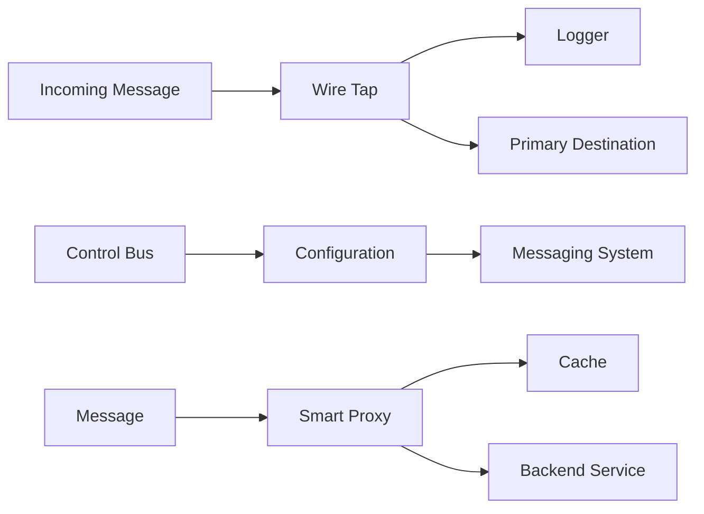

# Messaging System Management - Vaughn Vernon Patterns

## Overview

Messaging system management patterns provide operational control over message flows. JOTP implements Vaughn Vernon's management patterns for message interception, routing control, and transactional messaging.

**Patterns Covered**:
1. **Wire Tap**: Observe messages without affecting flow
2. **Control Bus**: Operational control over messaging system
3. **Smart Proxy**: Intelligent message interception
4. **Transactional Actor**: Transactional message processing

## Architecture



## Pattern 1: Wire Tap

### Overview

Observes messages flowing through a channel without affecting the primary flow. Copies each message to a secondary destination (typically a logger or monitor) while the primary message flow continues unaffected.

**Erlang Analog**: Process that receives a message, sends a copy to a monitor process, then forwards the original unchanged

**Enterprise Integration Pattern**: EIP §11.1 - Wire Tap

### Public API

```java
public final class WireTap<T> {
    // Create wire tap
    public WireTap(
        Consumer<T> primary,      // Primary destination
        Consumer<T> tap           // Secondary (tap) destination
    );

    // Send message through wire tap
    public void send(T message);

    // Activate the tap
    public void activate();

    // Deactivate the tap (primary flow continues)
    public void deactivate();

    // Check if tap is active
    public boolean isActive();

    // Stop wire tap
    public void stop() throws InterruptedException;
}
```

### Usage Examples

#### Message Logging

```java
// Create wire tap for logging
WireTap<Message> wireTap = new WireTap<>(
    message -> messageProcessor.process(message),  // Primary
    message -> logger.info("Message: {}", message)  // Tap: logger
);

// All messages are logged but still processed
wireTap.send(new Message("Hello"));
wireTap.send(new Message("World"));
```

#### Metrics Collection

```java
// Collect metrics without affecting processing
WireTap<Request> wireTap = new WireTap<>(
    request -> handleRequest(request),  // Primary
    request -> {  // Tap: metrics
        metricsService.counter("requests.total").increment();
        metricsService.timer("requests.latency").record(request.duration());
    }
);

wireTap.send(new Request(...));
```

#### Debugging Tap

```java
// Add debugging tap
WireTap<Message> wireTap = new WireTap<>(
    message -> processMessage(message),
    message -> {
        if (debugEnabled) {
            System.out.println("DEBUG: " + message);
        }
    }
);

// Can be toggled on/off
wireTap.activate();  // Enable debugging
wireTap.deactivate();  // Disable debugging
```

#### Conditional Tap

```java
// Only tap certain messages
WireTap<Message> wireTap = new WireTap<>(
    message -> processMessage(message),
    message -> {
        if (message instanceof ErrorEvent) {
            errorLogger.log("Error event: {}", message);
        }
    }
);
```

### When to Use

✅ **Use Wire Tap when**:
- Need to observe messages without affecting flow
- Implementing message logging
- Collecting metrics or analytics
- Debugging message flows
- Compliance/auditing requirements

❌ **Don't use Wire Tap when**:
- Need to modify messages
- Tap failures should affect primary flow
- Need message filtering (use Selective Consumer)

## Pattern 2: Control Bus

### Overview

Provides operational control over the messaging system. Allows runtime configuration changes, monitoring, and management without restarting the system.

**Enterprise Integration Pattern**: EIP §13.3 - Control Bus

### Usage Examples

#### Dynamic Configuration

```java
// Control bus for configuration
class ControlBus {
    private final Map<String, Object> config = new ConcurrentHashMap<>();

    public void updateConfig(String key, Object value) {
        config.put(key, value);
        notifyConfigChange(key, value);
    }

    public Object getConfig(String key) {
        return config.get(key);
    }

    private void notifyConfigChange(String key, Object value) {
        // Notify interested parties
        eventBus.publish(new ConfigChangeEvent(key, value));
    }
}

// Use control bus
ControlBus controlBus = new ControlBus();

// Update configuration at runtime
controlBus.updateConfig("max.queue.size", 1000);
controlBus.updateConfig("processing.timeout", 5000);
```

#### Throttling Control

```java
// Control processing rate
class ThrottlingControl {
    private volatile double rate = 1.0;  // Messages per millisecond

    public void setRate(double messagesPerSecond) {
        this.rate = messagesPerSecond / 1000.0;
    }

    public void acquire() throws InterruptedException {
        long delay = (long) (1000 / rate);
        Thread.sleep(delay);
    }
}

ThrottlingControl control = new ThrottlingControl();

// Adjust throttling at runtime
control.setRate(100);  // 100 messages/second
control.setRate(10);   // Slow down to 10 messages/second
```

#### Feature Flags

```java
// Control feature availability
class FeatureControl {
    private final Map<String, Boolean> features = new ConcurrentHashMap<>();

    public void enableFeature(String feature) {
        features.put(feature, true);
    }

    public void disableFeature(String feature) {
        features.put(feature, false);
    }

    public boolean isEnabled(String feature) {
        return features.getOrDefault(feature, false);
    }
}

FeatureControl control = new FeatureControl();

// Enable/disable features at runtime
control.enableFeature("new-payment-flow");
control.disableFeature("legacy-api");

// Check before processing
if (control.isEnabled("new-payment-flow")) {
    newPaymentProcessor.process(payment);
} else {
    legacyPaymentProcessor.process(payment);
}
```

### When to Use

✅ **Use Control Bus when**:
- Need runtime configuration changes
- Implementing feature flags
- Dynamic throttling/rate limiting
- Operational control without restarts
- A/B testing

❌ **Don't use Control Bus when**:
- Configuration is static
- Changes require restart
- Simpler configuration management exists

## Pattern 3: Smart Proxy

### Overview

Intelligent message interception that can modify, cache, or route messages based on content and context. More sophisticated than a simple wire tap.

### Usage Examples

#### Caching Proxy

```java
// Cache results of expensive operations
class SmartProxy<K, V> {
    private final Cache<K, V> cache;
    private final Function<K, V> backend;

    public SmartProxy(Function<K, V> backend) {
        this.backend = backend;
        this.cache = Caffeine.newBuilder()
            .maximumSize(1000)
            .expireAfterWrite(Duration.ofMinutes(10))
            .build();
    }

    public V get(K key) {
        return cache.get(key, backend);
    }
}

// Use smart proxy
SmartProxy<String, User> proxy = new SmartProxy<>(
    userId -> database.loadUser(userId)  // Backend
);

// First call hits backend
User user1 = proxy.get("user-123");

// Subsequent calls hit cache
User user2 = proxy.get("user-123");
```

#### Transforming Proxy

```java
// Transform messages before forwarding
class TransformingProxy<T, U> {
    private final Function<T, U> transform;
    private final Consumer<U> destination;

    public TransformingProxy(Function<T, U> transform, Consumer<U> destination) {
        this.transform = transform;
        this.destination = destination;
    }

    public void send(T message) {
        U transformed = transform.apply(message);
        destination.accept(transformed);
    }
}

// Transform legacy format to modern format
TransformingProxy<LegacyOrder, ModernOrder> proxy = new TransformingProxy<>(
    legacy -> convertToModern(legacy),
    modernOrder -> orderService.process(modernOrder)
);

proxy.send(new LegacyOrder(...));
```

#### Routing Proxy

```java
// Route to different backends based on load
class LoadBalancingProxy {
    private final List<Backend> backends;
    private final AtomicInteger index = new AtomicInteger(0);

    public LoadBalancingProxy(List<Backend> backends) {
        this.backends = backends;
    }

    public void send(Request request) {
        // Round-robin routing
        int i = index.getAndIncrement() % backends.size();
        backends.get(i).handle(request);
    }
}

LoadBalancingProxy proxy = new LoadBalancingProxy(
    List.of(backend1, backend2, backend3)
);

proxy.send(request);  // Routes to available backend
```

### When to Use

✅ **Use Smart Proxy when**:
- Need to intercept and modify messages
- Implementing caching layers
- Load balancing or routing
- Adding cross-cutting concerns

❌ **Don't use Smart Proxy when**:
- Simple point-to-point messaging
- No interception needed
- Proxy adds unnecessary complexity

## Pattern 4: Transactional Actor

### Overview

Ensures message processing is transactional - either all operations succeed or all fail. Provides atomicity and consistency guarantees.

### Usage Examples

#### Database Transaction

```java
// Process message within database transaction
class TransactionalProcessor {
    private final DataSource dataSource;

    public void process(Message message) {
        try (Connection conn = dataSource.getConnection()) {
            conn.setAutoCommit(false);

            try {
                // Process message
                handleMessage(conn, message);

                // Commit transaction
                conn.commit();
            } catch (Exception e) {
                // Rollback on error
                conn.rollback();
                throw new RuntimeException("Processing failed", e);
            }
        } catch (SQLException e) {
            throw new RuntimeException("Database error", e);
        }
    }

    private void handleMessage(Connection conn, Message message) {
        // All database operations use the same connection
        updateOrder(conn, message.orderId());
        insertAuditLog(conn, message);
        updateInventory(conn, message.items());
    }
}
```

#### Distributed Transaction

```java
// Transaction across multiple systems
class DistributedTransactionalProcessor {
    public void process(Order order) {
        Transaction transaction = new Transaction();

        try {
            // Start transaction
            transaction.begin();

            // Reserve inventory
            transaction.addOperation(() -> inventoryService.reserve(order));

            // Charge payment
            transaction.addOperation(() -> paymentService.charge(order));

            // Create shipment
            transaction.addOperation(() -> shippingService.create(order));

            // Commit all operations
            transaction.commit();
        } catch (Exception e) {
            // Rollback all operations
            transaction.rollback();
            throw new RuntimeException("Order processing failed", e);
        }
    }
}
```

#### Saga Transaction

```java
// Use saga for long-running transactions
DistributedSagaCoordinator saga = DistributedSagaCoordinator.create(
    new SagaConfig(
        "order-fulfillment",
        List.of(
            new SagaStep.Action<>("reserve-inventory", inventoryService::reserve),
            new SagaStep.Compensation<>("release-inventory", inventoryService::release),
            new SagaStep.Action<>("charge-payment", paymentService::charge),
            new SagaStep.Compensation<>("refund-payment", paymentService::refund),
            new SagaStep.Action<>("create-shipment", shippingService::create)
        )
    )
);

CompletableFuture<SagaResult> future = saga.execute();
```

### When to Use

✅ **Use Transactional Actor when**:
- Need atomicity guarantees
- Processing has side effects
- Must maintain consistency
- Implementing compensation logic

❌ **Don't use Transactional Actor when**:
- Processing is idempotent
- No side effects
- Transactions add too much overhead

## Performance Considerations

### Wire Tap
- **CPU**: Minimal overhead (async tap)
- **Memory**: O(1) per message
- **Latency**: Negligible if tap is async

### Control Bus
- **CPU**: O(1) per configuration change
- **Memory**: O(n) where n = configuration items
- **Latency**: Depends on configuration propagation

### Smart Proxy
- **CPU**: O(n) where n = transformation complexity
- **Memory**: O(n) for caching
- **Latency**: Depends on backend and cache hit rate

### Transactional Actor
- **CPU**: High (transaction overhead)
- **Memory**: O(n) for transaction state
- **Latency**: High (commit/rollback overhead)

## Anti-Patterns to Avoid

### 1. Blocking Wire Tap

```java
// BAD: Tap blocks primary flow
WireTap<Message> wireTap = new WireTap<>(
    message -> processMessage(message),
    message -> {
        Thread.sleep(1000);  // Blocks!
        logger.log(message);
    }
);

// GOOD: Async tap
WireTap<Message> wireTap = new WireTap<>(
    message -> processMessage(message),
    message -> CompletableFuture.runAsync(() -> logger.log(message))
);
```

### 2. Control Bus Without Validation

```java
// BAD: No validation
public void updateConfig(String key, Object value) {
    config.put(key, value);  // Any value accepted!
}

// GOOD: Validate configuration
public void updateConfig(String key, Object value) {
    if (!isValid(key, value)) {
        throw new IllegalArgumentException("Invalid config value");
    }
    config.put(key, value);
}
```

### 3. Smart Proxy Without Fallback

```java
// BAD: No fallback if backend fails
class SmartProxy<K, V> {
    public V get(K key) {
        return cache.get(key, backend);  // Throws if backend fails
    }
}

// GOOD: Handle failures gracefully
class SmartProxy<K, V> {
    public V get(K key) {
        try {
            return cache.get(key, backend);
        } catch (Exception e) {
            logger.error("Backend failed", e);
            return null;  // Or return stale cache value
        }
    }
}
```

### 4. Transactions Without Rollback

```java
// BAD: No rollback on error
public void process(Message message) {
    try {
        conn.setAutoCommit(false);
        handleMessage(conn, message);
        conn.commit();
    } catch (Exception e) {
        // Forgot to rollback!
        throw new RuntimeException(e);
    }
}

// GOOD: Always rollback on error
public void process(Message message) {
    try {
        conn.setAutoCommit(false);
        handleMessage(conn, message);
        conn.commit();
    } catch (Exception e) {
        conn.rollback();
        throw new RuntimeException(e);
    }
}
```

## Related Patterns

- **Content-Based Router**: For intelligent routing
- **Wire Tap**: For message observation
- **Saga**: For distributed transactions
- **Message Translator**: For message transformation

## References

- Enterprise Integration Patterns (EIP) - Chapter 11: Messaging System Management
- Reactive Messaging Patterns with the Actor Model (Vaughn Vernon)
- [JOTP Proc Documentation](../proc.md)
- [JOTP Supervisor Documentation](../supervisor.md)

## See Also

- `/Users/sac/jotp/src/main/java/io/github/seanchatmangpt/jotp/messagepatterns/management/WireTap.java`
- `/Users/sac/jotp/src/main/java/io/github/seanchatmangpt/jotp/messagepatterns/management/SmartProxy.java`
- `/Users/sac/jotp/src/main/java/io/github/seanchatmangpt/jotp/messagepatterns/management/TransactionalActor.java`
- `/Users/sac/jotp/src/main/java/io/github/seanchatmangpt/jotp/messagepatterns/management/PipesAndFilters.java`
- `/Users/sac/jotp/src/test/java/io/github/seanchatmangpt/jotp/messagepatterns/management/ManagementPatternsTest.java`
