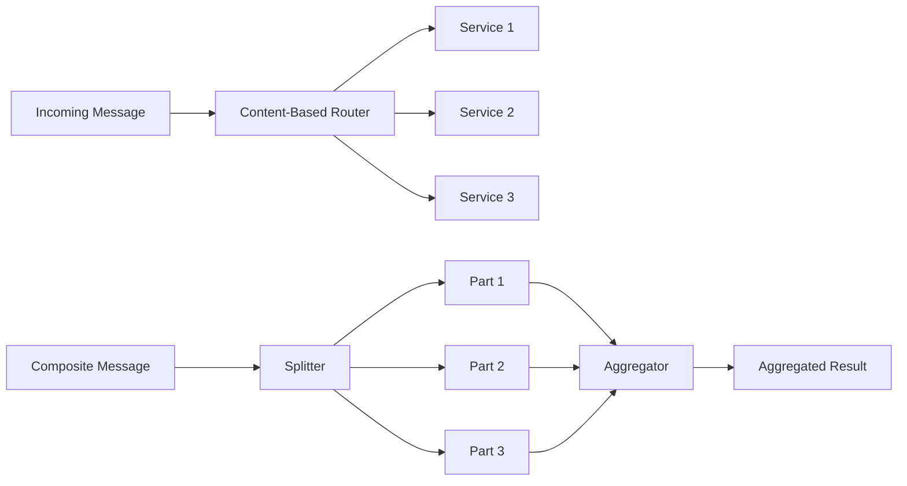

# Messaging Routing - Vaughn Vernon Patterns

## Overview

Messaging routing patterns control how messages flow through a system. JOTP implements Vaughn Vernon's routing patterns for content-based dispatching, message decomposition, aggregation, and scatter-gather processing.

**Patterns Covered**:
1. **Content-Based Router**: Route based on message content
2. **Splitter**: Decompose composite messages
3. **Aggregator**: Collect correlated messages
4. **Recipient List**: Route to multiple destinations
5. **Scatter-Gather**: Parallel processing with aggregation

## Architecture



## Pattern 1: Content-Based Router

### Overview

Inspects each message and routes to the appropriate destination based on message content. Uses predicates to determine routing logic.

**Erlang Analog**: Pattern matching in `receive` clauses

**Enterprise Integration Pattern**: EIP §8.1 - Content-Based Router

### Public API

```java
public final class ContentBasedRouter<T> {
    // Create builder
    public static <T> Builder<T> builder();

    // Route message
    public boolean route(T message);

    // Builder interface
    public static final class Builder<T> {
        public Builder<T> when(Predicate<T> predicate, Consumer<T> destination);
        public Builder<T> otherwise(Consumer<T> destination);
        public ContentBasedRouter<T> build();
    }
}
```

### Usage Examples

#### Order Routing

```java
// Define order types
record Order(String orderId, String type, List<Item> items) {}

// Create router
ContentBasedRouter<Order> router = ContentBasedRouter.<Order>builder()
    .when(order -> order.type().equals("TypeABC"), inventoryA::tell)
    .when(order -> order.type().equals("TypeXYZ"), inventoryX::tell)
    .otherwise(deadLetter::tell)
    .build();

// Route orders
router.route(new Order("order-1", "TypeABC", items));  // Goes to inventoryA
router.route(new Order("order-2", "TypeXYZ", items));  // Goes to inventoryX
router.route(new Order("order-3", "UNKNOWN", items));  // Goes to deadLetter
```

#### Priority Routing

```java
record WorkItem(String id, int priority) {}

ContentBasedRouter<WorkItem> router = ContentBasedRouter.<WorkItem>builder()
    .when(item -> item.priority() >= 9), highPriorityQueue::add)
    .when(item -> item.priority() >= 5), mediumPriorityQueue::add)
    .otherwise(lowPriorityQueue::add)
    .build();

router.route(new WorkItem("task-1", 9));   // High priority
router.route(new WorkItem("task-2", 5));   // Medium priority
router.route(new WorkItem("task-3", 1));   // Low priority
```

#### Geographic Routing

```java
record Request(String requestId, String region) {}

ContentBasedRouter<Request> router = ContentBasedRouter.<Request>builder()
    .when(req -> req.region().equals("us-east")), usEastService::handle)
    .when(req -> req.region().equals("us-west")), usWestService::handle)
    .when(req -> req.region().equals("eu-west")), euWestService::handle)
    .otherwise(defaultService::handle)
    .build();

router.route(new Request("req-1", "us-east"));  // US East
router.route(new Request("req-2", "eu-west"));  // EU West
```

### When to Use

✅ **Use Content-Based Router when**:
- Need to route based on message content
- Different destinations for different message types
- Want to avoid if-else chains
- Clean separation of routing logic

❌ **Don't use Content-Based Router when**:
- All messages go to same destination
- Routing is based on message type (use Datatype Channel)
- Simple point-to-point is sufficient

## Pattern 2: Splitter

### Overview

Decomposes a composite message into individual parts and routes each part. Useful for breaking down complex messages.

**Erlang Analog**: Process that decomposes list-based messages

**Enterprise Integration Pattern**: EIP §8.5 - Splitter

### Public API

```java
public final class Splitter<T, P> {
    // Create splitter
    public Splitter(
        Function<T, List<P>> splitFunction,
        Consumer<P> partConsumer
    );

    // Split and route
    public int split(T message);

    // Create with router
    public static <T, P> Splitter<T, P> withRouter(
        Function<T, List<P>> splitFunction,
        ContentBasedRouter<P> router
    );
}
```

### Usage Examples

#### Order Splitting

```java
record Order(String orderId, List<OrderItem> items) {}
record OrderItem(String productId, int quantity) {}

// Create splitter
Splitter<Order, OrderItem> splitter = new Splitter<>(
    order -> order.items(),  // Extract items
    item -> itemProcessor.process(item)
);

// Split order into items
Order order = new Order("order-1", List.of(
    new OrderItem("product-1", 2),
    new OrderItem("product-2", 1)
));

int count = splitter.split(order);  // Returns 2
```

#### Batch Processing

```java
record Batch(List<Record> records) {}

Splitter<Batch, Record> splitter = new Splitter<>(
    batch -> batch.records(),
    record -> database.insert(record)
);

Batch batch = new Batch(List.of(
    new Record("data-1"),
    new Record("data-2"),
    new Record("data-3")
));

splitter.split(batch);  // Inserts all records
```

#### Splitter with Router

```java
// Split and route based on item type
Splitter<Order, OrderItem> splitter = Splitter.withRouter(
    order -> order.items(),
    ContentBasedRouter.<OrderItem>builder()
        .when(item -> item.type().equals("digital")), digitalFulfillment::ship)
        .when(item -> item.type().equals("physical")), physicalFulfillment::ship)
        .otherwise(unknownFulfillment::handle)
        .build()
);

splitter.split(order);  // Splits and routes each item
```

### When to Use

✅ **Use Splitter when**:
- Need to decompose composite messages
- Process parts independently
- Want to parallelize processing
- Breaking down batches

❌ **Don't use Splitter when**:
- Message is already atomic
- Need to process message as whole
- Parts are dependent on each other

## Pattern 3: Aggregator

### Overview

Collects correlated messages until a completion condition is met, then emits an aggregated result. Uses correlation keys to group messages.

**Erlang Analog**: `gen_server` accumulating results by correlation ID

**Enterprise Integration Pattern**: EIP §8.6 - Aggregator

### Public API

```java
public final class Aggregator<T, K, R> {
    // Create aggregator
    public Aggregator(
        Function<T, K> correlationKeyExtractor,
        Function<List<T>, R> aggregateFunction,
        Consumer<R> resultConsumer
    );

    // Set expected count for correlation key
    public void expect(K correlationKey, int expectedCount);

    // Add part to aggregation
    public void addPart(T part);

    // Stop aggregator
    public void stop() throws InterruptedException;
}
```

### Usage Examples

#### Price Quote Aggregation

```java
record QuoteRequest(String rfqId, List<String> supplierIds) {}
record PriceQuote(String rfqId, String supplierId, BigDecimal price) {}
record QuotationFulfillment(String rfqId, List<PriceQuote> quotes) {}

// Create aggregator
Aggregator<PriceQuote, String, QuotationFulfillment> aggregator =
    new Aggregator<>(
        quote -> quote.rfqId(),  // Correlation key
        quotes -> new QuotationFulfillment(
            quotes.get(0).rfqId(),
            new ArrayList<>(quotes)
        ),  // Aggregate function
        fulfillment -> orderService.process(fulfillment)  // Result handler
    );

// Expect 3 quotes for RFQ-123
aggregator.expect("RFQ-123", 3);

// Add quotes
aggregator.addPart(new PriceQuote("RFQ-123", "supplier-1", new BigDecimal("100")));
aggregator.addPart(new PriceQuote("RFQ-123", "supplier-2", new BigDecimal("95")));
aggregator.addPart(new PriceQuote("RFQ-123", "supplier-3", new BigDecimal("105")));

// After 3 quotes, QuotationFulfillment is emitted
```

#### Order Item Aggregation

```java
record ShipmentItem(String orderId, String itemId) {}
record CompleteShipment(String orderId, List<ShipmentItem> items) {}

Aggregator<ShipmentItem, String, CompleteShipment> aggregator =
    new Aggregator<>(
        item -> item.orderId(),
        items -> new CompleteShipment(
            items.get(0).orderId(),
            new ArrayList<>(items)
        ),
        shipment -> shippingService.ship(shipment)
    );

// Expect 5 items for order-1
aggregator.expect("order-1", 5);

// Add items as they're packed
aggregator.addPart(new ShipmentItem("order-1", "item-1"));
aggregator.addPart(new ShipmentItem("order-1", "item-2"));
// ... more items
aggregator.addPart(new ShipmentItem("order-1", "item-5"));

// After 5 items, CompleteShipment is emitted
```

### When to Use

✅ **Use Aggregator when**:
- Need to collect related messages
- Processing requires all parts
- Implementing scatter-gather
- Batch processing results

❌ **Don't use Aggregator when**:
- Messages are independent
- Don't need to wait for all parts
- Stream processing is sufficient

## Pattern 4: Recipient List

### Overview

Routes each message to multiple destinations. All recipients receive the message.

**Enterprise Integration Pattern**: EIP §8.3 - Recipient List

### Usage Examples

#### Broadcasting

```java
record Notification(String message, List<String> channels) {}

ContentBasedRouter<Notification> router = ContentBasedRouter.<Notification>builder()
    .when(notif -> notif.channels().contains("email")), emailService::send)
    .when(notif -> notif.channels().contains("sms")), smsService::send)
    .when(notif -> notif.channels().contains("push")), pushService::send)
    .build();

Notification notification = new Notification(
    "Hello!",
    List.of("email", "sms", "push")
);

router.route(notification);  // Routes to all three channels
```

#### Multi-System Update

```java
record UserUpdate(String userId, Map<String, Object> changes) {}

List<Consumer<UserUpdate>> recipients = List.of(
    cacheService::update,
    searchService::index,
    analyticsService::track
);

// Send to all recipients
UserUpdate update = new UserUpdate("user-1", Map.of("name", "John"));
recipients.forEach(recipient -> recipient.accept(update));
```

## Pattern 5: Scatter-Gather

### Overview

Scatters a message to multiple recipients, then gathers their responses into an aggregated result. Combines Splitter and Aggregator patterns.

**Enterprise Integration Pattern**: EIP §8.7 - Scatter-Gather

### Usage Examples

#### Parallel Price Quotes

```java
record RFQ(String rfqId, String productId, int quantity) {}
record PriceQuote(String rfqId, String supplierId, BigDecimal price) {}
record QuotationFulfillment(String rfqId, List<PriceQuote> quotes) {}

// Create aggregator for quotes
Aggregator<PriceQuote, String, QuotationFulfillment> aggregator =
    new Aggregator<>(
        quote -> quote.rfqId(),
        quotes -> new QuotationFulfillment(quotes.get(0).rfqId(), new ArrayList<>(quotes)),
        fulfillment -> resultQueue.add(fulfillment)
    );

// Scatter RFQ to multiple suppliers
aggregator.expect("RFQ-123", 3);

List<SupplierService> suppliers = List.of(
    supplierA,
    supplierB,
    supplierC
);

RFQ rfq = new RFQ("RFQ-123", "product-1", 100);

// Scatter
suppliers.forEach(supplier -> {
    PriceQuote quote = supplier.requestQuote(rfq);
    aggregator.addPart(quote);  // Gather
});

// After 3 quotes, QuotationFulfillment is emitted
```

#### Parallel Data Fetching

```java
record DataRequest(String requestId) {}
record DataResponse(String requestId, String source, String data) {}
record AggregatedData(String requestId, Map<String, String> data) {}

Aggregator<DataResponse, String, AggregatedData> aggregator =
    new Aggregator<>(
        response -> response.requestId(),
        responses -> {
            Map<String, String> data = new HashMap<>();
            responses.forEach(r -> data.put(r.source(), r.data()));
            return new AggregatedData(responses.get(0).requestId(), data);
        },
        result -> processResult(result)
    );

aggregator.expect("req-1", 3);

// Scatter requests to multiple data sources
List<DataService> services = List.of(database, cache, api);
services.forEach(service -> {
    DataResponse response = service.fetch(new DataRequest("req-1"));
    aggregator.addPart(response);  // Gather
});
```

## Performance Considerations

### Content-Based Router
- **Throughput**: O(n) where n = number of predicates
- **Latency**: Low (< 1ms)
- **Memory**: Minimal

### Splitter
- **Throughput**: O(n) where n = number of parts
- **Latency**: Low per part
- **Memory**: O(n) for part storage

### Aggregator
- **Throughput**: O(1) per part
- **Latency**: High (waits for all parts)
- **Memory**: O(n × m) where n = groups, m = parts per group

## Anti-Patterns to Avoid

### 1. Forgetting to Set Expectations

```java
// BAD: Never set expected count
aggregator.addPart(part);  // Never aggregates

// GOOD: Set expectation first
aggregator.expect(correlationKey, 3);
aggregator.addPart(part);
```

### 2. Blocking in Router

```java
// BAD: Blocking operation in router
router.when(predicate, msg -> {
    Thread.sleep(1000);  // Blocks!
});

// GOOD: Async processing
router.when(predicate, msg ->
    CompletableFuture.runAsync(() -> process(msg))
);
```

### 3. Not Handling All Cases

```java
// BAD: Missing otherwise clause
ContentBasedRouter.<Message>builder()
    .when(pred1, dest1)
    .when(pred2, dest2)
    // What if neither matches?
    .build();

// GOOD: Always have otherwise
ContentBasedRouter.<Message>builder()
    .when(pred1, dest1)
    .when(pred2, dest2)
    .otherwise(defaultDest)  // Fallback
    .build();
```

## Related Patterns

- **Message Filter**: For filtering messages
- **Content Enricher**: For adding data to messages
- **Message Translator**: For transforming messages
- **Wire Tap**: For observing messages

## References

- Enterprise Integration Patterns (EIP) - Chapter 8: Messaging Routing
- Reactive Messaging Patterns with the Actor Model (Vaughn Vernon)
- [JOTP Proc Documentation](../proc.md)

## See Also

- `/Users/sac/jotp/src/main/java/io/github/seanchatmangpt/jotp/messagepatterns/routing/ContentBasedRouter.java`
- `/Users/sac/jotp/src/main/java/io/github/seanchatmangpt/jotp/messagepatterns/routing/Splitter.java`
- `/Users/sac/jotp/src/main/java/io/github/seanchatmangpt/jotp/messagepatterns/routing/Aggregator.java`
- `/Users/sac/jotp/src/main/java/io/github/seanchatmangpt/jotp/messagepatterns/routing/ScatterGather.java`
- `/Users/sac/jotp/src/test/java/io/github/seanchatmangpt/jotp/messagepatterns/routing/RoutingPatternsTest.java`
