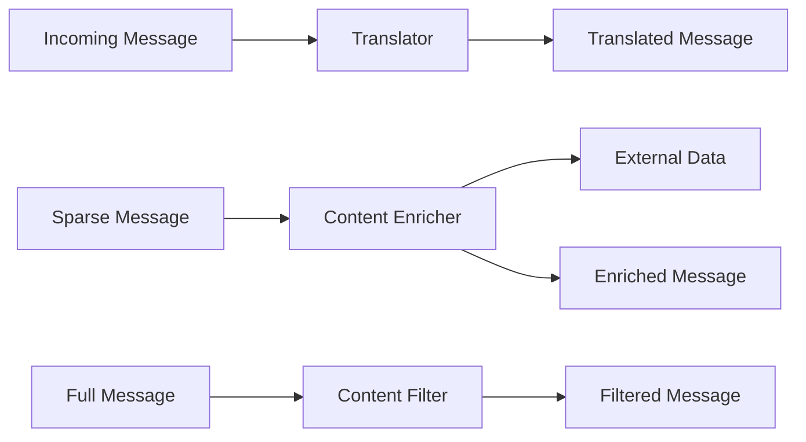

# Messaging Transformation - Vaughn Vernon Patterns

## Overview

Messaging transformation patterns modify message content and structure as they flow through the system. JOTP implements Vaughn Vernon's transformation patterns for translating, enriching, and filtering messages.

**Patterns Covered**:
1. **Message Translator**: Transform message format
2. **Content Enricher**: Add data to messages
3. **Content Filter**: Remove data from messages
4. **Normalizer**: Convert to common format

## Architecture



## Pattern 1: Message Translator

### Overview

Transforms messages from one format to another. Essential for integrating systems with different message formats.

**Erlang Analog**: Process that receives message in one format and sends in another

**Enterprise Integration Pattern**: EIP §7.2 - Message Translator

### Public API

```java
public final class MessageTranslator<T, U> {
    // Create translator
    public MessageTranslator(
        Function<T, U> translateFunction,
        Consumer<U> destination
    );

    // Translate and forward
    public void translate(T message);

    // Apply translation synchronously
    public U apply(T message);

    // Stop translator
    public void stop() throws InterruptedException;
}
```

### Usage Examples

#### Format Conversion

```java
// Convert between XML and JSON
record XmlOrder(String xml) {}
record JsonOrder(String json) {}

MessageTranslator<XmlOrder, JsonOrder> translator = new MessageTranslator<>(
    xmlOrder -> {
        // Parse XML, convert to JSON
        Order order = parseXml(xmlOrder.xml());
        String json = toJson(order);
        return new JsonOrder(json);
    },
    jsonOrder -> jsonConsumer.accept(jsonOrder.json())
);

// Translate XML order to JSON
translator.translate(new XmlOrder("<order>...</order>"));
```

#### Protocol Translation

```java
// Translate between REST and gRPC
record RestRequest(String path, Map<String, String> params) {}
record GrpcRequest(String method, byte[] payload) {}

MessageTranslator<RestRequest, GrpcRequest> translator = new MessageTranslator<>(
    restRequest -> {
        // Convert REST to gRPC
        String method = pathToMethod(restRequest.path());
        byte[] payload = serializeParams(restRequest.params());
        return new GrpcRequest(method, payload);
    },
    grpcRequest -> grpcClient.call(grpcRequest.method(), grpcRequest.payload())
);

translator.translate(new RestRequest("/api/v1/orders", params));
```

#### Legacy to Modern

```java
// Legacy format
record LegacyCustomer(String legacyId, String legacyName) {}

// Modern format
record Customer(String customerId, String firstName, String lastName) {}

MessageTranslator<LegacyCustomer, Customer> translator = new MessageTranslator<>(
    legacy -> {
        // Parse legacy name format "Last, First"
        String[] parts = legacy.legacyName().split(", ");
        return new Customer(
            legacy.legacyId(),
            parts[1],
            parts[0]
        );
    },
    customer -> modernService.createCustomer(customer)
);

translator.translate(new LegacyCustomer("CUST-001", "Doe, John"));
```

### When to Use

✅ **Use Message Translator when**:
- Integrating systems with different formats
- Migrating from legacy to modern systems
- Need protocol conversion
- Standardizing message formats

❌ **Don't use Message Translator when**:
- Messages are already in correct format
- Transformation adds no value
- Can modify source system instead

## Pattern 2: Content Enricher

### Overview

Augments a message with additional data from an external resource. Queries external sources and merges results into the message.

**Erlang Analog**: Process that queries ETS table or external service and forwards enriched message

**Enterprise Integration Pattern**: EIP §7.3 - Content Enricher

### Public API

```java
public final class ContentEnricher<T, R, U> {
    // Create enricher
    public ContentEnricher(
        Function<T, R> resourceLookup,
        BiFunction<T, R, U> enrichFunction,
        Consumer<U> destination
    );

    // Enrich and forward
    public void enrich(T message);

    // Apply enrichment synchronously
    public U apply(T message);

    // Stop enricher
    public void stop() throws InterruptedException;
}
```

### Usage Examples

#### Customer Enrichment

```java
// Sparse message
record Order(String orderId, String customerId) {}

// Enrichment resource
record Customer(String customerId, String name, String email, String ssn) {}

// Enriched message
record EnrichedOrder(String orderId, String customerId, String customerName, String customerEmail) {}

ContentEnricher<Order, Customer, EnrichedOrder> enricher = new ContentEnricher<>(
    order -> customerService.lookup(order.customerId()),  // Resource lookup
    (order, customer) -> new EnrichedOrder(
        order.orderId(),
        order.customerId(),
        customer.name(),
        customer.email()
    ),  // Enrich function
    enrichedOrder -> orderProcessor.process(enrichedOrder)  // Destination
);

// Enrich order with customer data
enricher.enrich(new Order("order-1", "customer-1"));
```

#### Product Enrichment

```java
record LineItem(String productId, int quantity) {}
record ProductDetails(String productId, String name, BigDecimal price, String description) {}
record EnrichedLineItem(String productId, String productName, BigDecimal price, int quantity) {}

ContentEnricher<LineItem, ProductDetails, EnrichedLineItem> enricher = new ContentEnricher<>(
    item -> productCatalog.lookup(item.productId()),
    (item, product) -> new EnrichedLineItem(
        item.productId(),
        product.name(),
        product.price(),
        item.quantity()
    ),
    enrichedItem -> cartService.addItem(enrichedItem)
);

enricher.enrich(new LineItem("product-1", 2));
```

#### Geographic Enrichment

```java
record Address(String zipCode) {}
record GeoLocation(String zipCode, double latitude, double longitude, String city, String state) {}
record EnrichedAddress(String zipCode, String city, String state, double lat, double lon) {}

ContentEnricher<Address, GeoLocation, EnrichedAddress> enricher = new ContentEnricher<>(
    address -> geoService.lookup(address.zipCode()),
    (address, geo) -> new EnrichedAddress(
        address.zipCode(),
        geo.city(),
        geo.state(),
        geo.latitude(),
        geo.longitude()
    ),
    enriched -> locationService.track(enriched)
);

enricher.enrich(new Address("90210"));
```

### When to Use

✅ **Use Content Enricher when**:
- Message lacks necessary data
- Need to query external resources
- Enriching data for downstream consumers
- Implementing data augmentation

❌ **Don't use Content Enricher when**:
- Message already contains all needed data
- External queries are too expensive
- Can include data in original message

## Pattern 3: Content Filter

### Overview

Removes unnecessary data from messages, reducing size and complexity. Focuses on relevant information for each consumer.

**Enterprise Integration Pattern**: EIP §7.4 - Content Filter

### Usage Examples

#### Sensitive Data Filtering

```java
// Full customer record
record FullCustomer(String customerId, String name, String email, String ssn, String ccNumber) {}

// Filtered for marketing
record MarketingCustomer(String customerId, String name, String email) {}

Function<FullCustomer, MarketingCustomer> filter = customer -> new MarketingCustomer(
    customer.customerId(),
    customer.name(),
    customer.email()
    // SSN and credit card removed
);

FullCustomer full = new FullCustomer("cust-1", "John Doe", "john@example.com", "123-45-6789", "4111-1111-1111-1111");
MarketingCustomer filtered = filter.apply(full);
```

#### Log Filtering

```java
record DetailedEvent(String eventId, String type, Map<String, Object> data, String stackTrace) {}
record LogEvent(String eventId, String type, String summary) {}

Function<DetailedEvent, LogEvent> filter = event -> new LogEvent(
    event.eventId(),
    event.type(),
    event.data().toString()
    // Stack trace removed
);
```

#### API Response Filtering

```java
record FullUser(String userId, String name, String email, String passwordHash, String salt, List<String> roles) {}
record PublicUser(String userId, String name) {}

Function<FullUser, PublicUser> filter = user -> new PublicUser(
    user.userId(),
    user.name()
    // Password, salt, roles removed
);
```

## Pattern 4: Normalizer

### Overview

Converts different message formats to a common canonical format. Simplifies downstream processing by standardizing inputs.

### Usage Examples

#### Order Normalization

```java
// Different order formats
record AmazonOrder(String amazonOrderId, List<Item> items) {}
record ShopifyOrder(String shopifyOrderId, List<LineItem> lineItems) {}
record CanonicalOrder(String orderId, List<OrderItem> items) {}

// Normalize Amazon orders
Function<AmazonOrder, CanonicalOrder> normalizeAmazon = amazon -> new CanonicalOrder(
    amazon.amazonOrderId(),
    amazon.items().stream()
        .map(item -> new OrderItem(item.productId(), item.quantity()))
        .toList()
);

// Normalize Shopify orders
Function<ShopifyOrder, CanonicalOrder> normalizeShopify = shopify -> new CanonicalOrder(
    shopify.shopifyOrderId(),
    shopify.lineItems().stream()
        .map(item -> new OrderItem(item.productId(), item.quantity()))
        .toList()
);

// Use normalizer
CanonicalOrder order1 = normalizeAmazon.apply(new AmazonOrder("AMZ-001", items));
CanonicalOrder order2 = normalizeShopify.apply(new ShopifyOrder("SHO-001", lineItems));

// Both are now CanonicalOrder
```

#### Event Normalization

```java
// Different event formats
record JsonEvent(String type, String payload) {}
record XmlEvent(String type, String payload) {}
record KeyValueEvent(String type, Map<String, String> data) {}

// Canonical event
record CanonicalEvent(String type, long timestamp, Map<String, Object> data) {}

Function<JsonEvent, CanonicalEvent> normalizeJson = event -> {
    Map<String, Object> data = parseJson(event.payload());
    return new CanonicalEvent(event.type(), System.currentTimeMillis(), data);
};

Function<XmlEvent, CanonicalEvent> normalizeXml = event -> {
    Map<String, Object> data = parseXml(event.payload());
    return new CanonicalEvent(event.type(), System.currentTimeMillis(), data);
};

Function<KeyValueEvent, CanonicalEvent> normalizeKv = event ->
    new CanonicalEvent(event.type(), System.currentTimeMillis(), new HashMap<>(event.data()));
```

## Performance Considerations

### Message Translator
- **CPU**: O(n) where n = message size
- **Memory**: O(n) for transformed message
- **Latency**: Depends on transformation complexity

### Content Enricher
- **CPU**: O(1) for enrichment + external query cost
- **Memory**: O(n) for enriched message
- **Latency**: High (external query)

### Content Filter
- **CPU**: O(n) where n = original message size
- **Memory**: O(m) where m < n (filtered message)
- **Latency**: Low

## Anti-Patterns to Avoid

### 1. Blocking External Calls

```java
// BAD: Blocking in enricher
ContentEnricher<Order, Customer, EnrichedOrder> enricher = new ContentEnricher<>(
    order -> customerService.lookupBlocking(order.customerId()),  // Blocks!
    ...
);

// GOOD: Async enrichment
ContentEnricher<Order, Customer, EnrichedOrder> enricher = new ContentEnricher<>(
    order -> customerService.lookupAsync(order.customerId()).join(),  // Async
    ...
);
```

### 2. Losing Critical Data

```java
// BAD: Filter removes important data
Function<FullCustomer, PublicCustomer> filter = customer -> new PublicCustomer(
    customer.customerId(),
    customer.name()
    // Lost email needed for notifications!
);

// GOOD: Keep necessary data
Function<FullCustomer, PublicCustomer> filter = customer -> new PublicCustomer(
    customer.customerId(),
    customer.name(),
    customer.email()  // Keep email
);
```

### 3. Over-Enriching

```java
// BAD: Enrich with unnecessary data
ContentEnricher<Order, Customer, EnrichedOrder> enricher = new ContentEnricher<>(
    order -> customerService.lookupFullDetails(order.customerId()),  // Too much!
    ...
);

// GOOD: Enrich with needed data only
ContentEnricher<Order, Customer, EnrichedOrder> enricher = new ContentEnricher<>(
    order -> customerService.lookupEssential(order.customerId()),  // Just enough
    ...
);
```

## Related Patterns

- **Content-Based Router**: For routing based on content
- **Splitter**: For decomposing messages
- **Aggregator**: For combining messages
- **Wire Tap**: For observing messages

## References

- Enterprise Integration Patterns (EIP) - Chapter 7: Messaging Transformation
- Reactive Messaging Patterns with the Actor Model (Vaughn Vernon)
- [JOTP Proc Documentation](../proc.md)

## See Also

- `/Users/sac/jotp/src/main/java/io/github/seanchatmangpt/jotp/messagepatterns/transformation/MessageTranslator.java`
- `/Users/sac/jotp/src/main/java/io/github/seanchatmangpt/jotp/messagepatterns/transformation/ContentEnricher.java`
- `/Users/sac/jotp/src/main/java/io/github/seanchatmangpt/jotp/messagepatterns/transformation/ContentFilter.java`
- `/Users/sac/jotp/src/test/java/io/github/seanchatmangpt/jotp/messagepatterns/transformation/TransformationPatternsTest.java`
