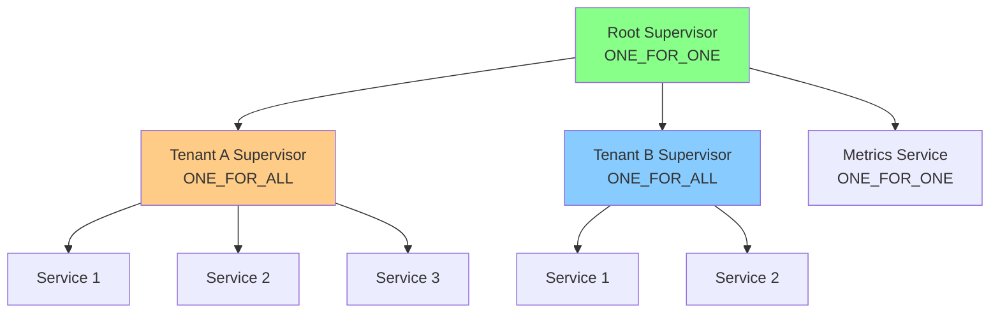

# Multi-Tenancy Pattern

## Overview

The Multi-Tenancy pattern isolates tenant workloads using hierarchical supervision. Each tenant gets its own ONE_FOR_ALL supervisor ensuring all tenant services fail/restart together, while one tenant's crash doesn't affect other tenants.

**Purpose**: Provide tenant isolation and fair resource allocation in multi-tenant systems.

## Architecture



**Hierarchy**:
- **Root Supervisor** (ONE_FOR_ONE): Manages tenant supervisors
- **Tenant Supervisor** (ONE_FOR_ALL): All tenant services restart together
- **Services**: Individual application services

## Public API

### Configuration

```java
public record TenantConfig(
    String tenantId,                      // Unique tenant identifier
    int maxConcurrentProcesses,           // Max processes for tenant
    TenantIsolationPolicy isolationPolicy, // Isolation strategy
    Duration restartWindow,               // Restart window for intensity
    int maxRestarts                       // Max restarts within window
)

public enum TenantIsolationPolicy {
    FULL_ISOLATION,      // Complete resource isolation
    SHARED_RESOURCES,    // Share some resources
    HYBRID               // Mix of both
}
```

### Creating a Multi-Tenant Supervisor

```java
MultiTenantSupervisor multiTenant = MultiTenantSupervisor.create();
```

### Registering Tenants

```java
// Register tenant A
TenantConfig configA = new TenantConfig(
    "tenant-a",
    50,                               // Max 50 concurrent processes
    TenantIsolationPolicy.FULL_ISOLATION,
    Duration.ofMinutes(1),
    10
);

Supervisor tenantASupervisor = multiTenant.registerTenant(configA);

// Add services to tenant A
tenantASupervisor.supervise(
    "order-service",
    new OrderServiceState(),
    (state, msg) -> handleOrderMessage(state, msg)
);

tenantASupervisor.supervise(
    "inventory-service",
    new InventoryServiceState(),
    (state, msg) -> handleInventoryMessage(state, msg)
);
```

### Managing Tenants

```java
// Get tenant supervisor
Supervisor supervisor = multiTenant.getTenant("tenant-a");

// List all tenants
MultiTenantSupervisor.TenantInfo[] tenants = multiTenant.listTenants();
for (TenantInfo tenant : tenants) {
    System.out.println("Tenant: " + tenant.tenantId());
    System.out.println("  Max processes: " + tenant.maxConcurrentProcesses());
    System.out.println("  Restarts: " + tenant.restartCount());
}

// Deregister tenant
multiTenant.deregisterTenant("tenant-a", "Migration completed");
```

### Event Listeners

```java
multiTenant.addListener(new MultiTenantSupervisor.MultiTenantListener() {
    @Override
    public void onTenantOnboarded(String tenantId, TenantConfig config) {
        logger.info("Tenant {} onboarded with max {} processes",
            tenantId, config.maxConcurrentProcesses());
    }

    @Override
    public void onTenantOffboarded(String tenantId, String reason) {
        logger.info("Tenant {} offboarded: {}", tenantId, reason);
    }

    @Override
    public void onTenantRestartLimitExceeded(String tenantId) {
        logger.error("Tenant {} exceeded restart limit", tenantId);
        alertingService.alert("Tenant " + tenantId + " failing repeatedly");
    }
});
```

### Shutdown

```java
multiTenant.shutdown();
```

## Usage Examples

### Basic Multi-Tenancy

```java
// Create multi-tenant supervisor
MultiTenantSupervisor multiTenant = MultiTenantSupervisor.create();

// Register tenants
List<String> tenantIds = List.of("tenant-1", "tenant-2", "tenant-3");

for (String tenantId : tenantIds) {
    TenantConfig config = new TenantConfig(
        tenantId,
        20,  // Max 20 processes per tenant
        TenantIsolationPolicy.FULL_ISOLATION,
        Duration.ofMinutes(1),
        5
    );

    Supervisor tenantSupervisor = multiTenant.registerTenant(config);

    // Add services to tenant
    tenantSupervisor.supervise(
        "worker-1",
        new WorkerState(),
        (state, msg) -> handleWork(state, msg)
    );

    tenantSupervisor.supervise(
        "worker-2",
        new WorkerState(),
        (state, msg) -> handleWork(state, msg)
    );
}

// Each tenant is isolated
// If tenant-1 crashes, tenant-2 and tenant-3 are unaffected
```

### Dynamic Tenant Onboarding

```java
MultiTenantSupervisor multiTenant = MultiTenantSupervisor.create();

// Listen for tenant events
multiTenant.addListener(new MultiTenantSupervisor.MultiTenantListener() {
    @Override
    public void onTenantOnboarded(String tenantId, TenantConfig config) {
        // Provision resources
        provisionDatabase(tenantId);
        provisionStorage(tenantId);
        provisionCache(tenantId);

        // Send welcome email
        emailService.sendWelcome(tenantId);
    }

    @Override
    public void onTenantOffboarded(String tenantId, String reason) {
        // Deprovision resources
        deprovisionDatabase(tenantId);
        deprovisionStorage(tenantId);
        deprovisionCache(tenantId);
    }
});

// Register new tenant
TenantConfig config = new TenantConfig(
    "new-tenant",
    100,
    TenantIsolationPolicy.FULL_ISOLATION,
    Duration.ofMinutes(5),
    10
);

Supervisor newTenantSupervisor = multiTenant.registerTenant(config);

// Add services dynamically
newTenantSupervisor.supervise(
    "api-gateway",
    new GatewayState(),
    (state, msg) -> handleGateway(state, msg)
);
```

### Tenant-Specific Resource Limits

```java
// Different limits for different tiers
Map<String, Integer> tierLimits = Map.of(
    "basic", 10,
    "pro", 50,
    "enterprise", 200
);

for (Customer customer : customers) {
    int maxProcesses = tierLimits.get(customer.tier());
    TenantConfig config = new TenantConfig(
        customer.tenantId(),
        maxProcesses,
        TenantIsolationPolicy.FULL_ISOLATION,
        Duration.ofMinutes(1),
        5
    );

    Supervisor tenantSupervisor = multiTenant.registerTenant(config);

    // Scale services based on tier
    for (int i = 0; i < maxProcesses; i++) {
        tenantSupervisor.supervise(
            "worker-" + i,
            new WorkerState(),
            (state, msg) -> handleWork(state, msg)
        );
    }
}
```

### Tenant Monitoring

```java
MultiTenantSupervisor multiTenant = MultiTenantSupervisor.create();

// Monitor tenant health
ScheduledExecutorService scheduler = Executors.newScheduledThreadPool(1);
scheduler.scheduleAtFixedRate(() -> {
    MultiTenantSupervisor.TenantInfo[] tenants = multiTenant.listTenants();

    for (TenantInfo tenant : tenants) {
        // Emit metrics
        metricsService.gauge("tenant.processes.max",
            tenant.maxConcurrentProcesses(),
            "tenant", tenant.tenantId()
        );

        metricsService.gauge("tenant.restarts",
            tenant.restartCount(),
            "tenant", tenant.tenantId()
        );

        // Alert on excessive restarts
        if (tenant.restartCount() > 10) {
            alertingService.warn(
                "Tenant {} has {} restarts",
                tenant.tenantId(),
                tenant.restartCount()
            );
        }
    }
}, 0, 1, TimeUnit.MINUTES);
```

## Configuration Options

### Isolation Policies

| Policy | Description | Use Case |
|--------|-------------|----------|
| `FULL_ISOLATION` | Complete resource isolation | High-security requirements |
| `SHARED_RESOURCES` | Share CPU, memory, database | Cost optimization |
| `HYBRID` | Mix of both approaches | Balanced approach |

### Process Limits

```java
// Small tenant
new TenantConfig(
    "small-tenant",
    10,  // Max 10 processes
    ...
);

// Medium tenant
new TenantConfig(
    "medium-tenant",
    50,  // Max 50 processes
    ...
);

// Large tenant
new TenantConfig(
    "large-tenant",
    200,  // Max 200 processes
    ...
);
```

### Restart Settings

```java
// Strict restart limits
new TenantConfig(
    ...,
    Duration.ofSeconds(30),  // 30s window
    3  // 3 restarts max
);

// Lenient restart limits
new TenantConfig(
    ...,
    Duration.ofMinutes(5),  // 5min window
    10  // 10 restarts max
);
```

## Performance Considerations

### Memory Overhead
- **Per tenant**: ~1 KB (tenant info)
- **Per supervisor**: ~5 KB (supervisor state)
- **Per process**: ~1 KB (process reference)

### CPU Overhead
- **Tenant registration**: O(1)
- **Tenant lookup**: O(1) (hash map)
- **Process restart**: O(n) where n = tenant process count

### Isolation Guarantees
- **Process isolation**: Each tenant has separate processes
- **Failure isolation**: Tenant crash doesn't affect other tenants
- **Resource isolation**: Configurable per-tenant limits

## Anti-Patterns to Avoid

### 1. Sharing State Between Tenants

```java
// BAD: Shared state between tenants
Map<String, Object> sharedState = new HashMap<>();
tenantASupervisor.supervise("service", state -> {
    sharedState.put("key", "value");  // Leak!
});

// GOOD: Tenant-specific state
tenantASupervisor.supervise("service", state -> {
    state.put("key", "value");  // Isolated
});
```

### 2. Not Handling Tenant Failures

```java
// BAD: Ignore tenant failures
multiTenant.registerTenant(config);

// GOOD: Monitor tenant health
multiTenant.addListener(new MultiTenantListener() {
    @Override
    public void onTenantRestartLimitExceeded(String tenantId) {
        logger.error("Tenant {} failing", tenantId);
        // Take action: alert, scale down, etc.
    }
});
```

### 3. Uneven Resource Allocation

```java
// BAD: All tenants get same limits
for (String tenantId : tenants) {
    multiTenant.registerTenant(new TenantConfig(tenantId, 10, ...));
}

// GOOD: Tiered limits
for (Customer customer : customers) {
    int limit = getLimitForTier(customer.tier());
    multiTenant.registerTenant(new TenantConfig(
        customer.tenantId(),
        limit,
        ...
    ));
}
```

### 4. Forgetting to Deregister

```java
// BAD: Tenant never removed
multiTenant.registerTenant(config);
// Tenant stays forever

// GOOD: Deregister when done
multiTenant.registerTenant(config);
try {
    // Use tenant
} finally {
    multiTenant.deregisterTenant(tenantId, "Completed");
}
```

## When to Use

✅ **Use Multi-Tenancy when**:
- SaaS application with multiple customers
- Need tenant isolation and fairness
- Want to prevent noisy neighbor problems
- Different tiers require different limits
- Regulatory requirements for data separation

❌ **Don't use Multi-Tenancy when**:
- Single-tenant application
- Can use single supervisor
- Isolation adds unnecessary complexity
- No regulatory requirements

## Related Patterns

- **Supervisor**: For process lifecycle management
- **Bulkhead**: For resource isolation
- **Circuit Breaker**: For failure detection
- **Health Check**: For tenant monitoring

## Integration with Authentication

```java
// Tie tenant ID to authentication
public class TenantAuthFilter {
    private final MultiTenantSupervisor multiTenant;

    public void authenticate(Request request) {
        String tenantId = request.getHeader("X-Tenant-ID");

        // Verify tenant exists
        Supervisor tenantSupervisor = multiTenant.getTenant(tenantId);
        if (tenantSupervisor == null) {
            throw new UnauthorizedException("Invalid tenant");
        }

        // Associate request with tenant
        request.setAttribute("tenant.supervisor", tenantSupervisor);
    }
}

// Use tenant-specific supervisor
public RequestHandler createHandler(Request request) {
    Supervisor tenantSupervisor = request.getAttribute("tenant.supervisor");

    return new RequestHandler(
        tenantSupervisor.supervise(
            "handler-" + UUID.randomUUID(),
            new HandlerState(),
            (state, msg) -> handleRequest(state, msg)
        )
    );
}
```

## Monitoring and Metrics

### Key Metrics

```java
// Per-tenant metrics
for (TenantInfo tenant : multiTenant.listTenants()) {
    metricsService.gauge("tenant.processes.max",
        tenant.maxConcurrentProcesses(),
        "tenant", tenant.tenantId()
    );

    metricsService.gauge("tenant.restarts",
        tenant.restartCount(),
        "tenant", tenant.tenantId()
    );

    metricsService.gauge("tenant.uptime",
        System.currentTimeMillis() - tenant.onboardedAtMs(),
        "tenant", tenant.tenantId()
    );
}

// Aggregate metrics
metricsService.gauge("multitenant.total_tenants",
    multiTenant.listTenants().length
);
```

## References

- Multi-Tenant Architecture Patterns
- [JOTP Supervisor Documentation](../supervisor.md)
- [Bulkhead Isolation Pattern](./bulkhead-isolation.md)

## See Also

- `/Users/sac/jotp/src/main/java/io/github/seanchatmangpt/jotp/enterprise/multitenancy/MultiTenantSupervisor.java`
- `/Users/sac/jotp/src/main/java/io/github/seanchatmangpt/jotp/enterprise/multitenancy/TenantConfig.java`
- `/Users/sac/jotp/src/main/java/io/github/seanchatmangpt/jotp/enterprise/multitenancy/TenantIsolationPolicy.java`
- `/Users/sac/jotp/src/test/java/io/github/seanchatmangpt/jotp/enterprise/multitenancy/MultiTenantSupervisorTest.java`
