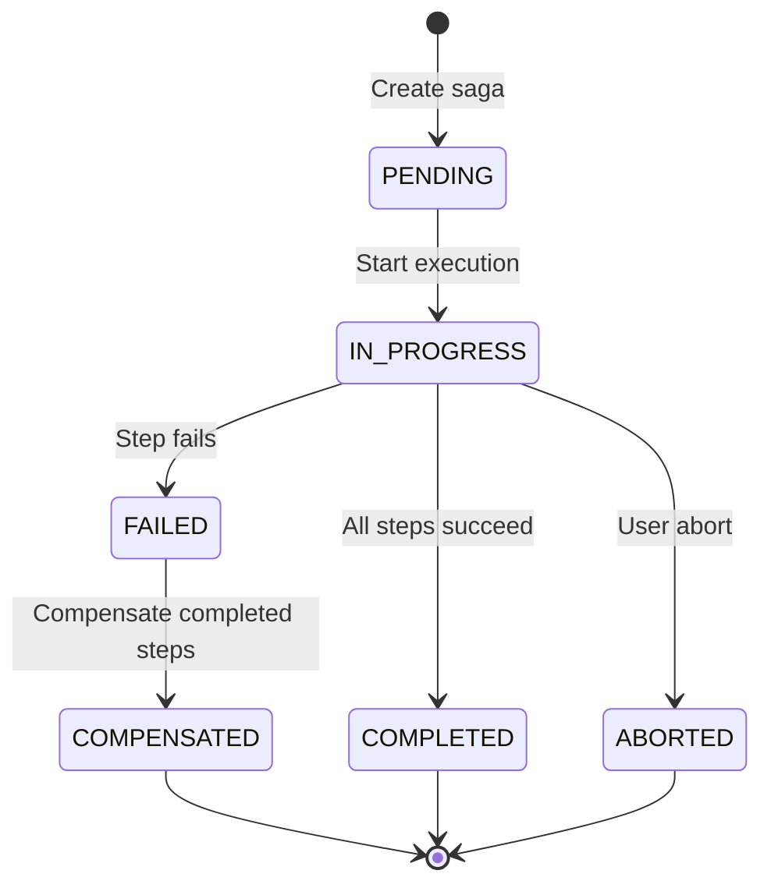

# Saga Transaction Pattern

## Overview

The Saga pattern manages distributed transactions by executing a sequence of steps (forward actions) and rolling back via compensation (backward actions) if any step fails. It provides exactly-once semantics with idempotent compensation and durable step logging.

**Purpose**: Coordinate long-running transactions across multiple services without distributed locking.

**State Machine**:
- `PENDING`: Saga registered, awaiting execution
- `IN_PROGRESS`: Executing forward steps
- `COMPLETED`: All steps succeeded
- `FAILED`: A step failed, starting compensation
- `COMPENSATED`: Compensation completed
- `ABORTED`: User-requested abort

## Architecture



Each saga step has:
- **Forward action**: Primary operation (e.g., charge credit card)
- **Compensation action**: Rollback operation (e.g., refund credit card)

## Public API

### Configuration

```java
public record SagaConfig(
    String sagaId,                          // Unique saga identifier
    List<SagaStep> steps                    // Ordered saga steps
)

public sealed interface SagaStep {
    record Action<T>(
        String name,                         // Step name
        Function<Object, T> task             // Forward action
    ) implements SagaStep {}

    record Compensation<T>(
        String name,                         // Step name
        Consumer<T> task                     // Compensating action
    ) implements SagaStep {}
}
```

### Creating a Saga Coordinator

```java
// Define saga steps
List<SagaStep> steps = List.of(
    new SagaStep.Action<Reservation>(
        "reserve-inventory",
        unused -> inventoryService.reserve(productId, quantity)
    ),
    new SagaStep.Action<ChargeResult>(
        "charge-payment",
        unused -> paymentService.charge(customerId, amount)
    ),
    new SagaStep.Compensation<ChargeResult>(
        "refund-payment",
        charge -> paymentService.refund(charge.transactionId())
    ),
    new SagaStep.Action<Shipment>(
        "create-shipment",
        unused -> shippingService.create(address, items)
    )
);

// Create saga coordinator
SagaConfig config = new SagaConfig("order-fulfillment", steps);
DistributedSagaCoordinator saga = DistributedSagaCoordinator.create(config);
```

### Executing a Saga

```java
CompletableFuture<SagaResult> future = saga.execute();

// Handle result
future.thenAccept(result -> {
    switch (result.status()) {
        case COMPLETED:
            System.out.println("Saga completed successfully");
            System.out.println("Outputs: " + result.outputs());
            break;
        case COMPENSATED:
            System.err.println("Saga failed, compensated: " + result.errorMessage());
            break;
        case FAILED:
            System.err.println("Saga failed: " + result.errorMessage());
            break;
        case ABORTED:
            System.out.println("Saga aborted: " + result.errorMessage());
            break;
    }
});
```

### Aborting a Saga

```java
saga.abort(sagaId, "Customer requested cancellation");
```

### Status Queries

```java
// Get current status
SagaTransaction transaction = saga.getStatus(sagaId);
System.out.println("Status: " + transaction);

// Get event log
List<SagaEvent> events = saga.getSagaLog(sagaId);
events.forEach(event -> System.out.println(event));
```

### Event Listeners

```java
saga.addListener(new SagaListener() {
    @Override
    public void onSagaStarted(String sagaId, int stepCount) {
        logger.info("Saga {} started with {} steps", sagaId, stepCount);
    }

    @Override
    public void onStepExecuted(String sagaId, String stepName, Object output) {
        logger.info("Saga {} step {} completed", sagaId, stepName);
    }

    @Override
    public void onCompensationStarted(String sagaId, int fromStep) {
        logger.warn("Saga {} compensation started from step {}", sagaId, fromStep);
    }

    @Override
    public void onCompensationCompleted(String sagaId) {
        logger.warn("Saga {} compensation completed", sagaId);
    }

    @Override
    public void onSagaCompleted(String sagaId, long durationMs) {
        logger.info("Saga {} completed in {}ms", sagaId, durationMs);
    }

    @Override
    public void onSagaAborted(String sagaId, String reason) {
        logger.info("Saga {} aborted: {}", sagaId, reason);
    }
});
```

### Shutdown

```java
saga.shutdown();
```

## Usage Examples

### Order Fulfillment Saga

```java
// Define order fulfillment steps
List<SagaStep> steps = List.of(
    // Step 1: Reserve inventory
    new SagaStep.Action<InventoryReservation>(
        "reserve-inventory",
        unused -> inventoryService.reserve(order.productId(), order.quantity())
    ),

    // Step 2: Charge payment
    new SagaStep.Action<PaymentResult>(
        "charge-payment",
        unused -> paymentGateway.charge(
            order.customerId(),
            order.totalAmount()
        )
    ),

    // Step 3: Compensate payment (refund if later steps fail)
    new SagaStep.Compensation<PaymentResult>(
        "refund-payment",
        payment -> paymentGateway.refund(payment.transactionId())
    ),

    // Step 4: Create shipment
    new SagaStep.Action<Shipment>(
        "create-shipment",
        unused -> shippingService.create(
            order.shippingAddress(),
            order.items()
        )
    ),

    // Step 5: Compensate shipment (cancel if later steps fail)
    new SagaStep.Compensation<Shipment>(
        "cancel-shipment",
        shipment -> shippingService.cancel(shipment.shipmentId())
    ),

    // Step 6: Send confirmation email
    new SagaStep.Action<Void>(
        "send-confirmation",
        unused -> {
            emailService.sendOrderConfirmation(order.customerEmail(), order.id());
            return null;
        }
    )
);

// Create and execute saga
SagaConfig config = new SagaConfig("order-" + order.id(), steps);
DistributedSagaCoordinator saga = DistributedSagaCoordinator.create(config);

CompletableFuture<SagaResult> future = saga.execute();

future.thenAccept(result -> {
    if (result.status() == SagaResult.Status.COMPLETED) {
        // Order fulfilled successfully
        orderService.markCompleted(order.id());
    } else if (result.status() == SagaResult.Status.COMPENSATED) {
        // Order failed, all compensations executed
        orderService.markFailed(order.id(), result.errorMessage());
    }
});

saga.shutdown();
```

### Account Migration Saga

```java
// Define account migration steps
List<SagaStep> steps = List.of(
    // Step 1: Create account in new system
    new SagaStep.Action<NewAccount>(
        "create-new-account",
        unused -> newSystem.createAccount(oldAccount)
    ),

    // Step 2: Compensate - delete new account
    new SagaStep.Compensation<NewAccount>(
        "delete-new-account",
        newAccount -> newSystem.deleteAccount(newAccount.id())
    ),

    // Step 3: Migrate transaction history
    new SagaStep.Action<Void>(
        "migrate-history",
        unused -> {
            newSystem.importTransactions(
                newAccount.id(),
                oldAccount.getTransactions()
            );
            return null;
        }
    ),

    // Step 4: Compensate - clear imported history
    new SagaStep.Compensation<NewAccount>(
        "clear-history",
        newAccount -> newSystem.clearTransactions(newAccount.id())
    ),

    // Step 5: Update routing tables
    new SagaStep.Action<Void>(
        "update-routing",
        unused -> {
            routingService.update(oldAccount.id(), newAccount.id());
            return null;
        }
    ),

    // Step 6: Compensate - revert routing
    new SagaStep.Compensation<String>(
        "revert-routing",
        oldAccountId -> routingService.revert(oldAccountId)
    ),

    // Step 7: Disable old account
    new SagaStep.Action<Void>(
        "disable-old-account",
        unused -> {
            oldSystem.disableAccount(oldAccount.id());
            return null;
        }
    )
);

SagaConfig config = new SagaConfig("migration-" + oldAccount.id(), steps);
DistributedSagaCoordinator saga = DistributedSagaCoordinator.create(config);

CompletableFuture<SagaResult> future = saga.execute();

future.thenAccept(result -> {
    if (result.status() == SagaResult.Status.COMPLETED) {
        logger.info("Account {} migrated successfully", oldAccount.id());
    } else if (result.status() == SagaResult.Status.COMPENSATED) {
        logger.error("Account {} migration failed, rolled back", oldAccount.id());
    }
});
```

### Saga with Timeout and Abort

```java
DistributedSagaCoordinator saga = DistributedSagaCoordinator.create(config);
CompletableFuture<SagaResult> future = saga.execute();

// Add timeout
CompletableFuture<SagaResult> withTimeout = future.orTimeout(30, TimeUnit.SECONDS);

// Allow manual abort
CompletableFuture.runAsync(() -> {
    if (userCancels.get()) {
        saga.abort(sagaId, "User requested cancellation");
    }
});

withTimeout.thenAccept(result -> {
    // Handle result
});
```

## Configuration Options

### Step Ordering

Steps are executed in order. Compensations execute in **reverse order**:

```java
// Execution order:
// 1. reserve-inventory
// 2. charge-payment
// 3. create-shipment
// 4. send-confirmation

// If step 3 fails, compensation order:
// 1. refund-payment (reverse of step 2)
// 2. release-inventory (reverse of step 1)
```

### Idempotent Compensations

Compensations must be idempotent (safe to execute multiple times):

```java
// GOOD: Idempotent compensation
new SagaStep.Compensation<PaymentResult>(
    "refund-payment",
    payment -> {
        if (payment.status() == PaymentStatus.CHARGED) {
            paymentGateway.refund(payment.transactionId());
        }
        // Safe to call multiple times - checks status first
    }
);

// BAD: Non-idempotent compensation
new SagaStep.Compensation<PaymentResult>(
    "refund-payment",
    payment -> paymentGateway.refund(payment.transactionId())
    // May refund multiple times if called repeatedly
);
```

### Error Handling

Steps throw exceptions to trigger compensation:

```java
new SagaStep.Action<Reservation>(
    "reserve-inventory",
    unused -> {
        if (inventoryAvailable()) {
            return inventoryService.reserve(...);
        } else {
            throw new RuntimeException("Out of stock");
            // Triggers compensation
        }
    }
);
```

## Performance Considerations

### Memory Overhead
- **Per saga**: ~5 KB (state, outputs, events)
- **Per event**: ~200 bytes (event record)

### Execution Time
- **Forward phase**: Sum of all step execution times
- **Compensation phase**: Sum of compensation times (if failure)
- **Total**: O(n) where n = number of steps

### Throughput
- Limited by slowest step
- Compensations add latency on failure
- Use async operations where possible

### Concurrency
- Multiple sagas can run concurrently
- Each saga is independent
- No shared state between sagas

## Anti-Patterns to Avoid

### 1. Non-Idempotent Compensations
```java
// BAD: Non-idempotent
new SagaStep.Compensation<Payment>(
    "refund",
    payment -> paymentService.refund(payment.id())
);

// GOOD: Idempotent
new SagaStep.Compensation<Payment>(
    "refund",
    payment -> {
        if (payment.isCharged()) {
            paymentService.refund(payment.id());
        }
    }
);
```

### 2. Missing Compensations
```java
// BAD: Action without compensation
new SagaStep.Action<Reservation>(
    "reserve",
    unused -> inventory.reserve()
)
// No compensation defined!

// GOOD: Action with compensation
new SagaStep.Action<Reservation>(
    "reserve",
    unused -> inventory.reserve()
),
new SagaStep.Compensation<Reservation>(
    "release",
    reservation -> inventory.release(reservation.id())
)
```

### 3. Long-Running Steps
```java
// BAD: Blocking for minutes
new SagaStep.Action<Result>(
    "process",
    unused -> longRunningService.process()
);

// GOOD: Async or break into smaller steps
new SagaStep.Action<Future<Result>>(
    "submit",
    unused -> longRunningService.submitAsync()
)
```

### 4. Ignoring Saga Status
```java
// BAD: Fire and forget
saga.execute();

// GOOD: Handle result
saga.execute().thenAccept(result -> {
    switch (result.status()) {
        case COMPLETED -> handleSuccess(result);
        case COMPENSATED -> handleCompensation(result);
        case FAILED -> handleFailure(result);
    }
});
```

## When to Use

✅ **Use Saga when**:
- Coordinating transactions across multiple services
- Need eventual consistency without distributed locks
- Implementing long-running business processes
- Compensating actions are well-defined
- Can tolerate temporary inconsistencies

❌ **Don't use Saga when**:
- Transaction is local to single service
- Need strong consistency (use 2PC instead)
- Compensations are undefined or impossible
- Transaction must complete atomically

## Related Patterns

- **Two-Phase Commit**: For strong consistency
- **CQRS**: For read/write separation
- **Event Sourcing**: For event-driven state
- **Process Manager**: For complex workflows

## Monitoring and Observability

### Saga Events

```java
saga.addListener(new SagaListener() {
    @Override
    public void onStepExecuted(String sagaId, String stepName, Object output) {
        // Track step execution
        metricsService.counter("saga.step.executed",
            "saga", sagaId,
            "step", stepName
        ).increment();
    }

    @Override
    public void onCompensationStarted(String sagaId, int fromStep) {
        // Alert on compensation
        alertingService.warn("Saga {} compensation started from step {}", sagaId, fromStep);
    }

    @Override
    public void onSagaCompleted(String sagaId, long durationMs) {
        // Track duration
        metricsService.timer("saga.duration",
            "saga", sagaId,
            "status", "completed"
        ).record(durationMs, TimeUnit.MILLISECONDS);
    }
});
```

### Distributed Tracing

```java
// Add tracing context to saga
String traceId = UUID.randomUUID().toString();

SagaConfig config = new SagaConfig(
    "order-" + traceId,
    steps
);

// Each step can use traceId for distributed tracing
new SagaStep.Action<Reservation>(
    "reserve-inventory",
    unused -> {
        Span span = tracer.nextSpan()
            .name("reserve-inventory")
            .tag("saga", traceId)
            .start();

        try {
            return inventoryService.reserve(...);
        } finally {
            span.end();
        }
    }
);
```

## References

- Saga Pattern (Garcia-Molina et al., 1987)
- Enterprise Integration Patterns (EIP) - Saga
- [JOTP Supervisor Documentation](../supervisor.md)
- [JOTP State Machine Documentation](../statemachine.md)

## See Also

- `/Users/sac/jotp/src/main/java/io/github/seanchatmangpt/jotp/enterprise/saga/DistributedSagaCoordinator.java`
- `/Users/sac/jotp/src/main/java/io/github/seanchatmangpt/jotp/enterprise/saga/SagaConfig.java`
- `/Users/sac/jotp/src/main/java/io/github/seanchatmangpt/jotp/enterprise/saga/SagaStep.java`
- `/Users/sac/jotp/src/test/java/io/github/seanchatmangpt/jotp/enterprise/saga/DistributedSagaCoordinatorTest.java`
