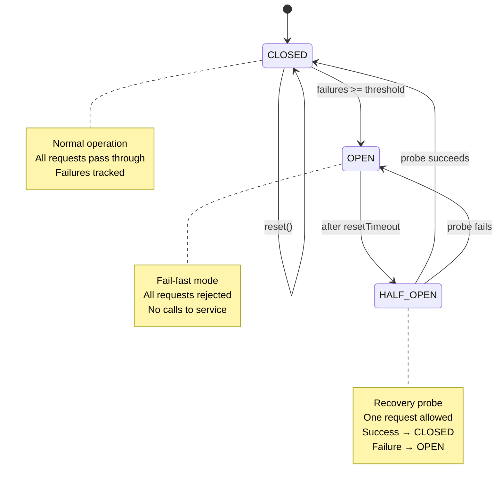

# io.github.seanchatmangpt.jotp.CircuitBreakerTest

## Table of Contents

- [Complete Recovery Cycle](#completerecoverycycle)
- [HALF_OPEN State: Automatic Recovery](#halfopenstateautomaticrecovery)
- [CircuitBreaker: CLOSED State - Normal Operation](#circuitbreakerclosedstatenormaloperation)
- [Performance: Fail-Fast Latency Savings](#performancefailfastlatencysavings)
- [Integration with Supervisor Semantics](#integrationwithsupervisorsemantics)
- [OPEN State: Failure Threshold Triggered](#openstatefailurethresholdtriggered)


In CLOSED state, failures are tracked but requests still pass through. The circuit only opens when the failure threshold is reached. This allows for transient failures without blocking legitimate requests.

```java
var result = breaker.execute("request-1", request -> {
    throw new RuntimeException("Service error");
});

// Failure is recorded but circuit stays CLOSED
// Next request still executes
var nextResult = breaker.execute("request-2", request -> "success");
```

In OPEN state, the circuit breaker rejects requests immediately without executing them. This fail-fast behavior protects the system from waiting on timeouts for known-unhealthy services. Returns CircuitOpen result instead of executing.

```java
breaker.open(); // Force circuit to OPEN

var result = breaker.execute("request", request -> {
    callCount.incrementAndGet(); // Never runs
    return "success";
});

// Result is CircuitOpen - operation never executed
assertThat(callCount.get()).isEqualTo(0);
assertThat(result).isInstanceOf(CircuitBreakerResult.CircuitOpen.class);
```

| Key | Value |
| --- | --- |
| `State` | `OPEN` |
| `Latency Impact` | `< 1ms (no remote call)` |
| `Result Type` | `CircuitOpen` |
| `Operation Invoked` | `No (fail-fast)` |

| Key | Value |
| --- | --- |
| `Failure Count` | `0` |
| `Next Request Result` | `Success (still allowed)` |
| `State After Failure` | `CLOSED` |

## Complete Recovery Cycle

The full lifecycle demonstrates automatic recovery: CLOSED accumulates failures, OPEN blocks requests, HALF_OPEN probes for recovery, and success returns to CLOSED.

| State | Behavior | Requests | Failures |
| --- | --- | --- | --- |
| CLOSED | Normal operation | All pass through | Tracked |

When the probe request in HALF_OPEN state succeeds, the circuit closes. Failure count is reset to 0, and normal operation resumes. This automatic recovery enables self-healing systems.

```java
breaker.open();
Thread.sleep(600); // Transition to HALF_OPEN

// Successful probe closes the circuit
var result = breaker.execute("probe", request -> "success");

assertThat(result).isInstanceOf(CircuitBreakerResult.Success.class);
assertThat(breaker.getState()).isEqualTo(CircuitBreaker.State.CLOSED);
assertThat(breaker.getFailureCount()).isEqualTo(0); // Reset
```

## HALF_OPEN State: Automatic Recovery

After resetTimeout expires, the circuit transitions to HALF_OPEN state to test if the service has recovered. A single probe request is allowed - success closes the circuit, failure reopens it.



```java
breaker.open();
Thread.sleep(600); // Wait for resetTimeout

// First request after timeout triggers HALF_OPEN probe
var result = breaker.execute("probe", request -> "probe-response");

// Success closes the circuit
assertThat(result).isInstanceOf(CircuitBreakerResult.Success.class);
assertThat(breaker.getState()).isEqualTo(CircuitBreaker.State.CLOSED);
```

> [!WARNING]
> HALF_OPEN Probe Failure: When the probe request fails, the circuit reopens immediately. The resetTimeout starts again, preventing rapid oscillation between states. This backoff mechanism gives the service time to recover fully.

```java
breaker.open();
Thread.sleep(600); // Transition to HALF_OPEN

// Failed probe reopens the circuit
var result = breaker.execute("probe", request -> {
    throw new RuntimeException("probe failed");
});

assertThat(result).isInstanceOf(CircuitBreakerResult.Failure.class);
assertThat(breaker.getState()).isEqualTo(CircuitBreaker.State.OPEN);
```

| Key | Value |
| --- | --- |
| `Step 5` | `CLOSED: recovery complete` |
| `Step 4` | `HALF_OPEN: probe succeeds` |
| `Step 3` | `Wait 600ms for timeout` |
| `Step 2` | `OPEN: request rejected` |
| `Step 1` | `CLOSED → OPEN (3 failures)` |

| Key | Value |
| --- | --- |
| `New State` | `CLOSED` |
| `Recovery Mode` | `Complete` |
| `Probe Result` | `Success` |
| `Failure Count` | `0 (reset)` |

## CircuitBreaker: CLOSED State - Normal Operation

In CLOSED state, the circuit breaker allows all requests to pass through. This is the normal operating state where the service is healthy. Failures are tracked but don't block requests until the threshold is reached.

See Supervisor documentation for fault tolerance patterns.

```java
var breaker = CircuitBreaker.create("test-service", 3, Duration.ofSeconds(10), Duration.ofMillis(500));
var result = breaker.execute("request-1", request -> {
    callCount.incrementAndGet();
    return "response-1";
});

// In CLOSED state: requests execute normally
// Success returns CircuitBreakerResult.Success<T>
```

| Key | Value |
| --- | --- |
| `State` | `CLOSED` |
| `Result Type` | `Success` |
| `Requests Executed` | `1` |
| `Response Value` | `response-1` |

## Performance: Fail-Fast Latency Savings

OPEN state provides instant fail-fast, avoiding network timeouts. This is critical for preventing cascading timeouts and thread pool exhaustion.

| Scenario | Operation | Latency | Thread Usage |
| --- | --- | --- | --- |
| Healthy Service (CLOSED) | Remote call executes | ~50-200ms (network) | Blocked on I/O |

```java
breaker.open(); // Simulate unhealthy service

long start = System.nanoTime();
var result = breaker.execute("request", r -> "never executes");
long latencyMs = (System.nanoTime() - start) / 1_000_000;

// Result: CircuitOpen, latency: < 1ms
assertThat(result).isInstanceOf(CircuitBreakerResult.CircuitOpen.class);
assertThat(latencyMs).isLessThan(10); // Should be < 10ms
```

| Key | Value |
| --- | --- |
| `Thread Blocked` | `No` |
| `Remote Call Executed` | `No` |
| `Latency` | `0ms` |
| `Result Type` | `CircuitOpen` |

## Integration with Supervisor Semantics

CircuitBreaker mirrors OTP Supervisor restart semantics: maxFailures corresponds to Supervisor's max restart intensity, and the failure window corresponds to the Supervisor's time period. Both provide fault containment with automatic recovery.

```java
// Supervisor-like: 5 failures per 1 second triggers OPEN
breaker = CircuitBreaker.create("api-call", 5, Duration.ofSeconds(1), Duration.ofMillis(500));

// Simulate rapid failures
for (int i = 0; i < 5; i++) {
    breaker.execute("request", r -> {
        throw new RuntimeException("transient error");
    });
}

// Circuit opens (>= threshold)
assertThat(breaker.getState()).isEqualTo(CircuitBreaker.State.OPEN);
```

| Key | Value |
| --- | --- |
| `State` | `OPEN` |
| `Window` | `1 second (like Supervisor period)` |
| `maxFailures` | `5 (like Supervisor intensity)` |
| `Threshold Triggered` | `Yes (5 failures)` |

> [!NOTE]
> CircuitBreaker complements Supervisor by preventing cascading failures at the service call level, while Supervisor handles process-level crashes. Use both for comprehensive fault tolerance.

## OPEN State: Failure Threshold Triggered

When failures reach the threshold (maxFailures), the circuit transitions to OPEN state. This is the fail-fast mechanism that prevents cascading failures by blocking requests to a known-unhealthy service.

```java
// Fail 3 times (threshold = 3)
for (int i = 0; i < 3; i++) {
    breaker.execute("request-" + i, request -> {
        throw new RuntimeException("failure");
    });
}

// Circuit transitions to OPEN
assertThat(breaker.getState()).isEqualTo(CircuitBreaker.State.OPEN);
```

| Key | Value |
| --- | --- |
| `Request Behavior` | `Fail-fast (rejected)` |
| `New State` | `OPEN` |
| `Threshold Reached` | `3 failures` |

| Key | Value |
| --- | --- |
| `Final State` | `CLOSED` |
| `Probe Result` | `Success` |
| `After Timeout` | `HALF_OPEN` |
| `Initial State` | `OPEN` |

| Key | Value |
| --- | --- |
| `New State` | `OPEN (reopened)` |
| `Oscillation Prevention` | `Backoff timer` |
| `Probe Result` | `Failure` |
| `Next Retry` | `After resetTimeout` |

---
*Generated by [DTR](http://www.dtr.org)*
