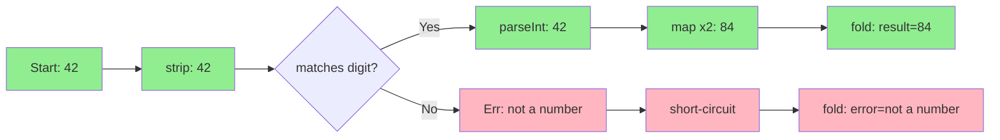

# io.github.seanchatmangpt.jotp.ResultTest

## Table of Contents

- [Result: Railway-Oriented Error Handling](#resultrailwayorientederrorhandling)
- [Railway Operations: map() transforms the success track](#railwayoperationsmaptransformsthesuccesstrack)
- [Railway Operations: flatMap() chains fallible operations](#railwayoperationsflatmapchainsfallibleoperations)
- [Railway Operations: fold() eliminates the Result type](#railwayoperationsfoldeliminatestheresulttype)
- [Railway Chaining: Multi-step transformation pipeline](#railwaychainingmultisteptransformationpipeline)
- [Side Effects: peek() for logging and auditing](#sideeffectspeekforloggingandauditing)
- [Error Recovery: recover() handles failures gracefully](#errorrecoveryrecoverhandlesfailuresgracefully)
- [Complete Pipeline: Combining all railway operations](#completepipelinecombiningallrailwayoperations)
- [Result vs Exceptions: Explicit Error Handling](#resultvsexceptionsexpliciterrorhandling)


## Result: Railway-Oriented Error Handling

Result<T,E> is Java 26's implementation of Erlang's {ok, Value} | {error, Reason} pattern.
Instead of throwing exceptions that propagate invisibly, operations return a Result
that forces explicit handling of both success and failure cases.


```java
Result<String, Exception> result = Result.ok("hello");

assertThat(result.isSuccess()).isTrue();
assertThat(result.isError()).isFalse();
assertThat(result).isInstanceOf(Result.Ok.class);
```

| Method | Returns | Purpose |
| --- | --- | --- |
| isSuccess() | true | Result is on success track |
| isError() | false | Result is NOT on error track |
| isFailure() | false | Alias for isError() |

## Railway Operations: map() transforms the success track

The map() function applies a transformation ONLY if the Result is on the success track.
If it's on the error track, map() short-circuits and returns the error unchanged.
This is the essence of railway-oriented programming: operations skip automatically
when things go wrong.


```java
Result<Integer, String> result = Result.<Integer, String>ok(5)
    .map(x -> x * 2);

assertThat(result.orElseThrow()).isEqualTo(10);

// On error track, map() short-circuits:
Result<Integer, String> error = Result.err("failed");
Result<Integer, String> mapped = error.map(x -> x * 2);
// mapped is still Err("failed") — the transformation never ran
```

## Railway Operations: flatMap() chains fallible operations

flatMap() chains operations that themselves return Results. This is how you build
pipelines where each step can fail. If any step returns an error, the entire
pipeline short-circuits — no further steps execute.


```java
Result<Integer, String> result = Result.<String, String>ok("42")
    .flatMap(s -> {
        try {
            return Result.ok(Integer.parseInt(s));
        } catch (NumberFormatException e) {
            return Result.err("not a number");
        }
    });

// If parsing succeeds, we get Result.ok(42)
// If parsing fails, we get Result.err("not a number")
```

## Railway Operations: fold() eliminates the Result type

fold() is the "eliminator" for Result — it handles both cases and returns a single
type. This is how you exit the railway and get a concrete value. Think of it as
pattern matching that's guaranteed exhaustive.


```java
Result<String, Integer> result = Result.ok("hello");
int length = result.fold(
    String::length,    // onSuccess: extract string length
    error -> -1        // onError: return sentinel value
);

// For Result.err(404):
String message = result.fold(
    value -> "success: " + value,
    error -> "error code: " + error
);
```

## Railway Chaining: Multi-step transformation pipeline

Railway-oriented programming eliminates nested if-statements. Each operation either
continues on the success track or short-circuits to the error track. The code reads
left-to-right like a story, with error handling woven through naturally.


```java
String result = Result.of(() -> "  42  ")
    .map(String::strip)                    // "42"
    .flatMap(s -> s.matches("\d+")
        ? Result.ok(Integer.parseInt(s))  // 42
        : Result.err("not a number"))
    .map(n -> n * 2)                       // 84
    .fold(n -> "result=" + n, e -> "error=" + e);

// Result: "result=84"
```



When validation fails, flatMap() returns an error and all subsequent map() operations
are skipped. The error "falls through" to fold(), which handles it. No try-catch,
no null checks — the railway handles it automatically.


```java
String result = Result.of(() -> "  abc  ")
    .map(String::strip)                    // "abc"
    .flatMap(s -> s.matches("\d+")
        ? Result.ok(Integer.parseInt(s))
        : Result.err("not a number"))     // Err!
    .map(n -> n * 2)                       // SKIPPED
    .fold(n -> "result=" + n, e -> "error=" + e);

// Result: "error=not a number"
```

> [!NOTE]
> The map(n -> n * 2) step NEVER executes. Once on the error track, subsequent operations automatically short-circuit. This is the key benefit: you can't forget to handle errors.

## Side Effects: peek() for logging and auditing

peek() applies a side-effect (logging, metrics, auditing) on the success track
without changing the Result. If on the error track, peek() does nothing — the error
passes through unchanged. This keeps your railway clean while still allowing
observability.


```java
var log = new ArrayList<String>();
Result<String, String> result = Result.<String, String>ok("hello")
    .peek(log::add)         // Log the success value
    .peek(v -> metrics.record("value_processed"));

// On success track: log contains ["hello"]
// On error track: log remains empty
```

## Error Recovery: recover() handles failures gracefully

recover() is the error-track equivalent of flatMap(). It only applies when the
Result is an error, allowing you to transform failures into successes or provide
fallback values. On the success track, recover() is a no-op.


```java
Result<String, String> result = Result.<String, String>ok("value")
    .recover(e -> Result.ok("recovered"));

// Success track: recover() does nothing
// result is still Ok("value")

Result<String, String> error = Result.<String, String>err("failed")
    .recover(e -> Result.ok("recovered: " + e));

// Error track: recover() transforms the error
// error becomes Ok("recovered: failed")
```

## Complete Pipeline: Combining all railway operations

A production pipeline combines map(), flatMap(), peek(), and recover() to handle
validation, transformation, side effects, and error recovery — all without a single
try-catch block. The railway pattern makes error handling explicit and composable.


```java
record Order(String id, int quantity) {}

String result = Result.<String, String>of(() -> "order-123")
    .map(id -> new Order(id, 10))                    // Transform
    .peek(order -> audit.log(order))                 // Side effect
    .flatMap(order -> order.quantity() > 0           // Validate
        ? Result.ok(order)
        : Result.err("invalid quantity"))
    .recover(e -> Result.ok(new Order("default", 0))) // Fallback
    .fold(order -> "processed=" + order.id(), e -> "error=" + e);
```

| Operation | Track | Purpose |
| --- | --- | --- |
| map() | Both | Transforms success value, passes through errors |
| peek() | Success only | Side effects on success, no-op on errors |
| flatMap() | Both | Chains fallible operations, short-circuits on errors |
| recover() | Error only | Transforms errors to successes, no-op on success |
| fold() | Both | Eliminates Result type, handles both cases |

With exceptions, error handling creates deeply nested try-catch blocks. With Result,
you can chain operations flatly using map() and flatMap(). The error handling logic
is woven through naturally, without interrupting the happy path.


```java
// EXCEPTIONS: Nested try-catch pyramid of doom
try {
    var order = validateOrder(request);
    try {
        var priced = calculatePrice(order);
        try {
            var reserved = reserveInventory(priced);
            return "success=" + reserved.id();
        } catch (InventoryException e) {
            return "error=out of stock";
        }
    } catch (PricingException e) {
        return "error=invalid price";
    }
} catch (ValidationException e) {
    return "error=invalid order";
}

// RESULT: Flat, composable pipeline
String result = Result.of(() -> validateOrder(request))
    .flatMap(order -> Result.of(() -> calculatePrice(order)))
    .flatMap(priced -> Result.of(() -> reserveInventory(priced)))
    .fold(
        reserved -> "success=" + reserved.id(),
        error -> "error=" + error.reason()
    );
```

> [!NOTE]
> The Result version is not only flatter but also safer — you can't forget to handle any error case. The compiler ensures exhaustiveness through pattern matching.

## Result vs Exceptions: Explicit Error Handling

Exceptions are INVISIBLE in function signatures. You can't tell if a method
throws just by looking at its type. Result<T,E> makes error handling EXPLICIT —
the error type is part of the signature, forcing callers to handle both cases.


```java
// EXCEPTIONS: Error handling is implicit and invisible
public Order processOrder(String id) throws ValidationException, SQLException {
    // Which exceptions? Check Javadoc or runtime!
}

// RESULT: Error handling is explicit in the type
public Result<Order, OrderError> processOrder(String id) {
    // Return type tells you: success = Order, failure = OrderError
}

// With Result, you MUST handle both cases:
Result<Order, OrderError> result = processOrder("order-123");
String status = result.fold(
    order -> "Order processed: " + order.id(),
    error -> "Order failed: " + error.reason()
);
```

| Aspect | Exceptions | Result<T,E> |
| --- | --- | --- |
| Visibility | Invisible (throws clause) | Explicit in type signature |
| Forgetting to handle | Runtime crash | Compiler forces handling |
| Composition | Requires try-catch around each call | Chain with map/flatMap |
| Control flow | Non-local jump | Explicit railway tracks |
| Type safety | Catches any Throwable | Typed errors (sealed hierarchy) |
| Functional style | Breaks composition | Natural for map/reduce |

> [!NOTE]
> Joe Armstrong: 'In Erlang, we don't throw exceptions across process boundaries. We return {ok, Value} or {error, Reason}. This forces the caller to handle both cases explicitly.' Result brings this philosophy to Java 26.

---
*Generated by [DTR](http://www.dtr.org)*
