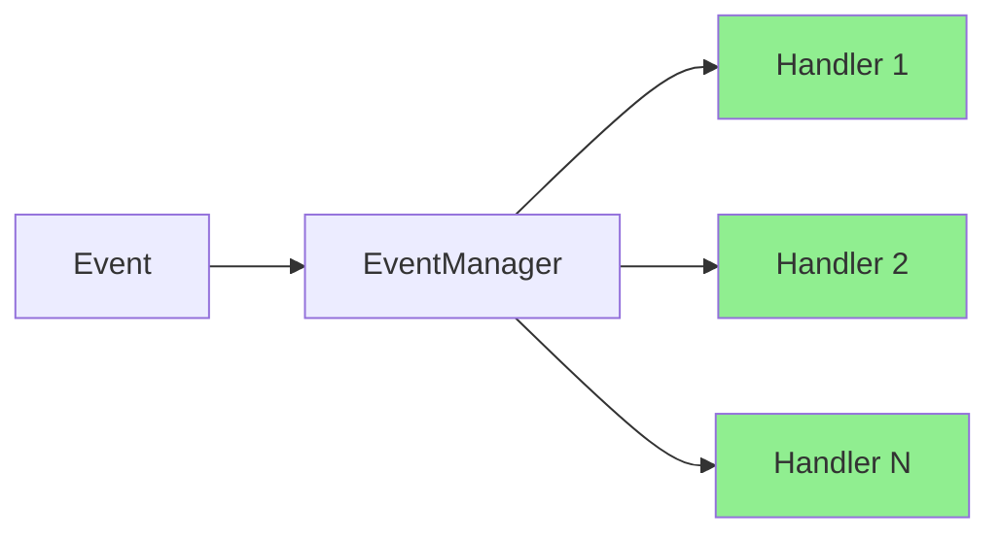
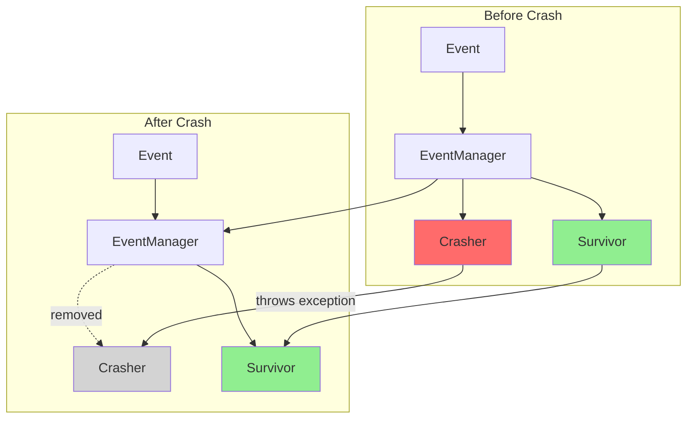
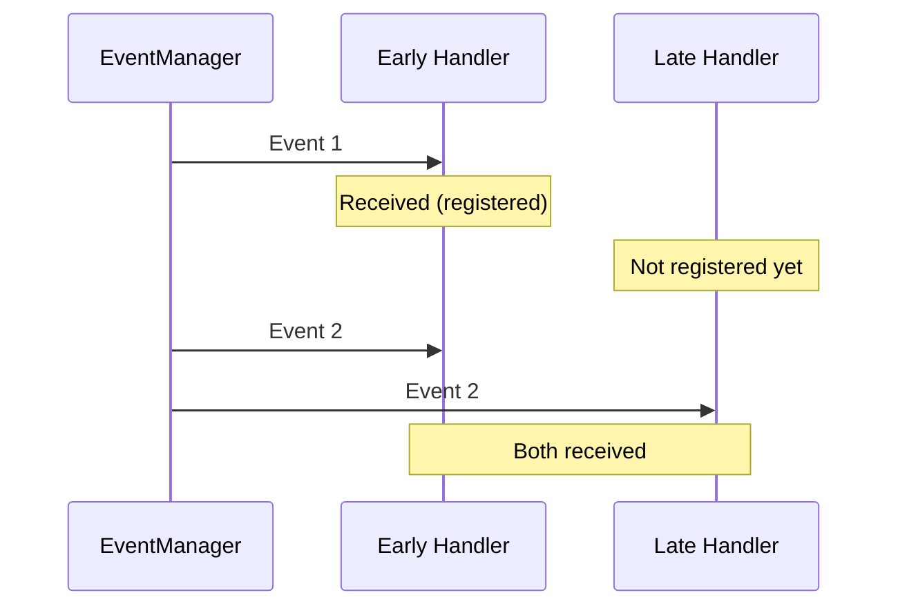

# io.github.seanchatmangpt.jotp.test.EventManagerTest

## Table of Contents

- [EventManager: Handler Removal](#eventmanagerhandlerremoval)
- [EventManager: Targeted Handler Call](#eventmanagertargetedhandlercall)
- [EventManager: Broadcast to All Handlers](#eventmanagerbroadcasttoallhandlers)
- [EventManager: Fault Isolation](#eventmanagerfaultisolation)
- [EventManager: Dynamic Handler Registration](#eventmanagerdynamichandlerregistration)


## EventManager: Handler Removal

Handlers can be removed with deleteHandler(). The terminate() callback is invoked for cleanup.

```mermaid
stateDiagram-v2
    [*] --> Registered: addHandler()
    Registered --> Processing: Event Received
    Processing --> Processing: More Events
    Processing --> Terminated: deleteHandler()
    Terminated --> [*]: terminate() called
    Note over Processing, Terminated: Handler removed from registry
```

```java
var mgr = EventManager.<AppEvent>start();
var count = new AtomicInteger(0);
var terminateCalled = new AtomicBoolean(false);

EventManager.Handler<AppEvent> h = new EventManager.Handler<>() {
    @Override
    public void handleEvent(AppEvent event) {
        count.incrementAndGet();
    }
    @Override
    public void terminate(Throwable reason) {
        terminateCalled.set(true);
    }
};

mgr.addHandler(h);
mgr.syncNotify(new AppEvent.UserLogin("dan")); // received

boolean removed = mgr.deleteHandler(h);
assertThat(removed).isTrue();

mgr.syncNotify(new AppEvent.UserLogin("eve")); // NOT received
```

| Key | Value |
| --- | --- |
| `Terminate Called` | `true` |
| `Handler Removed` | `true` |
| `Events Processed` | `1` |

## EventManager: Targeted Handler Call

call() delivers an event to a specific handler only, not a broadcast. This enables handler-specific queries.

```mermaid
graph LR
    E[Event] --> EM[EventManager]
    EM -->|call(h1, event)| H1[Handler 1]
    EM -.->|no delivery| H2[Handler 2]
    EM -.->|no delivery| Hn[Handler N]
    style H1 fill:#90EE90
    style H2 fill:#d3d3d3
    style Hn fill:#d3d3d3
```

Unlike notify() which broadcasts to all handlers, call() targets a single handler. This is useful for request-response patterns.

```java
var mgr = EventManager.<AppEvent>start();
var h1Events = new CopyOnWriteArrayList<AppEvent>();
var h2Events = new CopyOnWriteArrayList<AppEvent>();

EventManager.Handler<AppEvent> h1 = h1Events::add;
EventManager.Handler<AppEvent> h2 = h2Events::add;

mgr.addHandler(h1);
mgr.addHandler(h2);

// call(h1, event) — only h1 should receive it
mgr.call(h1, new AppEvent.OrderPlaced("call-only", 1.0));

assertThat(h1Events).hasSize(1);
assertThat(h2Events).isEmpty();
```

| Key | Value |
| --- | --- |
| `Handler 2 Events` | `0` |
| `Handler 1 Events` | `1` |

## EventManager: Broadcast to All Handlers

EventManager implements OTP gen_event semantics. notify() broadcasts events to all registered handlers.



When syncNotify() is called, the event is delivered to ALL registered handlers. Each handler processes independently.

```java
var mgr = EventManager.<AppEvent>start();
var counter1 = new AtomicInteger(0);
var counter2 = new AtomicInteger(0);

EventManager.Handler<AppEvent> h1 = event -> counter1.incrementAndGet();
EventManager.Handler<AppEvent> h2 = event -> counter2.incrementAndGet();

mgr.addHandler(h1);
mgr.addHandler(h2);

mgr.syncNotify(new AppEvent.UserLogin("alice"));
mgr.syncNotify(new AppEvent.OrderPlaced("order-1", 99.99));

// Both handlers received both events
assertThat(counter1.get()).isEqualTo(2);
assertThat(counter2.get()).isEqualTo(2);
```

| Key | Value |
| --- | --- |
| `Events Broadcast` | `2` |
| `Handler 1 Invocations` | `2` |
| `Handler 2 Invocations` | `2` |

## EventManager: Fault Isolation

A crashing handler is automatically removed but does NOT crash the EventManager. This is core OTP fault isolation.



When a handler crashes, the EventManager catches the exception, removes the failed handler, and continues processing events with remaining handlers.

```java
var mgr = EventManager.<AppEvent>start();
var survivorCount = new AtomicInteger(0);

EventManager.Handler<AppEvent> crasher = new EventManager.Handler<>() {
    @Override
    public void handleEvent(AppEvent event) {
        throw new RuntimeException("handler crash");
    }
};

EventManager.Handler<AppEvent> survivor = event -> survivorCount.incrementAndGet();

mgr.addHandler(crasher);
mgr.addHandler(survivor);

mgr.syncNotify(new AppEvent.UserLogin("frank")); // crasher throws, survivor handles

// Manager still alive, survivor still receives
mgr.syncNotify(new AppEvent.UserLogin("grace"));
assertThat(survivorCount.get()).isEqualTo(2);
```

| Key | Value |
| --- | --- |
| `Manager Status` | `ALIVE` |
| `Crasher Terminated` | `true` |
| `Survivor Invocations` | `2` |

## EventManager: Dynamic Handler Registration

Handlers can be added at runtime. Late-bound handlers only receive events sent after registration.



```java
var mgr = EventManager.<AppEvent>start();
var earlyCount = new AtomicInteger(0);
var lateCount = new AtomicInteger(0);

EventManager.Handler<AppEvent> early = event -> earlyCount.incrementAndGet();
mgr.addHandler(early);

mgr.syncNotify(new AppEvent.UserLogin("bob")); // early only

EventManager.Handler<AppEvent> late = event -> lateCount.incrementAndGet();
mgr.addHandler(late);

mgr.syncNotify(new AppEvent.UserLogin("carol")); // both

// early: 2 events, late: 1 event
```

| Key | Value |
| --- | --- |
| `Early Handler Count` | `2` |
| `Late Handler Count` | `1` |

---
*Generated by [DTR](http://www.dtr.org)*
