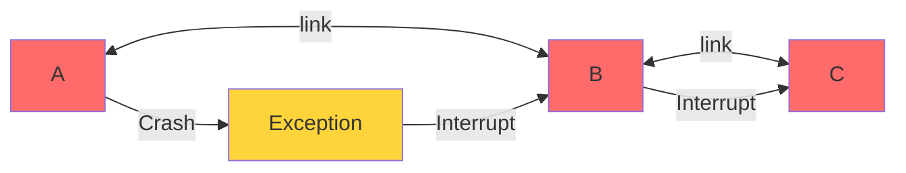
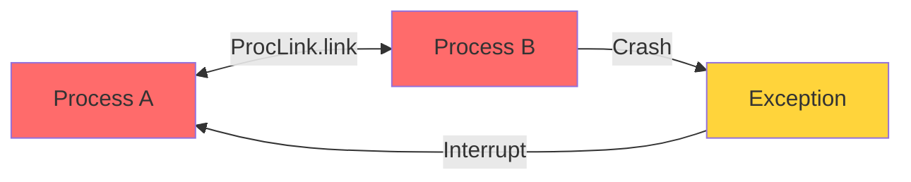
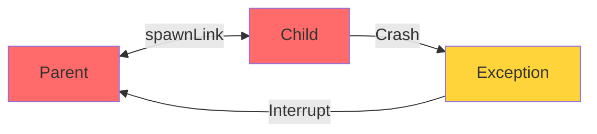
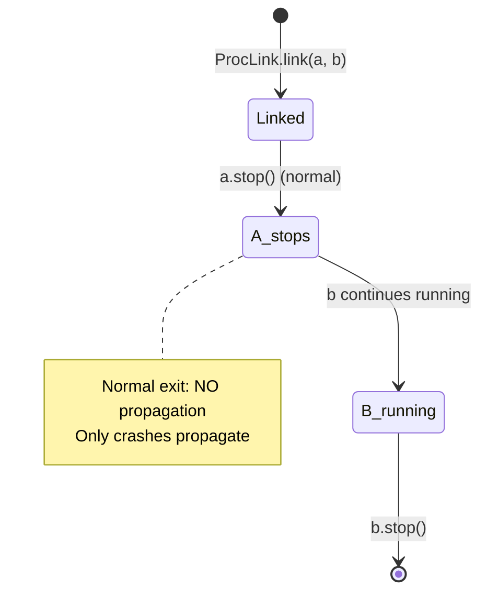
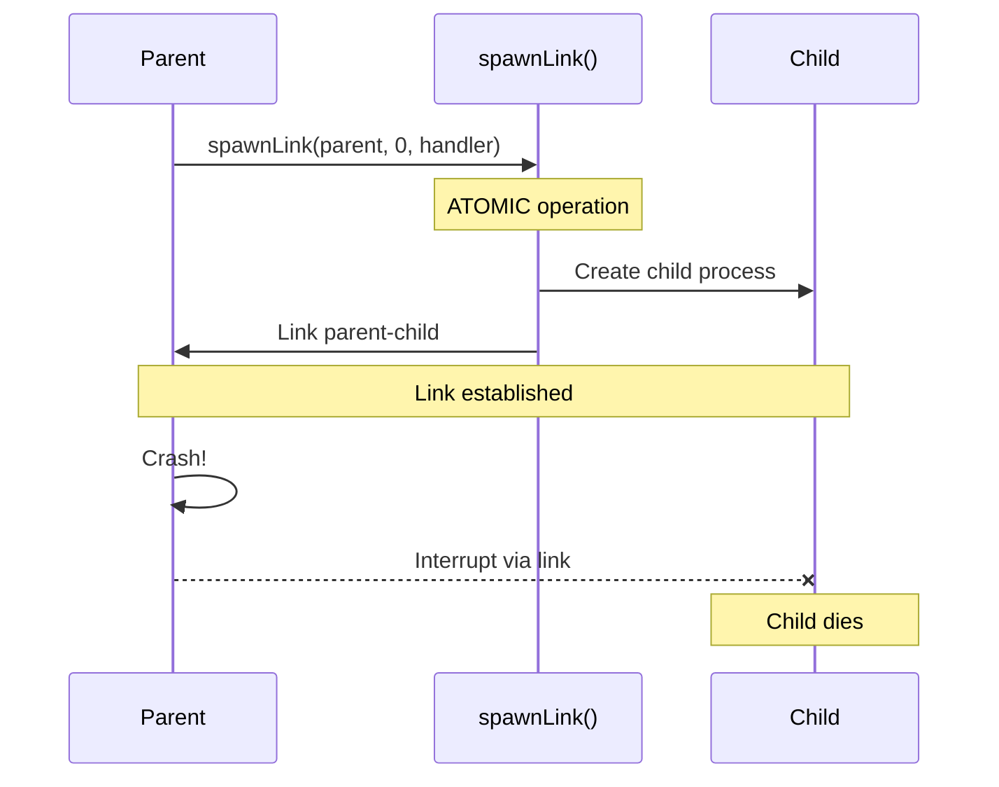
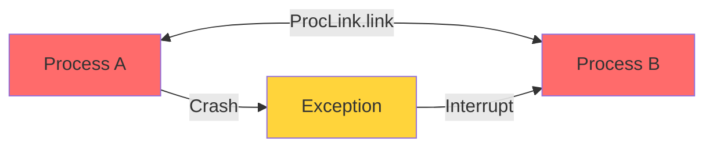

# io.github.seanchatmangpt.jotp.test.ProcLinkTest

## Table of Contents

- [ProcLink: Transitive Crash Propagation](#proclinktransitivecrashpropagation)
- [ProcLink: Symmetric Crash Propagation](#proclinksymmetriccrashpropagation)
- [ProcLink: Bidirectional spawnLink](#proclinkbidirectionalspawnlink)
- [ProcLink: Normal Exit Does NOT Propagate](#proclinknormalexitdoesnotpropagate)
- [ProcLink: Atomic spawnLink Operation](#proclinkatomicspawnlinkoperation)
- [ProcLink: Bidirectional Crash Propagation](#proclinkbidirectionalcrashpropagation)


## ProcLink: Transitive Crash Propagation

Links form chains. When A links to B, and B links to C, a crash in A propagates through the entire chain: A crashes → B interrupted → C interrupted.

```java
var a = new Proc<>(0, ProcLinkTest::handle);
var b = new Proc<>(0, ProcLinkTest::handle);
var c = new Proc<>(0, ProcLinkTest::handle);
ProcLink.link(a, b);
ProcLink.link(b, c);

// Crash the head of the chain
a.tell(new Msg.Boom());

// Entire chain falls: A → B → C
await().atMost(Duration.ofSeconds(3)).until(() ->
    !a.thread().isAlive() && !b.thread().isAlive() && !c.thread().isAlive());
```



> [!NOTE]
> Transitive propagation is why supervisors must be careful with link topology. A crash can cascade through an entire supervision tree. This is intentional - it allows failure to be contained at appropriate boundaries.

| Key | Value |
| --- | --- |
| `Trigger` | `A crashes` |
| `Final State` | `All processes dead` |
| `Chain Topology` | `A → B → C` |
| `Propagation` | `Transitive (A→B→C)` |

## ProcLink: Symmetric Crash Propagation

Links are symmetric - crash propagation works in both directions. B crashing interrupts A just as A crashing interrupts B.

```java
var a = new Proc<>(0, ProcLinkTest::handle);
var b = new Proc<>(0, ProcLinkTest::handle);
ProcLink.link(a, b);

// Crash process B instead
b.tell(new Msg.Boom());

// Process A is interrupted
await().atMost(Duration.ofSeconds(2)).until(() -> !a.thread().isAlive());
```



| Key | Value |
| --- | --- |
| `Process B Status` | `Crashed` |
| `Propagation` | `Symmetric` |
| `Process A Status` | `Interrupted` |

## ProcLink: Bidirectional spawnLink

spawnLink creates a bidirectional link. Child crashes kill the parent just as parent crashes kill the child.

```java
var parent = new Proc<>(0, ProcLinkTest::handle);
var child = ProcLink.spawnLink(parent, 0, ProcLinkTest::handle);

// Child crash kills parent
child.tell(new Msg.Boom());

await().atMost(Duration.ofSeconds(2)).until(() -> !parent.thread().isAlive());
```



> [!WARNING]
> In supervision trees, you typically use ProcLink.link() not spawnLink. spawnLink is for parent-child pairs where either should kill the other. Supervisors use monitor/monitor relationships instead.

| Key | Value |
| --- | --- |
| `Link Direction` | `Bidirectional` |
| `Parent Status` | `Interrupted` |
| `Child Status` | `Crashed` |
| `Propagation` | `Child → Parent` |

## ProcLink: Normal Exit Does NOT Propagate

Graceful shutdown (stop()) does NOT propagate through links. Only abnormal exits (crashes) trigger linked process interruption.

```java
var a = new Proc<>(0, ProcLinkTest::handle);
var b = new Proc<>(0, ProcLinkTest::handle);
ProcLink.link(a, b);

// Graceful stop of a — normal exit does not propagate
a.stop();

// b should still be alive and responsive
assertThat(b.thread().isAlive()).isTrue();

// b can still process messages
b.tell(new Msg.Inc());
var state = b.ask(new Msg.Ping()).get();
// state == 1
```



> [!NOTE]
> This distinction is critical for graceful shutdown. You can stop a process without killing its linked partners. Only crashes (exceptions) cascade.

| Key | Value |
| --- | --- |
| `Process B Status` | `Still Running` |
| `B State After Message` | `1` |
| `Process A Exit` | `Normal (stop())` |
| `Propagation` | `None` |

## ProcLink: Atomic spawnLink Operation

spawnLink() atomically creates and links a child process. There's no window between spawn and link where crashes could be missed.

```java
var parent = new Proc<>(0, ProcLinkTest::handle);
var child = ProcLink.spawnLink(parent, 0, ProcLinkTest::handle);

// Parent crash kills child via atomic link
parent.tell(new Msg.Boom());

await().atMost(Duration.ofSeconds(2)).until(() -> !child.thread().isAlive());
```



> [!NOTE]
> spawnLink is equivalent to Erlang's spawn_link. It guarantees the child is linked from creation, eliminating race conditions in supervision trees.

| Key | Value |
| --- | --- |
| `Parent Status` | `Crashed` |
| `Operation` | `spawnLink (atomic)` |
| `Child Status` | `Interrupted` |
| `Link Established` | `At creation time` |

## ProcLink: Bidirectional Crash Propagation

ProcLink creates a bidirectional crash relationship between two processes. When either process crashes abnormally, the linked partner is interrupted.

```java
var a = new Proc<>(0, ProcLinkTest::handle);
var b = new Proc<>(0, ProcLinkTest::handle);
ProcLink.link(a, b);

// Crash process A
a.tell(new Msg.Boom());

// Process B is interrupted (its virtual thread stops)
await().atMost(Duration.ofSeconds(2)).until(() -> !b.thread().isAlive());
```



> [!NOTE]
> Links are bidirectional: A crash kills B, and B crash kills A. This is fundamental to OTP's 'let it crash' philosophy - failures cascade to supervisors.

| Key | Value |
| --- | --- |
| `Link Type` | `Bidirectional` |
| `Process B Status` | `Interrupted` |
| `Process A Status` | `Crashed` |

---
*Generated by [DTR](http://www.dtr.org)*
