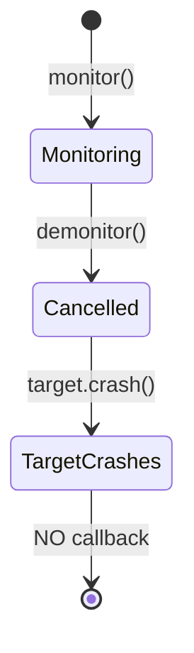
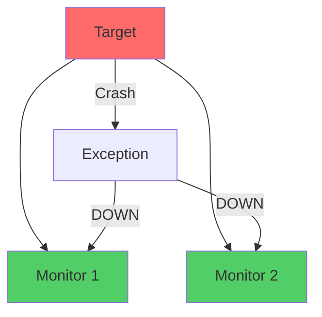
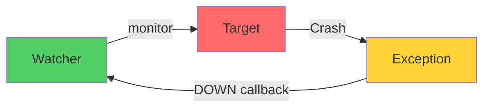

# io.github.seanchatmangpt.jotp.test.ProcMonitorTest

## Table of Contents

- [ProcMonitor: Demonitor (Cancel Monitoring)](#procmonitordemonitorcancelmonitoring)
- [ProcMonitor: Abnormal Exit Detection](#procmonitorabnormalexitdetection)
- [ProcMonitor: Multiple Independent Monitors](#procmonitormultipleindependentmonitors)
- [ProcMonitor: Normal Exit Detection](#procmonitornormalexitdetection)
- [ProcMonitor: Unilateral Observation](#procmonitorunilateralobservation)


## ProcMonitor: Demonitor (Cancel Monitoring)

demonitor() cancels an active monitor. After cancellation, the DOWN callback will not fire, even if the target crashes later.

```java
var target = counter();
var downFired = new AtomicBoolean(false);

var ref = ProcMonitor.monitor(target, _ -> downFired.set(true));

// Cancel the monitor before crash
ProcMonitor.demonitor(ref);

// Target crashes - no callback fires
target.tell(new Msg.Crash());

// downFired stays false
Thread.sleep(100);
assertThat(downFired.get()).isFalse();
```



> [!NOTE]
> demonitor is useful for temporary monitoring. Monitor only during specific operations, then cancel when no longer needed.

## ProcMonitor: Abnormal Exit Detection

ProcMonitor observes a process and fires a callback when it exits abnormally (crashes). The exception that caused the crash is passed as the reason.

```java
var target = counter();
var downReason = new AtomicReference<Throwable>();
var downFired = new AtomicBoolean(false);

ProcMonitor.monitor(target, reason -> {
    downReason.set(reason);
    downFired.set(true);
});

// Crash the target
target.tell(new Msg.Crash());

// Monitor callback fires with the exception
await().atMost(Duration.ofSeconds(3)).untilTrue(downFired);
// downReason.get().getMessage() == "BOOM"
```

```mermaid
sequenceDiagram
    participant M as Monitor
    participant T as Target Process

    M->>T: monitor(callback)
    Note over M: Observing T

    T->>T: Crash (RuntimeException)
    T-->>M: DOWN(reason=exception)
    Note over M: Callback invoked

    style T fill:#ff6b6b
```

> [!NOTE]
> Unlike links, monitors are one-way. The monitoring side is NOT affected when the target crashes. The callback is invoked asynchronously.

| Key | Value |
| --- | --- |
| `Target Status` | `Crashed` |
| `Monitor Status` | `Cancelled (demonitor)` |
| `Reason` | `Monitor cancelled before crash` |
| `Callback Fired` | `No` |

## ProcMonitor: Multiple Independent Monitors

Multiple processes can monitor the same target. All monitors fire independently when the target exits.

```java
var target = counter();
var fired1 = new AtomicBoolean(false);
var fired2 = new AtomicBoolean(false);

// Two independent monitors
ProcMonitor.monitor(target, _ -> fired1.set(true));
ProcMonitor.monitor(target, _ -> fired2.set(true));

// Target crashes - both callbacks fire
target.tell(new Msg.Crash());

await().atMost(Duration.ofSeconds(3))
    .until(() -> fired1.get() && fired2.get());
```



> [!NOTE]
> Each monitor is independent. Canceling one monitor doesn't affect others. This enables multiple observers of the same process.

| Key | Value |
| --- | --- |
| `Target Status` | `Crashed` |
| `Reason Type` | `RuntimeException` |
| `Reason Message` | `BOOM` |
| `Monitor Callback` | `Invoked` |

## ProcMonitor: Normal Exit Detection

Monitors also fire on normal exit (stop()), but with a null reason. This distinguishes graceful shutdown from crashes.

```java
var target = counter();
var downReason = new AtomicReference<Throwable>(new RuntimeException("sentinel"));
var downFired = new AtomicBoolean(false);

ProcMonitor.monitor(target, reason -> {
    downReason.set(reason); // should be null for normal exit
    downFired.set(true);
});

// Graceful shutdown
target.stop();

await().atMost(Duration.ofSeconds(3)).untilTrue(downFired);
// downReason.get() == null (normal exit)
```

| Exit Type | Reason Value | Interpretation |
| --- | --- | --- |
| Normal (stop()) | null | Graceful shutdown |
| Abnormal (crash) | Exception | Process crashed |

> [!NOTE]
> This null vs non-null distinction lets monitoring code handle graceful shutdown differently from crashes. You might log shutdown but trigger alerts for crashes.

| Key | Value |
| --- | --- |
| `Independence` | `Yes` |
| `Monitor 1 Fired` | `true` |
| `Target Status` | `Crashed` |
| `Monitors Registered` | `2` |
| `Monitor 2 Fired` | `true` |

## ProcMonitor: Unilateral Observation

Monitors are unilateral - the monitoring side is NOT affected when the target crashes. Unlike links, crashes don't propagate through monitors.

```java
var target = counter();
var watcher = counter();

ProcMonitor.monitor(target, reason -> {
    // Watcher still runs — tell it a Ping to confirm
    watcher.tell(new Msg.Ping());
});

// Target crashes
target.tell(new Msg.Crash());

// Watcher is still alive and responsive
await().atMost(Duration.ofSeconds(3))
    .until(() -> watcher.ask(new Msg.Ping()).join() >= 1);
```



> [!NOTE]
> This is key difference from links: links are bidirectional (both die), monitors are unilateral (only callback fires). Monitors are for observation, links are for coupling.

| Key | Value |
| --- | --- |
| `Interpretation` | `Graceful shutdown` |
| `Reason Value` | `null` |
| `Target Exit` | `Normal (stop())` |
| `Monitor Callback` | `Invoked` |

| Key | Value |
| --- | --- |
| `Target Status` | `Crashed` |
| `Relationship` | `Unilateral (one-way)` |
| `Watcher Status` | `Still Running` |
| `Callback Invoked` | `Yes` |

---
*Generated by [DTR](http://www.dtr.org)*
