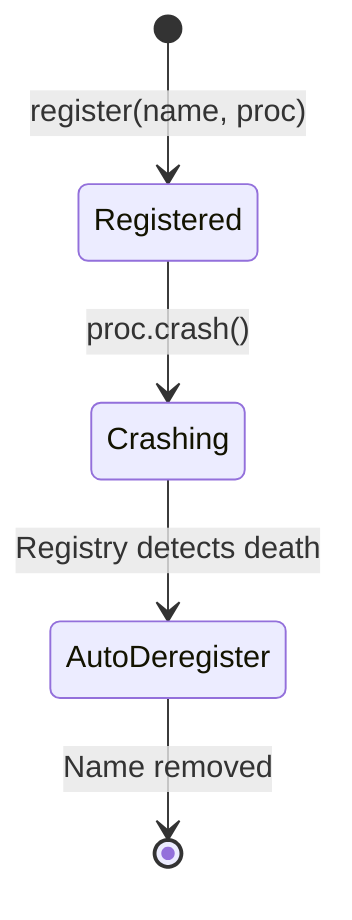
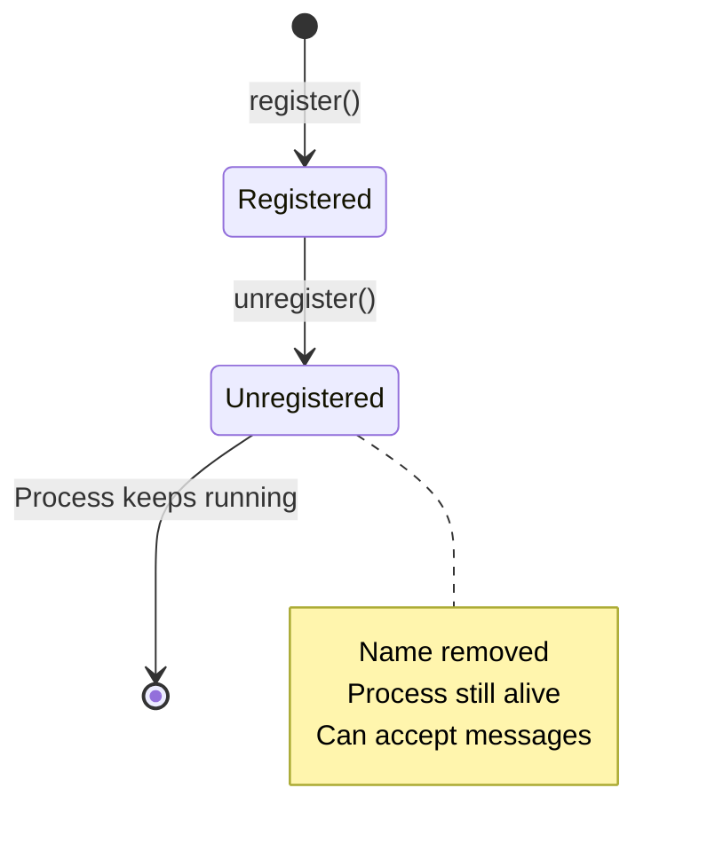

# io.github.seanchatmangpt.jotp.test.ProcRegistryTest

## Table of Contents

- [ProcRegistry: Unknown Name Lookup](#procregistryunknownnamelookup)
- [ProcRegistry: Auto-Deregistration on Stop](#procregistryautoderegistrationonstop)
- [ProcRegistry: List All Registered Names](#procregistrylistallregisterednames)
- [ProcRegistry: Name Reuse After Process Death](#procregistrynamereuseafterprocessdeath)
- [ProcRegistry: Duplicate Name Protection](#procregistryduplicatenameprotection)
- [ProcRegistry: Auto-Deregistration on Crash](#procregistryautoderegistrationoncrash)
- [ProcRegistry: Explicit Unregister](#procregistryexplicitunregister)
- [ProcRegistry: Name-Based Process Registration](#procregistrynamebasedprocessregistration)


## ProcRegistry: Unknown Name Lookup

Looking up an unregistered name returns Optional.empty(). This is the safe API - no null checks needed.

```java
var result = ProcRegistry.whereis("no-such-process");

// result.isEmpty() == true
// No NullPointerException risk
```

> [!NOTE]
> Optional return type forces explicit handling of missing processes. This is safer than returning null.

| Key | Value |
| --- | --- |
| `Safe` | `Yes (no null)` |
| `Result` | `Optional.empty()` |
| `Queried Name` | `no-such-process` |

## ProcRegistry: Auto-Deregistration on Stop

Graceful shutdown (stop()) also triggers auto-deregistration. The name is removed when the process terminates normally.

```java
var proc = counter();
ProcRegistry.register("stopper", proc);

// Graceful shutdown
proc.stop();

// Auto-deregistered
await().atMost(Duration.ofSeconds(3))
    .until(() -> ProcRegistry.whereis("stopper").isEmpty());
```

> [!NOTE]
> Auto-deregistration works for any process termination: crash, stop, or system exit. The registry monitors process lifecycle automatically.

## ProcRegistry: List All Registered Names

registered() returns a snapshot of all currently registered names. Useful for introspection and debugging.

```java
var a = counter();
var b = counter();

ProcRegistry.register("alpha", a);
ProcRegistry.register("beta", b);

// Get all registered names
var names = ProcRegistry.registered();

// names.contains("alpha") == true
// names.contains("beta") == true
```

> [!NOTE]
> The returned set is a snapshot - it won't change if processes are registered later. Call registered() again for the current state.

| Key | Value |
| --- | --- |
| `Count` | `2` |
| `Snapshot` | `Yes (immutable view)` |
| `Registered Names` | `[alpha, beta]` |

## ProcRegistry: Name Reuse After Process Death

Once a process dies and its name is auto-deregistered, the name becomes available for reuse. New processes can register under the same name.

```java
var first = counter();
ProcRegistry.register("reusable", first);

// First process dies
first.stop();

// Wait for auto-deregistration
await().atMost(Duration.ofSeconds(3))
    .until(() -> ProcRegistry.whereis("reusable").isEmpty());

// Register a new process with the same name
var second = counter();
ProcRegistry.register("reusable", second);

// Name now points to the new process
var found = ProcRegistry.<Integer, Msg>whereis("reusable");
// found.get() == second
```

> [!NOTE]
> Name reuse is intentional for service restarts. A new process instance can take over the same name after the previous one dies.

## ProcRegistry: Duplicate Name Protection

Registering a duplicate name throws IllegalStateException. This prevents accidental name collisions and ensures name uniqueness.

```java
var a = counter();
var b = counter();

ProcRegistry.register("shared-name", a);

// Second registration with same name throws
assertThatThrownBy(() -> ProcRegistry.register("shared-name", b))
    .isInstanceOf(IllegalStateException.class)
    .hasMessageContaining("shared-name");
```

> [!WARNING]
> Name conflicts indicate a configuration error. Two processes are trying to use the same name. Use unique names per process instance.

| Key | Value |
| --- | --- |
| `Protection` | `Name uniqueness enforced` |
| `First Process` | `Registered as 'x'` |
| `Exception Type` | `IllegalStateException` |
| `Second Process` | `Rejected` |

## ProcRegistry: Auto-Deregistration on Crash

When a registered process crashes, it's automatically removed from the registry. No manual cleanup needed.

```java
var proc = counter();
ProcRegistry.register("crasher", proc);

// Verify it's registered
assertThat(ProcRegistry.whereis("crasher").isPresent()).isTrue();

// Crash the process
proc.tell(new Msg.Crash());

// Auto-deregistered - name no longer exists
await().atMost(Duration.ofSeconds(3))
    .until(() -> ProcRegistry.whereis("crasher").isEmpty());
```



> [!NOTE]
> Auto-deregistration prevents stale references. A crashed process can't be looked up - the name is immediately available for reuse.

| Key | Value |
| --- | --- |
| `Process Exit` | `Normal (stop())` |
| `Registry Action` | `Auto-deregistered` |
| `Manual Cleanup` | `Not required` |

## ProcRegistry: Explicit Unregister

unregister() removes the name from the registry but keeps the process running. Useful for dynamic name changes or temporary registration.

```java
var proc = counter();
ProcRegistry.register("temp-name", proc);

// Remove the name - process continues
ProcRegistry.unregister("temp-name");

// Name is gone
assertThat(ProcRegistry.whereis("temp-name")).isEmpty();

// Process still works
var count = proc.ask(new Msg.Ping()).join();
// count == 1
```



> [!NOTE]
> unregister is for name management, not process control. Use stop() to terminate the process, unregister() just removes the name.

| Key | Value |
| --- | --- |
| `Name Status` | `Removed from registry` |
| `Message Processed` | `1` |
| `Can Accept Messages` | `Yes` |
| `Process Status` | `Still running` |

## ProcRegistry: Name-Based Process Registration

ProcRegistry provides name-based process discovery, equivalent to Erlang's whereis/1. Register a process with a name, then lookup by that name.

```java
var proc = counter();
ProcRegistry.register("my-counter", proc);

// Find the process by name
var found = ProcRegistry.<Integer, Msg>whereis("my-counter");

// found.isPresent() == true
// found.get() == proc
```

```mermaid
sequenceDiagram
    participant C as Client
    participant R as Registry
    participant P as Process

    C->>R: register("my-counter", proc)
    R->>R: Map name -> proc
    R-->>C: OK

    C->>R: whereis("my-counter")
    R->>R: Lookup name
    R-->>C: Optional[proc]

    style R fill:#51cf66
```

> [!NOTE]
> Registered names are global within the JVM. Use descriptive names like 'user-session-service' or 'order-processor'. Names must be unique.

| Key | Value |
| --- | --- |
| `Same Instance` | `true` |
| `Process Found` | `true` |
| `Registered Name` | `my-counter` |

| Key | Value |
| --- | --- |
| `Name Status` | `Available` |
| `First Process` | `Stopped and auto-deregistered` |
| `Name Points To` | `New process instance` |
| `Second Process` | `Registered successfully` |

| Key | Value |
| --- | --- |
| `Registry Action` | `Auto-deregistered` |
| `Name Status` | `Available for reuse` |
| `Process Action` | `Crashed` |
| `Initial State` | `Registered` |

---
*Generated by [DTR](http://www.dtr.org)*
