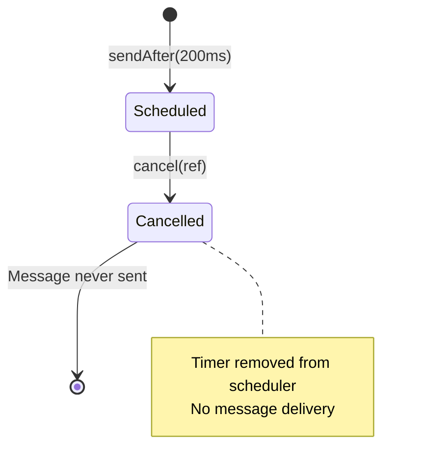

```mermaid
gantt
    title Timer Timeline
    dateFormat X
    axisFormat %Lms

    section Timer 1
    Fire  : 50, 50

    section Timer 2
    Fire  : 80, 80

    section Timer 3
    Fire  : 110, 110
```

# io.github.seanchatmangpt.jotp.test.ProcTimerTest

## Table of Contents

- [ProcTimer: Cancel One-Shot Timer](#proctimercanceloneshottimer)
- [ProcTimer: Cancel Interval Timer](#proctimercancelintervaltimer)
- [ProcTimer: Repeating Interval Timer](#proctimerrepeatingintervaltimer)
- [ProcTimer: One-Shot Delayed Message Delivery](#proctimeroneshotdelayedmessagedelivery)
- [ProcTimer: Multiple Concurrent Timers](#proctimermultipleconcurrenttimers)
- [ProcTimer: Cancel Return Value](#proctimercancelreturnvalue)


## ProcTimer: Cancel One-Shot Timer

Cancelling a one-shot timer prevents message delivery. The timer is removed from the scheduler before it fires.

```java
var proc = counter();

// Schedule a Tick after 200ms
var ref = ProcTimer.sendAfter(200, proc, new Msg.Tick());

// Cancel immediately
ProcTimer.cancel(ref);

// Wait past the original delay
Thread.sleep(350);

// Message never delivered - state still 0
assertThat(proc.ask(new Msg.Ping()).join()).isEqualTo(0);
```



> [!NOTE]
> cancel() is idempotent - calling it multiple times is safe. Returns true if timer was pending, false if already fired/cancelled.

## ProcTimer: Cancel Interval Timer

Cancelling an interval timer stops all future deliveries. In-flight messages may still arrive, but no new ones are scheduled.

```java
var proc = counter();

// Start interval: Tick every 50ms
var ref = ProcTimer.sendInterval(50, proc, new Msg.Tick());

// Wait for a couple of ticks
await().atMost(Duration.ofSeconds(3))
    .until(() -> proc.ask(new Msg.Ping()).join() >= 2);

// Cancel the timer
ProcTimer.cancel(ref);
var countAfterCancel = proc.ask(new Msg.Ping()).join();

// Wait well past another period
Thread.sleep(200);
var countLater = proc.ask(new Msg.Ping()).join();

// Should not have grown significantly
assertThat(countLater).isLessThanOrEqualTo(countAfterCancel + 1);
```

> [!NOTE]
> Allow +1 for in-flight messages that were already scheduled when cancel() was called. Cancel prevents new scheduling, doesn't intercept in-flight messages.

## ProcTimer: Repeating Interval Timer

sendInterval() delivers messages repeatedly at a fixed period. The timer continues until explicitly cancelled.

```java
var proc = counter();

// Send Tick every 50ms
var ref = ProcTimer.sendInterval(50, proc, new Msg.Tick());

// Wait for at least 3 ticks
await().atMost(Duration.ofSeconds(3))
    .until(() -> proc.ask(new Msg.Ping()).join() >= 3);

// Cancel to stop the timer
ProcTimer.cancel(ref);
```

```mermaid
sequenceDiagram
    participant C as Client
    participant T as Timer
    participant P as Proc

    C->>T: sendInterval(50ms, Tick)
    loop Every 50ms
        T->>P: Tick
        P->>P: state++
    end

    C->>T: cancel(ref)
    Note over T: Stopped

    style T fill:#51cf66
```

> [!NOTE]
> Interval timers are for recurring tasks: heartbeats, polling, metrics collection, periodic cleanup. Always cancel when done to prevent memory leaks.

## ProcTimer: One-Shot Delayed Message Delivery

sendAfter() delivers a single message after a specified delay. The timer fires once, then auto-cancels.

```java
var proc = counter();

// Send a Tick message after 100ms
ProcTimer.sendAfter(100, proc, new Msg.Tick());

// Before delay: state still 0
Thread.sleep(20);
assertThat(proc.ask(new Msg.Ping()).join()).isEqualTo(0);

// After delay: state incremented to 1
await().atMost(Duration.ofSeconds(3))
    .until(() -> proc.ask(new Msg.Ping()).join() == 1);

// Stays at 1 (one-shot, not repeating)
Thread.sleep(200);
assertThat(proc.ask(new Msg.Ping()).join()).isEqualTo(1);
```

```mermaid
sequenceDiagram
    participant C as Client
    participant T as Timer
    participant P as Proc

    C->>T: sendAfter(100ms, Tick)
    Note over T: Waiting...
    T->>P: Tick (after 100ms)
    P->>P: state = 1

    Note over T: Timer auto-cancels

    style T fill:#ffd43b
```

> [!NOTE]
> sendAfter is the primitive for delayed operations. It's used for timeouts, retries, and any 'do X later' behavior.

## ProcTimer: Multiple Concurrent Timers

Multiple timers targeting the same process fire independently. Each timer maintains its own schedule and delivery.

```java
var proc = counter();

// Three independent timers
ProcTimer.sendAfter(50, proc, new Msg.Tick());
ProcTimer.sendAfter(80, proc, new Msg.Tick());
ProcTimer.sendAfter(110, proc, new Msg.Tick());

// All three fire independently
await().atMost(Duration.ofSeconds(3))
    .until(() -> proc.ask(new Msg.Ping()).join() == 3);
```



> [!NOTE]
> Timers don't interfere with each other. Each one-shot timer delivers exactly one message. This enables complex timed behavior patterns.

| Key | Value |
| --- | --- |
| `Interval` | `50ms` |
| `Behavior` | `Periodic until cancelled` |
| `Messages Delivered` | `3+ (repeating)` |
| `Timer Status` | `Cancelled` |

## ProcTimer: Cancel Return Value

cancel() returns true if the timer was pending (cancelled before firing), false if already fired or previously cancelled.

```java
var proc = counter();

// Very long delay - guaranteed pending
var ref = ProcTimer.sendAfter(5000, proc, new Msg.Tick());

// First cancel: timer was pending
assertThat(ref.cancel()).isTrue();

// Second cancel: already cancelled
assertThat(ref.cancel()).isFalse();
```

| Cancel Timing | Return Value | Meaning |
| --- | --- | --- |
| Before fire | true | Timer was pending, now cancelled |
| After fire | false | Timer already fired |
| Already cancelled | false | No-op, already cancelled |

> [!NOTE]
> Return value helps distinguish successful cancellation from no-ops. Useful for debugging and conditional logic.

| Key | Value |
| --- | --- |
| `Timer Status` | `Cancelled` |
| `First cancel()` | `true (was pending)` |
| `Second cancel()` | `false (already cancelled)` |

| Key | Value |
| --- | --- |
| `Growth` | `≤ 1 (in-flight allowance)` |
| `Count at Cancel` | `2` |
| `Count After 200ms` | `2` |
| `Interval` | `50ms` |
| `Timer Status` | `Stopped` |

| Key | Value |
| --- | --- |
| `Messages Delivered` | `0` |
| `Original Delay` | `200ms` |
| `Wait Duration` | `350ms (past due)` |
| `Timer Status` | `Cancelled` |
| `Cancel Time` | `Immediately` |

| Key | Value |
| --- | --- |
| `Independence` | `Confirmed` |
| `Total Ticks` | `3` |
| `All Fired` | `Yes` |
| `Timers Created` | `3` |

| Key | Value |
| --- | --- |
| `Messages Delivered` | `1 (one-shot)` |
| `Delay` | `100ms` |
| `State After` | `1` |
| `Timer Status` | `Auto-cancelled` |
| `State Before` | `0` |

---
*Generated by [DTR](http://www.dtr.org)*
