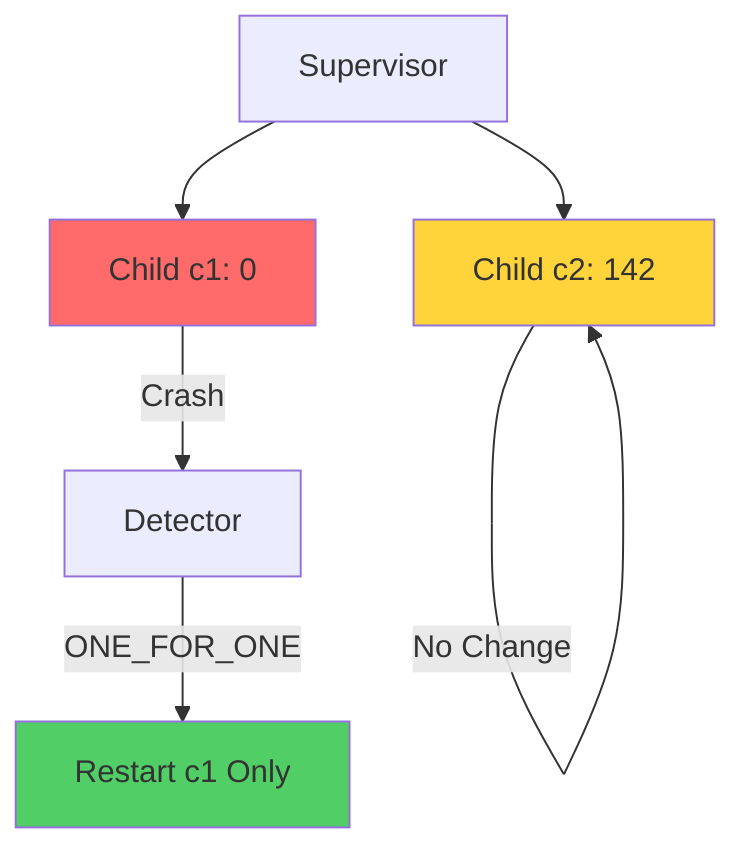
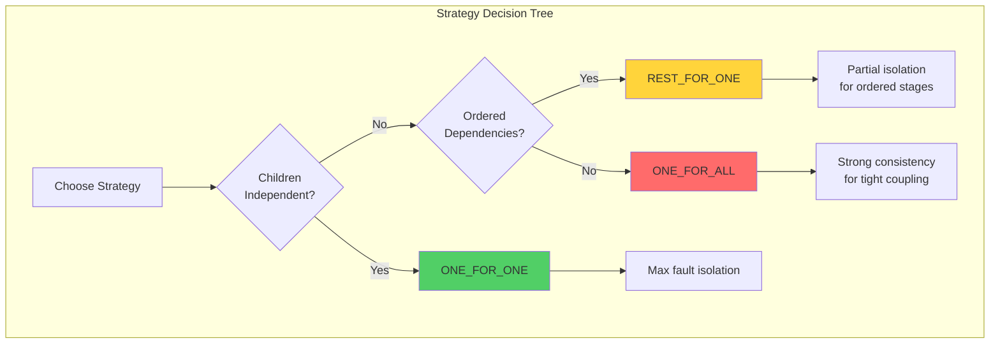
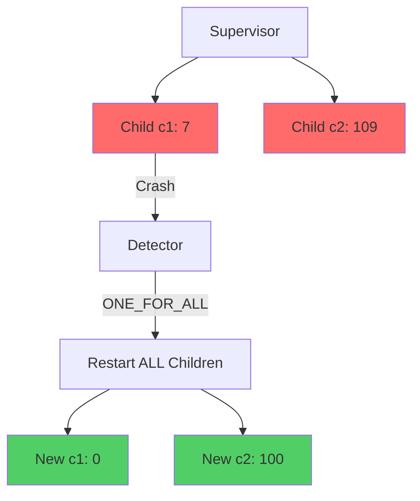
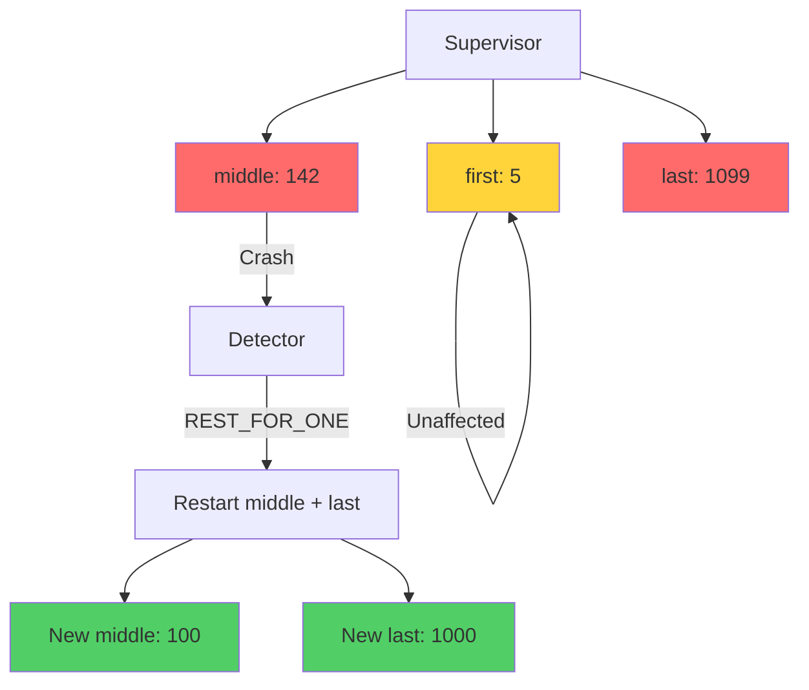
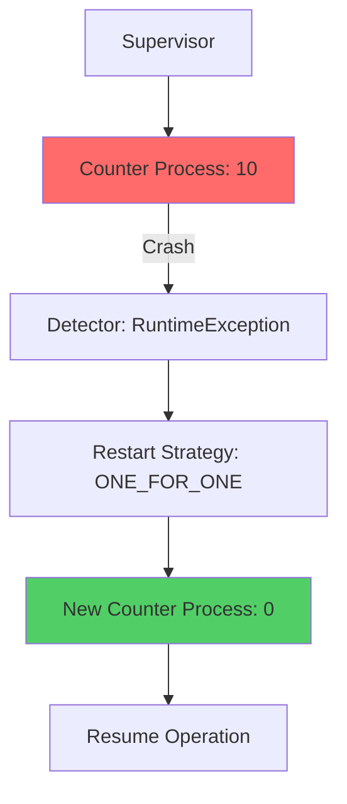

# io.github.seanchatmangpt.jotp.test.SupervisorTest

## Table of Contents

- [Supervisor: Max Restarts Threshold](#supervisormaxrestartsthreshold)
- [Supervisor: ONE_FOR_ONE Strategy](#supervisoroneforonestrategy)
- [Supervisor: Strategy Comparison](#supervisorstrategycomparison)
- [Supervisor: ONE_FOR_ALL Strategy](#supervisoroneforallstrategy)
- [Supervisor: REST_FOR_ONE Strategy](#supervisorrestforonestrategy)
- [Supervisor: Crash and Restart Recovery](#supervisorcrashandrestartrecovery)


## Supervisor: Max Restarts Threshold

Supervisors track restart frequency. If a child crashes more than maxRestarts times within the time window, the supervisor terminates itself (cascading failure).

```java
// Allow only 2 restarts in a 5-second window
var sup = new Supervisor(Strategy.ONE_FOR_ONE, 2, Duration.ofSeconds(5));
var ref = sup.supervise("fragile", 0, SupervisorTest::counterHandler);

// Crash 3 times — 3rd pushes over maxRestarts=2
for (int i = 0; i < 3; i++) {
    ref.tell(new CounterMsg.Boom("crash " + i));
    Thread.sleep(50);
}

await().atMost(Duration.ofSeconds(5)).until(() -> !sup.isRunning());
assertThat(sup.fatalError()).isNotNull();
```

```mermaid
sequenceDiagram
    participant S as Supervisor
    participant C as Child Process
    participant T as Time Window (5s)

    Note over S,T: maxRestarts=2
    C->>S: Crash #1
    S->>C: Restart (1/2)

    C->>S: Crash #2
    S->>C: Restart (2/2)

    C->>S: Crash #3
    Note over S: Threshold exceeded!
    S->>S: TERMINATE (cascade failure)

    style S fill:#ff6b6b
```

> [!WARNING]
> When maxRestarts is exceeded, the supervisor TERMINATES ITSELF to prevent crash loops. This is a fail-fast mechanism — the entire supervision tree shuts down to contain the fault. The supervisor's parent (if any) can then decide whether to restart the entire subtree.

| Key | Value |
| --- | --- |
| `Max Restarts` | `2` |
| `Supervisor Status` | `TERMINATED` |
| `Actual Crashes` | `3` |
| `Fatal Error` | `crash 2` |

## Supervisor: ONE_FOR_ONE Strategy

ONE_FOR_ONE means only the crashed child is restarted. Siblings are unaffected — fault isolation at the process level.

```java
var sup = new Supervisor(Strategy.ONE_FOR_ONE, 3, Duration.ofSeconds(10));
var ref1 = sup.supervise("c1", 0, SupervisorTest::counterHandler);
var ref2 = sup.supervise("c2", 100, SupervisorTest::counterHandler);

ref2.tell(new CounterMsg.Inc(42));
assertThat(ref2.ask(new CounterMsg.Get()).get(1, SECONDS)).isEqualTo(142);

ref1.tell(new CounterMsg.Boom("c1 crash")); // Crash only c1

// c1 restarts to 0, c2 preserves state at 142
await().atMost(Duration.ofSeconds(2)).untilAsserted(() -> assertThat(tryGet(ref1)).isEqualTo(0));
assertThat(ref2.ask(new CounterMsg.Get()).get(1, SECONDS)).isEqualTo(142);
```



| Key | Value |
| --- | --- |
| `c2 State After c1 Crash` | `142 (unaffected)` |
| `Strategy` | `ONE_FOR_ONE` |
| `c1 State After Crash` | `0 (restarted)` |

## Supervisor: Strategy Comparison

Choosing the right supervision strategy is critical for fault tolerance. Each strategy offers different trade-offs between fault isolation and consistency.

| Strategy | What Restarts | Fault Isolation | Use Case | State Impact |
| --- | --- | --- | --- | --- |
| ONE_FOR_ONE | Only crashed child | High - siblings unaffected | Independent workers, stateless services | Crashed child resets; siblings preserve state |
| ONE_FOR_ALL | ALL children | Low - cascade restart | Tightly coupled components, shared state | All children reset to initial state |
| REST_FOR_ONE | Crashed + later siblings | Medium - partial cascade | Ordered pipelines, stage dependencies | Earlier children preserve; later reset |



> [!WARNING]
> Strategy selection affects availability during failure. ONE_FOR_ONE keeps most services running; ONE_FOR_ALL causes brief but complete service interruption. REST_FOR_ONE offers a middle ground for ordered processing pipelines.

## Supervisor: ONE_FOR_ALL Strategy

ONE_FOR_ALL means all children are restarted when any one crashes. Use when children are tightly coupled.

```java
var sup = new Supervisor(Strategy.ONE_FOR_ALL, 3, Duration.ofSeconds(10));
var ref1 = sup.supervise("c1", 0, SupervisorTest::counterHandler);
var ref2 = sup.supervise("c2", 100, SupervisorTest::counterHandler);

ref1.tell(new CounterMsg.Inc(7));
ref2.tell(new CounterMsg.Inc(9));

ref1.tell(new CounterMsg.Boom("trigger ONE_FOR_ALL")); // Crash c1

// Both reset to their initial states (0 and 100)
await().atMost(Duration.ofSeconds(2)).untilAsserted(() -> {
    assertThat(tryGet(ref1)).isEqualTo(0);
    assertThat(tryGet(ref2)).isEqualTo(100);
});
```



> [!WARNING]
> ONE_FOR_ALL causes cascading restarts. All children reset to initial state, even those that were healthy. Use only when children have strong dependencies.

| Key | Value |
| --- | --- |
| `c2 Before Crash` | `109` |
| `c2 After Cascade` | `100` |
| `c1 After Cascade` | `0` |
| `Strategy` | `ONE_FOR_ALL` |
| `c1 Before Crash` | `7` |

## Supervisor: REST_FOR_ONE Strategy

REST_FOR_ONE means the crashed child and ALL children started AFTER IT are restarted. Children before the crash are unaffected. Use for ordered dependencies where later processes depend on earlier ones.

```java
var sup = new Supervisor(Strategy.REST_FOR_ONE, 3, Duration.ofSeconds(10));
var ref1 = sup.supervise("first", 0, SupervisorTest::counterHandler);
var ref2 = sup.supervise("middle", 100, SupervisorTest::counterHandler);
var ref3 = sup.supervise("last", 1000, SupervisorTest::counterHandler);

ref1.tell(new CounterMsg.Inc(5));
ref2.tell(new CounterMsg.Inc(42));
ref3.tell(new CounterMsg.Inc(99));

// Crash the middle child
ref2.tell(new CounterMsg.Boom("middle crash"));

// ref1 (before crash) unaffected at 5
// ref2 and ref3 (at/after crash) restart to 100 and 1000
await().atMost(Duration.ofSeconds(2)).untilAsserted(() -> {
    assertThat(tryGet(ref1)).isEqualTo(5);
    assertThat(tryGet(ref2)).isEqualTo(100);
    assertThat(tryGet(ref3)).isEqualTo(1000);
});
```



> [!WARNING]
> REST_FOR_ONE provides partial isolation. Only the crashed process and later siblings restart. Earlier processes maintain state, making this ideal for ordered pipelines where stage N+1 depends on stage N.

| Key | Value |
| --- | --- |
| `middle (crashed)` | `100 (restarted)` |
| `Strategy` | `REST_FOR_ONE` |
| `first (before crash)` | `5 (unaffected)` |
| `last (after crash)` | `1000 (restarted)` |

## Supervisor: Crash and Restart Recovery

When a supervised process crashes, the supervisor automatically restarts it. The process resets to its initial state.

[See ProcTest#proc-basic-creation](../ProcTest.md#proc-basic-creation)

```java
var sup = new Supervisor(Strategy.ONE_FOR_ONE, 3, Duration.ofSeconds(10));
var ref = sup.supervise("counter", 0, SupervisorTest::counterHandler);

ref.tell(new CounterMsg.Inc(10));
assertThat(ref.ask(new CounterMsg.Get()).get(1, SECONDS)).isEqualTo(10);

ref.tell(new CounterMsg.Boom("injected fault")); // Crash it!

// Supervisor restarts; process resets to initial state (0)
await().atMost(Duration.ofSeconds(2)).untilAsserted(() -> assertThat(tryGet(ref)).isEqualTo(0));
```



| Key | Value |
| --- | --- |
| `Max Restarts` | `3` |
| `Initial State After Crash` | `0 (reset)` |
| `State After Recovery` | `5` |
| `Strategy` | `ONE_FOR_ONE` |

---
*Generated by [DTR](http://www.dtr.org)*
