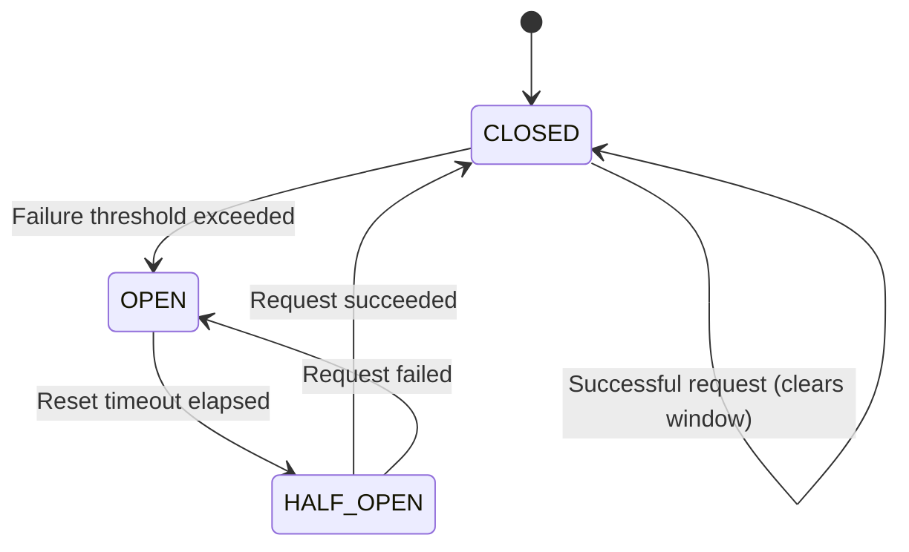

# Circuit Breaker Design - JOTP Enterprise Pattern

## Architecture Overview

The Circuit Breaker pattern in JOTP prevents cascading failures by failing fast when downstream services exceed crash thresholds. It leverages JOTP's Supervisor with restart intensity limits to automatically trip circuits and enforce operational discipline.

### Core Principles

1. **Fail-Fast Philosophy**: Circuit opens immediately when threshold exceeded, not after timeouts
2. **Supervisor Integration**: Uses JOTP's built-in restart intensity (max crashes within time window)
3. **Forced Acknowledgment**: Supervisor crash = system problem requiring investigation
4. **State Transparency**: All state transitions observable via sealed message types

### State Machine



### State Definitions

| State | Description | Behavior |
|-------|-------------|----------|
| **CLOSED** | Normal operation | Requests pass through, failures tracked in sliding window |
| **OPEN** | Circuit tripped | All requests fail immediately without execution |
| **HALF_OPEN** | Testing recovery | Single test request allowed to probe service health |

## Class Diagram

```plantuml
@startuml
package io.github.seanchatmangpt.jotp.enterprise.circuitbreaker {

  class CircuitBreakerPattern {
    -CircuitBreakerConfig config
    -Supervisor supervisor
    -ProcRef<CircuitState, CircuitMsg> coordinator
    -CopyOnWriteArrayList<CircuitBreakerListener> listeners
    +static create(CircuitBreakerConfig): CircuitBreakerPattern
    +execute<T>(CircuitBreakerTask<T>, Duration): Result<T>
    +getState(): CircuitState
    +reset(): void
    +addListener(CircuitBreakerListener): void
    +shutdown(): void
  }

  class CircuitBreakerConfig {
    String serviceName
    int maxRestarts
    Duration restartWindow
    Duration resetTimeout
    int failureThreshold
    +static of(String): CircuitBreakerConfig
  }

  class CircuitState {
    Status status
    int failureCount
    Deque<Long> failureWindow
    long lastFailureTime
  }

  enum Status {
    CLOSED
    OPEN
    HALF_OPEN
  }

  sealed interface CircuitMsg {
    RequestSuccess
    RequestFailure
    ResetTimeout
    Shutdown
  }

  interface CircuitBreakerTask<T> {
    +execute(Duration): T
  }

  sealed interface Result<T> {
    Success<T>
    Failure<T>
  }

  interface CircuitBreakerListener {
    +onStateChanged(Status, Status): void
  }

  class Supervisor {
    +Strategy strategy
    +int maxRestarts
    +Duration restartWindow
    +supervise(String, State, Handler): void
    +shutdown(): void
  }

  CircuitBreakerPattern --> CircuitBreakerConfig
  CircuitBreakerPattern --> CircuitState
  CircuitBreakerPattern --> Supervisor
  CircuitBreakerPattern --> CircuitMsg
  CircuitBreakerPattern --> Result
  CircuitBreakerPattern --> CircuitBreakerListener
  CircuitState --> Status
}

package io.github.seanchatmangpt.jotp {

  class Proc<S, M> {
    -S state
    -BiFunction<S, M, S> handler
    +getState(): S
    +tell(M): void
  }

  class ProcRef<S, M> {
    -Proc<S, M> proc
    +tell(M): void
  }

  ProcRef --> Proc
  CircuitBreakerPattern --> ProcRef
}
@enduml
```

## Sequence Diagram: Circuit Breaker Flow

```plantuml
@startuml
actor Client
participant CircuitBreaker
participant Coordinator as ProcRef<CircuitState, CircuitMsg>
participant Supervisor
participant Service as Downstream Service

Client->>CircuitBreaker: execute(task, timeout)
activate CircuitBreaker

CircuitBreaker->>CircuitBreaker: getState()
alt State is OPEN
    CircuitBreaker->>CircuitBreaker: Check reset timeout
    alt Time elapsed >= resetTimeout
        CircuitBreaker->>Coordinator: tell(ResetTimeout)
        Coordinator-->>CircuitBreaker: HALF_OPEN
        CircuitBreaker->>Service: Execute task
    else Time not elapsed
        CircuitBreaker-->>Client: Result.failure("Circuit OPEN")
    end
else State is CLOSED or HALF_OPEN
    CircuitBreaker->>Service: Execute task
    activate Service
    alt Success
        Service-->>CircuitBreaker: result
        CircuitBreaker->>Coordinator: tell(RequestSuccess)
        Coordinator-->>CircuitBreaker: Clear failure window
        CircuitBreaker-->>Client: Result.success(result)
    else Failure
        Service-->>CircuitBreaker: throw Exception
        CircuitBreaker->>Coordinator: tell(RequestFailure)
        Coordinator->>Coordinator: Add to failure window
        alt Threshold exceeded
            Coordinator-->>CircuitBreaker: Transition to OPEN
            CircuitBreaker-->>Client: Result.failure("Circuit OPEN")
        else Threshold not exceeded
            Coordinator-->>CircuitBreaker: Remain CLOSED
            CircuitBreaker-->>Client: Result.failure(error)
        end
    end
    deactivate Service
end

deactivate CircuitBreaker
@enduml
```

## Design Decisions (ADR Format)

### ADR-001: Supervisor-Based Circuit Tripping

**Status**: Accepted

**Context**: Need to detect when service is unhealthy and stop sending requests

**Decision**: Use JOTP's Supervisor with restart intensity (max crashes within time window)

**Consequences**:
- **Positive**: Automatic circuit tripping without custom counters
- **Positive**: Supervisor crash forces acknowledgment (system problem)
- **Positive**: Leverages existing OTP supervision semantics
- **Negative**: Requires understanding of Supervisor behavior
- **Negative**: Less granular than custom counter (per-minute vs per-window)

**Alternatives Considered**:
1. **Custom failure counter**: More flexible but requires manual crash detection
2. **External circuit breaker**: Adds complexity, loses OTP integration
3. **Semaphore-based**: Doesn't distinguish transient vs persistent failures

### ADR-002: Sliding Window Failure Tracking

**Status**: Accepted

**Context**: Need to track recent failures without memory bloat

**Decision**: Use bounded Deque<Long> with timestamps

**Consequences**:
- **Positive**: Fixed memory footprint (configurable window size)
- **Positive**: Natural sliding window behavior
- **Positive**: Easy to purge old timestamps
- **Negative**: Requires periodic cleanup (handled by size limit)
- **Negative**: Timestamp precision matters (millisecond recommended)

### ADR-003: Fail-Fast on OPEN Circuit

**Status**: Accepted

**Context**: What to do when circuit is OPEN and request arrives

**Decision**: Return failure immediately without executing request

**Consequences**:
- **Positive**: Prevents cascading load on failing service
- **Positive**: Fast feedback to caller (no timeout wait)
- **Positive**: Conserves resources (no threads blocked)
- **Negative**: Caller must handle CircuitBreakerException
- **Negative**: No queue/buffer for requests (use Bulkhead for that)

## Failure Tracking Algorithm

### Sliding Window Implementation

```java
// Failure window tracking
Deque<Long> failureWindow = new ArrayDeque<>(config.failureThreshold());

// On failure
failureWindow.addLast(System.currentTimeMillis());
while (failureWindow.size() > config.failureThreshold()) {
    failureWindow.removeFirst();
}

// Threshold check
if (failureWindow.size() >= config.failureThreshold()) {
    status = Status.OPEN;
}
```

### Reset Strategy

1. **Automatic Reset**: After `resetTimeout` elapsed since last failure
2. **Manual Reset**: Via `reset()` method (for testing/emergency recovery)
3. **Successful Request**: In HALF_OPEN state immediately transitions to CLOSED

## Supervisor Integration

### Restart Intensity Configuration

```java
Supervisor supervisor = Supervisor.create(
    Supervisor.Strategy.ONE_FOR_ONE,
    config.maxRestarts(),      // e.g., 3 crashes
    config.restartWindow()     // e.g., 60 seconds
);
```

### Crash Cascade

1. Service crashes → Supervisor restarts (count: 1/3)
2. Crash again → Supervisor restarts (count: 2/3)
3. Crash again → Supervisor restarts (count: 3/3)
4. Crash again → **Supervisor crashes** (circuit opens, fail-fast)

This is the **circuit breaker mechanism**: Supervisor cannot recover without external intervention.

## CAP Theorem Trade-offs

| Aspect | Choice | Justification |
|--------|--------|---------------|
| **Consistency** | Strong | Circuit state is local (single coordinator process) |
| **Availability** | Partial | OPEN state rejects requests but system remains operational |
| **Partition Tolerance** | N/A | Single-node pattern (no network partition) |

**Trade-off**: Prioritizes **Consistency** over Availability (CP in distributed context). However, since this is a local pattern, it's actually **CA** (Consistent + Available, no Partition).

## Performance Characteristics

### Memory Footprint

- **Per Circuit**: ~1 KB (state + failure window + listeners)
- **Failure Window**: 8 bytes per failure timestamp × threshold
- **Supervisor**: ~500 bytes (child spec + restart tracking)

### Latency Impact

| Operation | Latency | Notes |
|-----------|---------|-------|
| **CLOSED state** | +0.1ms | Coordinator message send |
| **OPEN state** | 0ms | Immediate failure (no execution) |
| **HALF_OPEN state** | +0.1ms | Same as CLOSED |
| **State transition** | +0.5ms | Coordinator processing + listeners |

### Throughput

- **Max requests/sec**: Limited by downstream service (circuit adds negligible overhead)
- **Failure tracking**: O(1) per request (deque operations)
- **Memory**: O(threshold) for failure window

## Known Limitations

### 1. Single-Node Only
**Limitation**: Not distributed-aware (no cross-node circuit state)

**Mitigation**: Use one circuit breaker per node, or implement distributed state via ProcRegistry

### 2. Failure Count Precision
**Limitation**: Supervisor restart intensity is per-window, not per-minute

**Example**: 3 crashes in 60 seconds = trip, even if all 3 occurred in first 10 seconds

**Mitigation**: Set `restartWindow` smaller than desired precision window

### 3. No Request Queuing
**Limitation**: OPEN circuit rejects all requests immediately (no buffering)

**Mitigation**: Use Bulkhead pattern for queue/buffering

### 4. Threshold Sensitivity
**Limitation**: Too low = false positives, too high = delayed detection

**Mitigation**: Monitor and tune based on service baseline error rate

### 5. Manual Reset Required
**Limitation**: Supervisor crash requires external intervention

**Mitigation**: Use higher-level supervisor to auto-restart circuit breaker supervisor

## Configuration Guidelines

### Recommended Settings

| Scenario | maxRestarts | restartWindow | resetTimeout | failureThreshold |
|----------|-------------|---------------|--------------|------------------|
| **Critical service** | 3 | 60s | 30s | 3 |
| **Non-critical service** | 5 | 60s | 10s | 5 |
| **High-latency service** | 3 | 120s | 60s | 3 |
| **High-volume service** | 10 | 60s | 5s | 10 |

### Tuning Process

1. **Baseline**: Monitor normal error rate (should be < 1%)
2. **Threshold**: Set to 5-10x baseline error rate
3. **Window**: Match service's typical recovery time
4. **Reset Timeout**: 2-3x typical recovery time
5. **Iterate**: Adjust based on production metrics

## Monitoring & Observability

### Key Metrics

```java
// Expose via CircuitBreakerListener
public interface CircuitBreakerListener {
    void onStateChanged(Status from, Status to);
}
```

### Recommended Metrics

1. **State transitions**: CLOSED → OPEN frequency (indicates service instability)
2. **Time in OPEN**: How long circuits stay open (indicates recovery time)
3. **Failure rate**: Failures / total requests
4. **Reset success rate**: HALF_OPEN → CLOSED vs HALF_OPEN → OPEN

### Alerting Thresholds

- **Alert**: Circuit opens more than 3 times in 10 minutes
- **Critical**: Circuit remains OPEN > 5 minutes
- **Warning**: Failure rate > 10% (before threshold)

## Integration Examples

### With Backpressure

```java
Backpressure backpressure = Backpressure.create(backpressureConfig);
CircuitBreakerPattern breaker = CircuitBreakerPattern.create(breakerConfig);

Result<String> result = breaker.execute(
    timeout -> backpressure.execute(
        taskTimeout -> service.call(),
        taskTimeout
    ),
    timeout
);
```

**Order matters**: Circuit breaker (outer) → Backpressure (inner) → Service

### With Bulkhead

```java
BulkheadIsolationEnterprise bulkhead = BulkheadIsolationEnterprise.create(bulkheadConfig);
CircuitBreakerPattern breaker = CircuitBreakerPattern.create(breakerConfig);

Result<String> result = breaker.execute(
    timeout -> bulkhead.execute(() -> service.call()),
    timeout
);
```

**Order matters**: Circuit breaker (outer) → Bulkhead (inner) → Service

### With Saga

```java
SagaStep step = new SagaStep.Action<>(
    "charge-payment",
    input -> breaker.execute(
        timeout -> paymentGateway.charge(input.amount()),
        timeout
    )
);
```

**Result type**: Saga will compensate if circuit is OPEN

## Testing Strategy

### Unit Tests

1. **State transitions**: Verify CLOSED → OPEN → HALF_OPEN → CLOSED
2. **Failure window**: Verify threshold counting
3. **Reset timeout**: Verify automatic HALF_OPEN transition
4. **Manual reset**: Verify reset() forces CLOSED state

### Integration Tests

1. **Supervisor crash**: Verify circuit opens after max crashes
2. **Recovery**: Verify successful request closes circuit
3. **Listener notifications**: Verify all state changes emitted

### Chaos Testing

1. **Service down**: Verify circuit opens after threshold
2. **Network partition**: Verify circuit opens (no hung requests)
3. **Service restart**: Verify circuit closes after successful request

## References

- [Enterprise Integration Patterns - Circuit Breaker](https://www.enterpriseintegrationpatterns.com/patterns/messaging/CircuitBreaker.html)
- [Release It! - Michael Nygard](https://www.pragprog.com/titles/mnee2/release-it-second-edition/)
- [JOTP Supervisor Documentation](/Users/sac/jotp/docs/explanations/architecture.md)
- [JOTP Backpressure Pattern](/Users/sac/jotp/docs/architecture/enterprise/circuit-breaker-design.md)

## Changelog

### v1.0.0 (2026-03-15)
- Initial implementation with Supervisor-based circuit tripping
- Sliding window failure tracking
- Automatic and manual reset strategies
- Listener API for observability
