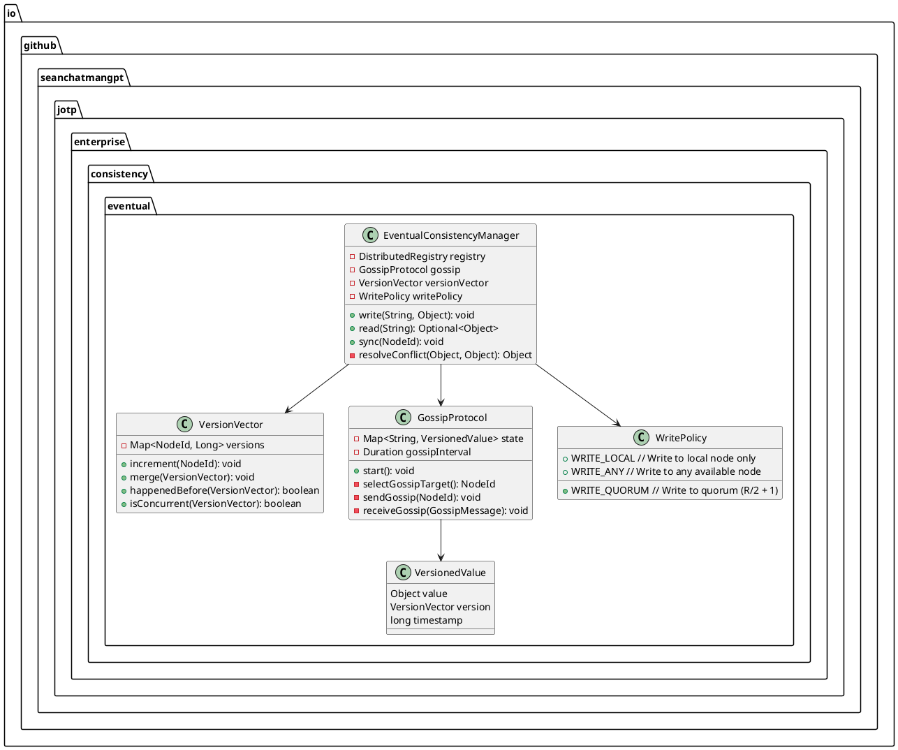
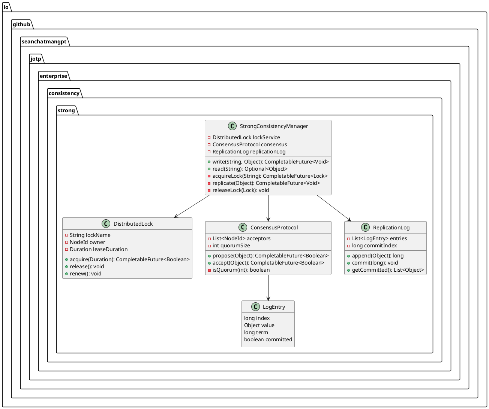
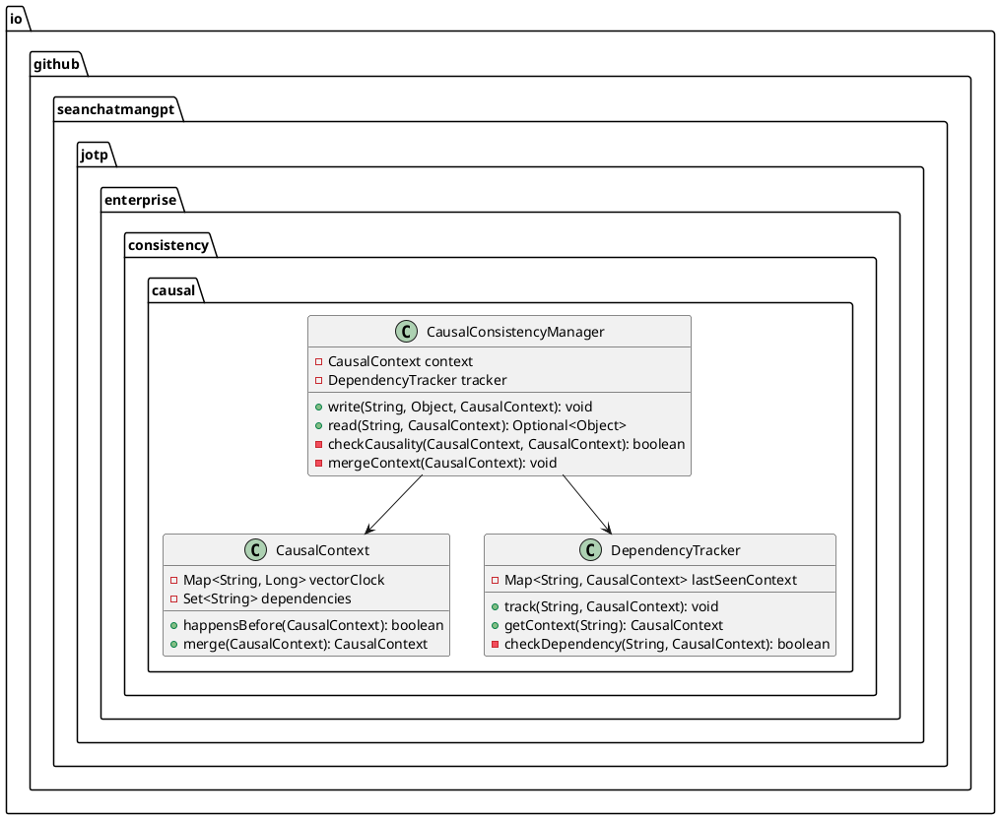
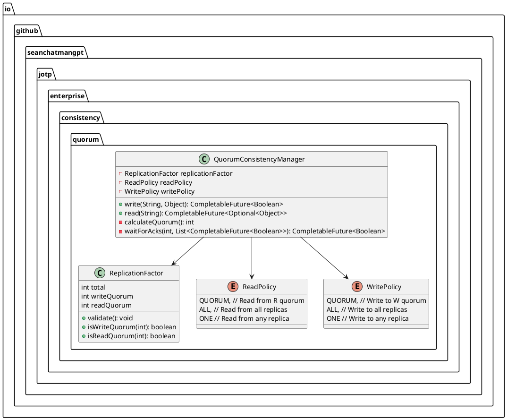
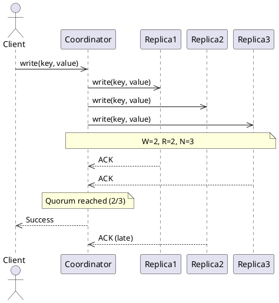

# Consistency Models - JOTP Enterprise Pattern

## Architecture Overview

JOTP provides multiple consistency models to balance data correctness with system performance and availability. This document covers Eventual Consistency (AP), Strong Consistency (CP), Causal Consistency, and Quorum-based Consistency for distributed process registries and state management.

### Consistency Spectrum


| Model | Consistency | Latency | Availability | Use Case |
|-------|-------------|---------|--------------|----------|
| **Strong** | ✓✓✓ | High | Low | Financial transactions |
| **Causal** | ✓✓ | Medium | Medium | Social media feeds |
| **Quorum** | ✓✓ | Medium | High | Distributed registries |
| **Eventual** | ✓ | Low | High | Caching, replication |

## Eventual Consistency (AP)

### Architecture



### Gossip-Based Propagation

```java
class EventualConsistencyManager {
    private final Map<String, VersionedValue> localState = new ConcurrentHashMap<>();
    private final VersionVector localVersion = new VersionVector();

    public void write(String key, Object value) {
        // Increment local version
        localVersion.increment(localNodeId);

        // Create versioned value
        VersionedValue versionedValue = new VersionedValue(
            value,
            localVersion.copy(),
            System.currentTimeMillis()
        );

        // Write to local state
        localState.put(key, versionedValue);

        // Trigger gossip (async)
        gossip.trigger(key, versionedValue);
    }

    public Optional<Object> read(String key) {
        VersionedValue value = localState.get(key);

        if (value == null) {
            // Try to fetch from other nodes
            return readRepair(key);
        }

        return Optional.of(value.value());
    }

    private Optional<Object> readRepair(String key) {
        // Query random subset of nodes
        List<NodeId> nodes = selectRandomNodes(3);

        for (NodeId node : nodes) {
            try {
                VersionedValue remoteValue = queryRemote(node, key);

                if (remoteValue != null) {
                    // Merge with local state
                    localState.put(key, remoteValue);
                    return Optional.of(remoteValue.value());
                }
            } catch (Exception e) {
                // Node unavailable, continue
            }
        }

        return Optional.empty();
    }

    public void sync(NodeId nodeId) {
        // Exchange state with peer
        Map<String, VersionedValue> remoteState = queryFullState(nodeId);

        // Merge states
        for (Map.Entry<String, VersionedValue> entry : remoteState.entrySet()) {
            String key = entry.getKey();
            VersionedValue remoteValue = entry.getValue();
            VersionedValue localValue = localState.get(key);

            if (localValue == null) {
                // Local doesn't have key, accept remote
                localState.put(key, remoteValue);
            } else {
                // Resolve conflict using version vectors
                if (localValue.version().isConcurrent(remoteValue.version())) {
                    // Concurrent writes, resolve conflict
                    Object resolved = resolveConflict(localValue.value(), remoteValue.value());
                    localState.put(key, new VersionedValue(
                        resolved,
                        localValue.version().merge(remoteValue.version()),
                        Math.max(localValue.timestamp(), remoteValue.timestamp())
                    ));
                } else if (remoteValue.version().happenedAfter(localValue.version())) {
                    // Remote is newer, accept it
                    localState.put(key, remoteValue);
                }
                // Else local is newer, keep it
            }
        }
    }
}
```

### Version Vector Implementation

```java
class VersionVector {
    private final Map<NodeId, Long> versions = new ConcurrentHashMap<>();

    public void increment(NodeId nodeId) {
        versions.merge(nodeId, 1L, Long::sum);
    }

    public VersionVector merge(VersionVector other) {
        VersionVector result = new VersionVector();

        // Add all versions from both vectors
        result.versions.putAll(this.versions);

        for (Map.Entry<NodeId, Long> entry : other.versions.entrySet()) {
            result.versions.merge(entry.getKey(), entry.getValue(), Math::max);
        }

        return result;
    }

    public boolean happenedBefore(VersionVector other) {
        // Check if this version happened before other
        boolean allLessOrEqual = true;
        boolean someLess = false;

        for (Map.Entry<NodeId, Long> entry : versions.entrySet()) {
            NodeId node = entry.getKey();
            long thisVersion = entry.getValue();
            long otherVersion = other.versions.getOrDefault(node, 0L);

            if (thisVersion > otherVersion) {
                allLessOrEqual = false;
            } else if (thisVersion < otherVersion) {
                someLess = true;
            }
        }

        return allLessOrEqual && someLess;
    }

    public boolean isConcurrent(VersionVector other) {
        // Check if versions are concurrent (neither happened before)
        boolean thisLessOther = false;
        boolean otherLessThis = false;

        for (NodeId node : allNodes()) {
            long thisVersion = versions.getOrDefault(node, 0L);
            long otherVersion = other.versions.getOrDefault(node, 0L);

            if (thisVersion < otherVersion) {
                thisLessOther = true;
            } else if (thisVersion > otherVersion) {
                otherLessThis = true;
            }
        }

        return thisLessOther && otherLessThis;
    }

    private Set<NodeId> allNodes() {
        Set<NodeId> nodes = new HashSet<>(versions.keySet());
        nodes.addAll(versions.keySet());
        return nodes;
    }
}
```

### CAP Characteristics

| Aspect | Choice | Trade-off |
|--------|--------|-----------|
| **Consistency** | Eventual | Updates propagate asynchronously |
| **Availability** | High | Reads/writes always succeed locally |
| **Partition Tolerance** | High | Continue operating during partitions |

**Inconsistency Window**: O(log N) gossip rounds = 100-500ms for 100-node cluster

## Strong Consistency (CP)

### Architecture



### Two-Phase Commit (2PC)

```java
class StrongConsistencyManager {
    public CompletableFuture<Void> write(String key, Object value) {
        return acquireLock(key)
            .thenCompose(lock -> {
                // Phase 1: Prepare
                return replicatePrepare(key, value)
                    .thenCompose(prepared -> {
                        if (prepared) {
                            // Phase 2: Commit
                            return replicateCommit(key, value)
                                .thenRun(() -> releaseLock(lock));
                        } else {
                            // Abort
                            return replicateAbort(key)
                                .thenRun(() -> releaseLock(lock));
                        }
                    });
            });
    }

    private CompletableFuture<Boolean> replicatePrepare(String key, Object value) {
        List<NodeId> replicas = getReplicas(key);
        List<CompletableFuture<Boolean>> futures = new ArrayList<>();

        for (NodeId replica : replicas) {
            futures.add(sendPrepare(replica, key, value));
        }

        return CompletableFuture.allOf(futures.toArray(new CompletableFuture[0]))
            .thenApply(v -> {
                // Check if all replicas prepared
                return futures.stream().allMatch(f -> f.join());
            });
    }

    private CompletableFuture<Void> replicateCommit(String key, Object value) {
        List<NodeId> replicas = getReplicas(key);
        List<CompletableFuture<Void>> futures = new ArrayList<>();

        for (NodeId replica : replicas) {
            futures.add(sendCommit(replica, key, value));
        }

        return CompletableFuture.allOf(futures.toArray(new CompletableFuture[0]));
    }

    private CompletableFuture<Void> replicateAbort(String key) {
        List<NodeId> replicas = getReplicas(key);
        List<CompletableFuture<Void>> futures = new ArrayList<>();

        for (NodeId replica : replicas) {
            futures.add(sendAbort(replica, key));
        }

        return CompletableFuture.allOf(futures.toArray(new CompletableFuture[0]));
    }
}
```

### Distributed Locking

```java
class DistributedLock {
    private final String lockName;
    private volatile NodeId owner;
    private volatile long leaseExpiry;

    public CompletableFuture<Boolean> acquire(Duration timeout) {
        NodeId candidate = localNodeId;
        long expiry = System.currentTimeMillis() + timeout.toMillis();

        // Try to acquire lock via consensus
        return consensus.propose(new LockAcquisition(lockName, candidate, expiry))
            .thenApply(success -> {
                if (success) {
                    owner = candidate;
                    leaseExpiry = expiry;
                    startLeaseRenewal();
                    return true;
                }
                return false;
            });
    }

    private void startLeaseRenewal() {
        scheduler.scheduleAtFixedRate(() -> {
            if (owner.equals(localNodeId) && System.currentTimeMillis() < leaseExpiry) {
                // Renew lease
                long newExpiry = System.currentTimeMillis() + leaseDuration.toMillis();
                consensus.propose(new LeaseRenewal(lockName, newExpiry))
                    .thenAccept(success -> {
                        if (success) {
                            leaseExpiry = newExpiry;
                        } else {
                            // Lost lock, notify application
                            notifyLockLost();
                        }
                    });
            }
        }, leaseDuration.toMillis() / 2, leaseDuration.toMillis() / 2, TimeUnit.MILLISECONDS);
    }

    public void release() {
        if (owner.equals(localNodeId)) {
            consensus.propose(new LockRelease(lockName))
                .thenRun(() -> {
                    owner = null;
                    leaseExpiry = 0;
                });
        }
    }
}
```

### CAP Characteristics

| Aspect | Choice | Trade-off |
|--------|--------|-----------|
| **Consistency** | Strong | All nodes see same data |
| **Availability** | Low | Blocked during lock acquisition |
| **Partition Tolerance** | Low | Cannot reach consensus during partition |

**Latency**: 2 network round-trips (prepare + commit) = 10-100ms

## Causal Consistency

### Architecture



### Causal Ordering

```java
class CausalConsistencyManager {
    public void write(String key, Object value, CausalContext parentContext) {
        // Create new context from parent
        CausalContext newContext = context.copy().merge(parentContext);
        newContext.increment(key);

        // Track dependencies
        tracker.track(key, newContext);

        // Write value with context
        VersionedValue versioned = new VersionedValue(value, newContext);
        localState.put(key, versioned);

        // Propagate to other nodes
        propagate(key, versioned);
    }

    public Optional<Object> read(String key, CausalContext readContext) {
        VersionedValue value = localState.get(key);

        if (value == null) {
            return Optional.empty();
        }

        // Check causal dependency
        if (!checkCausality(readContext, value.context())) {
            // Causal dependency not satisfied, wait or fetch
            return waitForCausalUpdate(key, readContext);
        }

        return Optional.of(value.value());
    }

    private boolean checkCausality(CausalContext readContext, CausalContext valueContext) {
        // Value must happen-after read context
        return valueContext.happensAfter(readContext);
    }

    private Optional<Object> waitForCausalUpdate(String key, CausalContext context) {
        // Wait for causal update from other nodes
        CompletableFuture<VersionedValue> future = new CompletableFuture<>();

        // Register listener for causal updates
        causalListeners.put(key, (updatedKey, updatedValue) -> {
            if (updatedKey.equals(key) && updatedValue.context().happensAfter(context)) {
                future.complete(updatedValue);
            }
        });

        try {
            VersionedValue value = future.get(5, TimeUnit.SECONDS);
            return Optional.of(value.value());
        } catch (Exception e) {
            return Optional.empty();
        }
    }
}
```

### Dependency Tracking

```java
class DependencyTracker {
    private final Map<String, CausalContext> lastSeenContext = new ConcurrentHashMap<>();

    public void track(String key, CausalContext context) {
        // Update last seen context for key
        lastSeenContext.merge(key, context, CausalContext::merge);
    }

    public CausalContext getContext(String key) {
        return lastSeenContext.getOrDefault(key, CausalContext.empty());
    }

    public boolean checkDependency(String key, CausalContext requiredContext) {
        CausalContext lastContext = lastSeenContext.get(key);

        if (lastContext == null) {
            return false;
        }

        // Check if last seen context satisfies required
        return lastContext.happensAfter(requiredContext);
    }
}
```

### CAP Characteristics

| Aspect | Choice | Trade-off |
|--------|--------|-----------|
| **Consistency** | Causal | Preserves operation ordering |
| **Availability** | Medium | May wait for causal updates |
| **Partition Tolerance** | Medium | Continue with available context |

**Latency**: Variable (may wait for causal propagation)

## Quorum-Based Consistency

### Architecture



### Quorum Reads/Writes

```java
class QuorumConsistencyManager {
    private final int totalReplicas;
    private final int writeQuorum;
    private final int readQuorum;

    // Quorum formula: W + R > N
    // Example: N=3, W=2, R=2 → 2 + 2 > 3 ✓

    public CompletableFuture<Boolean> write(String key, Object value) {
        List<NodeId> replicas = getReplicas(key);
        List<CompletableFuture<Boolean>> futures = new ArrayList<>();

        // Send write to all replicas
        for (NodeId replica : replicas) {
            futures.add(sendWrite(replica, key, value));
        }

        // Wait for write quorum
        return waitForAcks(writeQuorum, futures);
    }

    public CompletableFuture<Optional<Object>> read(String key) {
        List<NodeId> replicas = getReplicas(key);
        List<CompletableFuture<VersionedValue>> futures = new ArrayList<>();

        // Send read to all replicas
        for (NodeId replica : replicas) {
            futures.add(sendRead(replica, key));
        }

        // Wait for read quorum and resolve
        return CompletableFuture.allOf(futures.toArray(new CompletableFuture[0]))
            .thenApply(v -> {
                List<VersionedValue> values = futures.stream()
                    .map(CompletableFuture::join)
                    .filter(Objects::nonNull)
                    .toList();

                if (values.size() < readQuorum) {
                    return Optional.empty();
                }

                // Resolve to latest version
                return Optional.of(resolveLatest(values));
            });
    }

    private CompletableFuture<Boolean> waitForAcks(int required, List<CompletableFuture<Boolean>> futures) {
        AtomicInteger ackCount = new AtomicInteger(0);
        CompletableFuture<Boolean> result = new CompletableFuture<>();

        for (CompletableFuture<Boolean> future : futures) {
            future.whenComplete((success, error) -> {
                if (success && error == null) {
                    int count = ackCount.incrementAndGet();

                    if (count >= required) {
                        result.complete(true);
                    }
                }
            });
        }

        return result;
    }

    private Object resolveLatest(List<VersionedValue> values) {
        // Select value with highest version
        return values.stream()
            .max(Comparator.comparing(v -> v.version()))
            .map(VersionedValue::value)
            .orElse(null);
    }
}
```

### Quorum Configuration

```java
class ReplicationFactor {
    private final int total;
    private final int writeQuorum;
    private final int readQuorum;

    public ReplicationFactor(int total, int writeQuorum, int readQuorum) {
        // Validate: W + R > N
        if (writeQuorum + readQuorum <= total) {
            throw new IllegalArgumentException(
                "Quorum configuration must satisfy: W + R > N"
            );
        }

        // Validate: W > N/2, R > N/2
        if (writeQuorum <= total / 2 || readQuorum <= total / 2) {
            throw new IllegalArgumentException(
                "Quorum must be majority: W > N/2, R > N/2"
            );
        }

        this.total = total;
        this.writeQuorum = writeQuorum;
        this.readQuorum = readQuorum;
    }

    public static ReplicationFactor of(int total, ConsistencyLevel level) {
        int quorum = (total / 2) + 1;

        return switch (level) {
            case QUORUM -> new ReplicationFactor(total, quorum, quorum);
            case ALL -> new ReplicationFactor(total, total, total);
            case ONE -> new ReplicationFactor(total, 1, 1);
            case LOW_LATENCY -> new ReplicationFactor(total, 2, quorum); // Fast write, consistent read
        };
    }
}
```

### CAP Characteristics

| Aspect | Choice | Trade-off |
|--------|--------|-----------|
| **Consistency** | Tunable | Adjust W/R for desired consistency |
| **Availability** | Tunable | Lower quorum = higher availability |
| **Partition Tolerance** | High | Continue if quorum reachable |

**Latency**: Min(W, R) round-trips = 5-50ms

## Consistency Model Comparison

| Scenario | Recommended Model | Justification |
|----------|-------------------|---------------|
| **Financial transactions** | Strong | No tolerance for inconsistencies |
| **User profiles** | Eventual | Fast reads, eventual propagation OK |
| **Social feeds** | Causal | Preserve post ordering, allow delays |
| **Caching layer** | Eventual | Speed over consistency |
| **Configuration** | Quorum (W+R>N) | Balance consistency and availability |
| **Shopping cart** | Causal | Preserve add/remove ordering |
| **Inventory** | Strong | Prevent overselling |

## Sequence Diagram: Quorum Write Flow



## Performance Comparison

| Model | Write Latency | Read Latency | Throughput | Availability |
|-------|---------------|--------------|------------|--------------|
| **Eventual** | 1ms | 1ms | Very High | 100% |
| **Causal** | 5ms | 5ms | High | 95% |
| **Quorum (2/3)** | 10ms | 10ms | Medium | 90% |
| **Strong (2PC)** | 50ms | 1ms | Low | 70% |

## Configuration Guidelines

### Choosing Consistency Model

```
IF requirement == "never inconsistent":
    Use Strong Consistency
ELIF requirement == "preserve ordering":
    Use Causal Consistency
ELIF requirement == "tunable consistency":
    Use Quorum Consistency
ELSE:
    Use Eventual Consistency (default)
```

### Quorum Tuning

| Requirement | N | W | R | Characteristics |
|-------------|---|---|---|-----------------|
| **Fast write, consistent read** | 3 | 2 | 3 | Write optimized |
| **Consistent write, fast read** | 3 | 3 | 2 | Read optimized |
| **Balanced** | 3 | 2 | 2 | Default |
| **High availability** | 5 | 3 | 3 | Low latency |

## Monitoring & Observability

### Key Metrics

1. **Inconsistency window**: Time from write to full propagation
2. **Quorum hit rate**: Percentage of quorum operations successful
3. **Conflict rate**: Concurrent updates requiring resolution
4. **Lock wait time**: Time waiting for distributed locks
5. **Causal dependency wait**: Time waiting for causal updates

### Alerting Thresholds

- **Warning**: Inconsistency window > 1s
- **Critical**: Quorum operations failing > 5%
- **Alert**: Lock wait time > 5s
- **Warning**: Causal wait time > 2s

## Testing Strategy

### Unit Tests

1. **Version vector ordering**: Verify happened-before logic
2. **Quorum calculations**: Verify W+R>N validation
3. **Conflict resolution**: Verify merge logic

### Integration Tests

1. **Multi-node consistency**: Verify consistency across nodes
2. **Network partitions**: Verify behavior during partitions
3. **Failure scenarios**: Verify recovery after failures

### Chaos Testing

1. **Random failures**: Verify consistency under chaos
2. **Network partitions**: Verify split-brain prevention
3. **Clock skew**: Verify robustness to time drift

## References

- [CAP Theorem - Brewer](https://www.cs. Cornell.edu/~lbshou/pres/decai cap.pdf)
- [Dynamo: Amazon's Highly Available Key-Value Store](https://www.allthingsdistributed.com/files/amazon-dynamo-sosp2007.pdf)
- [Bayou: Weak Consistency Replication](http://www.cs.utexas.edu/users/lorenzo/corsi/cs380d/papers/Bayou.pdf)
- [Cassandra Consistency Levels](https://cassandra.apache.org/doc/latest/cql/ddl.html)
- [JOTP Distributed Registry](/Users/sac/jotp/docs/architecture/enterprise/distributed-registry.md)

## Changelog

### v1.0.0 (2026-03-15)
- Initial consistency models documentation
- Eventual consistency with gossip
- Strong consistency with 2PC
- Causal consistency with vector clocks
- Quorum-based tunable consistency
