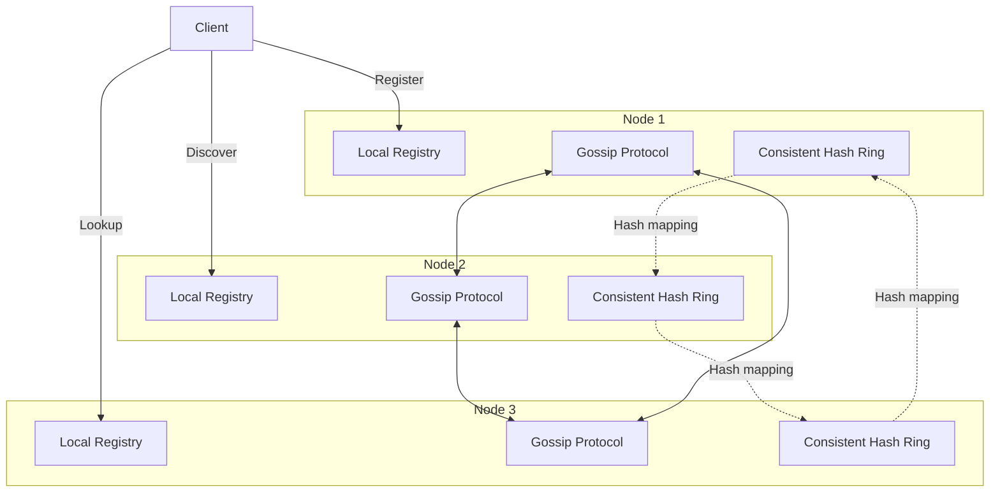
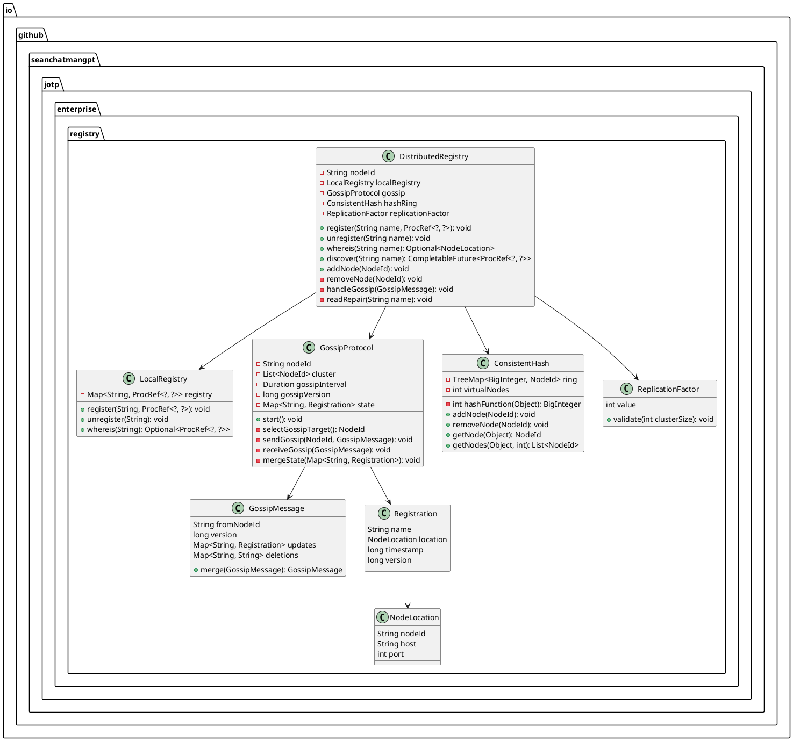
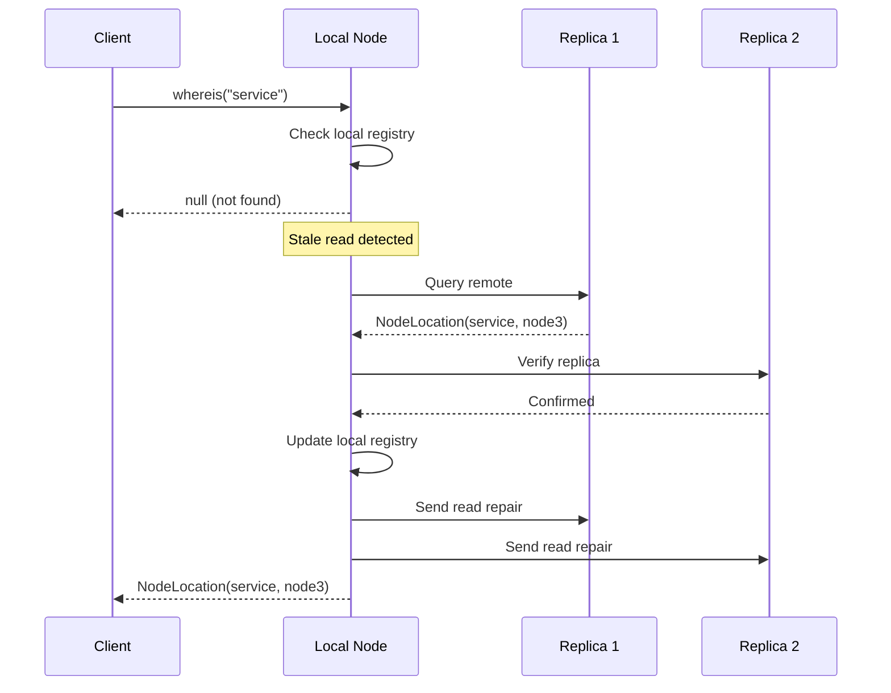

# Distributed Registry - JOTP Enterprise Pattern

## Architecture Overview

The Distributed Registry pattern extends JOTP's local `ProcRegistry` to provide cross-node process registration and discovery. It implements consistent hashing for load distribution, gossip protocol for state propagation, and read repair for eventual consistency.

### Core Principles

1. **Consistent Hashing**: Minimize data movement on topology changes
2. **Gossip Protocol**: Efficient state propagation with O(log N) convergence
3. **Read Repair**: Detect and reconcile stale reads
4. **Partition Tolerance**: Continue operating during network partitions

### Architecture Components



## Class Diagram



## Consistent Hashing Design

### Hash Ring Structure

```java
class ConsistentHash {
    private final TreeMap<BigInteger, NodeId> ring;
    private final int virtualNodes;

    // Add node to ring
    public void addNode(NodeId nodeId) {
        for (int i = 0; i < virtualNodes; i++) {
            String virtualNodeName = nodeId + "#" + i;
            BigInteger hash = hash(virtualNodeName);
            ring.put(hash, nodeId);
        }
    }

    // Get primary node for key
    public NodeId getNode(Object key) {
        BigInteger hash = hash(key);
        Map.Entry<BigInteger, NodeId> entry = ring.ceilingEntry(hash);
        if (entry == null) {
            entry = ring.firstEntry(); // Wrap around
        }
        return entry.getValue();
    }

    // Get N replicas for key
    public List<NodeId> getNodes(Object key, int count) {
        BigInteger hash = hash(key);
        List<NodeId> nodes = new ArrayList<>();
        Iterator<NodeId> it = ring.tailMap(hash).values().iterator();

        while (nodes.size() < count && it.hasNext()) {
            NodeId node = it.next();
            if (!nodes.contains(node)) {
                nodes.add(node);
            }
        }

        // Wrap around if needed
        if (nodes.size() < count) {
            it = ring.values().iterator();
            while (nodes.size() < count && it.hasNext()) {
                NodeId node = it.next();
                if (!nodes.contains(node)) {
                    nodes.add(node);
                }
            }
        }

        return nodes;
    }
}
```

### Virtual Node Selection

**Why Virtual Nodes?**
- **Balanced Distribution**: Each physical node gets multiple hash positions
- **Minimal Data Movement**: Only 1/N of data moves when node joins/leaves
- **Hotspot Avoidance**: Prevents uneven load distribution

**Formula:**
```
Virtual Nodes = Physical Nodes × Replication Factor
Example: 10 nodes × 3 = 30 virtual nodes per physical node
```

## Gossip Protocol Design

### Gossip State Message

```java
record GossipMessage(
    String fromNodeId,
    long version,
    Map<String, Registration> updates,
    Map<String, String> deletions
) {
    // Merge incoming gossip with local state
    public GossipMessage merge(GossipMessage other) {
        Map<String, Registration> mergedUpdates = new HashMap<>(this.updates);

        for (Map.Entry<String, Registration> entry : other.updates.entrySet()) {
            String name = entry.getKey();
            Registration otherReg = entry.getValue();
            Registration localReg = mergedUpdates.get(name);

            if (localReg == null || otherReg.version > localReg.version) {
                mergedUpdates.put(name, otherReg);
            }
        }

        return new GossipMessage(
            this.fromNodeId,
            Math.max(this.version, other.version),
            mergedUpdates,
            mergeDeletions(this.deletions, other.deletions)
        );
    }
}
```

### Gossip Dissemination Algorithm

```java
class GossipProtocol {
    private static final Duration GOSSIP_INTERVAL = Duration.ofMillis(100);
    private static final int GOSSIP_FANOUT = 3;

    public void start() {
        scheduler.scheduleAtFixedRate(() -> {
            // Select random gossip targets
            List<NodeId> targets = selectRandomTargets(GOSSIP_FANOUT);

            // Send gossip to each target
            for (NodeId target : targets) {
                GossipMessage message = buildGossipMessage();
                sendGossip(target, message);
            }
        }, 0, GOSSIP_INTERVAL.toMillis(), TimeUnit.MILLISECONDS);
    }

    private List<NodeId> selectRandomTargets(int count) {
        List<NodeId> nodes = new ArrayList<>(cluster);
        Collections.shuffle(nodes);
        return nodes.subList(0, Math.min(count, nodes.size()));
    }
}
```

### Convergence Time Analysis

**Theoretical Convergence**: O(log N) rounds

```
Convergence Time = log_base_fanout(Cluster Size)
Example: log_3(100) ≈ 4.2 rounds
With 100ms interval: 4.2 × 100ms = 420ms
```

**Factors Affecting Convergence**:
1. **Cluster Size**: Larger clusters take longer
2. **Fanout**: More targets = faster convergence
3. **Network Latency**: Higher latency = slower propagation
4. **Message Loss**: Lossy networks require more rounds

## Read Repair Strategy

### Stale Read Detection

```java
class DistributedRegistry {
    private static final int READ_REPAIR_THRESHOLD = 2; // Versions

    public Optional<NodeLocation> whereis(String name) {
        // Get from local registry
        Optional<NodeLocation> local = localRegistry.whereis(name);

        if (local.isEmpty()) {
            // Try consistent hash lookup
            List<NodeId> replicas = hashRing.getNodes(name, replicationFactor.value());
            for (NodeId replica : replicas) {
                if (replica.equals(localNodeId)) continue;

                try {
                    Optional<NodeLocation> remote = queryRemote(replica, name);
                    if (remote.isPresent()) {
                        // Stale read detected, trigger repair
                        triggerReadRepair(name, remote.get());
                        return remote;
                    }
                } catch (Exception e) {
                    // Remote unavailable, continue
                }
            }
        }

        return local;
    }

    private void triggerReadRepair(String name, NodeLocation correctValue) {
        // Broadcast correct value to cluster
        gossip.broadcastUpdate(name, correctValue);
    }
}
```

### Read Repair Flow



## Partition Handling

### Network Partition Detection

```java
class GossipProtocol {
    private final Map<NodeId, Long> lastSeenTimestamps = new HashMap<>();

    public void detectPartitions() {
        long now = System.currentTimeMillis();
        long partitionThreshold = GOSSIP_INTERVAL.multipliedBy(10).toMillis();

        List<NodeId> suspected = new ArrayList<>();
        for (Map.Entry<NodeId, Long> entry : lastSeenTimestamps.entrySet()) {
            if (now - entry.getValue() > partitionThreshold) {
                suspected.add(entry.getKey());
            }
        }

        if (!suspected.isEmpty()) {
            handlePartition(suspected);
        }
    }

    private void handlePartition(List<NodeId> suspectedNodes) {
        // Mark nodes as suspect
        for (NodeId node : suspectedNodes) {
            markSuspect(node);
        }

        // Trigger rehashing
        consistentHash.removeNodes(suspectedNodes);

        // Notify listeners
        notifyPartitionEvent(suspectedNodes);
    }
}
```

### Partition Recovery

```java
class GossipProtocol {
    public void handleNodeRejoin(NodeId node) {
        // Clear suspect flag
        clearSuspect(node);

        // Add back to hash ring
        consistentHash.addNode(node);

        // Request full state sync
        requestStateSync(node);

        // Notify listeners
        notifyRejoinEvent(node);
    }

    private void requestStateSync(NodeId node) {
        GossipMessage syncRequest = GossipMessage.builder()
            .fromNodeId(localNodeId)
            .type(GossipMessage.Type.STATE_SYNC_REQUEST)
            .build();

        sendGossip(node, syncRequest);
    }
}
```

### Split-Brain Prevention

```java
class DistributedRegistry {
    private final Quorum quorum;

    public void register(String name, ProcRef<?, ?> ref) {
        List<NodeId> replicas = hashRing.getNodes(name, replicationFactor.value());

        // Require quorum ack
        int acks = 0;
        for (NodeId replica : replicas) {
            try {
                registerRemote(replica, name, ref);
                acks++;
            } catch (Exception e) {
                // Registration failed
            }
        }

        if (acks < quorum.getValue()) {
            throw new RegistrationException(
                "Quorum not reached: " + acks + "/" + quorum.getValue()
            );
        }
    }
}
```

## CAP Theorem Trade-offs

| Aspect | Choice | Justification |
|--------|--------|---------------|
| **Consistency** | Eventual | Gossip propagation + read repair |
| **Availability** | High | Local reads always succeed |
| **Partition Tolerance** | High | Continue operating during partitions |

**Trade-off**: Prioritizes **Availability** and **Partition Tolerance** over strong Consistency (AP system).

### Eventual Consistency Window

```
Max Inconsistency Window = Gossip Interval × log(Cluster Size)
Example: 100ms × log_3(100) ≈ 420ms
```

## Performance Characteristics

### Memory Footprint

| Component | Per Node | Growth Rate |
|-----------|----------|-------------|
| **Local Registry** | ~100 bytes per process | O(N) |
| **Gossip State** | ~200 bytes per registration | O(N) |
| **Hash Ring** | ~1 KB per virtual node | O(N × V) |
| **Total** | ~1-2 MB for 10k registrations | Linear |

### Network Overhead

| Operation | Bytes per Message | Frequency |
|-----------|-------------------|-----------|
| **Gossip** | ~1-5 KB | Every 100ms |
| **Read Repair** | ~500 bytes | On stale read |
| **Registration** | ~300 bytes | On register |

**Total Bandwidth**: ~50-100 KB/s per node (for 100-node cluster)

### Latency Impact

| Operation | Latency | Notes |
|-----------|---------|-------|
| **Local register** | < 1ms | HashMap put |
| **Local whereis** | < 1ms | HashMap get |
| **Remote whereis** | 5-50ms | Network round-trip |
| **Gossip propagation** | 100-500ms | Eventual consistency window |

## Known Limitations

### 1. Eventual Consistency
**Limitation**: Reads may be stale during gossip propagation

**Mitigation**:
- Use read repair for critical lookups
- Increase gossip frequency for faster convergence
- Use quorum reads for strong consistency

### 2. Split-Brain Risk
**Limitation**: Network partitions can cause conflicting registrations

**Mitigation**:
- Use quorum-based registration
- Implement conflict resolution (last-write-wins)
- Use fencing tokens for mutual exclusion

### 3. Memory Growth
**Limitation**: Gossip state grows unbounded

**Mitigation**:
- Implement state garbage collection
- Use TTL for registrations
- Periodic state snapshots

### 4. Gossip Overhead
**Limitation**: Constant network traffic even with no changes

**Mitigation**:
- Use delta-based gossip (only send changes)
- Implement gossip batching
- Use adaptive gossip intervals

### 5. Hotspot Detection
**Limitation**: Consistent hashing can create hotspots with skewed keys

**Mitigation**:
- Increase virtual node count
- Use bounded loads (max replicas per node)
- Implement hotspot detection and rebalancing

## Configuration Guidelines

### Replication Factor

| Cluster Size | Recommended RF | Quorum |
|--------------|----------------|--------|
| **< 10 nodes** | 3 | 2 |
| **10-100 nodes** | 3 | 2 |
| **> 100 nodes** | 5 | 3 |

**Formula**: `Quorum = Floor(RF / 2) + 1`

### Gossip Interval

| Latency Requirement | Interval | Fanout |
|---------------------|----------|--------|
| **Fast convergence** | 50ms | 5 |
| **Balanced** | 100ms | 3 |
| **Low overhead** | 500ms | 2 |

**Trade-off**: Lower interval = faster convergence but higher network overhead

### Virtual Node Count

| Cluster Size | Virtual Nodes | Physical Nodes × Virtual |
|--------------|---------------|-------------------------|
| **< 10 nodes** | 100 | 10 × 10 |
| **10-100 nodes** | 200 | 50 × 4 |
| **> 100 nodes** | 1000 | 200 × 5 |

**Trade-off**: More virtual nodes = better distribution but more memory

## Monitoring & Observability

### Key Metrics

1. **Gossip convergence time**: Time from update to full propagation
2. **Stale read rate**: Percentage of reads requiring read repair
3. **Partition events**: Count and duration of network partitions
4. **Registration success rate**: Percentage of successful registrations
5. **Hash ring balance**: Standard deviation of keys per node

### Alerting Thresholds

- **Warning**: Gossip convergence > 2× expected
- **Critical**: Stale read rate > 5%
- **Alert**: Partition detected > 10 seconds
- **Warning**: Hash ring imbalance > 2×

## Testing Strategy

### Unit Tests

1. **Consistent hashing**: Verify even distribution
2. **Gossip propagation**: Verify convergence time
3. **Read repair**: Verify stale detection
4. **Partition handling**: Verify recovery

### Integration Tests

1. **Multi-node cluster**: Verify cross-node registration
2. **Network partition**: Verify partition tolerance
3. **Node failure**: Verify automatic rehashing

### Chaos Testing

1. **Random node failures**: Verify continued operation
2. **Network partitions**: Verify split-brain prevention
3. **High churn**: Verify gossip stability

## References

- [Dynamo: Amazon's Highly Available Key-Value Store](https://www.allthingsdistributed.com/files/amazon-dynamo-sosp2007.pdf)
- [Consistent Hashing - Wikipedia](https://en.wikipedia.org/wiki/Consistent_hashing)
- [Gossip Protocol - Wikipedia](https://en.wikipedia.org/wiki/Gossip_protocol_(computer_science))
- [JOTP Local Registry](/Users/sac/jotp/docs/explanations/architecture.md)

## Changelog

### v1.0.0 (2026-03-15)
- Initial design document
- Consistent hashing with virtual nodes
- Gossip protocol for state propagation
- Read repair for eventual consistency
- Partition detection and recovery
