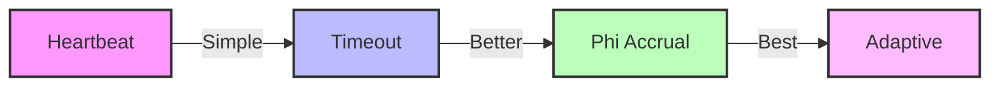
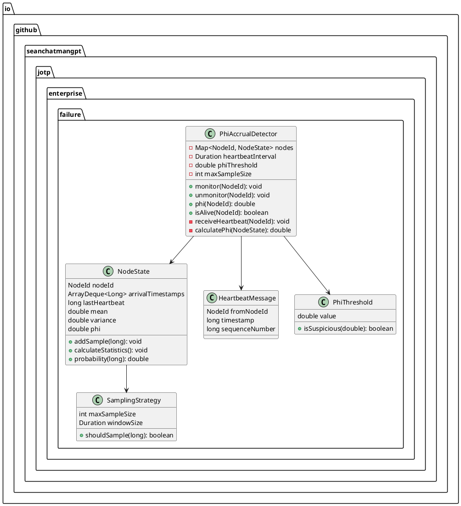
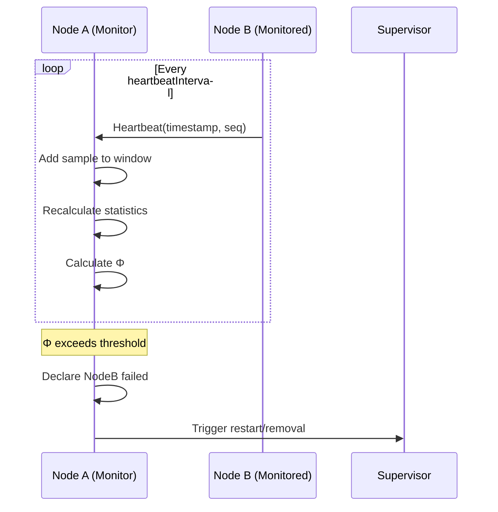

# Failure Detection - JOTP Enterprise Pattern

## Architecture Overview

The Φ Accrual Failure Detector provides a probabilistic approach to detecting process crashes in distributed systems. Unlike traditional heartbeat-based detectors, it accrues suspicion over time and provides a confidence level (Φ) that a process has failed.

### Core Principles

1. **Probabilistic Detection**: Output confidence level instead of binary up/down
2. **Adaptive Thresholds**: Adjust to network conditions automatically
3. **Accrual Mechanism**: Accumulate evidence over time
4. **No False Positives**: High confidence required before declaring failure

### Failure Detector Spectrum



| Method | Complexity | Accuracy | Adaptability |
|--------|------------|----------|--------------|
| **Fixed Heartbeat** | Low | Low | None |
| **Timeout** | Low | Medium | Low |
| **Φ Accrual** | Medium | High | High |
| **Adaptive** | High | Very High | Very High |

## Φ Accrual Failure Detector

### Mathematical Foundation

**Φ = -log10(P(last_heartbeat < now))**

Where:
- **P**: Probability from normal distribution
- **last_heartbeat**: Time of most recent heartbeat
- **now**: Current time

**Interpretation**:
- Φ = 1: 10% chance process is alive (90% failed)
- Φ = 2: 1% chance process is alive (99% failed)
- Φ = 3: 0.1% chance process is alive (99.9% failed)

### Architecture Diagram



### Heartbeat Sampling

```java
class NodeState {
    private final ArrayDeque<Long> arrivalTimestamps;
    private final int maxSampleSize;
    private double mean;
    private double variance;

    public void addSample(long timestamp) {
        // Calculate inter-arrival time
        long interArrival = timestamp - lastHeartbeat;
        lastHeartbeat = timestamp;

        // Add to sample window
        arrivalTimestamps.addLast(interArrival);
        if (arrivalTimestamps.size() > maxSampleSize) {
            arrivalTimestamps.removeFirst();
        }

        // Recalculate statistics
        calculateStatistics();
    }

    private void calculateStatistics() {
        // Calculate mean
        double sum = 0;
        for (Long sample : arrivalTimestamps) {
            sum += sample;
        }
        mean = sum / arrivalTimestamps.size();

        // Calculate variance
        double sumSquares = 0;
        for (Long sample : arrivalTimestamps) {
            double diff = sample - mean;
            sumSquares += diff * diff;
        }
        variance = sumSquares / arrivalTimestamps.size();
    }
}
```

### Φ Calculation

```java
class PhiAccrualDetector {
    private double calculatePhi(NodeState state) {
        long now = System.currentTimeMillis();
        long timeSinceLastHeartbeat = now - state.lastHeartbeat();

        // Calculate probability using normal distribution
        double probability = state.probability(timeSinceLastHeartbeat);

        // Convert to phi (avoid log(0))
        if (probability == 0) {
            return Double.MAX_VALUE;
        }

        return -Math.log10(probability);
    }
}

class NodeState {
    public double probability(long timeSinceLastHeartbeat) {
        // Normal distribution: P(X < x) = 0.5 * (1 + erf((x - μ) / (σ * sqrt(2))))
        double stdDev = Math.sqrt(variance);

        if (stdDev == 0) {
            // No variance, use simple threshold
            return timeSinceLastHeartbeat > mean ? 0 : 1;
        }

        double z = (timeSinceLastHeartbeat - mean) / (stdDev * Math.sqrt(2));
        return 0.5 * (1 + erf(z));
    }

    // Error function approximation
    private double erf(double z) {
        double t = 1.0 / (1.0 + 0.5 * Math.abs(z));
        double ans = 1 - t * Math.exp(-z * z - 1.26551223 +
                                        t * (1.00002368 +
                                        t * (0.37409196 +
                                        t * (0.09678418 +
                                        t * (-0.18628806 +
                                        t * (0.27886807 +
                                        t * (-1.13520398 +
                                        t * (1.48851587 +
                                        t * (-0.82215223 +
                                        t * 0.17087277)))))))));
        return z >= 0 ? ans : -ans;
    }
}
```

## Heartbeat Mechanism

### Heartbeat Exchange Protocol



### Adaptive Heartbeat Interval

```java
class PhiAccrualDetector {
    private Duration heartbeatInterval = Duration.ofSeconds(1);

    public void adjustHeartbeatInterval(NodeId nodeId) {
        NodeState state = nodes.get(nodeId);

        // Adjust based on network conditions
        double meanInterArrival = state.mean();
        double variance = state.variance();

        // Target: 3σ above mean
        double targetInterval = meanInterArrival + (3 * Math.sqrt(variance));

        // Convert to Duration with safety margin
        Duration newInterval = Duration.ofMillis((long) (targetInterval * 0.8));

        // Update if significant change
        if (Math.abs(newInterval.toMillis() - heartbeatInterval.toMillis()) > 100) {
            heartbeatInterval = newInterval;
        }
    }
}
```

## Suspicion Threshold

### Threshold Selection Guidelines

| Φ Value | Confidence | Use Case |
|---------|-----------|----------|
| **1.0** | 90% | Testing, development |
| **3.0** | 99.9% | Production (default) |
| **5.0** | 99.999% | Critical systems |
| **8.0** | 99.999999% | Safety-critical |

### Adaptive Threshold

```java
class AdaptivePhiThreshold {
    private double baseThreshold = 3.0;
    private double minThreshold = 1.0;
    private double maxThreshold = 8.0;
    private int recentFalsePositives = 0;
    private int recentFalseNegatives = 0;

    public double calculateThreshold() {
        // Adjust based on recent accuracy
        double adjustment = 0;

        if (recentFalsePositives > recentFalseNegatives) {
            // Too aggressive, increase threshold
            adjustment = 0.5 * recentFalsePositives;
        } else if (recentFalseNegatives > recentFalsePositives) {
            // Too conservative, decrease threshold
            adjustment = -0.5 * recentFalseNegatives;
        }

        double newThreshold = baseThreshold + adjustment;
        return Math.max(minThreshold, Math.min(maxThreshold, newThreshold));
    }

    public void recordResult(boolean wasFalsePositive) {
        if (wasFalsePositive) {
            recentFalsePositives++;
        } else {
            recentFalseNegatives++;
        }

        // Decay old samples
        if (Math.random() < 0.1) {
            recentFalsePositives = Math.max(0, recentFalsePositives - 1);
            recentFalseNegatives = Math.max(0, recentFalseNegatives - 1);
        }
    }
}
```

## Network Partition Handling

### Partition Detection

```java
class PhiAccrualDetector {
    private final Map<NodeId, Long> lastPartitionTime = new HashMap<>();

    public void handleNetworkPartition(List<NodeId> partitionedNodes) {
        long now = System.currentTimeMillis();

        for (NodeId node : partitionedNodes) {
            // Mark partition time
            lastPartitionTime.put(node, now);

            // Increase suspicion threshold temporarily
            NodeState state = nodes.get(node);
            state.setTemporaryThreshold(8.0); // Very conservative

            // Notify listeners
            notifyPartitionEvent(node);
        }
    }

    public void handlePartitionRecovery(NodeId node) {
        // Clear partition flag
        lastPartitionTime.remove(node);

        // Reset to normal threshold
        NodeState state = nodes.get(node);
        state.resetThreshold();

        // Notify listeners
        notifyRecoveryEvent(node);
    }
}
```

### Partition Recovery Strategy

```java
class PartitionRecovery {
    public enum Strategy {
        OPTIMISTIC, // Assume nodes recovered, resume monitoring
        PESSIMISTIC, // Require verification before resuming
        CAUTIOUS // Gradual threshold reduction
    }

    public void handleRecoveredNode(NodeId node, Strategy strategy) {
        switch (strategy) {
            case OPTIMISTIC:
                detector.resumeMonitoring(node);
                break;

            case PESSIMISTIC:
                // Require ping-pong verification
                if (pingNode(node)) {
                    detector.resumeMonitoring(node);
                }
                break;

            case CAUTIOUS:
                // Start with high threshold, gradually reduce
                detector.setThreshold(node, 8.0);
                scheduler.schedule(() -> detector.setThreshold(node, 5.0), 1, TimeUnit.MINUTES);
                scheduler.schedule(() -> detector.setThreshold(node, 3.0), 5, TimeUnit.MINUTES);
                break;
        }
    }
}
```

## Sequence Diagram: Failure Detection Flow

```plantuml
@startuml
actor MonitoringProcess
participant Detector
participant NodeState
partition Heartbeat Loop {
    loop Every heartbeatInterval
        MonitoredProcess->>Detector: Heartbeat
        Detector->>NodeState: Add sample
        NodeState->>NodeState: Update statistics
        Detector->>NodeState: Calculate Φ
        alt Φ < threshold
            Detector->>MonitoringProcess: Node is alive
        else Φ >= threshold
            Detector->>MonitoringProcess: Node suspected failed
            MonitoringProcess->>Supervisor: Trigger action
        end
    end
}
@enduml
```

## CAP Theorem Trade-offs

| Aspect | Choice | Justification |
|--------|--------|---------------|
| **Consistency** | Eventual | Φ threshold provides confidence, not certainty |
| **Availability** | High | Continue operating even with suspected failures |
| **Partition Tolerance** | High | Detect and handle partitions explicitly |

**Trade-off**: Prioritizes **Partition Tolerance** and **Availability** with tunable consistency via Φ threshold.

## Performance Characteristics

### Memory Footprint

| Component | Per Node | Growth Rate |
|-----------|----------|-------------|
| **NodeState** | ~500 bytes | O(N) |
| **Sample Window** | ~8 bytes × sampleSize | O(N × S) |
| **Total** | ~1-2 KB per monitored node | Linear |

**Example**: 100 nodes × 2 KB = 200 KB

### Network Overhead

| Metric | Value | Notes |
|--------|-------|-------|
| **Heartbeat size** | ~32 bytes | NodeId + timestamp + seq |
| **Heartbeat frequency** | 1/sec (default) | Adaptive based on network |
| **Bandwidth per node** | ~32 B/s | One heartbeat/sec |

**Total for 100-node cluster**: ~3.2 KB/s total

### CPU Usage

| Operation | Cost | Frequency |
|-----------|------|-----------|
| **Heartbeat receive** | ~0.1ms | Per heartbeat |
| **Statistics update** | ~0.5ms | Per heartbeat |
| **Φ calculation** | ~0.2ms | Per query |

**Total CPU**: < 1% for 100-node cluster

## Known Limitations

### 1. False Positives
**Limitation**: May declare healthy nodes failed during network congestion

**Mitigation**:
- Use higher Φ threshold for critical systems
- Implement adaptive threshold adjustment
- Add secondary verification (ping-pong)

### 2. False Negatives
**Limitation**: May not detect crashed processes immediately

**Mitigation**:
- Use lower Φ threshold (faster detection)
- Combine with application-level heartbeats
- Implement application-specific health checks

### 3. Sample Window Size
**Limitation**: Small windows = noisy statistics, large windows = slow adaptation

**Mitigation**:
- Use adaptive window size (start small, grow over time)
- Implement minimum sample threshold (e.g., 100 samples)
- Use weighted samples (recent = higher weight)

### 4. Network Asymmetry
**Limitation**: Assumes symmetric network conditions

**Mitigation**:
- Monitor bidirectional heartbeats
- Use separate detectors for each direction
- Implement network condition monitoring

### 5. Clock Skew
**Limitation**: Relies on synchronized clocks

**Mitigation**:
- Use NTP for clock synchronization
- Use logical timestamps (Lamport clocks)
- Implement clock skew detection and correction

## Configuration Guidelines

### Recommended Φ Thresholds

| Scenario | Φ Threshold | Detection Time | False Positive Rate |
|----------|-------------|----------------|---------------------|
| **Development** | 1.0 | Fast (1-2s) | High (10%) |
| **Production (default)** | 3.0 | Medium (3-10s) | Low (0.1%) |
| **Critical** | 5.0 | Slow (10-30s) | Very Low (0.001%) |
| **Safety-Critical** | 8.0 | Very Slow (30-60s) | Extremely Low (0.000001%) |

### Heartbeat Interval Guidelines

| Network Condition | Interval | Sample Size |
|-------------------|----------|-------------|
| **LAN (low latency)** | 500ms | 1000 |
| **WAN (medium latency)** | 1s | 500 |
| **Internet (high latency)** | 2s | 250 |

### Adaptive Tuning

```java
// Start conservative
PhiAccrualDetector detector = PhiAccrualDetector.builder()
    .phiThreshold(5.0)
    .heartbeatInterval(Duration.ofSeconds(2))
    .sampleSize(1000)
    .build();

// After warm-up period (e.g., 10 minutes)
scheduler.schedule(() -> {
    detector.setPhiThreshold(3.0);
    detector.setHeartbeatInterval(Duration.ofSeconds(1));
}, 10, TimeUnit.MINUTES);
```

## Monitoring & Observability

### Key Metrics

1. **Φ distribution**: P50, P95, P99 Φ values across all nodes
2. **Detection time**: Time from actual failure to Φ exceeding threshold
3. **False positive rate**: Percentage of nodes marked failed but still alive
4. **False negative rate**: Percentage of failed nodes not detected
5. **Heartbeat latency**: Inter-arrival time statistics

### Alerting Thresholds

- **Warning**: Φ > threshold for > 10% of nodes
- **Critical**: Φ > threshold for > 50% of nodes
- **Alert**: Sudden Φ spike (network partition suspected)
- **Warning**: Detection time > 2× expected

## Integration Examples

### With Supervisor

```java
PhiAccrualDetector detector = PhiAccrualDetector.builder()
    .phiThreshold(3.0)
    .listener(nodeId -> {
        // Node failed, trigger supervisor action
        supervisor.terminateChild(nodeId.toString());
    })
    .build();
```

### With Distributed Registry

```java
PhiAccrualDetector detector = PhiAccrualDetector.builder()
    .phiThreshold(5.0) // More conservative for registry
    .listener(nodeId -> {
        // Remove failed node from registry
        registry.removeNode(nodeId);
    })
    .build();
```

### With Circuit Breaker

```java
PhiAccrualDetector detector = PhiAccrualDetector.builder()
    .phiThreshold(3.0)
    .listener(nodeId -> {
        // Open circuit for failed node
        CircuitBreakerPattern breaker = breakers.get(nodeId);
        if (breaker != null) {
            breaker.open();
        }
    })
    .build();
```

## Testing Strategy

### Unit Tests

1. **Φ calculation**: Verify correct probability to Φ conversion
2. **Statistics update**: Verify mean/variance calculation
3. **Threshold comparison**: Verify failure detection logic

### Integration Tests

1. **Network simulation**: Simulate latency and packet loss
2. **Crash simulation**: Verify detection time
3. **Recovery simulation**: Verify recovery after network repair

### Chaos Testing

1. **Random failures**: Verify detection under chaos
2. **Network partitions**: Verify partition detection
3. **Clock skew**: Verify robustness to clock drift

## References

- [The Phi Accrual Failure Detector - Hayashibara et al.](https://www.jaist.ac.jp/~defago/documents/pdf/ICDCS2004-488.pdf)
- [Erlang's Implementation in OTP](http://www.erlang.org/doc/man/kernel_app.html)
- [Cassandra Phi Accrual Implementation](https://cassandra.apache.org/doc/latest/operating/repair.html)
- [JOTP Supervisor Documentation](/Users/sac/jotp/docs/explanations/architecture.md)

## Changelog

### v1.0.0 (2026-03-15)
- Initial Φ Accrual Failure Detector design
- Probabilistic failure detection with confidence levels
- Adaptive heartbeat intervals
- Network partition handling
- Configurable suspicion thresholds
