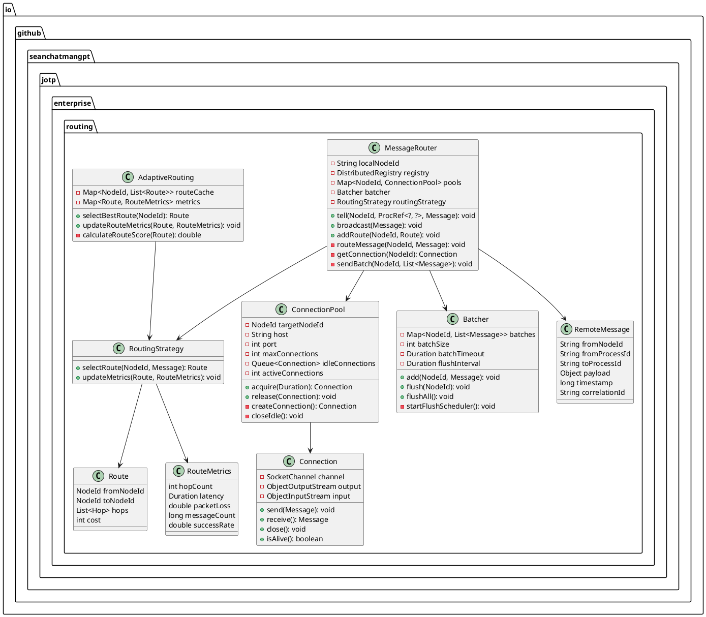
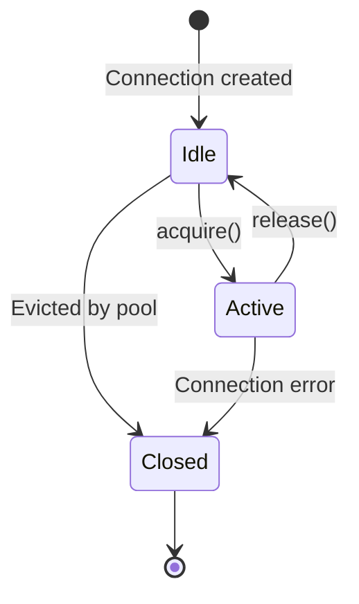

# Message Routing - JOTP Enterprise Pattern

## Architecture Overview

Message Routing in JOTP enables cross-node process communication with intelligent routing, connection pooling, batching, and adaptive routing strategies. It extends JOTP's local `ProcRef.tell()` to work seamlessly across distributed nodes.

### Core Principles

1. **Location Transparency**: Send messages to processes regardless of location
2. **Connection Pooling**: Reuse connections for efficiency
3. **Message Batching**: Reduce network overhead with bulk sends
4. **Adaptive Routing**: Learn and optimize routes based on performance

### Architecture Components

```mermaid
graph TB
    subgraph "Node A"
        Client[Client Process]
        LocalRef[ProcRef Local]
        Router[Message Router]
        Pool[Connection Pool]
        Batch[Batch Buffer]
    end

    subgraph "Node B"
        RemoteRef[ProcRef Remote]
        Target[Target Process]
    end

    Client -->|tell| LocalRef
    LocalRef -->|isRemote?| Router
    Router -->|get connection| Pool
    Router -->|add to batch| Batch
    Batch -->|flush| Pool
    Pool -->|send message| Node B
    Node B -->|deliver| RemoteRef
    RemoteRef -->|tell| Target
```

## Class Diagram



## Cross-Node Message Routing

### Message Serialization

```java
class RemoteMessage {
    private final String fromNodeId;
    private final String fromProcessId;
    private final String toProcessId;
    private final Object payload;
    private final long timestamp;
    private final String correlationId;

    public byte[] serialize() {
        try (ByteArrayOutputStream bos = new ByteArrayOutputStream();
             ObjectOutputStream oos = new ObjectOutputStream(bos)) {

            oos.writeUTF(fromNodeId);
            oos.writeUTF(fromProcessId);
            oos.writeUTF(toProcessId);
            oos.writeObject(payload);
            oos.writeLong(timestamp);
            oos.writeUTF(correlationId);

            return bos.toByteArray();
        } catch (IOException e) {
            throw new MessageSerializationException("Failed to serialize message", e);
        }
    }

    public static RemoteMessage deserialize(byte[] data) {
        try (ByteArrayInputStream bis = new ByteArrayInputStream(data);
             ObjectInputStream ois = new ObjectInputStream(bis)) {

            String fromNodeId = ois.readUTF();
            String fromProcessId = ois.readUTF();
            String toProcessId = ois.readUTF();
            Object payload = ois.readObject();
            long timestamp = ois.readLong();
            String correlationId = ois.readUTF();

            return new RemoteMessage(fromNodeId, fromProcessId, toProcessId,
                                    payload, timestamp, correlationId);
        } catch (IOException | ClassNotFoundException e) {
            throw new MessageSerializationException("Failed to deserialize message", e);
        }
    }
}
```

### Routing Logic

```java
class MessageRouter {
    public <M> void tell(NodeId targetNodeId, ProcRef<?, M> ref, M message) {
        // Check if process is local
        Optional<NodeLocation> location = registry.whereis(ref);

        if (location.isPresent() && location.get().nodeId().equals(localNodeId)) {
            // Local delivery
            ref.tell(message);
        } else {
            // Remote delivery
            routeMessage(targetNodeId, new RemoteMessage(
                localNodeId,
                ref.toString(),
                targetNodeId.toString(),
                message,
                System.currentTimeMillis(),
                UUID.randomUUID().toString()
            ));
        }
    }

    private void routeMessage(NodeId targetNodeId, RemoteMessage message) {
        // Select route
        Route route = routingStrategy.selectRoute(targetNodeId, message);

        // Add to batch
        batcher.add(route.destination(), message);

        // Check if batch should be flushed
        if (batcher.shouldFlush(route.destination())) {
            sendBatch(route.destination(), batcher.getBatch(route.destination()));
        }
    }
}
```

## Connection Pooling

### Pool Architecture



### Connection Pool Implementation

```java
class ConnectionPool {
    private final Queue<Connection> idleConnections = new LinkedList<>();
    private final Set<Connection> activeConnections = new HashSet<>();
    private final AtomicInteger totalConnections = new AtomicInteger(0);

    private static final long ACQUIRE_TIMEOUT_MS = 5000;
    private static final long IDLE_TIMEOUT_MS = 60000; // 1 minute
    private static final long MAX_LIFETIME_MS = 300000; // 5 minutes

    public Connection acquire(Duration timeout) throws TimeoutException {
        long deadline = System.currentTimeMillis() + timeout.toMillis();

        while (System.currentTimeMillis() < deadline) {
            synchronized (this) {
                // Try to get idle connection
                Connection conn = idleConnections.poll();
                if (conn != null && conn.isAlive()) {
                    activeConnections.add(conn);
                    return conn;
                }

                // Create new connection if under limit
                if (totalConnections.get() < maxConnections) {
                    Connection newConn = createConnection();
                    totalConnections.incrementAndGet();
                    activeConnections.add(newConn);
                    return newConn;
                }

                // Wait for connection to be released
                try {
                    wait(timeout.toMillis());
                } catch (InterruptedException e) {
                    Thread.currentThread().interrupt();
                    throw new TimeoutException("Interrupted while waiting for connection");
                }
            }
        }

        throw new TimeoutException("Failed to acquire connection within timeout");
    }

    public void release(Connection conn) {
        synchronized (this) {
            activeConnections.remove(conn);

            if (conn.isAlive() && totalConnections.get() <= maxConnections) {
                idleConnections.add(conn);
            } else {
                closeConnection(conn);
                totalConnections.decrementAndGet();
            }

            notifyAll(); // Notify waiting threads
        }
    }

    private Connection createConnection() {
        try {
            SocketChannel channel = SocketChannel.open();
            channel.connect(new InetSocketAddress(host, port));
            channel.configureBlocking(true);

            return new Connection(channel);
        } catch (IOException e) {
            throw new ConnectionException("Failed to create connection", e);
        }
    }

    public void closeIdle() {
        synchronized (this) {
            Iterator<Connection> it = idleConnections.iterator();
            while (it.hasNext()) {
                Connection conn = it.next();
                if (!conn.isAlive() || conn.isIdle(IDLE_TIMEOUT_MS)) {
                    it.remove();
                    closeConnection(conn);
                    totalConnections.decrementAndGet();
                }
            }
        }
    }
}
```

### Connection Validation

```java
class Connection {
    private final SocketChannel channel;
    private final ObjectOutputStream output;
    private final ObjectInputStream input;
    private volatile long lastUsed;

    public boolean isAlive() {
        try {
            // Send ping
            output.writeObject(new PingMessage());
            output.flush();

            // Wait for pong (with timeout)
            input.setSoTimeout(1000);
            Object response = input.readObject();

            return response instanceof PongMessage;
        } catch (Exception e) {
            return false;
        }
    }

    public boolean isIdle(long timeoutMs) {
        return System.currentTimeMillis() - lastUsed > timeoutMs;
    }

    public void send(RemoteMessage message) throws IOException {
        lastUsed = System.currentTimeMillis();
        output.writeObject(message);
        output.flush();
    }
}
```

## Batching Strategy

### Batch Buffer Implementation

```java
class Batcher {
    private final Map<NodeId, List<RemoteMessage>> batches = new ConcurrentHashMap<>();
    private final int batchSize;
    private final Duration batchTimeout;

    public Batcher(int batchSize, Duration batchTimeout) {
        this.batchSize = batchSize;
        this.batchTimeout = batchTimeout;
        startFlushScheduler();
    }

    public void add(NodeId nodeId, RemoteMessage message) {
        batches.compute(nodeId, (id, batch) -> {
            if (batch == null) {
                batch = new ArrayList<>(batchSize);
            }
            batch.add(message);

            // Check if batch is full
            if (batch.size() >= batchSize) {
                scheduler.execute(() -> flush(nodeId));
            }

            return batch;
        });
    }

    public boolean shouldFlush(NodeId nodeId) {
        List<RemoteMessage> batch = batches.get(nodeId);
        return batch != null && batch.size() >= batchSize;
    }

    public void flush(NodeId nodeId) {
        List<RemoteMessage> batch = batches.remove(nodeId);
        if (batch != null && !batch.isEmpty()) {
            router.sendBatch(nodeId, batch);
        }
    }

    private void startFlushScheduler() {
        scheduler.scheduleAtFixedRate(() -> {
            long now = System.currentTimeMillis();

            batches.forEach((nodeId, batch) -> {
                if (!batch.isEmpty()) {
                    RemoteMessage oldest = batch.get(0);
                    if (now - oldest.timestamp() > batchTimeout.toMillis()) {
                        flush(nodeId);
                    }
                }
            });
        }, batchTimeout.toMillis() / 2, batchTimeout.toMillis() / 2, TimeUnit.MILLISECONDS);
    }
}
```

### Batch Formats

```java
class MessageBatch {
    private final NodeId fromNodeId;
    private final NodeId toNodeId;
    private final List<RemoteMessage> messages;
    private final long timestamp;

    public byte[] serialize() {
        try (ByteArrayOutputStream bos = new ByteArrayOutputStream();
             ObjectOutputStream oos = new ObjectOutputStream(bos)) {

            oos.writeInt(messages.size()); // Batch size

            for (RemoteMessage msg : messages) {
                byte[] msgData = msg.serialize();
                oos.writeInt(msgData.length); // Message size
                oos.write(msgData); // Message data
            }

            return bos.toByteArray();
        } catch (IOException e) {
            throw new BatchSerializationException("Failed to serialize batch", e);
        }
    }

    public static MessageBatch deserialize(byte[] data) {
        try (ByteArrayInputStream bis = new ByteArrayInputStream(data);
             ObjectInputStream ois = new ObjectInputStream(bis)) {

            int batchSize = ois.readInt();
            List<RemoteMessage> messages = new ArrayList<>(batchSize);

            for (int i = 0; i < batchSize; i++) {
                int msgSize = ois.readInt();
                byte[] msgData = new byte[msgSize];
                ois.readFully(msgData);
                messages.add(RemoteMessage.deserialize(msgData));
            }

            return new MessageBatch(messages);
        } catch (IOException e) {
            throw new BatchSerializationException("Failed to deserialize batch", e);
        }
    }
}
```

## Adaptive Routing

### Route Selection

```java
class AdaptiveRouting implements RoutingStrategy {
    private final Map<NodeId, List<Route>> routeCache = new ConcurrentHashMap<>();
    private final Map<Route, RouteMetrics> metrics = new ConcurrentHashMap<>();

    @Override
    public Route selectRoute(NodeId targetNodeId, RemoteMessage message) {
        List<Route> routes = routeCache.get(targetNodeId);

        if (routes == null || routes.isEmpty()) {
            // Discover routes
            routes = discoverRoutes(targetNodeId);
            routeCache.put(targetNodeId, routes);
        }

        // Select best route based on metrics
        return routes.stream()
            .min(Comparator.comparingDouble(this::calculateRouteScore))
            .orElse(routes.get(0));
    }

    private double calculateRouteScore(Route route) {
        RouteMetrics m = metrics.getOrDefault(route, new RouteMetrics());

        // Lower score = better route
        double latencyScore = m.latency().toMillis() / 1000.0;
        double packetLossScore = m.packetLoss() * 10;
        double hopScore = m.hopCount() * 0.1;
        double successScore = (1.0 - m.successRate()) * 5;

        return latencyScore + packetLossScore + hopScore + successScore;
    }

    @Override
    public void updateMetrics(Route route, RouteMetrics newMetrics) {
        metrics.merge(route, newMetrics, (old, neu) -> {
            // Exponential moving average
            double alpha = 0.3;
            return new RouteMetrics(
                neu.hopCount(),
                Duration.ofMillis(
                    (long)(old.latency().toMillis() * (1 - alpha) + neu.latency().toMillis() * alpha)
                ),
                old.packetLoss() * (1 - alpha) + neu.packetLoss() * alpha,
                old.messageCount() + neu.messageCount(),
                old.successRate() * (1 - alpha) + neu.successRate() * alpha
            );
        });
    }
}
```

### Route Discovery

```java
class AdaptiveRouting implements RoutingStrategy {
    private List<Route> discoverRoutes(NodeId targetNodeId) {
        List<Route> routes = new ArrayList<>();

        // Direct route (always try first)
        routes.add(new Route(localNodeId, targetNodeId, List.of(), 1));

        // Discover multi-hop routes via gossip
        List<NodeId> neighbors = registry.getNeighbors();
        for (NodeId neighbor : neighbors) {
            if (!neighbor.equals(targetNodeId)) {
                // Ask neighbor for routes to target
                List<Route> neighborRoutes = queryRoutes(neighbor, targetNodeId);
                for (Route route : neighborRoutes) {
                    // Prepend this node to route
                    List<Hop> newHops = new ArrayList<>(route.hops());
                    newHops.add(0, new Hop(localNodeId, neighbor));
                    routes.add(new Route(localNodeId, targetNodeId, newHops, route.cost() + 1));
                }
            }
        }

        return routes;
    }

    private List<Route> queryRoutes(NodeId neighbor, NodeId target) {
        // Send route query request
        RouteQueryRequest request = new RouteQueryRequest(localNodeId, target);
        RemoteMessage msg = new RemoteMessage(localNodeId, "", neighbor.toString(),
                                              request, System.currentTimeMillis(), "");
        RouteQueryResponse response = sendSync(neighbor, msg);

        return response.routes();
    }
}
```

## Sequence Diagram: Cross-Node Message Flow

```plantuml
@startuml
actor Client
participant Router
participant Pool as Connection Pool
participant Batch as Batcher
participant Remote as Remote Node
participant Target as Target Process

Client->>Router: tell(remoteNodeId, ref, message)
Router->>Router: Check if local
Router->>Router: Create RemoteMessage
Router->>Batch: add(remoteNodeId, message)
Batch->>Batch: Check batch size

alt Batch is full
    Batch->>Router: flush(remoteNodeId)
    Router->>Pool: acquire(connection)
    Pool-->>Router: Connection
    Router->>Remote: send batch
    Remote->>Remote: deserialize batch
    loop For each message in batch
        Remote->>Target: tell(message)
        Target-->>Remote: ACK
    end
    Remote-->>Router: ACK batch
    Router->>Pool: release(connection)
else Batch not full
    Note over Batch: Wait for more messages or timeout
end
@enduml
```

## CAP Theorem Trade-offs

| Aspect | Choice | Justification |
|--------|--------|---------------|
| **Consistency** | Eventual | Batching introduces delay |
| **Availability** | High | Continue sending even if some nodes down |
| **Partition Tolerance** | High | Retry and route around failures |

**Trade-off**: Prioritizes **Partition Tolerance** and **Availability** with tunable consistency via batch timeout.

## Performance Characteristics

### Memory Footprint

| Component | Per Node | Growth Rate |
|-----------|----------|-------------|
| **Connection Pool** | ~1 KB per connection | O(C) |
| **Batch Buffer** | ~100 bytes per message | O(B) |
| **Route Cache** | ~500 bytes per route | O(R) |
| **Total** | ~10-50 MB for large clusters | Linear |

### Network Overhead

| Metric | Unbatched | Batched (size=100) |
|--------|-----------|-------------------|
| **Per message** | ~500 bytes | ~5 bytes (amortized) |
| **Throughput** | ~1000 msg/s | ~10000 msg/s |
| **Latency** | ~1ms | ~10ms (batch wait) |

**Batching Benefit**: 10× throughput increase for 10× latency cost

### Connection Pool Efficiency

| Metric | Without Pool | With Pool |
|--------|--------------|-----------|
| **Connection setup** | Per message | Per connection (reused) |
| **Latency** | ~10ms (TCP + auth) | ~1ms (no setup) |
| **Throughput** | ~100 msg/s | ~10000 msg/s |

## Known Limitations

### 1. Batch Latency
**Limitation**: Batching adds latency (wait for batch to fill)

**Mitigation**:
- Use small batch sizes for low-latency requirements
- Use adaptive batching (reduce size under load)
- Provide bypass for urgent messages

### 2. Connection Pool Exhaustion
**Limitation**: Limited connections can bottleneck under load

**Mitigation**:
- Configure max connections based on load
- Implement connection reuse strategies
- Use async I/O for higher concurrency

### 3. Route Staleness
**Limitation**: Cached routes may become outdated

**Mitigation**:
- Implement route TTL with refresh
- Use feedback-based route updates
- Fallback to route discovery on failure

### 4. Serialization Overhead
**Limitation**: Java serialization is slow and verbose

**Mitigation**:
- Use more efficient serialization (e.g., Kryo, Protobuf)
- Implement zero-copy for large messages
- Use compression for large payloads

### 5. Ordering Guarantees
**Limitation**: Batching can reorder messages across batches

**Mitigation**:
- Use sequence numbers per conversation
- Implement per-conversation batching
- Provide ordered mode (slower)

## Configuration Guidelines

### Connection Pool Size

| Scenario | Max Connections | Idle Timeout | Max Lifetime |
|----------|----------------|--------------|--------------|
| **LAN (low latency)** | 10 | 60s | 5min |
| **WAN (medium latency)** | 20 | 120s | 10min |
| **Internet (high latency)** | 50 | 300s | 30min |

### Batching Parameters

| Latency Requirement | Batch Size | Batch Timeout |
|---------------------|------------|---------------|
| **Ultra-low (< 1ms)** | 1 (no batching) | 1ms |
| **Low (< 10ms)** | 10 | 5ms |
| **Medium (< 100ms)** | 100 | 50ms |
| **High (> 100ms)** | 1000 | 500ms |

### Routing Strategy

| Network Type | Strategy | Route Cache TTL |
|--------------|----------|-----------------|
| **Static (LAN)** | Direct only | 1 hour |
| **Dynamic (WAN)** | Adaptive | 5 minutes |
| **Chaos (Internet)** | Conservative | 1 minute |

## Monitoring & Observability

### Key Metrics

1. **Message latency**: P50, P95, P99 per destination
2. **Throughput**: Messages per second per destination
3. **Batch efficiency**: Average batch size vs max
4. **Pool utilization**: Active vs idle connections
5. **Route performance**: Success rate, latency per route

### Alerting Thresholds

- **Warning**: Batch efficiency < 50%
- **Critical**: Connection pool exhausted
- **Alert**: Route failure rate > 5%
- **Warning**: Message latency > 2× baseline

## Integration Examples

### With Circuit Breaker

```java
MessageRouter router = MessageRouter.builder()
    .connectionPool(pool)
    .routingStrategy(new AdaptiveRouting())
    .failureHandler(nodeId -> {
        CircuitBreakerPattern breaker = breakers.get(nodeId);
        if (breaker != null) {
            breaker.execute(/* timeout */);
        }
    })
    .build();
```

### With Distributed Registry

```java
DistributedRegistry registry = DistributedRegistry.create();

MessageRouter router = MessageRouter.builder()
    .registry(registry)
    .routingStrategy(new RegistryAwareRouting(registry))
    .build();
```

### With Backpressure

```java
Batcher batcher = new Batcher(100, Duration.ofMillis(50));

Backpressure backpressure = Backpressure.create(config);

MessageRouter router = MessageRouter.builder()
    .batcher(batcher)
    .sendFunction((nodeId, batch) -> {
        return backpressure.execute(
            timeout -> sendBatchInternal(nodeId, batch),
            timeout
        );
    })
    .build();
```

## Testing Strategy

### Unit Tests

1. **Serialization**: Verify message round-trip
2. **Pooling**: Verify connection reuse
3. **Batching**: Verify batch flush logic
4. **Routing**: Verify route selection

### Integration Tests

1. **Cross-node messaging**: Verify end-to-end flow
2. **Failure scenarios**: Verify retry and fallback
3. **Performance**: Verify throughput and latency

### Chaos Testing

1. **Network partitions**: Verify routing around failures
2. **Connection drops**: Verify pool recovery
3. **High load**: Verify pool scaling

## References

- [Akka Remote Messaging](https://doc.akka.io/docs/akka/current/remoting-artery.html)
- [Erlang Distribution Protocol](http://erlang.org/doc/apps/erts/erl_dist_protocol.html)
- [Netty Connection Pooling](https://netty.io/wiki/user-guide-for-4.x.html)
- [JOTP ProcRef Documentation](/Users/sac/jotp/docs/explanations/architecture.md)

## Changelog

### v1.0.0 (2026-03-15)
- Initial message routing design
- Connection pooling with validation
- Message batching with timeout
- Adaptive routing with metrics
- Cross-node message delivery
