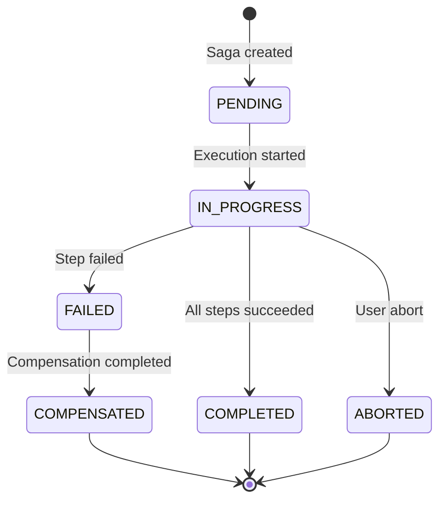

# Saga Orchestration - JOTP Enterprise Pattern

## Architecture Overview

The Saga pattern in JOTP provides distributed transaction management with compensating transactions. It implements the orchestration pattern where a central coordinator manages the execution of forward actions and compensating actions when failures occur.

### Core Principles

1. **Exactly-Once Semantics**: Idempotent step execution prevents duplicate effects
2. **Compensating Transactions**: Every forward action has a corresponding rollback action
3. **Event Sourcing**: Complete audit trail via saga event log
4. **Fault Isolation**: Process-based isolation prevents cascading failures

### State Machine



### State Definitions

| State | Description | Entry Condition |
|-------|-------------|-----------------|
| **PENDING** | Saga initialized, awaiting execution | Constructor |
| **IN_PROGRESS** | Executing forward steps | execute() called |
| **COMPLETED** | All steps succeeded successfully | Last step completes |
| **FAILED** | Step failed, starting compensation | Exception thrown |
| **COMPENSATED** | Compensation completed | All compensations done |
| **ABORTED** | User-requested abort | abort() called |

## Class Diagram

```plantuml
@startuml
package io.github.seanchatmangpt.jotp.enterprise.saga {

  class DistributedSagaCoordinator {
    -SagaConfig config
    -ProcRef<SagaState, SagaMsg> coordinator
    -Map<String, SagaInstance> sagas
    -CopyOnWriteArrayList<SagaListener> listeners
    +static create(SagaConfig): DistributedSagaCoordinator
    +execute(): CompletableFuture<SagaResult>
    +abort(String, String): void
    +getStatus(String): SagaTransaction
    +getSagaLog(String): List<SagaEvent>
    +addListener(SagaListener): void
    +shutdown(): void
  }

  class SagaConfig {
    String sagaId
    List<SagaStep> steps
    Duration timeout
    Duration compensationTimeout
    int maxRetries
    boolean asyncOutput
    boolean metricsEnabled
    +builder(String): Builder
  }

  sealed interface SagaStep {
    Action<Input, Output>
    Compensation<Input>
  }

  class Action<Input, Output> {
    String name
    Function<Input, Output> task
  }

  class Compensation<Input> {
    String name
    Consumer<Input> task
  }

  sealed interface SagaTransaction {
    InProgress
    Completed
    Failed
    Compensated
    Aborted
  }

  sealed interface SagaEvent {
    StepExecuted
    StepFailed
    CompensationStarted
    CompensationCompleted
    SagaCompleted
    SagaAborted
  }

  class SagaResult {
    String sagaId
    Status status
    String errorMessage
    Map<String, Object> outputs
  }

  interface SagaListener {
    +onSagaStarted(String, int): void
    +onStepExecuted(String, String, Object): void
    +onCompensationStarted(String, int): void
    +onCompensationCompleted(String): void
    +onSagaCompleted(String, long): void
    +onSagaAborted(String, String): void
  }

  DistributedSagaCoordinator --> SagaConfig
  DistributedSagaCoordinator --> SagaStep
  DistributedSagaCoordinator --> SagaTransaction
  DistributedSagaCoordinator --> SagaEvent
  DistributedSagaCoordinator --> SagaResult
  DistributedSagaCoordinator --> SagaListener
  SagaStep --> Action
  SagaStep --> Compensation
}

package io.github.seanchatmangpt.jotp {

  class Proc<S, M> {
    -S state
    -BiFunction<S, M, S> handler
  }

  class ProcRef<S, M> {
    -Proc<S, M> proc
    +tell(M): void
  }

  DistributedSagaCoordinator --> ProcRef
}
@enduml
```

## Sequence Diagram: Successful Saga Execution

```plantuml
@startuml
actor Client
participant Coordinator
participant SagaProcess as Proc<SagaState, SagaMsg>
participant Step1 as SagaStep 1
participant Step2 as SagaStep 2
participant StepN as SagaStep N

Client->>Coordinator: execute()
activate Coordinator
Coordinator->>Coordinator: Create sagaId
Coordinator->>SagaProcess: Initialize state
Coordinator->>Coordinator: sagas.put(sagaId, instance)
Coordinator-->>Client: CompletableFuture<SagaResult>

Coordinator->>Step1: Execute action
activate Step1
Step1-->>Coordinator: Output1
Coordinator->>SagaProcess: tell(StepExecuted)
Coordinator->>Coordinator: events.add(StepExecuted)
deactivate Step1

Coordinator->>Step2: Execute action
activate Step2
Step2-->>Coordinator: Output2
Coordinator->>SagaProcess: tell(StepExecuted)
Coordinator->>Coordinator: events.add(StepExecuted)
deactivate Step2

...
Coordinator->>StepN: Execute action
activate StepN
StepN-->>Coordinator: OutputN
Coordinator->>SagaProcess: tell(StepExecuted)
Coordinator->>Coordinator: events.add(StepExecuted)
deactivate StepN

Coordinator->>Coordinator: transaction.set(Completed)
Coordinator->>Coordinator: events.add(SagaCompleted)
Coordinator-->>Client: complete(SagaResult)
deactivate Coordinator
@enduml
```

## Sequence Diagram: Saga Failure & Compensation

```plantuml
@startuml
actor Client
participant Coordinator
participant SagaProcess as Proc<SagaState, SagaMsg>
participant Step1 as SagaStep 1
participant Step2 as SagaStep 2
participant Step3 as SagaStep 3

Note over Coordinator,Step3: Steps 1-2 succeeded

Coordinator->>Step3: Execute action
activate Step3
Step3-->>Coordinator: throw Exception
deactivate Step3

Coordinator->>Coordinator: transaction.set(Failed)
Coordinator->>Coordinator: events.add(CompensationStarted)
Coordinator->>Step2: Execute compensation
activate Step2
Step2-->>Coordinator: Compensation complete
deactivate Step2

Coordinator->>Step1: Execute compensation
activate Step1
Step1-->>Coordinator: Compensation complete
deactivate Step1

Coordinator->>Coordinator: transaction.set(Compensated)
Coordinator->>Coordinator: events.add(CompensationCompleted)
Coordinator-->>Client: complete(SagaResult)
@enduml
```

## Design Decisions (ADR Format)

### ADR-001: Orchestration vs Choreography

**Status**: Accepted

**Context**: Need to coordinate multi-step transactions across services

**Decision**: Use orchestration pattern (central coordinator)

**Consequences**:
- **Positive**: Single source of truth for saga state
- **Positive**: Easy to add listeners/observability
- **Positive**: Simpler error handling and retry logic
- **Negative**: Coordinator is single point of failure
- **Negative**: Tight coupling to coordinator
- **Mitigation**: Use ProcRef for stable handle, supervisor for restart

**Alternatives Considered**:
1. **Choreography**: Event-driven, no coordinator
   - Pro: Decoupled, no SPOF
   - Con: Complex state tracking, hard to debug
2. **Two-Phase Commit**: Distributed locking
   - Pro: Strong consistency
   - Con: Blocking, not fault-tolerant

### ADR-002: Synchronous Execution with Async API

**Status**: Accepted

**Context**: Balance simplicity with responsiveness

**Decision**: Execute steps synchronously but return CompletableFuture

**Consequences**:
- **Positive**: Simple sequential execution (easy to reason about)
- **Positive**: Async API for non-blocking callers
- **Positive**: Simple compensation (reverse order)
- **Negative**: No parallel step execution
- **Negative**: Thread bound during execution
- **Mitigation**: Use asyncOutput=true for parallel steps (future work)

### ADR-003: Event Sourcing for Saga Log

**Status**: Accepted

**Context**: Need complete audit trail of saga execution

**Decision**: Append-only event log in memory

**Consequences**:
- **Positive**: Complete history (debugging, auditing)
- **Positive**: Immutable (append-only)
- **Positive**: Easy to persist (serializable)
- **Negative**: Memory growth (unbounded)
- **Mitigation**: Add log rotation/snapshotting (future work)

## Compensation Logic

### Forward Execution

```java
for (int i = 0; i < config.steps().size(); i++) {
    SagaStep step = config.steps().get(i);
    if (step instanceof SagaStep.Action<?, ?> action) {
        try {
            Object output = action.task().apply(null);
            instance.outputs.put(action.name(), output);
            instance.events.add(new SagaEvent.StepExecuted(sagaId, action.name(), output));
        } catch (Exception e) {
            return compensateAndFail(sagaId, instance, i, e);
        }
    }
}
```

### Backward Compensation

```java
private SagaResult compensateAndFail(String sagaId, SagaInstance instance, int failedStep, Exception cause) {
    // Execute compensations in REVERSE order
    for (int i = failedStep - 1; i >= 0; i--) {
        SagaStep step = config.steps().get(i);
        if (step instanceof SagaStep.Compensation<?> comp) {
            try {
                comp.task().accept(null);
            } catch (Exception e) {
                // Log but continue with other compensations
                instance.events.add(new SagaEvent.StepFailed(sagaId, comp.name(), e.getMessage()));
            }
        }
    }
    return new SagaResult(sagaId, SagaResult.Status.COMPENSATED, cause.getMessage(), instance.outputs);
}
```

### Idempotency Requirements

**Critical**: All actions and compensations MUST be idempotent

```java
// Example: Idempotent action
Function<Payment, Void> chargePayment = payment -> {
    if (paymentRepository.existsById(payment.id())) {
        return null; // Already charged
    }
    paymentRepository.save(payment);
    return null;
};
```

## State Persistence Strategy

### In-Memory State

```java
private final Map<String, SagaInstance> sagas = new HashMap<>();

private static class SagaInstance {
    final String sagaId;
    final AtomicReference<SagaTransaction> transaction;
    final List<SagaEvent> events;
    final Map<String, Object> outputs;
    final long startTime;
}
```

### Persistence Options (Future Work)

1. **Event Store**: Persist saga events to database
2. **Snapshotting**: Periodic state snapshots to reduce replay time
3. **Distributed State**: Use ProcRegistry for cross-node persistence

### Recovery Mechanism

```java
// On crash recovery:
SagaInstance instance = sagas.get(sagaId);
SagaTransaction current = instance.transaction.get();

if (current instanceof SagaTransaction.InProgress inProgress) {
    // Resume from last executed step
    int nextStep = inProgress.executedStep();
    resumeSaga(sagaId, nextStep);
} else if (current instanceof SagaTransaction.Failed failed) {
    // Resume compensation
    resumeCompensation(sagaId, failed.failedStep());
}
```

## CAP Theorem Trade-offs

| Aspect | Choice | Justification |
|--------|--------|---------------|
| **Consistency** | Strong | Saga state is local (single coordinator) |
| **Availability** | High | Async API doesn't block callers |
| **Partition Tolerance** | Low | In-memory state (no cross-node coordination) |

**Trade-off**: Prioritizes **Consistency** and **Availability** over Partition Tolerance (CA system).

For distributed sagas, use:
- **Consistent Hashing**: Route saga executions to specific nodes
- **Event Sourcing**: Persist events for cross-node recovery
- **Distributed Locking**: Ensure single coordinator per saga

## Performance Characteristics

### Memory Footprint

- **Per Saga**: ~2-5 KB (state + events + outputs)
- **Event Log**: ~200 bytes per event
- **Listener Overhead**: ~50 bytes per listener

### Latency Impact

| Operation | Latency | Notes |
|-----------|---------|-------|
| **Saga creation** | < 1ms | UUID generation + HashMap put |
| **Step execution** | User-defined | Depends on action implementation |
| **Compensation** | User-defined | Depends on compensation implementation |
| **Event append** | < 0.1ms | ArrayList add (amortized O(1)) |

### Throughput

- **Max concurrent sagas**: Limited by memory (1000 sagas ~ 2-5 MB)
- **Step throughput**: Limited by slowest action
- **Compensation throughput**: Limited by slowest compensation

## Known Limitations

### 1. In-Memory State
**Limitation**: State lost on coordinator crash

**Mitigation**:
- Use Supervisor to restart coordinator
- Persist saga events to event store
- Implement recovery mechanism (see above)

### 2. No Parallel Step Execution
**Limitation**: All steps execute sequentially

**Mitigation**:
- Use asyncOutput=true (future work)
- Manually spawn parallel processes within action
- Use multiple sagas for parallel workflows

### 3. Compensation Best-Effort
**Limitation**: Failed compensations are logged but not retried

**Mitigation**:
- Make compensations idempotent
- Implement manual recovery procedures
- Add retry logic (future work)

### 4. No Distributed Coordination
**Limitation**: Single-node coordinator only

**Mitigation**:
- Use consistent hashing to route sagas to nodes
- Implement distributed saga registry (future work)
- Use external coordination service (e.g., ZooKeeper)

### 5. Step Ordering Fixed
**Limitation**: Cannot dynamically change step order

**Mitigation**:
- Use conditional steps (skip if not needed)
- Implement dynamic saga builder (future work)

## Configuration Guidelines

### Recommended Settings

| Scenario | timeout | compensationTimeout | maxRetries | asyncOutput |
|----------|---------|---------------------|------------|-------------|
| **Fast local operations** | 30s | 10s | 0 | false |
| **Slow remote operations** | 5m | 2m | 3 | false |
| **High-throughput** | 1m | 30s | 1 | true |
| **Critical operations** | 10m | 5m | 5 | false |

### Timeout Calculation

```
forwardTimeout = Σ(stepTimeout) + Σ(networkLatency)
compensationTimeout = Σ(compensationTimeout) + Σ(networkLatency)
totalTimeout = forwardTimeout + compensationTimeout + safetyMargin
```

### Retry Strategy

```java
// For transient failures (network timeouts):
maxRetries = 3

// For permanent failures (validation errors):
maxRetries = 0 (fail fast)

// For idempotent operations:
maxRetries = 5 (aggressive retry)
```

## Monitoring & Observability

### Key Metrics

```java
public interface SagaListener {
    void onSagaStarted(String sagaId, int stepCount);
    void onStepExecuted(String sagaId, String stepName, Object output);
    void onCompensationStarted(String sagaId, int fromStep);
    void onCompensationCompleted(String sagaId);
    void onSagaCompleted(String sagaId, long durationMs);
    void onSagaAborted(String sagaId, String reason);
}
```

### Recommended Metrics

1. **Saga completion rate**: Completed / (Completed + Compensated + Failed)
2. **Compensation rate**: Compensated / (Completed + Compensated + Failed)
3. **Step latency**: P50, P95, P99 per step
4. **Saga duration**: P50, P95, P99 end-to-end
5. **Aborted sagas**: Count and reason analysis

### Alerting Thresholds

- **Warning**: Saga failure rate > 5%
- **Critical**: Saga compensation rate > 1%
- **Alert**: Saga duration > 2× timeout
- **Alert**: Aborted sagas > 10 in 5 minutes

## Integration Examples

### With Circuit Breaker

```java
SagaStep chargePayment = new SagaStep.Action<>(
    "charge-payment",
    input -> circuitBreaker.execute(
        timeout -> paymentGateway.charge(input.amount()),
        timeout
    )
);
```

**Behavior**: Circuit OPEN → Action fails → Saga compensates

### With Backpressure

```java
SagaStep reserveInventory = new SagaStep.Action<>(
    "reserve-inventory",
    input -> backpressure.execute(
        timeout -> inventoryService.reserve(input.sku(), input.quantity()),
        timeout
    )
);
```

**Behavior**: Backpressure timeout → Action fails → Saga compensates

### With Event Bus

```java
saga.addListener(new SagaListener() {
    public void onSagaCompleted(String sagaId, long duration) {
        eventBus.publish(new SagaCompletedEvent(sagaId, duration));
    }

    public void onCompensationCompleted(String sagaId) {
        eventBus.publish(new SagaFailedEvent(sagaId));
    }
});
```

**Behavior**: Saga events published to event bus for monitoring

## Testing Strategy

### Unit Tests

1. **Successful execution**: All steps complete
2. **Failure at step 1**: Only step 1 compensations
3. **Failure at step N**: Steps 1..N-1 compensate
4. **Abort during execution**: Steps 1..current compensate
5. **Compensation failure**: Logged but continues

### Integration Tests

1. **Slow steps**: Timeout handling
2. **Flaky steps**: Retry behavior
3. **Coordinator crash**: State recovery

### Chaos Testing

1. **Random step failures**: Verify compensation coverage
2. **Coordinator kill**: Verify state persistence
3. **Network partition**: Verify timeout and rollback

## Best Practices

### 1. Idempotent Actions

```java
// BAD: Non-idempotent
Function<Payment, Void> charge = payment -> {
    paymentGateway.charge(payment.amount()); // May double-charge
    return null;
};

// GOOD: Idempotent
Function<Payment, Void> charge = payment -> {
    if (paymentRepository.isCharged(payment.id())) {
        return null; // Skip if already charged
    }
    paymentGateway.charge(payment.amount());
    paymentRepository.markCharged(payment.id());
    return null;
};
```

### 2. Compensatable Actions

```java
// Action: Reserve inventory
Function<Reservation, Void> reserve = reservation -> {
    inventoryService.reserve(reservation.sku(), reservation.quantity());
    return null;
};

// Compensation: Release reservation
Consumer<Reservation> compensate = reservation -> {
    inventoryService.release(reservation.sku(), reservation.quantity());
};
```

### 3. Timeout Handling

```java
// Action with timeout
Function<Payment, PaymentResult> charge = payment -> {
    try {
        return paymentGateway.charge(payment)
            .get(30, TimeUnit.SECONDS);
    } catch (TimeoutException e) {
        throw new SagaTimeoutException("Payment timeout");
    }
};
```

### 4. Error Context

```java
// BAD: Generic exception
throw new Exception("Failed");

// GOOD: Contextual exception
throw new PaymentDeclinedException(
    payment.id(),
    "Insufficient funds: " + payment.amount()
);
```

## References

- [Saga Pattern - Microservices.io](https://microservices.io/patterns/data/saga.html)
- [Distributed Transactions - Martin Fowler](https://martinfowler.com/bliki/TwoHardThings.html)
- [Event Sourcing - Martin Fowler](https://martinfowler.com/eaaDev/EventSourcing.html)
- [JOTP Supervisor Documentation](/Users/sac/jotp/docs/explanations/architecture.md)

## Changelog

### v1.0.0 (2026-03-15)
- Initial implementation with orchestration pattern
- Synchronous execution with async API
- Event sourcing for saga log
- Compensation in reverse order
- Listener API for observability
