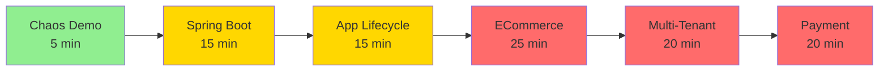

# JOTP Code Examples

import { CardGrid } from '@astro-site/components/CardGrid';

Welcome to the JOTP code examples! These examples demonstrate real-world applications of JOTP's 15 OTP primitives, from simple process creation to distributed payment processing systems.

## Quick Start

<Callout type="info">
**Prerequisites:** All examples require Java 26 with `--enable-preview` and Maven 4+.
</Callout>

```bash
# Build JOTP
cd /path/to/jotp
mvnd clean compile

# Run any example
mvnd exec:java -Dexec.mainClass="io.github.seanchatmangpt.jotp.examples.ChaosDemo"
```

## Example Categories

### Getting Started

<CardGrid>
  <Card
    title="Chaos Engineering Demo"
    href="/docs/user-guide/examples/chaos-demo"
    icon="⚡"
    description="Kill processes randomly and watch JOTP self-heal automatically. Best first example to understand JOTP's core value proposition."
    tags={[
      { label: "Beginner", color: "green" },
      { label: "Fault Tolerance", color: "blue" },
      { label: "Supervision", color: "purple" }
    ]}
    stats={{
      "Time": "5 min",
      "Concepts": "3",
      "Lines": "~310"
    }}
  />
</CardGrid>

### Migration Patterns

<CardGrid>
  <Card
    title="Spring Boot Integration"
    href="/docs/user-guide/examples/spring-boot-migration"
    icon="🔄"
    description="Gradual migration path from synchronous Spring Boot to asynchronous JOTP agents. Includes 6-month migration timeline with dual-write phase."
    tags={[
      { label: "Intermediate", color: "yellow" },
      { label: "Migration", color: "orange" },
      { label: "State Machines", color: "blue" }
    ]}
    stats={{
      "Time": "15 min",
      "Concepts": "5",
      "Lines": "~548"
    }}
  />
</CardGrid>

### Distributed Systems

<CardGrid>
  <Card
    title="Distributed Payment Processing"
    href="/docs/user-guide/examples/distributed-payment"
    icon="💳"
    description="Cross-JVM payment processing with distributed saga, event sourcing audit log, and circuit breaker protection."
    tags={[
      { label: "Advanced", color: "red" },
      { label: "Distributed", color: "purple" },
      { label: "Saga", color: "blue" }
    ]}
    stats={{
      "Time": "20 min",
      "Concepts": "4",
      "Lines": "~456"
    }}
  />
</CardGrid>

### Enterprise Patterns

<CardGrid>
  <Card
    title="E-Commerce Order Service"
    href="/docs/user-guide/examples/ecommerce-order-service"
    icon="🛒"
    description="Integration of 5 enterprise patterns: Saga coordinator, Circuit Breaker, Bulkhead Isolation, Event Sourcing, and Supervision."
    tags={[
      { label: "Advanced", color: "red" },
      { label: "Multi-Pattern", color: "purple" },
      { label: "Enterprise", color: "orange" }
    ]}
    stats={{
      "Time": "25 min",
      "Concepts": "5",
      "Lines": "~434"
    }}
  />

  <Card
    title="Multi-Tenant SaaS Platform"
    href="/docs/user-guide/examples/multi-tenant-saas"
    icon="🏢"
    description="Enterprise multi-tenancy with per-tenant supervision trees, rate limiting, bulkhead isolation, and resource quotas."
    tags={[
      { label: "Advanced", color: "red" },
      { label: "Multi-Tenancy", color: "purple" },
      { label: "Isolation", color: "blue" }
    ]}
    stats={{
      "Time": "20 min",
      "Concepts": "4",
      "Lines": "~430"
    }}
  />
</CardGrid>

### Application Management

<CardGrid>
  <Card
    title="Application Lifecycle"
    href="/docs/user-guide/examples/application-lifecycle"
    icon="🔄"
    description="Complete application lifecycle management: loading, starting, stopping, and unloading with supervision trees."
    tags={[
      { label: "Intermediate", color: "yellow" },
      { label: "Lifecycle", color: "green" },
      { label: "Configuration", color: "blue" }
    ]}
    stats={{
      "Time": "15 min",
      "Concepts": "4",
      "Lines": "~625"
    }}
  />
</CardGrid>

## Learning Path

We recommend exploring the examples in this order:



### Beginner (Start Here)

1. **Chaos Demo** - Understand fault tolerance (5 min)
2. **Spring Boot Integration** - Learn migration patterns (15 min)

### Intermediate

3. **Application Lifecycle** - Production deployment (15 min)

### Advanced

4. **E-Commerce Order Service** - Multi-pattern integration (25 min)
5. **Multi-Tenant SaaS** - Enterprise isolation (20 min)
6. **Distributed Payment** - Cross-JVM workflows (20 min)

## Concepts Covered

Across all examples, you'll learn:

<Tabs>
  <TabItem label="Fault Tolerance">
    - **Let It Crash**: Don't handle errors, let supervisors restart
    - **Restart Strategies**: ONE_FOR_ONE vs ONE_FOR_ALL vs REST_FOR_ONE
    - **Recovery Time**: <50ms median for process restart
  </TabItem>

  <TabItem label="State Machines">
    - **Sealed Types**: Type-safe state transitions
    - **Pattern Matching**: Exhaustive event handling
    - **Timeout Handling**: Per-state timeout configuration
  </TabItem>

  <TabItem label="Supervision">
    - **Supervisor Trees**: Hierarchical process management
    - **Child Specs**: Permanent, Temporary, Transient restart types
    - **Lifecycle Hooks**: onChildExit callbacks for monitoring
  </TabItem>

  <TabItem label="Message Passing">
    - **Tell**: Fire-and-forget messaging
    - **Ask**: Request-reply with timeout
    - **ProcRef**: Stable references across restarts
  </TabItem>

  <TabItem label="Enterprise Patterns">
    - **Circuit Breaker**: Protect external service calls
    - **Bulkhead Isolation**: Prevent cascading failures
    - **Distributed Saga**: Multi-service compensation
    - **Event Sourcing**: Append-only audit trails
  </TabItem>
</Tabs>

## Running Examples

### Option 1: Using Maven Daemon (Fastest)

```bash
# Build once
mvnd clean compile

# Run any example (uses persistent JVM daemon)
mvnd exec:java -Dexec.mainClass="io.github.seanchatmangpt.jotp.examples.ChaosDemo"
```

### Option 2: Using Maven Wrapper

```bash
# Build
./mvnw clean compile

# Run
./mvnw exec:java -Dexec.mainClass="io.github.seanchatmangpt.jotp.examples.ChaosDemo"
```

### Option 3: Using Maven Direct

```bash
# Build
mvn clean compile

# Run
mvn exec:java -Dexec.mainClass="io.github.seanchatmangpt.jotp.examples.ChaosDemo"
```

## Troubleshooting

<Callout type="warning">
**Java Version Required:** All examples require Java 26 with `--enable-preview`.
</Callout>

### Issue: "Unsupported class file major version 66"

**Solution:** Java 26 is required. Download from [jdk.java.net/26](https://jdk.java.net/26/)

```bash
# Verify Java version
java --version
# Should show: openjdk 26-ea
```

### Issue: "Preview features not enabled"

**Solution:** Add `--enable-preview` to Maven configuration:

```xml
<!-- In pom.xml -->
<plugin>
  <groupId>org.apache.maven.plugins</groupId>
  <artifactId>maven-compiler-plugin</artifactId>
  <configuration>
    <compilerArgs>
      <arg>--enable-preview</arg>
    </compilerArgs>
  </configuration>
</plugin>
```

### Issue: "Compilation failed"

**Solution:** Ensure you've compiled JOTP core first:

```bash
mvnd clean compile
```

## Extending Examples

Each example includes "What to Try Next" exercises:

1. **Modify code:** Change restart strategies, add failure scenarios
2. **Add features:** Implement metrics, add monitoring
3. **Scale up:** Increase worker counts, add more tenants
4. **Build on:** Use examples as templates for your systems

## Contributing

Found a bug or have an improvement?

1. Fork the repository
2. Create a feature branch
3. Make your changes
4. Add tests for new functionality
5. Submit a pull request

## Next Steps

After exploring the examples:

- Read the [User Guide](/docs/user-guide) for deep dives on concepts
- Check the [API Reference](/docs/api) for detailed API docs
- Explore [Patterns](/docs/patterns) for production patterns
- Review the [Architecture](/docs/architecture) for system design

## Example Source Code

All examples are located in:

```
/src/main/java/io/github/seanchatmangpt/jotp/examples/
├── ChaosDemo.java
├── SpringBootIntegration.java
├── DistributedPaymentProcessing.java
├── ApplicationLifecycleExample.java
├── EcommerceOrderService.java
└── MultiTenantSaaSPlatform.java
```

Each example is self-contained and can be run independently.

## Performance Characteristics

| Example | Throughput | Latency | Memory | Processes |
|---------|-----------|---------|--------|-----------|
| Chaos Demo | 4,000 req/s | <50ms recovery | ~1 KB/process | 10 workers |
| Spring Boot | Async | Non-blocking | ~1 KB/process | Unlimited |
| Payment | Saga | <5s workflow | ~1 KB/process | Multi-node |
| ECommerce | Multi-pattern | <3s per step | ~1 KB/process | 50+ workers |
| Multi-Tenant | Tier-based | <100ms | ~1 KB/process | 100+ tenants |
| Lifecycle | N/A | <1s startup | ~1 KB/process | Dynamic |

## Support

- **Documentation:** [docs.jotp.dev](https://docs.jotp.dev)
- **Issues:** [github.com/seanchatmangpt/jotp/issues](https://github.com/seanchatmangpt/jotp/issues)
- **Discussions:** [github.com/seanchatmangpt/jotp/discussions](https://github.com/seanchatmangpt/jotp/discussions)
- **Email:** support@jotp.dev
