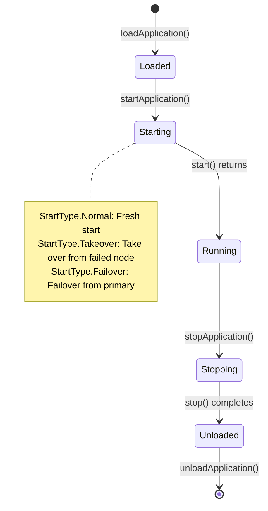

# Application Lifecycle Management

## Overview

The Application Lifecycle example demonstrates how JOTP manages the complete lifecycle of applications: loading, starting, stopping, and unloading. This example shows how to build production-grade application management with supervision trees, configuration management, and graceful shutdown.

### Learning Objectives

After completing this example, you will understand:

- How to implement the Application callback interface
- How to build supervision trees for applications
- How to manage application configuration
- How to handle different start types (Normal, Takeover, Failover)
- How to gracefully shutdown applications

### Application Lifecycle



## Running the Example

```bash
mvnd exec:java -Dexec.mainClass="io.github.seanchatmangpt.jotp.examples.ApplicationLifecycleExample"
```

### Expected Output

```text
╔═══════════════════════════════════════════════════════════════════════════╗
║  Application Lifecycle Example: Complete JOTP Application Demonstration  ║
╚═══════════════════════════════════════════════════════════════════════════╝

Step 1: Creating ApplicationConfig
  Name: channel-app
  Version: 1.0.0
  Description: Channel allocator application for message routing
  Modules: 4
  Dependencies: [kernel, stdlib]
  Environment: {log_level=info, max_channels=100, file=/var/log/channels.log}

Step 2: Loading application
  Application loaded

Step 3: Starting application (NORMAL mode)
  Application started

...
```

## Key Concepts

### Application Callback Interface

```java
public interface Application {
    Result<Supervisor, Exception> start(StartType type, Object... args);
    void stop(Object state);
}
```

### Application Configuration

```java
ApplicationConfig.builder()
    .name("channel-app")
    .version("1.0.0")
    .description("Channel allocator application")
    .modules(List.of(MyChannelApp.class, ChannelSupervisor.class))
    .env("max_channels", 100)
    .env("log_level", "info")
    .build();
```

### Start Types

- **Normal:** Fresh start of the application
- **Takeover:** Take over from a failed node (read state from disk)
- **Failover:** Failover from primary (assume primary role)

## What to Try Next

### Exercise 1: Add Health Checks

Implement health check endpoint:

```java
public interface Application {
    Result<Supervisor, Exception> start(StartType type, Object... args);
    void stop(Object state);

    // Add health check
    default HealthCheck health() {
        return HealthCheck.healthy();
    }
}
```

### Exercise 2: Add Graceful Shutdown

Implement drain before shutdown:

```java
@Override
public void stop(Object state) {
    Supervisor supervisor = (Supervisor) state;

    // Stop accepting new work
    supervisor.drain(Duration.ofSeconds(30));

    // Wait for in-flight work to complete
    supervisor.shutdown(Duration.ofSeconds(10));
}
```

### Exercise 3: Add Configuration Reload

Hot-reload configuration:

```java
public void reloadConfig(ApplicationConfig newConfig) {
    if (config.version().compareTo(newConfig.version()) < 0) {
        stop(currentState);
        this.config = newConfig;
        start(StartType.Normal);
    }
}
```

## Key Takeaways

1. **Lifecycle Management:** Clear load → start → stop → unload flow
2. **Configuration:** Builder pattern for type-safe config
3. **Start Types:** Support for normal, takeover, and failover scenarios
4. **Supervision:** Applications are just supervision trees

## Source File Reference

- **Location:** `/src/main/java/io/github/seanchatmangpt/jotp/examples/ApplicationLifecycleExample.java`
- **Lines of Code:** ~625
- **Dependencies:** `io.github.seanchatmangpt.jotp.*`, `java.util.*`
