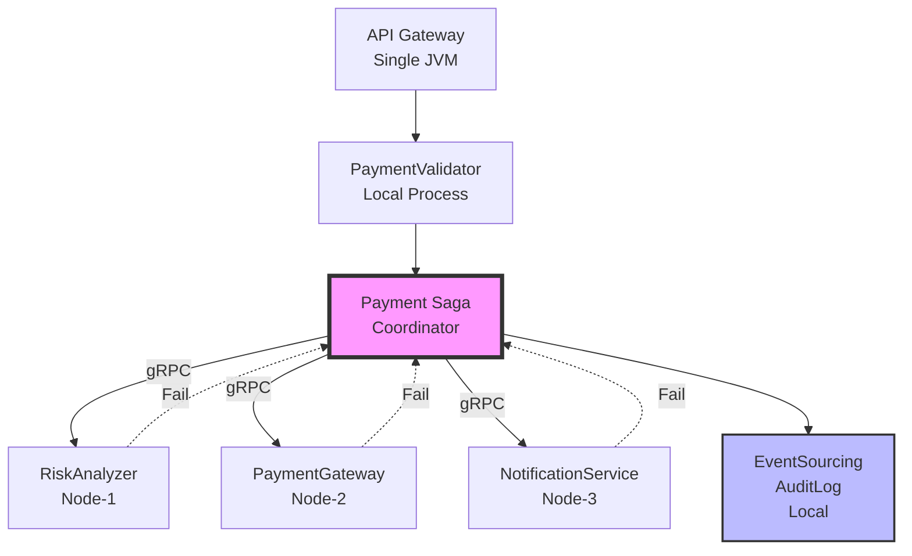
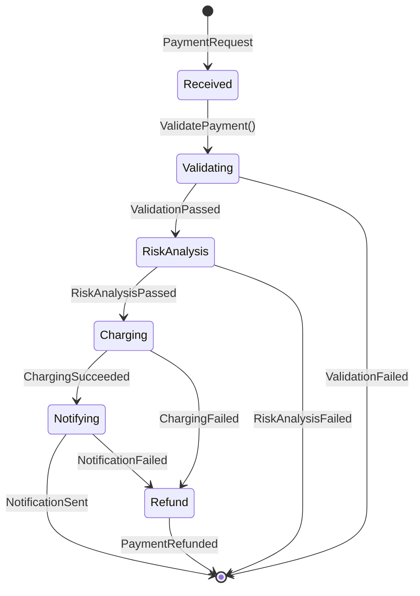

# Distributed Payment Processing

import { Callout } from '@astro-site/components/Callout';

## Overview

The Distributed Payment Processing example demonstrates **cross-JVM actor communication** using JOTP's distributed capabilities. This example shows how to build a payment processing system that spans multiple JVM instances while maintaining fault tolerance, audit trails, and distributed saga semantics.

### Learning Objectives

After completing this example, you will understand:

- How to design distributed payment workflows across multiple services
- How to implement distributed saga with compensation
- How to use event sourcing for audit trails
- How to protect external calls with circuit breakers
- How to handle failures in distributed systems

### Architecture



### Payment Workflow



## Key Concepts

### Distributed Saga Pattern

A saga is a sequence of local transactions where each transaction updates data within a single service. If any step fails, compensating transactions execute to undo the changes.

**Example:**
1. **Forward:** Charge payment → Reserve inventory → Send notification
2. **Compensate:** Refund payment → Release inventory → Send apology

### Event Sourcing for Audit

Every payment event is recorded in an append-only log for compliance and replay:

```
[10:00:01] PaymentReceived: PAY-001, $99.99
[10:00:02] ValidationPassed: email OK, card OK
[10:00:03] RiskAnalysisPassed: score=42 (low risk)
[10:00:04] ChargingSucceeded: TXN-12345
[10:00:05] NotificationSent: NOTIF-67890
[10:00:06] PaymentCompleted: total time=5s
```

### Circuit Breaker Pattern

Protect external service calls from cascading failures:

```text
Closed → Open (after N failures) → Half-Open (after timeout) → Closed
```

## Running the Example

```bash
mvnd exec:java -Dexec.mainClass="io.github.seanchatmangpt.jotp.examples.DistributedPaymentProcessing"
```

### Expected Output

```text
╔═══════════════════════════════════════════════════════════════════════════╗
║  Distributed Payment Processing: JOTP Cross-JVM Example                 ║
╚═══════════════════════════════════════════════════════════════════════════╝

Processing payments...

Processing PAY-001 (Amount: $99.99)
  Payment SUCCESSFUL
     Transaction ID: TXN-1234567890
     Steps:
       - Validation: PASSED
       - Risk Analysis: RISK-1234567890
       - Charging: TXN-1234567890
       - Notification: NOTIF-1234567890

--- System Status ---
Total Transactions: 2
Payment Gateway Circuit Breaker: CLOSED
```

## What to Try Next

### Exercise 1: Simulate Gateway Failure

Trigger circuit breaker:

```java
paymentGateway.setSimulateFailure(true);
// After 3 failures, circuit opens
// Subsequent calls fail fast without waiting
```

### Exercise 2: Add Idempotency

Prevent duplicate charges:

```java
record PaymentKey(String paymentId) {}

Set<PaymentKey> processedPayments = ConcurrentHashMap.newKeySet();

if (processedPayments.contains(paymentKey)) {
    return Result.success(existingTransactionId);
}
```

### Exercise 3: Add Distributed Tracing

Track request across nodes:

```java
String traceId = UUID.randomUUID().toString();
payment.send(new ChargeRequest(payment, traceId));
// Log traceId at each hop for debugging
```

## Key Takeaways

1. **Distributed Saga:** All-or-nothing semantics across services
2. **Audit Trail:** Event sourcing provides compliance and replay
3. **Circuit Breaker:** Prevents cascading failures
4. **Compensation:** Automatic rollback on failure

## Source File Reference

- **Location:** `/src/main/java/io/github/seanchatmangpt/jotp/examples/DistributedPaymentProcessing.java`
- **Lines of Code:** ~456
- **Dependencies:** `io.github.seanchatmangpt.jotp.*`, `java.time.*`
