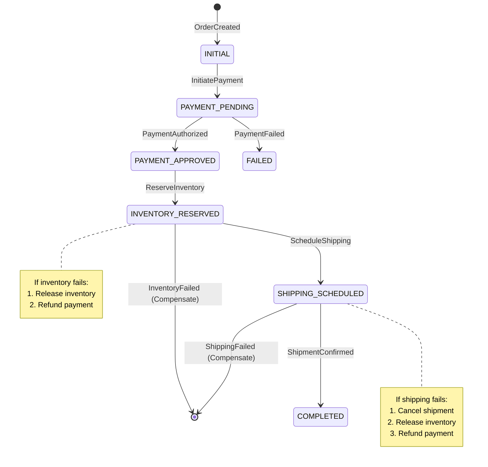
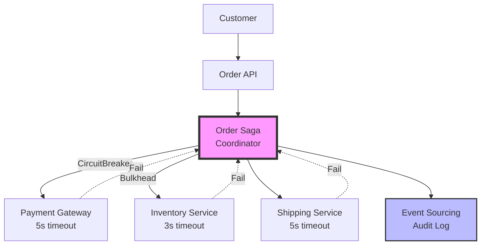

# E-Commerce Order Service

import { Callout } from '@astro-site/components/Callout';

## Overview

The E-Commerce Order Service example demonstrates **integration of five JOTP enterprise patterns** in a real-world e-commerce system:

1. **Distributed Saga Coordinator** - Orchestrates multi-service workflows
2. **Circuit Breaker** - Protects external payment gateway calls
3. **Bulkhead Isolation** - Isolates inventory operations
4. **Event Sourcing Audit Log** - Maintains audit trail
5. **Supervisor** - Manages process lifecycle

### Learning Objectives

After completing this example, you will understand:

- How to orchestrate complex multi-service workflows
- How to implement compensation on failure
- How to protect external service calls
- How to isolate subsystem failures
- How to maintain audit trails for compliance

### Order Workflow



### Architecture



## Key Concepts

### Saga Compensation

When a step fails, compensate all previous steps in **LIFO order**:

```java
// Forward: Payment → Inventory → Shipping
// Shipping fails:
// 1. Compensate Shipping (cancel shipment)
// 2. Compensate Inventory (release reservation)
// 3. Compensate Payment (refund)
```

### Circuit Breaker Protection

```java
var breaker = CircuitBreaker.create(
    "payment-gateway",
    5,                    // Max failures
    Duration.ofSeconds(60),  // Window
    Duration.ofSeconds(30)   // Timeout
);
```

States: **CLOSED** → **OPEN** (after 5 failures) → **HALF_OPEN** (after 30s)

### Bulkhead Isolation

```java
var bulkhead = BulkheadIsolation.create(
    "inventory-service",
    5,      // Pool size
    100,    // Queue depth
    handler // Processor
);
```

Prevents inventory overload from affecting order API.

### Event Sourcing Audit

Every order event is logged:

```
[10:00:01] Created: order-123, $99.99
[10:00:02] PaymentAuthorized: TXN-001
[10:00:03] InventoryReserved: RES-001
[10:00:04] ShippingScheduled: TRACK-001
[10:00:05] OrderCompleted: total=4s
```

## Running the Example

```bash
mvnd exec:java -Dexec.mainClass="io.github.seanchatmangpt.jotp.examples.EcommerceOrderService"
```

### Expected Output

```text
╔═══════════════════════════════════════════════════════════════════════════╗
║  E-Commerce Order Service: JOTP Pattern Integration Example              ║
╚═══════════════════════════════════════════════════════════════════════════╝

Creating order: ORD-123456
  Amount: $99.99
  Items: [LineItem[productId=SKU-001, quantity=1]]
  Shipping: Address[street=123 Main St, city=Springfield, zipCode=12345]

--- Saga Execution Result ---
Order creation SUCCEEDED
   Message: Order created successfully
   Steps:
     - Payment: TXN-1234567890 [SUCCEEDED]
     - Inventory: RES-1234567890 [SUCCEEDED]
     - Shipping: TRACK-1234567890 [SUCCEEDED]

--- Pattern Status ---
Circuit Breaker (Payment): CLOSED
Bulkhead Isolation (Inventory): BulkheadStatus[activeWorkers=0, queueDepth=0]
```

## What to Try Next

### Exercise 1: Trigger Payment Failure

```java
paymentService.setSimulateFailure(true);
var result = coordinator.executeOrderCreation(orderData);
// Should see compensation: refund payment
```

### Exercise 2: Trigger Circuit Breaker

```java
for (int i = 0; i < 10; i++) {
    paymentService.charge(100.0); // Will fail
}
// After 5 failures, circuit opens
// Subsequent calls fail fast
```

### Exercise 3: Trigger Bulkhead Rejection

```java
for (int i = 0; i < 100; i++) {
    inventoryService.reserve("SKU-" + i, 1);
}
// After pool + queue full, requests rejected
```

### Exercise 4: Add Idempotency Keys

```java
record OrderRequest(String orderId, ...) {
    String idempotencyKey() {
        return "order-" + orderId.hashCode();
    }
}

// Check if already processed
if (auditLog.contains(idempotencyKey)) {
    return cachedResult;
}
```

### Exercise 5: Add Distributed Locking

```java
// Prevent duplicate order processing
var lock = distributedLock.acquire("order-" + orderId, Duration.ofSeconds(30));
try {
    return saga.execute(orderData);
} finally {
    lock.release();
}
```

## Key Takeaways

1. **Saga Pattern:** Orchestrate complex workflows with compensation
2. **Circuit Breaker:** Prevent cascading failures
3. **Bulkhead:** Isolate subsystem failures
4. **Event Sourcing:** Maintain audit trail
5. **Type Safety:** Sealed types prevent invalid states

## Real-World Applications

- **E-commerce:** Order processing, payment workflows
- **Travel:** Booking flights, hotels, cars
- **Finance:** Trade execution, settlement
- **Healthcare:** Patient intake, insurance claims
- **Manufacturing:** Production workflows

## Source File Reference

- **Location:** `/src/main/java/io/github/seanchatmangpt/jotp/examples/EcommerceOrderService.java`
- **Lines of Code:** ~434
- **Dependencies:** `io.github.seanchatmangpt.jotp.*`, `java.time.*`
