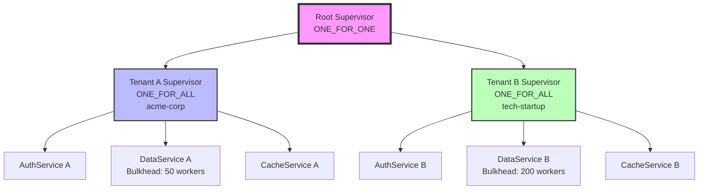

# Multi-Tenant SaaS Platform

import { Callout } from '@astro-site/components/Callout';

## Overview

The Multi-Tenant SaaS Platform example demonstrates **enterprise multi-tenancy** using JOTP supervision trees. Each tenant gets its own isolated supervisor subtree with independent rate limiting, bulkheads, and resource quotas.

### Learning Objectives

After completing this example, you will understand:

- How to build per-tenant supervision trees
- How to implement rate limiting per tenant
- How to isolate tenant resources with bulkheads
- How to achieve noisy neighbor protection
- How to scale multi-tenant systems

### Architecture



### Tenant Isolation Guarantees

| Guarantee | Implementation |
|-----------|----------------|
| **Failure Isolation** | Tenant crash doesn't affect others (ONE_FOR_ALL) |
| **Rate Limiting** | Token bucket per tenant (100-500 req/s) |
| **Resource Quotas** | Bulkhead pool size per tenant (50-200 workers) |
| **Data Isolation** | Separate cache per tenant |
| **Independent Scaling** | Each tenant has own supervisor tree |

## Key Concepts

### Per-Tenant Supervisor Tree

```java
// Each tenant gets its own supervisor
var tenantSupervisor = Supervisor.create()
    .withStrategy(RestartStrategy.ONE_FOR_ALL) // Atomic per-tenant restart
    .build();

tenantSupervisor.addChild(authService);
tenantSupervisor.addChild(dataService);
tenantSupervisor.addChild(cacheService);
```

### Token Bucket Rate Limiter

```java
public class RateLimiter {
    private final int capacity;
    private volatile double tokens;
    private volatile long lastRefillTime;

    public boolean tryAcquire() {
        refillTokens();
        if (tokens >= 1.0) {
            tokens -= 1.0;
            return true;
        }
        return false;
    }

    private void refillTokens() {
        long now = System.nanoTime();
        long elapsed = now - lastRefillTime;
        double tokensToAdd = (elapsed / 1_000_000_000.0) * capacity;
        tokens = Math.min(capacity, tokens + tokensToAdd);
        lastRefillTime = now;
    }
}
```

### Bulkhead Isolation

```java
var bulkhead = BulkheadIsolation.create(
    "data-" + tenantId,
    poolSize,      // 50 for DEFAULT, 200 for PREMIUM
    maxQueueDepth, // 1000 for DEFAULT, 5000 for PREMIUM
    processor
);
```

## Tenant Tiers

<Callout type="info">
**Pricing Tiers:** Different rate limits and resource quotas per plan.
</Callout>

| Tier | Rate Limit | Pool Size | Queue Depth | Cache Size |
|------|-----------|-----------|-------------|------------|
| **DEFAULT** | 100 req/s | 50 workers | 1,000 | 10,000 entries |
| **PREMIUM** | 500 req/s | 200 workers | 5,000 | 100,000 entries |

## Running the Example

```bash
mvnd exec:java -Dexec.mainClass="io.github.seanchatmangpt.jotp.examples.MultiTenantSaaSPlatform"
```

### Expected Output

```text
╔═══════════════════════════════════════════════════════════════════════════╗
║  Multi-Tenant SaaS Platform: JOTP Isolation Example                     ║
╚═══════════════════════════════════════════════════════════════════════════╝

Registering tenants...
  [REGISTER] Tenant: acme-corp (TenantConfig[tenantId=acme-corp, maxRequestsPerSecond=100, bulkheadPoolSize=50, maxQueueDepth=1000, maxCacheSize=10000])
  [REGISTER] Tenant: tech-startup (TenantConfig[tenantId=tech-startup, maxRequestsPerSecond=500, bulkheadPoolSize=200, maxQueueDepth=5000, maxCacheSize=100000])

Processing requests...
  [acme-corp] SUCCESS (cached) (response time: 2ms)
  [tech-startup] SUCCESS (response time: 15ms)
  [acme-corp] SUCCESS (cached) (response time: 1ms)

--- Tenant Status ---
Tenant: acme-corp | Requests: 2 | Data Service: BulkheadStatus[activeWorkers=0, queueDepth=0]
Tenant: tech-startup | Requests: 1 | Data Service: BulkheadStatus[activeWorkers=0, queueDepth=0]

✅ Multi-tenancy isolation working correctly!
   Each tenant has independent supervision trees and rate limits.
```

## What to Try Next

### Exercise 1: Trigger Rate Limiting

```java
for (int i = 0; i < 200; i++) {
    platform.handleRequest(new TenantRequest("acme-corp", ...));
}
// After 100 requests, subsequent requests fail with "Rate limit exceeded"
```

### Exercise 2: Trigger Bulkhead Rejection

```java
for (int i = 0; i < 1000; i++) {
    platform.handleRequest(new TenantRequest("acme-corp", ...));
}
// After pool (50) + queue (1000) full, requests rejected
```

### Exercise 3: Tenant Failure Isolation

```java
// Simulate tenant A failure
tenants.get("acme-corp").crash();
// Tenant A restarts (ONE_FOR_ALL)
// Tenant B continues unaffected
```

### Exercise 4: Dynamic Tenant Provisioning

```java
public void provisionTenant(String tenantId, Tier tier) {
    var config = switch (tier) {
        case DEFAULT -> TenantConfig.DEFAULT(tenantId);
        case PREMIUM -> TenantConfig.PREMIUM(tenantId);
    };
    platform.registerTenant(config);
}
```

### Exercise 5: Tenant Metrics

```java
public record TenantMetrics(
    String tenantId,
    long requestCount,
    double currentRate,
    double rateLimitUtilization,
    int activeWorkers,
    int queueDepth
) {}

public TenantMetrics getMetrics(String tenantId) {
    var coordinator = tenants.get(tenantId);
    var rateLimiter = coordinator.getRateLimiter();
    var bulkhead = coordinator.getDataServiceStatus();

    return new TenantMetrics(
        tenantId,
        coordinator.getRequestCount(),
        rateLimiter.getMeasuredRate(),
        rateLimiter.getUtilization(),
        bulkhead.activeWorkers(),
        bulkhead.queueDepth()
    );
}
```

## Key Takeaways

1. **Tenant Isolation:** Each tenant has own supervisor tree
2. **Rate Limiting:** Token bucket per tenant
3. **Bulkhead Protection:** Per-tenant resource limits
4. **Failure Isolation:** One tenant's crash doesn't affect others
5. **Independent Scaling:** Each tenant scales independently

## Real-World Applications

- **SaaS Platforms:** Multi-tenant applications
- **API Gateways:** Per-customer rate limiting
- **Cloud Services:** Resource quota enforcement
- **Enterprise Systems:** Department/team isolation
- **PaaS Platforms:** Application isolation

## Further Reading

- [Bulkhead Pattern](/docs/patterns/bulkheads) - Isolation patterns
- [Rate Limiting](/docs/patterns/rate-limiting) - Rate limiting strategies
- [Supervision Trees](/docs/user-guide/supervision-trees) - Multi-level supervision
- [Enterprise Patterns](/docs/patterns) - Production patterns

## Source File Reference

- **Location:** `/src/main/java/io/github/seanchatmangpt/jotp/examples/MultiTenantSaaSPlatform.java`
- **Lines of Code:** ~430
- **Dependencies:** `io.github.seanchatmangpt.jotp.*`, `java.util.concurrent.*`
