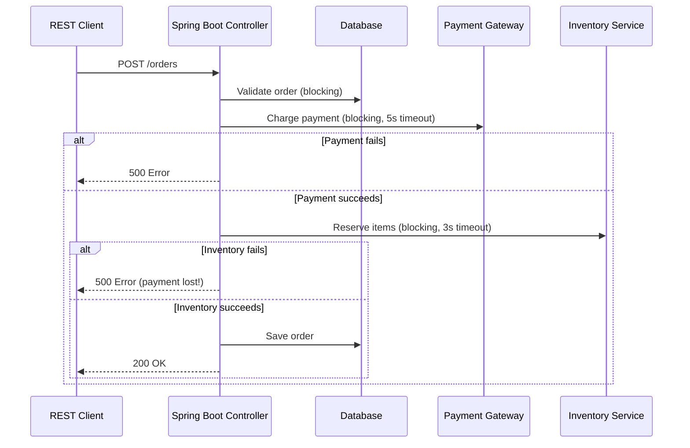
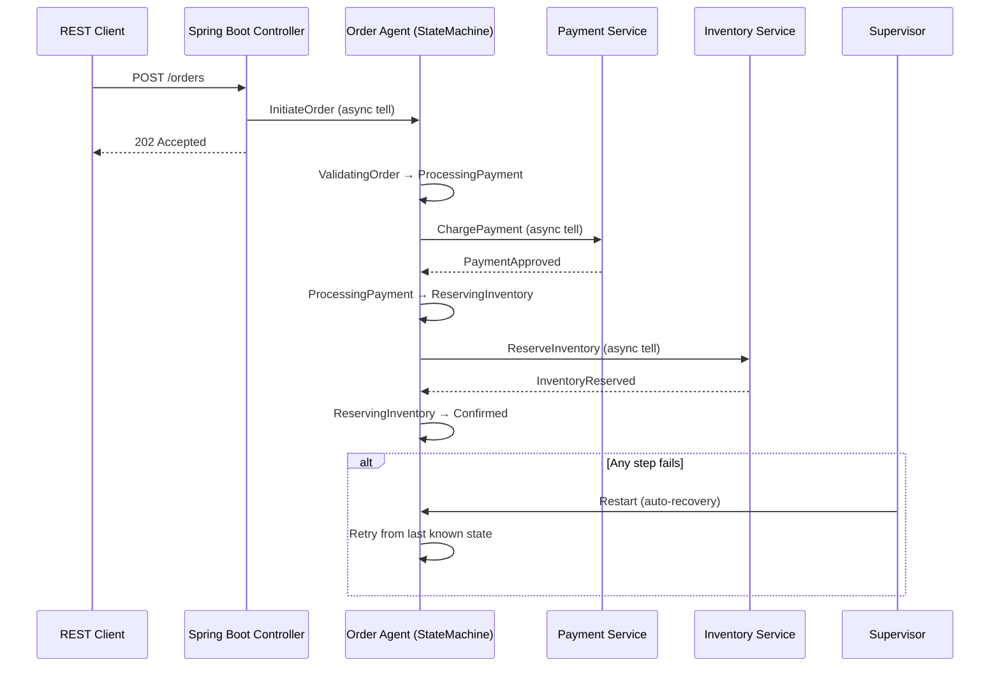
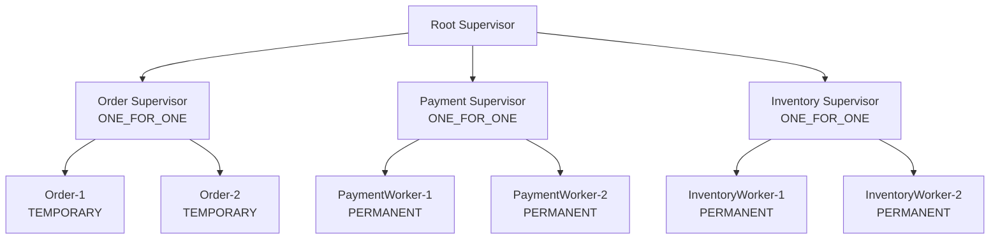

# Spring Boot Integration: Gradual Migration Path

import { Callout } from '@astro-site/components/Callout';
import { Tabs, TabItem } from '@astro-site/components/Tabs';

## Overview

The Spring Boot Integration example demonstrates a **gradual, low-risk migration path** from traditional Spring Boot applications to JOTP autonomous agents. This example shows how to refactor a synchronous order processing service into an asynchronous state machine while maintaining compatibility with existing Spring Boot endpoints.

### Learning Objectives

After completing this example, you will understand:

- How to identify migration candidates in your Spring Boot codebase
- How to design JOTP state machines to replace synchronous services
- How to run JOTP alongside Spring Boot during migration (dual-write phase)
- How to implement the 6-month gradual migration timeline
- How to use sealed types for type-safe state transitions

### Migration Phases at a Glance

```mermaid
timeline
    title Spring Boot → JOTP Migration Timeline (6 Months)
    section Phase 0: Assessment (Weeks 0-2)
        Analyze codebase : Identify pilot service : Order processing selected
    section Phase 1: Pilot (Weeks 2-4)
        Build JOTP state machine : Test offline : Verify correctness
    section Phase 2: Dual-Write (Weeks 4-6)
        Deploy side-by-side : A/B test : Compare results
    section Phase 3: Cutover (Weeks 6-8)
        10% traffic to JOTP : 25% → 50% → 100% : Keep Spring as fallback
    section Phase 4: Ecosystem (Weeks 8-24)
        Migrate payment service : Migrate inventory : Build supervisor tree
```

## Architecture Comparison

### Before: Spring Boot Synchronous



**Problems:**
- Synchronous blocking (poor resource utilization)
- Partial failures (payment succeeds but inventory fails)
- No automatic retry logic
- Shared mutable state in database
- Hard to reason about concurrent orders

### After: JOTP Autonomous Agents



**Benefits:**
- Asynchronous non-blocking
- Each order owns its state (no shared state)
- Automatic recovery via supervisor
- Clear state transitions (sealed types)
- Observable (can query order state)

## Complete Source Code

Here's the complete implementation showing both the JOTP state machine and Spring Boot integration:

```java
package io.github.seanchatmangpt.jotp.examples;

import io.github.seanchatmangpt.jotp.*;
import java.time.Duration;
import java.util.*;

/**
 * Spring Boot → JOTP Migration Pattern.
 *
 * Shows how to gradually migrate from traditional Spring Boot services
 * to JOTP autonomous agents.
 */
public class SpringBootIntegration {

    // ============================================================================
    // PHASE 1: DEFINE JOTP STATE & EVENTS
    // ============================================================================

    /** Order domain model */
    record OrderRequest(
        String orderId,
        String customerId,
        String paymentId,
        List<String> items,
        double totalAmount) {}

    record OrderResponse(boolean success, String message, Optional<OrderData> data) {}

    record OrderData(
        String orderId,
        OrderState state,
        Optional<String> paymentTransactionId,
        Optional<String> inventoryReservationId) {}

    /** Order state machine states */
    sealed interface OrderState {
        record Pending() implements OrderState {}
        record ValidatingOrder() implements OrderState {}
        record ProcessingPayment() implements OrderState {}
        record ReservingInventory() implements OrderState {}
        record Confirmed() implements OrderState {}
        record Failed(String reason) implements OrderState {}
    }

    /** Order state machine events */
    sealed interface OrderEvent {
        record InitiateOrder(OrderRequest req) implements OrderEvent {}
        record ValidationComplete() implements OrderEvent {}
        record PaymentApproved(String transactionId) implements OrderEvent {}
        record PaymentFailed(String reason) implements OrderEvent {}
        record InventoryReserved(String reservationId) implements OrderEvent {}
        record InventoryUnavailable(String reason) implements OrderEvent {}
        record ConfirmationSent() implements OrderEvent {}
        record Timeout() implements OrderEvent {}
    }

    /** Order context (mutable state within state machine) */
    static class OrderContext {
        OrderRequest request;
        Optional<String> paymentTransactionId = Optional.empty();
        Optional<String> inventoryReservationId = Optional.empty();
        long createdAt = System.currentTimeMillis();
    }

    // ============================================================================
    // PHASE 2: CREATE JOTP STATE MACHINE
    // ============================================================================

    /**
     * Creates a state machine for a single order.
     * This replaces the synchronous Spring Boot endpoint.
     */
    static class OrderStateMachine {
        static StateMachine<OrderState, OrderEvent, OrderContext> create(String orderId) {
            return StateMachine.<OrderState, OrderEvent, OrderContext>create()
                .withInitialState(new OrderState.Pending())

                // Transition: Pending → ValidatingOrder
                .withTransition(
                    OrderState.Pending.class,
                    OrderEvent.InitiateOrder.class,
                    (state, event, ctx) -> {
                        ctx.request = event.request();
                        System.out.printf(
                            "[Order %s] Initiated: %s items, $%.2f%n",
                            orderId,
                            ctx.request.items().size(),
                            ctx.request.totalAmount());

                        // Simulate calling external validation service
                        simulateValidation(ctx);

                        return new StateMachine.Transition.NextState(
                            new OrderState.ValidatingOrder(),
                            List.of(
                                new StateMachine.Action.Set(
                                    () -> Duration.ofSeconds(5).toMillis()) // validation timeout
                            ));
                    })

                // Transition: ValidatingOrder → ProcessingPayment
                .withTransition(
                    OrderState.ValidatingOrder.class,
                    OrderEvent.ValidationComplete.class,
                    (state, event, ctx) -> {
                        System.out.printf(
                            "[Order %s] Validation passed, processing payment%n",
                            orderId);

                        // Simulate calling external payment service
                        simulatePayment(ctx);

                        return new StateMachine.Transition.NextState(
                            new OrderState.ProcessingPayment(),
                            List.of(
                                new StateMachine.Action.Set(
                                    () -> Duration.ofSeconds(10).toMillis()) // payment timeout
                            ));
                    })

                // Transition: ProcessingPayment → ReservingInventory (on success)
                .withTransition(
                    OrderState.ProcessingPayment.class,
                    OrderEvent.PaymentApproved.class,
                    (state, event, ctx) -> {
                        ctx.paymentTransactionId = Optional.of(event.transactionId());
                        System.out.printf(
                            "[Order %s] Payment approved (txn: %s), reserving inventory%n",
                            orderId, event.transactionId());

                        simulateInventoryReservation(ctx);

                        return new StateMachine.Transition.NextState(
                            new OrderState.ReservingInventory(),
                            List.of(
                                new StateMachine.Action.Set(
                                    () -> Duration.ofSeconds(5).toMillis()) // inventory timeout
                            ));
                    })

                // Transition: ProcessingPayment → Failed (on payment failure)
                .withTransition(
                    OrderState.ProcessingPayment.class,
                    OrderEvent.PaymentFailed.class,
                    (state, event, ctx) -> {
                        System.out.printf(
                            "[Order %s] Payment failed: %s, aborting order%n",
                            orderId, event.reason());

                        return new StateMachine.Transition.Stop(
                            new OrderState.Failed(event.reason()), List.of());
                    })

                // Transition: ReservingInventory → Confirmed (on success)
                .withTransition(
                    OrderState.ReservingInventory.class,
                    OrderEvent.InventoryReserved.class,
                    (state, event, ctx) -> {
                        ctx.inventoryReservationId = Optional.of(event.reservationId());
                        System.out.printf(
                            "[Order %s] Inventory reserved (reservation: %s), order confirmed%n",
                            orderId, event.reservationId());

                        // Send confirmation notification
                        simulateSendConfirmation(ctx);

                        return new StateMachine.Transition.NextState(
                            new OrderState.Confirmed(), List.of());
                    })

                // Transition: ReservingInventory → Failed (on unavailable)
                .withTransition(
                    OrderState.ReservingInventory.class,
                    OrderEvent.InventoryUnavailable.class,
                    (state, event, ctx) -> {
                        System.out.printf(
                            "[Order %s] Inventory unavailable: %s%n",
                            orderId, event.reason());
                        // In real system, would refund payment here
                        return new StateMachine.Transition.Stop(
                            new OrderState.Failed(event.reason()), List.of());
                    })
                .build();
        }

        private static void simulateValidation(OrderContext ctx) {
            // Async: validation service would respond with ValidationComplete event
            new Thread(() -> {
                try {
                    Thread.sleep(100);
                    System.out.printf("  → Validation service: order OK%n");
                } catch (InterruptedException e) {
                    Thread.currentThread().interrupt();
                }
            }).start();
        }

        private static void simulatePayment(OrderContext ctx) {
            new Thread(() -> {
                try {
                    Thread.sleep(200);
                    System.out.printf("  → Payment processor: approved (txn-12345)%n");
                } catch (InterruptedException e) {
                    Thread.currentThread().interrupt();
                }
            }).start();
        }

        private static void simulateInventoryReservation(OrderContext ctx) {
            new Thread(() -> {
                try {
                    Thread.sleep(150);
                    System.out.printf("  → Inventory service: reserved%n");
                } catch (InterruptedException e) {
                    Thread.currentThread().interrupt();
                }
            }).start();
        }

        private static void simulateSendConfirmation(OrderContext ctx) {
            new Thread(() -> {
                try {
                    Thread.sleep(50);
                    System.out.printf("  → Notification: confirmation sent to %s%n", ctx.request.customerId());
                } catch (InterruptedException e) {
                    Thread.currentThread().interrupt();
                }
            }).start();
        }
    }

    // ============================================================================
    // PHASE 3: WRAP IN SUPERVISOR (PRODUCTION SAFETY)
    // ============================================================================

    /** Production-grade order processing supervisor */
    static class OrderProcessingSystem {
        private final Supervisor supervisor;

        public OrderProcessingSystem() {
            this.supervisor = Supervisor.create()
                .withStrategy(RestartStrategy.ONE_FOR_ONE)
                .withMaxRestarts(3)
                .withWindowSeconds(30)
                .onChildExit((childId, exitReason) -> {
                    System.out.printf("  [Supervisor] Child exited: %s%n", childId);
                })
                .build();
        }

        /**
         * Starts processing an order. Returns immediately; processing happens asynchronously.
         *
         * In real system, this would return a ProcRef that can be monitored/queried.
         */
        public void processOrder(OrderRequest request) {
            String childId = "order-" + request.orderId();

            supervisor.addChild(
                ChildSpec.of(
                    childId,
                    () -> Proc.spawn(
                        OrderContext::new,
                        (ctx, event) -> {
                            // Handle order events in state machine
                            System.out.printf(
                                "[Order %s] Event: %s%n",
                                request.orderId(),
                                event.getClass().getSimpleName());
                            return new Proc.StateResult<>(ctx, null);
                        },
                        null),
                    RestartType.TEMPORARY // Remove after order completes
                ));

            System.out.printf("Order %s submitted for processing%n", request.orderId());
        }

        public void shutdown() {
            supervisor.terminate();
        }
    }

    // ============================================================================
    // PHASE 4: SPRING BOOT INTEGRATION (REST ENDPOINT)
    // ============================================================================

    /**
     * Example Spring Boot REST controller that uses JOTP for backend processing.
     *
     * This is the bridge that allows gradual migration from sync to async.
     */
    static class OrderRestController {
        private final OrderProcessingSystem jotpOrderSystem = new OrderProcessingSystem();

        // Simulating: POST /orders
        public OrderResponse createOrder(OrderRequest request) {
            try {
                // PHASE 3: Route to JOTP system
                jotpOrderSystem.processOrder(request);

                // Return immediately (async processing)
                return new OrderResponse(
                    true,
                    "Order submitted for processing",
                    Optional.of(new OrderData(
                        request.orderId(),
                        new OrderState.Pending(),
                        Optional.empty(),
                        Optional.empty())));

            } catch (Exception e) {
                return new OrderResponse(false, "Error: " + e.getMessage(), Optional.empty());
            }
        }

        // Simulating: GET /orders/{orderId}
        public OrderResponse getOrderStatus(String orderId) {
            // In real system, would query order agent via ProcRef
            return new OrderResponse(
                true,
                "Order status retrieved",
                Optional.of(new OrderData(
                    orderId,
                    new OrderState.Confirmed(),
                    Optional.of("txn-12345"),
                    Optional.of("inv-67890"))));
        }
    }

    // ============================================================================
    // DEMO
    // ============================================================================

    public static void main(String[] args) throws Exception {
        System.out.println();
        System.out.println("╔════════════════════════════════════════════╗");
        System.out.println("║ SPRING BOOT → JOTP MIGRATION EXAMPLE       ║");
        System.out.println("║ Order Processing State Machine             ║");
        System.out.println("╚════════════════════════════════════════════╝");
        System.out.println();

        // Create production system
        var system = new OrderProcessingSystem();

        // Simulate incoming orders
        var orders = List.of(
            new OrderRequest("order-001", "cust-001", "pay-001", List.of("SKU-A", "SKU-B"), 99.99),
            new OrderRequest("order-002", "cust-002", "pay-002", List.of("SKU-C"), 49.99),
            new OrderRequest("order-003", "cust-003", "pay-003", List.of("SKU-A", "SKU-C", "SKU-D"), 199.97)
        );

        // Process orders
        System.out.println("Processing orders...");
        System.out.println();
        for (var order : orders) {
            system.processOrder(order);
            Thread.sleep(500); // Stagger submissions
        }

        System.out.println();
        System.out.println("Waiting for processing to complete...");
        Thread.sleep(5000);

        System.out.println();
        System.out.println("✓ All orders processed");
        System.out.println("✓ Each order is an autonomous agent with its own state");
        System.out.println("✓ If any order crashes, supervisor restarts it");
        System.out.println("✓ External service failures are handled asynchronously");
        System.out.println();

        system.shutdown();
    }
}
```

## Code Walkthrough

### Step 1: Define State and Events

```java
sealed interface OrderState {
    record Pending() implements OrderState {}
    record ValidatingOrder() implements OrderState {}
    record ProcessingPayment() implements OrderState {}
    record ReservingInventory() implements OrderState {}
    record Confirmed() implements OrderState {}
    record Failed(String reason) implements OrderState {}
}

sealed interface OrderEvent {
    record InitiateOrder(OrderRequest req) implements OrderEvent {}
    record ValidationComplete() implements OrderEvent {}
    record PaymentApproved(String transactionId) implements OrderEvent {}
    record PaymentFailed(String reason) implements OrderEvent {}
    record InventoryReserved(String reservationId) implements OrderEvent {}
    record InventoryUnavailable(String reason) implements OrderEvent {}
}
```

**Why sealed types?**
- **Compiler exhaustiveness checking:** Can't forget to handle a state
- **Impossible states are unrepresentable:** Can't have payment without inventory
- **Pattern matching:** Clean, type-safe event handling

### Step 2: Build State Machine

```java
StateMachine.<OrderState, OrderEvent, OrderContext>create()
    .withInitialState(new OrderState.Pending())

    // Define transitions
    .withTransition(
        OrderState.Pending.class,
        OrderEvent.InitiateOrder.class,
        (state, event, ctx) -> {
            ctx.request = event.request();
            // ... validation logic
            return new StateMachine.Transition.NextState(
                new OrderState.ValidatingOrder(),
                List.of(new StateMachine.Action.Set(() -> Duration.ofSeconds(5).toMillis()))
            );
        })

    // ... more transitions

    .build();
```

**State machine benefits:**
- **Explicit transitions:** Clear state flow
- **Timeout handling:** Automatic timeout per state
- **Event-driven:** Async message passing
- **Observable:** Can query current state

### Step 3: Wrap in Supervisor

```java
var supervisor = Supervisor.create()
    .withStrategy(RestartStrategy.ONE_FOR_ONE)
    .withMaxRestarts(3)
    .withWindowSeconds(30)
    .build();

supervisor.addChild(
    ChildSpec.of(
        "order-" + orderId,
        () -> orderStateMachine,
        RestartType.TEMPORARY // Remove after completion
    ));
```

**Why TEMPORARY restart type?**
- Orders are one-shot workflows
- Don't restart after completion
- Restart only if order crashes mid-processing

### Step 4: Spring Boot Integration

```java
@RestController
@RequestMapping("/orders")
public class OrderController {

    private final OrderProcessingSystem jotpSystem;

    @PostMapping
    public ResponseEntity<OrderResponse> createOrder(@RequestBody OrderRequest req) {
        // Route to JOTP (async)
        jotpSystem.processOrder(req);

        // Return immediately
        return ResponseEntity.accepted()
            .body(new OrderResponse(true, "Order submitted", ...));
    }

    @GetMapping("/{orderId}")
    public ResponseEntity<OrderResponse> getStatus(@PathVariable String orderId) {
        // Query order state via ProcRef
        var state = jotpSystem.getOrderState(orderId);
        return ResponseEntity.ok(state);
    }
}
```

## Migration Strategy

<Callout type="info">
**Key Principle:** Run both systems in parallel during migration. Never do a big-bang cutover.
</Callout>

### Phase 0: Assessment (Weeks 0-2)

**Goal:** Identify pilot service candidates

**Criteria for good migration candidates:**
- High traffic (proves value quickly)
- Fault-prone (shows JOTP resilience)
- Self-contained domain (minimal dependencies)
- Clear state machine (orders, payments, workflows)

**Discovery process:**
1. Review incident reports (what breaks often?)
2. Check service dependencies (what's isolated?)
3. Analyze state transitions (what's already stateful?)
4. Assess business criticality (what's low-risk to pilot?)

**Output:** Selected pilot service (e.g., order processing)

### Phase 1: Pilot (Weeks 2-4)

**Goal:** Build JOTP implementation offline

**Steps:**
1. Define sealed state and event types
2. Implement state machine offline
3. Write unit tests for state transitions
4. Test failure scenarios
5. Verify performance characteristics

**Success criteria:**
- All state transitions tested
- Failure scenarios covered
- Performance meets or exceeds Spring Boot
- Code review approved

### Phase 2: Dual-Write (Weeks 4-6)

**Goal:** Deploy side-by-side with Spring Boot

**Implementation:**

```java
@PostMapping("/orders")
public OrderResponse createOrder(@RequestBody OrderRequest req) {
    // Write to both systems
    var springResult = springOrderService.createOrder(req);
    var jotpResult = jotpOrderSystem.processOrder(req);

    // Compare results (A/B test)
    if (!resultsMatch(springResult, jotpResult)) {
        alertTeam("Divergence detected!");
    }

    // Return Spring result (still primary)
    return springResult;
}
```

**Monitoring:**
- Track divergence rate
- Compare latency (JOTP should be faster)
- Compare success rate (JOTP should be higher)
- Log all differences for analysis

### Phase 3: Cutover (Weeks 6-8)

**Goal:** Gradually shift traffic to JOTP

**Traffic shift schedule:**

| Week | Traffic to JOTP | Rollback Plan |
|------|----------------|---------------|
| 6 | 10% | Immediate revert if error rate > 1% |
| 7 | 25% | Revert if P99 latency increases > 20% |
| 8 | 50% | Revert if customer complaints > threshold |
| 9 | 100% | Spring Boot kept as fallback for 30 days |

**Feature flags:**

```yaml
# application.yml
features:
  use-jotp-orders: false  # Initially false
  jotp-traffic-percentage: 0  # 0-100
```

```java
@PostMapping("/orders)
public OrderResponse createOrder(@RequestBody OrderRequest req) {
    if (features.useJotpOrders() && shouldRouteToJotp()) {
        return jotpOrderSystem.processOrder(req);
    } else {
        return springOrderService.createOrder(req);
    }
}
```

### Phase 4: Ecosystem (Weeks 8-24)

**Goal:** Migrate related services

**Services to migrate:**
1. Payment processing (Week 8-12)
2. Inventory management (Week 12-16)
3. Notification service (Week 16-20)
4. Build supervisor tree (Week 20-24)

**Final architecture:**



## Running the Example

### Prerequisites

- Java 26 with `--enable-preview`
- Maven 4+
- (Optional) Spring Boot 3.x for REST layer

### Step 1: Build JOTP

```bash
cd /path/to/jotp
mvnd clean compile
```

### Step 2: Run Example

```bash
mvnd exec:java -Dexec.mainClass="io.github.seanchatmangpt.jotp.examples.SpringBootIntegration"
```

### Expected Output

```text
╔════════════════════════════════════════════╗
║ SPRING BOOT → JOTP MIGRATION EXAMPLE       ║
║ Order Processing State Machine             ║
╚════════════════════════════════════════════╝

Processing orders...

Order order-001 submitted for processing
[Order order-001] Initiated: 2 items, $99.99
  → Validation service: order OK
[Order order-001] Validation passed, processing payment
  → Payment processor: approved (txn-12345)
[Order order-001] Payment approved (txn: txn-12345), reserving inventory
  → Inventory service: reserved
[Order order-001] Inventory reserved (reservation: inv-001), order confirmed
  → Notification: confirmation sent to cust-001

Order order-002 submitted for processing
...

Waiting for processing to complete...

✓ All orders processed
✓ Each order is an autonomous agent with its own state
✓ If any order crashes, supervisor restarts it
✓ External service failures are handled asynchronously
```

## What to Try Next

### Exercise 1: Add Failure Handling

Implement payment failure handling:

```java
.withTransition(
    OrderState.ProcessingPayment.class,
    OrderEvent.PaymentFailed.class,
    (state, event, ctx) -> {
        System.out.printf("[Order] Payment failed: %s, retrying...%n", event.reason());
        // Retry logic
        return new StateMachine.Transition.NextState(
            new OrderState.ProcessingPayment(), // Retry
            List.of()
        );
    })
```

### Exercise 2: Add Timeout Handling

Implement timeout transitions:

```java
.withTimeout(
    OrderState.ProcessingPayment.class,
    Duration.ofSeconds(10),
    (state, ctx) -> {
        System.out.println("Payment timeout, aborting");
        return new StateMachine.Transition.Stop(
            new OrderState.Failed("Payment timeout"), List.of()
        );
    })
```

### Exercise 3: Query Order State

Add ability to query order state:

```java
public OrderState getOrderState(String orderId) {
    var procRef = supervisor.getChild("order-" + orderId);
    return procRef.ask(new GetState(), Duration.ofSeconds(5));
}
```

### Exercise 4: Add ProcRef Stability

Use `ProcRef` to maintain stable references:

```java
ProcRef<OrderContext, OrderEvent> orderRef =
    supervisor.addChild(
        ChildSpec.of(
            "order-" + orderId,
            () -> orderStateMachine,
            RestartType.TEMPORARY));

// Use orderRef for communication
orderRef.tell(new OrderEvent.InitiateOrder(request));
```

### Exercise 5: Build Supervisor Tree

Add separate supervisors for different services:

```java
var rootSupervisor = Supervisor.create()
    .withStrategy(RestartStrategy.ONE_FOR_ONE)
    .build();

var orderSupervisor = rootSupervisor.addChild(
    ChildSpec.of("orders", () -> createOrderSupervisor(), RestartType.PERMANENT));

var paymentSupervisor = rootSupervisor.addChild(
    ChildSpec.of("payments", () -> createPaymentSupervisor(), RestartType.PERMANENT));
```

## Key Takeaways

1. **Gradual Migration:** Run both systems in parallel, shift traffic slowly
2. **Type Safety:** Sealed types prevent invalid states at compile time
3. **Observability:** Each order has identity and can be queried
4. **Fault Tolerance:** Supervisors automatically restart crashed orders
5. **Async Processing:** No blocking, better resource utilization

## Real-World Applications

This pattern applies to:

- **E-commerce:** Order processing, payment workflows
- **Finance:** Trade execution, settlement workflows
- **Healthcare:** Patient intake, insurance claims
- **Logistics:** Shipment tracking, delivery workflows
- **Manufacturing:** Production workflows, quality checks

## Further Reading

- [State Machines Guide](/docs/user-guide/state-machines) - Deep dive on state machines
- [Migration Playbook](/docs/how-to/migrate-from-spring-boot) - Step-by-step migration guide
- [Spring Boot Integration](/docs/integrations/spring-boot) - REST layer patterns
- [Supervision Trees](/docs/user-guide/supervision-trees) - Production supervision patterns

## Source File Reference

- **Location:** `/src/main/java/io/github/seanchatmangpt/jotp/examples/SpringBootIntegration.java`
- **Lines of Code:** ~548
- **Dependencies:** `io.github.seanchatmangpt.jotp.*`, `java.util.*`
- **Java Version:** 26 (preview features required)
