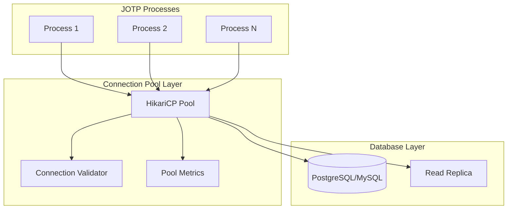

# Connecting JOTP to Databases

<date>2026-03-15</date>

## Overview

Learn how to integrate JOTP processes with relational databases using JDBC, connection pools, and reactive patterns while maintaining fault tolerance and avoiding connection leaks.

## Benefits

- **Connection Pooling**: Efficient database connection management
- **Fault Tolerance**: Automatic recovery from database failures
- **Async Operations**: Non-blocking database queries
- **Transaction Safety**: Proper resource cleanup on process crashes
- **Backpressure Prevention**: Handle database overload gracefully

## Architecture



## Prerequisites

- Java 26 with `--enable-preview`
- PostgreSQL 14+ or MySQL 8+
- Maven 4.x
- JOTP core dependency

## Dependencies

Add to your `pom.xml`:

```xml
<dependencies>
    <!-- JOTP Core -->
    <dependency>
        <groupId>io.github.seanchatmangpt</groupId>
        <artifactId>jotp-core</artifactId>
        <version>1.0.0</version>
    </dependency>

    <!-- HikariCP Connection Pool -->
    <dependency>
        <groupId>com.zaxxer</groupId>
        <artifactId>HikariCP</artifactId>
        <version>5.1.0</version>
    </dependency>

    <!-- PostgreSQL Driver -->
    <dependency>
        <groupId>org.postgresql</groupId>
        <artifactId>postgresql</artifactId>
        <version>42.7.1</version>
    </dependency>

    <!-- MySQL Driver (alternative) -->
    <dependency>
        <groupId>com.mysql</groupId>
        <artifactId>mysql-connector-j</artifactId>
        <version>8.2.0</version>
    </dependency>

    <!-- Flyway for Migrations -->
    <dependency>
        <groupId>org.flywaydb</groupId>
        <artifactId>flyway-core</artifactId>
        <version>10.4.1</version>
    </dependency>
</dependencies>
```

## Configuration

### Database Configuration

```java
public record DatabaseConfig(
    String url,
    String username,
    String password,
    int poolSize,
    long connectionTimeout,
    long maxLifetime
) {
    public static DatabaseConfig fromEnv() {
        return new DatabaseConfig(
            System.getenv("DB_URL"),
            System.getenv("DB_USER"),
            System.getenv("DB_PASSWORD"),
            Integer.parseInt(System.getenv().getOrDefault("DB_POOL_SIZE", "10")),
            Long.parseLong(System.getenv().getOrDefault("DB_CONN_TIMEOUT", "30000")),
            Long.parseLong(System.getenv().getOrDefault("DB_MAX_LIFETIME", "1800000"))
        );
    }
}
```

### Connection Pool Setup

```java
public class DatabaseConnectionPool {

    private final HikariDataSource dataSource;

    public DatabaseConnectionPool(DatabaseConfig config) {
        HikariConfig hikariConfig = new HikariConfig();
        hikariConfig.setJdbcUrl(config.url());
        hikariConfig.setUsername(config.username());
        hikariConfig.setPassword(config.password());
        hikariConfig.setMaximumPoolSize(config.poolSize());
        hikariConfig.setConnectionTimeout(config.connectionTimeout());
        hikariConfig.setMaxLifetime(config.maxLifetime());

        // JOTP-specific optimizations
        hikariConfig.addDataSourceProperty("prepStmtCacheSize", "250");
        hikariConfig.addDataSourceProperty("prepStmtCacheSqlLimit", "2048");
        hikariConfig.addDataSourceProperty("useServerPrepStmts", "true");
        hikariConfig.addDataSourceProperty("useLocalSessionState", "true");

        this.dataSource = new HikariDataSource(hikariConfig);
    }

    public Connection getConnection() throws SQLException {
        return dataSource.getConnection();
    }

    public void close() {
        dataSource.close();
    }

    public HikariPoolMXBean getPoolMetrics() {
        return dataSource.getHikariPoolMXBean();
    }
}
```

## JOTP Integration Patterns

### Pattern 1: Connection Per Process

Each process borrows a connection for its lifetime:

```java
public sealed interface DbState {
    record Initializing() implements DbState {}
    record Connected(Connection conn) implements DbState {}
    record Processing() implements DbState {}
    record Closed() implements DbState {}
}

public sealed interface DbEvent {
    record Initialize() implements DbEvent {}
    record ExecuteQuery(String sql) implements DbEvent {}
    record QueryComplete(ResultSet rs) implements DbEvent {}
    record Close() implements DbEvent {}
}

public record DbContext(
    DatabaseConnectionPool pool,
    Optional<Connection> connection
) {
    public DbContext(DatabaseConnectionPool pool) {
        this(pool, Optional.empty());
    }
}

public class DatabaseProcess {

    static Proc<DbContext, DbEvent> create(DatabaseConnectionPool pool) {
        return Proc.spawn(
            new DbContext(pool),
            (ctx, event) -> handleEvent(ctx, event),
            new DbState.Initializing()
        );
    }

    private static Proc.StateResult<DbContext, Void> handleEvent(
        DbContext ctx, DbEvent event
    ) {
        return switch (event) {
            case DbEvent.Initialize() -> {
                Connection conn = ctx.pool().getConnection();
                yield new Proc.StateResult<>(
                    new DbContext(ctx.pool(), Optional.of(conn)),
                    null
                );
            }

            case DbEvent.ExecuteQuery(var sql) -> {
                if (ctx.connection().isEmpty()) {
                    throw new RuntimeException("Not connected to database");
                }
                Connection conn = ctx.connection().get();
                Statement stmt = conn.createStatement();
                ResultSet rs = stmt.executeQuery(sql);

                // Send result back via message
                yield new Proc.StateResult<>(ctx, null);
            }

            case DbEvent.Close() -> {
                ctx.connection().ifPresent(conn -> {
                    try {
                        conn.close();
                    } catch (SQLException e) {
                        // Let supervisor handle cleanup
                        throw new RuntimeException(e);
                    }
                });
                yield new Proc.StateResult<>(
                    new DbContext(ctx.pool(), Optional.empty()),
                    null
                );
            }
        };
    }
}
```

### Pattern 2: Query-Execute-Release Pattern

Borrow connection only for query duration:

```java
public class DatabaseRepository {

    private final DatabaseConnectionPool pool;

    public <T> Result<T, Exception> executeQuery(
        String sql,
        Function<ResultSet, T> mapper
    ) {
        Connection conn = null;
        PreparedStatement stmt = null;
        ResultSet rs = null;

        try {
            conn = pool.getConnection();
            stmt = conn.prepareStatement(sql);
            rs = stmt.executeQuery();

            T result = mapper.apply(rs);
            return Result.success(result);

        } catch (Exception e) {
            return Result.failure(e);
        } finally {
            // Ensure resources are closed
            closeQuietly(rs);
            closeQuietly(stmt);
            closeQuietly(conn);
        }
    }

    private void closeQuietly(AutoCloseable resource) {
        if (resource != null) {
            try {
                resource.close();
            } catch (Exception e) {
                // Log but don't throw
            }
        }
    }
}
```

### Pattern 3: Async Database Operations

Non-blocking database queries with completable futures:

```java
public class AsyncDatabaseProcess {

    private final ExecutorService dbExecutor;
    private final DatabaseRepository repository;

    public CompletableFuture<OrderData> loadOrder(String orderId) {
        return CompletableFuture.supplyAsync(
            () -> repository.executeQuery(
                "SELECT * FROM orders WHERE id = ?",
                rs -> rs.next() ? mapToOrder(rs) : null
            ),
            dbExecutor
        ).thenApply(result -> result.orElseThrow());
    }

    public Proc<ProcessState, DbEvent> create() {
        return Proc.spawn(
            new ProcessState(),
            (ctx, event) -> handleEvent(ctx, event),
            null
        );
    }

    private Proc.StateResult<ProcessState, Void> handleEvent(
        ProcessState ctx, DbEvent event
    ) {
        return switch (event) {
            case DbEvent.LoadOrder(var orderId) -> {
                // Initiate async load
                loadOrder(orderId)
                    .thenAccept(order -> {
                        // Send result back to self
                        self().send(new DbEvent.OrderLoaded(order));
                    });

                yield new Proc.StateResult<>(ctx, null);
            }

            case DbEvent.OrderLoaded(var order) -> {
                // Process loaded order
                yield new Proc.StateResult<>(
                    ctx.withOrder(order),
                    null
                );
            }
        };
    }
}
```

## Transaction Management

### Transaction Per Process

```java
public record TransactionState(
    Connection connection,
    boolean committed
) {}

public class TransactionalProcess {

    static Proc<TransactionState, TxEvent> create(Connection conn) {
        try {
            conn.setAutoCommit(false);

            return Proc.spawn(
                new TransactionState(conn, false),
                (ctx, event) -> handleTransactionEvent(ctx, event),
                null
            );

        } catch (SQLException e) {
            throw new RuntimeException("Failed to start transaction", e);
        }
    }

    private static Proc.StateResult<TransactionState, Void> handleTransactionEvent(
        TransactionState ctx, TxEvent event
    ) {
        return switch (event) {
            case TxEvent.Commit() -> {
                try {
                    ctx.connection().commit();
                    yield new Proc.StateResult<>(
                        new TransactionState(ctx.connection(), true),
                        null
                    );
                } catch (SQLException e) {
                    throw new RuntimeException("Commit failed", e);
                }
            }

            case TxEvent.Rollback() -> {
                try {
                    ctx.connection().rollback();
                    yield new Proc.StateResult<>(
                        new TransactionState(ctx.connection(), false),
                        null
                    );
                } catch (SQLException e) {
                    throw new RuntimeException("Rollback failed", e);
                }
            }
        };
    }
}
```

### Saga Pattern with Database

```java
public class OrderSaga {

    private final DatabaseRepository repo;

    public Result<SagaOutcome, SagaError> executeOrderSaga(OrderData order) {
        Connection conn = null;

        try {
            conn = pool.getConnection();
            conn.setAutoCommit(false);

            // Step 1: Create order
            String orderId = createOrder(conn, order);

            // Step 2: Reserve inventory
            String reservationId = reserveInventory(conn, order.getItems());

            // Step 3: Process payment
            String transactionId = processPayment(conn, order.getAmount());

            // All steps succeeded - commit
            conn.commit();

            return Result.success(new SagaOutcome(orderId, transactionId, reservationId));

        } catch (Exception e) {
            // Compensate - rollback transaction
            if (conn != null) {
                try {
                    conn.rollback();
                } catch (SQLException rollbackEx) {
                    // Log rollback failure
                }
            }
            return Result.failure(new SagaError("Saga failed", List.of(e.getMessage())));
        } finally {
            closeQuietly(conn);
        }
    }
}
```

## Connection Pool Monitoring

### Process for Pool Metrics

```java
public class PoolMonitoringProcess {

    static Proc<MonitoringState, MonitoringEvent> create(DatabaseConnectionPool pool) {
        return Proc.spawn(
            new MonitoringState(pool),
            (ctx, event) -> handleMonitoringEvent(ctx, event),
            null
        );
    }

    private static Proc.StateResult<MonitoringState, Void> handleMonitoringEvent(
        MonitoringState ctx, MonitoringEvent event
    ) {
        return switch (event) {
            case MonitoringEvent.CheckPool() -> {
                var metrics = ctx.pool().getPoolMetrics();

                System.out.printf(
                    "Pool Status: Active=%d, Idle=%d, Waiting=%d, Total=%d%n",
                    metrics.getActiveConnections(),
                    metrics.getIdleConnections(),
                    metrics.getThreadsAwaitingConnection(),
                    metrics.getTotalConnections()
                );

                // Alert if pool is exhausted
                if (metrics.getActiveConnections() >= metrics.getTotalConnections()) {
                    System.out.println("WARNING: Connection pool exhausted!");
                }

                // Schedule next check
                ProcTimer.sendAfter(
                    ctx.self(),
                    Duration.ofSeconds(30),
                    new MonitoringEvent.CheckPool()
                );

                yield new Proc.StateResult<>(ctx, null);
            }
        };
    }
}
```

## Fault Tolerance

### Supervisor for Database Operations

```java
public class DatabaseSupervisor {

    static Supervisor create(DatabaseConnectionPool pool) {
        return Supervisor.create()
            .withStrategy(RestartStrategy.ONE_FOR_ONE)
            .withMaxRestarts(3)
            .withChild(ChildSpec.of(
                "db-worker-1",
                () -> DatabaseProcess.create(pool),
                RestartType.TEMPORARY
            ))
            .withChild(ChildSpec.of(
                "db-worker-2",
                () -> DatabaseProcess.create(pool),
                RestartType.TEMPORARY
            ))
            .onChildExit((childId, reason) -> {
                System.out.println("Database process " + childId + " exited: " + reason);
            })
            .start();
    }
}
```

### Circuit Breaker for Database

```java
public class DatabaseCircuitBreaker {

    private final CircuitBreaker<DbRequest, DbResult, Exception> breaker;

    public DatabaseCircuitBreaker(DatabaseConnectionPool pool) {
        this.breaker = CircuitBreaker.create(
            "database",
            5, // Max failures
            Duration.ofSeconds(60), // Window
            Duration.ofSeconds(30) // Timeout
        );
    }

    public Result<DbResult, Exception> execute(DbRequest request) {
        var result = breaker.execute(request, req -> {
            // Execute database query
            return performQuery(req);
        });

        return switch (result) {
            case CircuitBreaker.CircuitBreakerResult.Success<DbResult, Exception>(var value) ->
                Result.success(value);
            case CircuitBreaker.CircuitBreakerResult.Failure<DbResult, Exception>(var error) ->
                Result.failure(error);
            case CircuitBreaker.CircuitBreakerResult.CircuitOpen<DbResult, Exception> ignored ->
                Result.failure(new Exception("Circuit breaker open"));
        };
    }
}
```

## Best Practices

1. **Always use connection pools**: Never create connections per query
2. **Release connections promptly**: Use try-with-resources or finally blocks
3. **Set appropriate timeouts**: Prevent indefinite waits
4. **Monitor pool metrics**: Track active, idle, and waiting connections
5. **Handle connection failures**: Let supervisors restart failed processes
6. **Use transactions for multi-step operations**: Ensure atomicity
7. **Implement backpressure**: Reject requests when pool is exhausted

## Testing

### Unit Tests with H2

```java
@Test
void shouldExecuteDatabaseQuery() {
    // Use H2 in-memory database
    var config = new DatabaseConfig("jdbc:h2:mem:test", "sa", "", 5, 30000, 1800000);
    var pool = new DatabaseConnectionPool(config);

    var process = DatabaseProcess.create(pool);

    process.send(new DbEvent.Initialize());
    process.send(new DbEvent.ExecuteQuery("SELECT 1"));

    await().atMost(5, TimeUnit.SECONDS)
        .until(() -> process.getState() instanceof DbState.Processing);
}
```

### Integration Tests

```java
@Testcontainers
class DatabaseIntegrationTest {

    @Container
    PostgreSQLContainer<?> postgres = new PostgreSQLContainer<>("postgres:16");

    @Test
    void shouldHandleDatabaseFailures() {
        var config = new DatabaseConfig(
            postgres.getJdbcUrl(),
            postgres.getUsername(),
            postgres.getPassword(),
            10,
            30000,
            1800000
        );

        var pool = new DatabaseConnectionPool(config);
        var supervisor = DatabaseSupervisor.create(pool);

        // Test connection recovery
        postgres.stop();
        // Verify supervisor handles failure

        postgres.start();
        // Verify supervisor recovers
    }
}
```

## Production Considerations

1. **Set appropriate pool sizes**: Formula = `cores * 2 + effective_spindle_count`
2. **Enable connection testing**: Validate connections before use
3. **Configure connection limits**: Match database `max_connections`
4. **Monitor slow queries**: Use database query logging
5. **Implement read replicas**: Offload read queries to replicas
6. **Use connection validation**: Test connections on borrow
7. **Set proper timeouts**: Prevent connection leaks

## Resources

- [HikariCP Documentation](https://github.com/brettwooldridge/HikariCP)
- [PostgreSQL JDBC Driver](https://jdbc.postgresql.org/)
- [MySQL Connector/J](https://dev.mysql.com/doc/connector-j/en/)
- [Flyway Migrations](https://flywaydb.org/documentation/)
- [State Machine Workflows](./state-machine-workflow.md)
