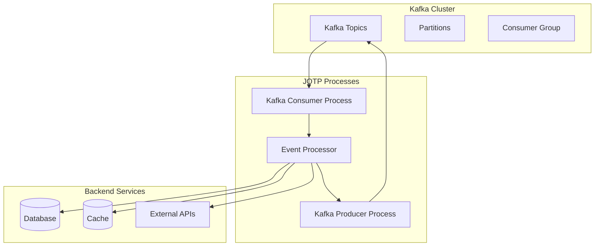

# Using JOTP with Apache Kafka

<date>2026-03-15</date>

## Overview

Learn how to integrate JOTP processes with Apache Kafka for event streaming, message processing, and building event-driven architectures with fault tolerance.

## Benefits

- **Event-Driven Architecture**: Decouple services via events
- **Fault Tolerance**: Automatic recovery from failures
- **Scalability**: Process partitions in parallel
- **Exactly-Once Semantics**: Reliable message delivery
- **Backpressure**: Handle consumer lag gracefully

## Architecture



## Prerequisites

- Java 26 with `--enable-preview`
- Apache Kafka 3.x
- Maven 4.x
- JOTP core dependency

## Dependencies

Add to your `pom.xml`:

```xml
<dependencies>
    <!-- JOTP Core -->
    <dependency>
        <groupId>io.github.seanchatmangpt</groupId>
        <artifactId>jotp-core</artifactId>
        <version>1.0.0</version>
    </dependency>

    <!-- Kafka Clients -->
    <dependency>
        <groupId>org.apache.kafka</groupId>
        <artifactId>kafka-clients</artifactId>
        <version>3.6.1</version>
    </dependency>

    <!-- Avro (for schema serialization) -->
    <dependency>
        <groupId>org.apache.avro</groupId>
        <artifactId>avro</artifactId>
        <version>1.11.3</version>
    </dependency>

    <!-- JSON Serialization -->
    <dependency>
        <groupId>com.fasterxml.jackson.core</groupId>
        <artifactId>jackson-databind</artifactId>
        <version>2.16.0</version>
    </dependency>
</dependencies>
```

## Configuration

### Kafka Configuration

```java
public record KafkaConfig(
    String bootstrapServers,
    String groupId,
    String clientId,
    int pollTimeoutMs,
    int maxPollRecords,
    int sessionTimeoutMs,
    int heartbeatIntervalMs,
    boolean enableAutoCommit,
    String autoOffsetReset
) {
    public static KafkaConfig fromEnv() {
        return new KafkaConfig(
            System.getenv().getOrDefault("KAFKA_BOOTSTRAP_SERVERS", "localhost:9092"),
            System.getenv().getOrDefault("KAFKA_GROUP_ID", "jotp-consumer-group"),
            System.getenv().getOrDefault("KAFKA_CLIENT_ID", "jotp-client"),
            Integer.parseInt(System.getenv().getOrDefault("KAFKA_POLL_TIMEOUT", "1000")),
            Integer.parseInt(System.getenv().getOrDefault("KAFKA_MAX_POLL_RECORDS", "500")),
            Integer.parseInt(System.getenv().getOrDefault("KAFKA_SESSION_TIMEOUT", "30000")),
            Integer.parseInt(System.getenv().getOrDefault("KAFKA_HEARTBEAT_INTERVAL", "10000")),
            Boolean.parseBoolean(System.getenv().getOrDefault("KAFKA_AUTO_COMMIT", "false")),
            System.getenv().getOrDefault("KAFKA_AUTO_OFFSET_RESET", "earliest")
        );
    }

    public Properties toProperties() {
        Properties props = new Properties();
        props.put(ConsumerConfig.BOOTSTRAP_SERVERS_CONFIG, bootstrapServers());
        props.put(ConsumerConfig.GROUP_ID_CONFIG, groupId());
        props.put(ConsumerConfig.CLIENT_ID_CONFIG, clientId());
        props.put(ConsumerConfig.POLL_TIMEOUT_MS_CONFIG, pollTimeoutMs());
        props.put(ConsumerConfig.MAX_POLL_RECORDS_CONFIG, maxPollRecords());
        props.put(ConsumerConfig.SESSION_TIMEOUT_MS_CONFIG, sessionTimeoutMs());
        props.put(ConsumerConfig.HEARTBEAT_INTERVAL_MS_CONFIG, heartbeatIntervalMs());
        props.put(ConsumerConfig.ENABLE_AUTO_COMMIT_CONFIG, enableAutoCommit());
        props.put(ConsumerConfig.AUTO_OFFSET_RESET_CONFIG, autoOffsetReset());

        // Use efficient deserializers
        props.put(ConsumerConfig.KEY_DESERIALIZER_CLASS_CONFIG,
            StringDeserializer.class.getName());
        props.put(ConsumerConfig.VALUE_DESERIALIZER_CLASS_CONFIG,
            JsonDeserializer.class.getName());

        return props;
    }
}
```

## Kafka Consumer Process

### Consumer State Machine

```java
public sealed interface ConsumerState {
    record Initialized() implements ConsumerState {}
    record Polling(long lastPollTime) implements ConsumerState {}
    record Processing(List<ConsumerRecord<String, Event>> records) implements ConsumerState {}
    record Paused() implements ConsumerState {}
    record Closed() implements ConsumerState {}
}

public sealed interface ConsumerEvent {
    record StartPolling() implements ConsumerEvent {}
    record RecordsReceived(List<ConsumerRecord<String, Event>> records) implements ConsumerEvent {}
    record RecordsProcessed() implements ConsumerEvent {}
    record PauseConsumption() implements ConsumerEvent {}
    record ResumeConsumption() implements ConsumerEvent {}
    record StopConsumption() implements ConsumerEvent {}
}

public record ConsumerContext(
    KafkaConsumer<String, Event> consumer,
    List<String> subscribedTopics,
    Map<String, EventProcessor> processors
) {}
```

### Consumer Process Implementation

```java
public class KafkaConsumerProcess {

    static Proc<ConsumerContext, ConsumerEvent> create(
        KafkaConfig config,
        List<String> topics
    ) {
        KafkaConsumer<String, Event> consumer = new KafkaConsumer<>(config.toProperties());
        consumer.subscribe(topics);

        return Proc.spawn(
            new ConsumerContext(consumer, topics, new HashMap<>()),
            (ctx, event) -> handleConsumerEvent(ctx, event),
            new ConsumerState.Initialized()
        );
    }

    private static Proc.StateResult<ConsumerContext, Void> handleConsumerEvent(
        ConsumerContext ctx, ConsumerEvent event
    ) {
        return switch (event) {
            case ConsumerEvent.StartPolling() -> {
                // Poll for records
                ConsumerRecords<String, Event> records = ctx.consumer().poll(
                    Duration.ofMillis(1000)
                );

                if (!records.isEmpty()) {
                    List<ConsumerRecord<String, Event>> recordList =
                        new ArrayList<>(records.count());

                    for (ConsumerRecord<String, Event> record : records) {
                        recordList.add(record);
                    }

                    // Send to self for processing
                    ctx.self().send(new ConsumerEvent.RecordsReceived(recordList));
                }

                // Schedule next poll
                ProcTimer.sendAfter(
                    ctx.self(),
                    Duration.ofMillis(100),
                    new ConsumerEvent.StartPolling()
                );

                yield new Proc.StateResult<>(
                    ctx,
                    new ConsumerState.Polling(System.currentTimeMillis())
                );
            }

            case ConsumerEvent.RecordsReceived(var records) -> {
                // Process each record
                for (ConsumerRecord<String, Event> record : records) {
                    // Find or create processor for partition
                    String processorKey = record.topic() + "-" + record.partition();
                    EventProcessor processor = ctx.processers().computeIfAbsent(
                        processorKey,
                        k -> EventProcessor.create(record.topic(), record.partition())
                    );

                    // Send event to processor
                    processor.send(new ProcessorEvent.ProcessRecord(record));
                }

                yield new Proc.StateResult<>(
                    ctx,
                    new ConsumerState.Processing(records)
                );
            }

            case ConsumerEvent.RecordsProcessed() -> {
                // Commit offsets
                ctx.consumer().commitSync();

                yield new Proc.StateResult<>(
                    ctx,
                    new ConsumerState.Polling(System.currentTimeMillis())
                );
            }

            case ConsumerEvent.PauseConsumption() -> {
                ctx.consumer().pause(
                    ctx.consumer().assignment()
                );

                yield new Proc.StateResult<>(
                    ctx,
                    new ConsumerState.Paused()
                );
            }

            case ConsumerEvent.ResumeConsumption() -> {
                ctx.consumer().resume(
                    ctx.consumer().assignment()
                );

                // Resume polling
                ctx.self().send(new ConsumerEvent.StartPolling());

                yield new Proc.StateResult<>(
                    ctx,
                    new ConsumerState.Polling(System.currentTimeMillis())
                );
            }

            case ConsumerEvent.StopConsumption() -> {
                ctx.consumer().close();
                yield new Proc.StateResult<>(
                    ctx,
                    new ConsumerState.Closed()
                );
            }
        };
    }
}
```

## Event Processor

### Processor for Each Partition

```java
public sealed interface ProcessorState {
    record Idle() implements ProcessorState {}
    record Processing(ConsumerRecord<String, Event> currentRecord) implements ProcessorState {}
}

public sealed interface ProcessorEvent {
    record ProcessRecord(ConsumerRecord<String, Event> record) implements ProcessorEvent {}
    record RecordProcessed() implements ProcessorEvent {}
    record RecordFailed(Exception error) implements ProcessorEvent {}
}

public record ProcessorContext(
    String topic,
    int partition,
    long processedCount
) {}

public class EventProcessor {

    static Proc<ProcessorContext, ProcessorEvent> create(String topic, int partition) {
        return Proc.spawn(
            new ProcessorContext(topic, partition, 0),
            EventProcessor::handleProcessorEvent,
            new ProcessorState.Idle()
        );
    }

    private static Proc.StateResult<ProcessorContext, Void> handleProcessorEvent(
        ProcessorContext ctx, ProcessorEvent event
    ) {
        return switch (event) {
            case ProcessorEvent.ProcessRecord(var record) -> {
                try {
                    // Process event
                    processEvent(record.value());

                    yield new Proc.StateResult<>(
                        new ProcessorContext(
                            ctx.topic(),
                            ctx.partition(),
                            ctx.processedCount() + 1
                        ),
                        new ProcessorState.Processing(record)
                    );
                } catch (Exception e) {
                    // Let supervisor handle failure
                    throw new RuntimeException("Failed to process record", e);
                }
            }

            case ProcessorEvent.RecordProcessed() -> {
                yield new Proc.StateResult<>(
                    ctx,
                    new ProcessorState.Idle()
                );
            }

            case ProcessorEvent.RecordFailed(var error) -> {
                // Log error and continue
                System.err.printf("Failed to process record: %s%n", error.getMessage());
                yield new Proc.StateResult<>(
                    ctx,
                    new ProcessorState.Idle()
                );
            }
        };
    }

    private static void processEvent(Event event) {
        // Business logic here
        System.out.println("Processing event: " + event);
    }
}
```

## Kafka Producer

### Producer Process

```java
public sealed interface ProducerState {
    record Ready() implements ProducerState {}
    record Sending() implements ProducerState {}
}

public sealed interface ProducerEvent {
    record Produce(String topic, String key, Event value, CompletableFuture<RecordMetadata> future)
        implements ProducerEvent {}
    record Produced(RecordMetadata metadata) implements ProducerEvent {}
    record ProduceFailed(Exception error) implements ProducerEvent {}
}

public record ProducerContext(
    KafkaProducer<String, Event> producer
) {}

public class KafkaProducerProcess {

    static Proc<ProducerContext, ProducerEvent> create(KafkaConfig config) {
        Properties props = new Properties();
        props.put(ProducerConfig.BOOTSTRAP_SERVERS_CONFIG, config.bootstrapServers());
        props.put(ProducerConfig.CLIENT_ID_CONFIG, config.clientId());
        props.put(ProducerConfig.KEY_SERIALIZER_CLASS_CONFIG,
            StringSerializer.class.getName());
        props.put(ProducerConfig.VALUE_SERIALIZER_CLASS_CONFIG,
            JsonSerializer.class.getName());
        props.put(ProducerConfig.ACKS_CONFIG, "all");
        props.put(ProducerConfig.RETRIES_CONFIG, 3);
        props.put(ProducerConfig.ENABLE_IDEMPOTENCE_CONFIG, true);

        KafkaProducer<String, Event> producer = new KafkaProducer<>(props);

        return Proc.spawn(
            new ProducerContext(producer),
            KafkaProducerProcess::handleProducerEvent,
            new ProducerState.Ready()
        );
    }

    private static Proc.StateResult<ProducerContext, Void> handleProducerEvent(
        ProducerContext ctx, ProducerEvent event
    ) {
        return switch (event) {
            case ProducerEvent.Produce(var topic, var key, var value, var future) -> {
                // Send asynchronously
                ctx.producer().send(
                    new ProducerRecord<>(topic, key, value),
                    (metadata, exception) -> {
                        if (exception == null) {
                            ctx.self().send(new ProducerEvent.Produced(metadata));
                        } else {
                            ctx.self().send(new ProducerEvent.ProduceFailed(exception));
                        }
                    }
                );

                yield new Proc.StateResult<>(
                    ctx,
                    new ProducerState.Sending()
                );
            }

            case ProducerEvent.Produced(var metadata) -> {
                System.out.printf("Message sent to %s-%d@%d%n",
                    metadata.topic(), metadata.partition(), metadata.offset());

                yield new Proc.StateResult<>(
                    ctx,
                    new ProducerState.Ready()
                );
            }

            case ProducerEvent.ProduceFailed(var error) -> {
                System.err.printf("Failed to send message: %s%n", error.getMessage());
                // Let supervisor handle retries
                throw new RuntimeException("Producer failed", error);
            }
        };
    }

    public static CompletableFuture<RecordMetadata> produce(
        Proc<ProducerContext, ProducerEvent> producer,
        String topic,
        String key,
        Event value
    ) {
        CompletableFuture<RecordMetadata> future = new CompletableFuture<>();
        producer.send(new ProducerEvent.Produce(topic, key, value, future));
        return future;
    }
}
```

## Consumer Group Supervisor

### Supervision Tree for Kafka

```java
public class KafkaConsumerSupervisor {

    static Supervisor create(KafkaConfig config, List<String> topics, int consumerCount) {
        return Supervisor.create()
            .withStrategy(RestartStrategy.ONE_FOR_ONE)
            .withMaxRestarts(3)
            .build()
            .start()
            .thenCompose(supervisor -> {
                // Start consumers under supervision
                List<CompletableFuture<Void>> futures = new ArrayList<>();

                for (int i = 0; i < consumerCount; i++) {
                    int consumerId = i;
                    CompletableFuture<Void> future = supervisor.addChild(
                        ChildSpec.of(
                            "kafka-consumer-" + i,
                            () -> KafkaConsumerProcess.create(config, topics),
                            RestartType.PERMANENT
                        )
                    );
                    futures.add(future);
                }

                return CompletableFuture.allOf(futures.toArray(new CompletableFuture[0]))
                    .thenApply(v -> supervisor);
            })
            .join();
    }
}
```

## Event Sourcing with Kafka

### Event Sourcing Pattern

```java
public class EventSourcingProcessor {

    private final DatabaseConnectionPool dbPool;

    public void processEvent(ConsumerRecord<String, Event> record) {
        Event event = record.value();

        // Persist event to database
        try (Connection conn = dbPool.getConnection()) {
            // Save event to event store
            saveEvent(conn, event);

            // Apply event to aggregate
            applyEvent(event);

            // Commit transaction
            conn.commit();

        } catch (Exception e) {
            // Event will be reprocessed by Kafka
            throw new RuntimeException("Failed to process event", e);
        }
    }

    private void saveEvent(Connection conn, Event event) throws SQLException {
        String sql = """
            INSERT INTO event_store (event_id, aggregate_id, event_type, event_data, timestamp)
            VALUES (?, ?, ?, ?, ?)
            """;

        try (PreparedStatement stmt = conn.prepareStatement(sql)) {
            stmt.setString(1, event.id());
            stmt.setString(2, event.aggregateId());
            stmt.setString(3, event.type());
            stmt.setString(4, event.data());
            stmt.setLong(5, event.timestamp());
            stmt.executeUpdate();
        }
    }

    private void applyEvent(Event event) {
        // Apply event to aggregate state
        // This updates the read model
    }
}
```

## CQRS with Kafka

### Command and Query Separation

```java
public class CQRSProcessor {

    // Write side: Handle commands
    public void handleCommand(CommandEvent command) {
        // Validate command
        validateCommand(command);

        // Execute command
        executeCommand(command);

        // Publish event
        publishEvent(new CommandExecutedEvent(command.id()));
    }

    // Read side: Handle events
    public void handleEvent(DomainEvent event) {
        // Update read model
        updateReadModel(event);
    }

    private void updateReadModel(DomainEvent event) {
        // Update projection/database
        // This is optimized for queries
    }
}
```

## Testing

### Unit Tests

```java
@Test
void shouldProcessKafkaMessage() {
    // Use embedded Kafka for testing
    EmbeddedKafkaRule kafkaRule = new EmbeddedKafkaRule(1, true, "test-topic");

    KafkaConfig config = new KafkaConfig(
        kafkaRule.getEmbeddedKafka().getBrokersAsString(),
        "test-group",
        "test-client",
        1000,
        500,
        30000,
        10000,
        false,
        "earliest"
    );

    var consumer = KafkaConsumerProcess.create(
        config,
        List.of("test-topic")
    );

    // Send test message
    var producer = KafkaProducerProcess.create(config);
    KafkaProducerProcess.produce(
        producer,
        "test-topic",
        "key",
        new TestEvent("test-id", "test-data")
    ).join();

    // Verify processing
    await().atMost(10, TimeUnit.SECONDS)
        .until(() -> consumer.getProcessedCount() > 0);
}
```

## Production Considerations

1. **Consumer Group Management**: Use unique group IDs for different services
2. **Offset Management**: Disable auto-commit for better control
3. **Backpressure**: Pause consumption when overloaded
4. **Dead Letter Queues**: Route failed messages to DLQ topics
5. **Monitoring**: Track consumer lag, processing rates
6. **Schema Evolution**: Use Avro or Protobuf for schemas
7. **Security**: Enable SASL/SSL for production
8. **Exactly-Once**: Use transactions for critical operations

## Best Practices

1. **One consumer per thread**: Don't share consumer instances
2. **Commit offsets after processing**: Ensure at-least-once delivery
3. **Use separate producer/consumer**: Don't mix them
4. **Handle deserialization errors**: Use dead letter queues
5. **Monitor consumer lag**: Prevent falling behind
6. **Use compacted topics**: For stateful operations
7. **Test with embedded Kafka**: For unit tests
8. **Graceful shutdown**: Commit offsets before stopping

## Resources

- [Apache Kafka Documentation](https://kafka.apache.org/documentation/)
- [Kafka Clients API](https://kafka.apache.org/36/javadoc/index.html)
- [Confluent Kafka Documentation](https://docs.confluent.io/)
- [State Machine Workflows](./state-machine-workflow.md)
- [Building Supervision Trees](./build-supervision-trees.md)
