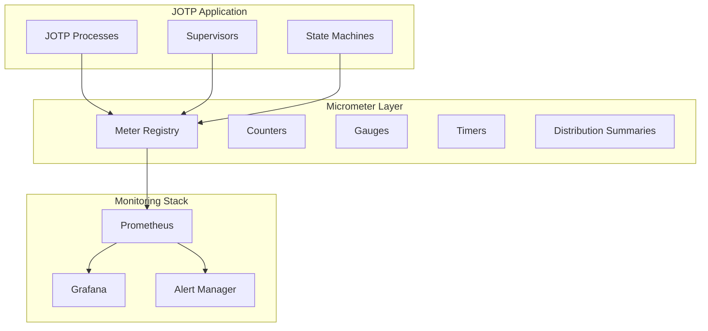

# Monitoring JOTP with Micrometer

<date>2026-03-15</date>

## Overview

Learn how to monitor JOTP applications using Micrometer for metrics collection, Prometheus for scraping, and Grafana for visualization.

## Benefits

- **Production-Ready Metrics**: Industry-standard monitoring
- **Multiple Backends**: Prometheus, Datadog, CloudWatch, etc.
- **Custom Metrics**: Track JOTP-specific metrics
- **Alerting**: Set up alerts on anomalies
- **Performance Insights**: Identify bottlenecks

## Architecture



## Prerequisites

- Java 26 with `--enable-preview`
- Maven 4.x
- JOTP core dependency
- Prometheus server
- Grafana instance

## Dependencies

Add to your `pom.xml`:

```xml
<dependencies>
    <!-- JOTP Core -->
    <dependency>
        <groupId>io.github.seanchatmangpt</groupId>
        <artifactId>jotp-core</artifactId>
        <version>1.0.0</version>
    </dependency>

    <!-- Micrometer Core -->
    <dependency>
        <groupId>io.micrometer</groupId>
        <artifactId>micrometer-core</artifactId>
        <version>1.12.3</version>
    </dependency>

    <!-- Micrometer Prometheus Registry -->
    <dependency>
        <groupId>io.micrometer</groupId>
        <artifactId>micrometer-registry-prometheus</artifactId>
        <version>1.12.3</version>
    </dependency>

    <!-- Micrometer StatsD (alternative) -->
    <dependency>
        <groupId>io.micrometer</groupId>
        <artifactId>micrometer-registry-statsd</artifactId>
        <version>1.12.3</version>
    </dependency>

    <!-- Simple HTTP Server for metrics endpoint -->
    <dependency>
        <groupId>com.sun.net.httpserver</groupId>
        <artifactId>http</artifactId>
        <version>1.0.0</version>
        <scope>system</scope>
        <systemPath>${java.home}/lib/jrt-fs.jar</systemPath>
    </dependency>
</dependencies>
```

## Configuration

### Micrometer Configuration

```java
public record MonitoringConfig(
    String applicationName,
    String prometheusEndpoint,
    int prometheusPort,
    boolean enableJvmMetrics,
    boolean enableSystemMetrics,
    List<String> tags
) {
    public static MonitoringConfig fromEnv() {
        return new MonitoringConfig(
            System.getenv().getOrDefault("APP_NAME", "jotp-app"),
            System.getenv().getOrDefault("PROMETHEUS_ENDPOINT", "/metrics"),
            Integer.parseInt(System.getenv().getOrDefault("PROMETHEUS_PORT", "9090")),
            Boolean.parseBoolean(System.getenv().getOrDefault("ENABLE_JVM_METRICS", "true")),
            Boolean.parseBoolean(System.getenv().getOrDefault("ENABLE_SYSTEM_METRICS", "true")),
            List.of(System.getenv().getOrDefault("TAGS", "").split(","))
                .stream()
                .filter(s -> !s.isEmpty())
                .toList()
        );
    }
}
```

### Metrics Registry Setup

```java
public class JotpMetricsRegistry {

    private final PrometheusMeterRegistry registry;
    private final HttpServer metricsServer;

    public JotpMetricsRegistry(MonitoringConfig config) throws IOException {
        // Create Prometheus registry
        this.registry = new PrometheusMeterRegistry(PrometheusConfig.DEFAULT);

        // Add common tags
        registry.config().commonTags(
            "application", config.applicationName(),
            "environment", System.getenv().getOrDefault("ENV", "development")
        );

        // Add custom tags from config
        for (String tag : config.tags()) {
            String[] parts = tag.split("=");
            if (parts.length == 2) {
                registry.config().commonTags(parts[0], parts[1]);
            }
        }

        // Enable JVM metrics
        if (config.enableJvmMetrics()) {
            new JvmMemoryMetrics().bindTo(registry);
            new JvmGcMetrics().bindTo(registry);
            new JvmThreadMetrics().bindTo(registry);
            new JvmCompilationMetrics().bindTo(registry);
        }

        // Enable system metrics
        if (config.enableSystemMetrics()) {
            new ProcessorMetrics().bindTo(registry);
            new UptimeMetrics().bindTo(registry);
            new FileDescriptorMetrics().bindTo(registry);
        }

        // Start HTTP server for metrics endpoint
        InetSocketAddress addr = new InetSocketAddress(config.prometheusPort());
        this.metricsServer = HttpServer.create(addr, 0);
        metricsServer.createContext(config.prometheusEndpoint(), exchange -> {
            String response = registry.scrape();
            exchange.sendResponseHeaders(200, response.getBytes().length);
            try (OutputStream os = exchange.getResponseBody()) {
                os.write(response.getBytes());
            }
        });
        metricsServer.start();

        System.out.println("Metrics server started on port " + config.prometheusPort());
    }

    public PrometheusMeterRegistry getRegistry() {
        return registry;
    }

    public void close() {
        metricsServer.stop(0);
        registry.close();
    }
}
```

## JOTP Process Metrics

### Process Lifecycle Metrics

```java
public class ProcessMetrics {

    private final Counter processCreated;
    private final Counter processStarted;
    private final Counter processStopped;
    private final Counter processCrashed;
    private final Gauge processActiveCount;
    private final AtomicInteger activeProcesses = new AtomicInteger(0);

    public ProcessMetrics(PrometheusMeterRegistry registry) {
        this.processCreated = Counter.builder("jotp.process.created")
            .description("Total number of processes created")
            .tags("type", "process")
            .register(registry);

        this.processStarted = Counter.builder("jotp.process.started")
            .description("Total number of processes started")
            .tags("type", "process")
            .register(registry);

        this.processStopped = Counter.builder("jotp.process.stopped")
            .description("Total number of processes stopped normally")
            .tags("type", "process")
            .register(registry);

        this.processCrashed = Counter.builder("jotp.process.crashed")
            .description("Total number of processes that crashed")
            .tags("type", "process")
            .register(registry);

        this.processActiveCount = Gauge.builder("jotp.process.active", activeProcesses, AtomicInteger::get)
            .description("Current number of active processes")
            .tags("type", "process")
            .register(registry);
    }

    public void recordProcessCreated(String processType) {
        Counter.builder("jotp.process.created")
            .tags("type", processType)
            .register(processCreated.getId().getTags())
            .increment();
    }

    public void recordProcessStarted(String processType) {
        processCreated.increment();
        processStarted.increment();
        activeProcesses.incrementAndGet();
    }

    public void recordProcessStopped(String processType) {
        processStopped.increment();
        activeProcesses.decrementAndGet();
    }

    public void recordProcessCrashed(String processType, String reason) {
        processCrashed.increment();
        activeProcesses.decrementAndGet();

        Counter.builder("jotp.process.crashed.reason")
            .tags("type", processType, "reason", reason)
            .register(processCrashed.getId().getTags())
            .increment();
    }
}
```

### Message Processing Metrics

```java
public class MessageMetrics {

    private final Counter messagesReceived;
    private final Counter messagesProcessed;
    private final Counter messagesFailed;
    private final Timer messageProcessingTime;
    private final DistributionSummary mailboxSize;

    public MessageMetrics(PrometheusMeterRegistry registry) {
        this.messagesReceived = Counter.builder("jotp.messages.received")
            .description("Total number of messages received")
            .register(registry);

        this.messagesProcessed = Counter.builder("jotp.messages.processed")
            .description("Total number of messages processed successfully")
            .register(registry);

        this.messagesFailed = Counter.builder("jotp.messages.failed")
            .description("Total number of messages that failed to process")
            .register(registry);

        this.messageProcessingTime = Timer.builder("jotp.messages.processing.time")
            .description("Time taken to process messages")
            .register(registry);

        this.mailboxSize = DistributionSummary.builder("jotp.mailbox.size")
            .description("Distribution of mailbox sizes")
            .register(registry);
    }

    public void recordMessageReceived(String messageType) {
        Counter.builder("jotp.messages.received")
            .tags("type", messageType)
            .register(messagesReceived.getId().getTags())
            .increment();
    }

    public void recordMessageProcessed(String messageType) {
        messagesProcessed.increment();
    }

    public void recordMessageFailed(String messageType, String errorType) {
        messagesFailed.increment();

        Counter.builder("jotp.messages.failed.reason")
            .tags("type", messageType, "error", errorType)
            .register(messagesFailed.getId().getTags())
            .increment();
    }

    public Timer.Sample startMessageProcessing() {
        return Timer.start();
    }

    public void recordMessageProcessingTime(Timer.Sample sample) {
        sample.stop(messageProcessingTime);
    }

    public void recordMailboxSize(int size) {
        mailboxSize.record(size);
    }
}
```

### Supervisor Metrics

```java
public class SupervisorMetrics {

    private final Counter supervisorRestarts;
    private final Counter supervisorShutdowns;
    private final Timer supervisorRestartTime;
    private final Gauge activeChildrenCount;

    public SupervisorMetrics(PrometheusMeterRegistry registry) {
        this.supervisorRestarts = Counter.builder("jotp.supervisor.restarts")
            .description("Total number of supervisor-initiated restarts")
            .register(registry);

        this.supervisorShutdowns = Counter.builder("jotp.supervisor.shutdowns")
            .description("Total number of supervisor shutdowns")
            .register(registry);

        this.supervisorRestartTime = Timer.builder("jotp.supervisor.restart.time")
            .description("Time taken for supervisor restarts")
            .register(registry);

        this.activeChildrenCount = Gauge.builder("jotp.supervisor.children.active",
            new AtomicInteger(0), AtomicInteger::get)
            .description("Current number of active children under supervision")
            .register(registry);
    }

    public void recordSupervisorRestart(String supervisorId, String childId) {
        supervisorRestarts.increment();

        Counter.builder("jotp.supervisor.restart.child")
            .tags("supervisor", supervisorId, "child", childId)
            .register(supervisorRestarts.getId().getTags())
            .increment();
    }

    public void recordSupervisorShutdown(String supervisorId) {
        supervisorShutdowns.increment();
    }

    public Timer.Sample startSupervisorRestart() {
        return Timer.start();
    }

    public void recordSupervisorRestartTime(Timer.Sample sample) {
        sample.stop(supervisorRestartTime);
    }
}
```

## State Machine Metrics

```java
public class StateMachineMetrics {

    private final Counter stateTransitions;
    private final Timer stateTransitionTime;
    private final Gauge currentStateGauge;

    public StateMachineMetrics(PrometheusMeterRegistry registry) {
        this.stateTransitions = Counter.builder("jotp.statemachine.transitions")
            .description("Total number of state transitions")
            .register(registry);

        this.stateTransitionTime = Timer.builder("jotp.statemachine.transition.time")
            .description("Time taken for state transitions")
            .register(registry);

        this.currentStateGauge = Gauge.builder("jotp.statemachine.state",
            new AtomicReference<>(""), ref -> ref.get().hashCode())
            .description("Current state of state machine")
            .register(registry);
    }

    public void recordStateTransition(String machineId, String fromState, String toState) {
        stateTransitions.increment();

        Counter.builder("jotp.statemachine.transition")
            .tags("machine", machineId, "from", fromState, "to", toState)
            .register(stateTransitions.getId().getTags())
            .increment();
    }

    public Timer.Sample startStateTransition() {
        return Timer.start();
    }

    public void recordStateTransitionTime(Timer.Sample sample) {
        sample.stop(stateTransitionTime);
    }
}
```

## Integration with JOTP Processes

### Instrumented Process

```java
public class InstrumentedProcess {

    private final ProcessMetrics processMetrics;
    private final MessageMetrics messageMetrics;

    static Proc<ProcessContext, ProcessEvent> create(
        ProcessMetrics processMetrics,
        MessageMetrics messageMetrics
    ) {
        processMetrics.recordProcessCreated("instrumented-process");

        return Proc.spawn(
            new ProcessContext(),
            (ctx, event) -> handleEvent(ctx, event, processMetrics, messageMetrics),
            null
        );
    }

    private static Proc.StateResult<ProcessContext, Void> handleEvent(
        ProcessContext ctx,
        ProcessEvent event,
        ProcessMetrics processMetrics,
        MessageMetrics messageMetrics
    ) {
        Timer.Sample processingSample = messageMetrics.startMessageProcessing();

        try {
            messageMetrics.recordMessageReceived(event.getClass().getSimpleName());

            // Process event...
            Proc.StateResult<ProcessContext, Void> result = processEvent(ctx, event);

            messageMetrics.recordMessageProcessed(event.getClass().getSimpleName());
            messageMetrics.recordMessageProcessingTime(processingSample);

            return result;

        } catch (Exception e) {
            messageMetrics.recordMessageFailed(
                event.getClass().getSimpleName(),
                e.getClass().getSimpleName()
            );
            throw e;
        }
    }
}
```

### Instrumented Supervisor

```java
public class InstrumentedSupervisor {

    private final SupervisorMetrics supervisorMetrics;
    private final Supervisor supervisor;

    public InstrumentedSupervisor(SupervisorMetrics metrics) {
        this.supervisorMetrics = metrics;
        this.supervisor = Supervisor.create()
            .onChildExit((childId, reason) -> {
                supervisorMetrics.recordSupervisorRestart("main-supervisor", childId);
            })
            .build();
    }

    public void addChild(ChildSpec spec) {
        supervisorMetrics.recordSupervisorRestart("main-supervisor", spec.id());
        supervisor.addChild(spec);
    }
}
```

## Prometheus Configuration

### prometheus.yml

```yaml
global:
  scrape_interval: 15s
  evaluation_interval: 15s

scrape_configs:
  - job_name: 'jotp-app'
    static_configs:
      - targets: ['localhost:9090']
    metrics_path: '/metrics'
    scrape_interval: 5s

# Alerting rules
rule_files:
  - 'alerts.yml'

alerting:
  alertmanagers:
    - static_configs:
        - targets: ['localhost:9093']
```

### Alert Rules

```yaml
groups:
  - name: jotp_alerts
    rules:
      - alert: HighProcessCrashRate
        expr: rate(jotp_process_crashed[5m]) > 0.1
        for: 5m
        labels:
          severity: warning
        annotations:
          summary: "High process crash rate detected"
          description: "Process crash rate is {{ $value }} per second"

      - alert: HighMessageFailureRate
        expr: |
          rate(jotp_messages_failed[5m]) / rate(jotp_messages_received[5m]) > 0.05
        for: 5m
        labels:
          severity: warning
        annotations:
          summary: "High message failure rate detected"
          description: "Message failure rate is {{ $value | humanizePercentage }}"

      - alert: LongProcessingTime
        expr: |
          histogram_quantile(0.95, jotp_messages_processing_time_seconds) > 1
        for: 5m
        labels:
          severity: warning
        annotations:
          summary: "Long message processing time detected"
          description: "95th percentile processing time is {{ $value }}s"

      - alert: SupervisorRestartStorm
        expr: rate(jotp_supervisor_restarts[1m]) > 1
        for: 2m
        labels:
          severity: critical
        annotations:
          summary: "Supervisor restart storm detected"
          description: "Supervisor restart rate is {{ $value }} per second"
```

## Grafana Dashboards

### Dashboard Configuration

```json
{
  "dashboard": {
    "title": "JOTP Metrics",
    "panels": [
      {
        "title": "Active Processes",
        "targets": [
          {
            "expr": "jotp_process_active"
          }
        ],
        "type": "graph"
      },
      {
        "title": "Message Processing Rate",
        "targets": [
          {
            "expr": "rate(jotp_messages_received[5m])",
            "legendFormat": "Received"
          },
          {
            "expr": "rate(jotp_messages_processed[5m])",
            "legendFormat": "Processed"
          },
          {
            "expr": "rate(jotp_messages_failed[5m])",
            "legendFormat": "Failed"
          }
        ],
        "type": "graph"
      },
      {
        "title": "Message Processing Time",
        "targets": [
          {
            "expr": "histogram_quantile(0.95, jotp_messages_processing_time_seconds)",
            "legendFormat": "95th percentile"
          },
          {
            "expr": "histogram_quantile(0.99, jotp_messages_processing_time_seconds)",
            "legendFormat": "99th percentile"
          }
        ],
        "type": "graph"
      },
      {
        "title": "Supervisor Restarts",
        "targets": [
          {
            "expr": "rate(jotp_supervisor_restarts[5m])"
          }
        ],
        "type": "graph"
      }
    ]
  }
}
```

## Testing

### Unit Tests

```java
@Test
void shouldRecordProcessMetrics() {
    var registry = new PrometheusMeterRegistry(PrometheusConfig.DEFAULT);
    var metrics = new ProcessMetrics(registry);

    metrics.recordProcessCreated("test-process");
    metrics.recordProcessStarted("test-process");
    metrics.recordProcessStopped("test-process");

    assertThat(registry.get("jotp.process.created").counter().count()).isEqualTo(1.0);
    assertThat(registry.get("jotp.process.started").counter().count()).isEqualTo(1.0);
    assertThat(registry.get("jotp.process.stopped").counter().count()).isEqualTo(1.0);
}

@Test
void shouldRecordMessageMetrics() {
    var registry = new PrometheusMeterRegistry(PrometheusConfig.DEFAULT);
    var metrics = new MessageMetrics(registry);

    var sample = metrics.startMessageProcessing();
    metrics.recordMessageReceived("TestEvent");
    metrics.recordMessageProcessed("TestEvent");
    metrics.recordMessageProcessingTime(sample);

    assertThat(registry.get("jotp.messages.received").counter().count()).isEqualTo(1.0);
    assertThat(registry.get("jotp.messages.processed").counter().count()).isEqualTo(1.0);
}
```

## Best Practices

1. **Tag Everything**: Use tags for filtering and aggregation
2. **Use Percentiles**: Track p95, p99 latencies not averages
3. **Monitor Trends**: Use rate() for counters
4. **Set Alerts**: Proactively monitor anomalies
5. **Custom Metrics**: Add business-specific metrics
6. **Low Cardinality**: Keep tag values low cardinality
7. **Regular Cleanup**: Remove unused metrics
8. **Dashboard Templates**: Create reusable dashboards

## Production Considerations

1. **Retention Policy**: Configure Prometheus data retention
2. **Scrape Interval**: Balance between granularity and load
3. **Metric Volume**: Limit number of unique metrics
4. **High Availability**: Run Prometheus in HA mode
5. **Backups**: Backup Prometheus data regularly
6. **Performance**: Use efficient metric types
7. **Security**: Enable authentication for metrics endpoint
8. **Network**: Use separate network for metrics traffic

## Resources

- [Micrometer Documentation](https://micrometer.io/docs)
- [Prometheus Documentation](https://prometheus.io/docs/)
- [Grafana Documentation](https://grafana.com/docs/)
- [Building Supervision Trees](./build-supervision-trees.md)
- [Performance Tuning](./performance-tuning.md)
