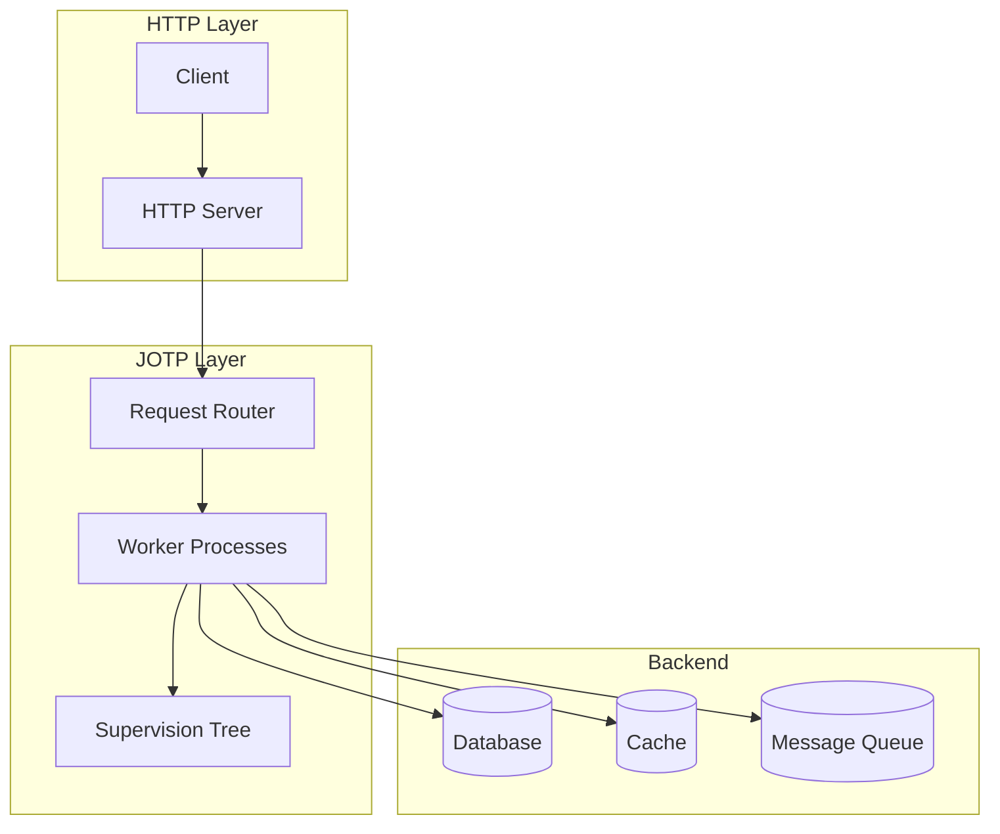

# Implementing REST APIs with JOTP

<date>2026-03-15</date>

## Overview

Learn how to build high-performance REST APIs using JOTP processes for request handling, async processing, and fault-tolerant backend operations.

## Benefits

- **Async Processing**: Handle requests without blocking threads
- **Fault Tolerance**: Automatic recovery from failures
- **Backpressure**: Handle load spikes gracefully
- **Stateful Services**: Maintain conversation state across requests
- **Location Transparency**: Scale horizontally easily

## Architecture



## Prerequisites

- Java 26 with `--enable-preview`
- Maven 4.x
- JOTP core dependency
- HTTP server (Helidon, Netty, or Undertow)

## Dependencies

### Option 1: Helidon HTTP

```xml
<dependencies>
    <!-- JOTP Core -->
    <dependency>
        <groupId>io.github.seanchatmangpt</groupId>
        <artifactId>jotp-core</artifactId>
        <version>1.0.0</version>
    </dependency>

    <!-- Helidon Web Server -->
    <dependency>
        <groupId>io.helidon.webserver</groupId>
        <artifactId>helidon-webserver</artifactId>
        <version>4.0.0</version>
    </dependency>

    <!-- JSON Binding -->
    <dependency>
        <groupId>jakarta.json</groupId>
        <artifactId>jakarta.json-api</artifactId>
        <version>2.1.3</version>
    </dependency>
</dependencies>
```

### Option 2: Undertow HTTP

```xml
<dependencies>
    <!-- JOTP Core -->
    <dependency>
        <groupId>io.github.seanchatmangpt</groupId>
        <artifactId>jotp-core</artifactId>
        <version>1.0.0</version>
    </dependency>

    <!-- Undertow Web Server -->
    <dependency>
        <groupId>io.undertow</groupId>
        <artifactId>undertow-core</artifactId>
        <version>2.3.10.Final</version>
    </dependency>

    <!-- Jackson JSON -->
    <dependency>
        <groupId>com.fasterxml.jackson.core</groupId>
        <artifactId>jackson-databind</artifactId>
        <version>2.16.0</version>
    </dependency>
</dependencies>
```

## Basic REST API with JOTP

### Request/Response Models

```java
// Request models
public record CreateUserRequest(
    String username,
    String email,
    String password
) {}

public record CreateOrderRequest(
    String userId,
    List<OrderItem> items
) {}

public record OrderItem(String productId, int quantity) {}

// Response models
public sealed interface ApiResponse<T> {
    record Success<T>(T data) implements ApiResponse<T> {}
    record Error<T>(String message, int code) implements ApiResponse<T> {}
    record Accepted<T>(String requestId) implements ApiResponse<T> {}
}
```

### JOTP Worker Process

```java
public sealed interface WorkerState {
    record Idle() implements WorkerState {}
    record Processing(String requestId) implements WorkerState {}
}

public sealed interface WorkerEvent {
    record HandleRequest(HttpRequest request, CompletableFuture<HttpResponse> response)
        implements WorkerEvent {}
    record CompleteRequest() implements WorkerEvent {}
}

public record WorkerContext(
    String workerId,
    long processedCount
) {}

public class ApiWorkerProcess {

    static Proc<WorkerContext, WorkerEvent> create(String workerId) {
        return Proc.spawn(
            new WorkerContext(workerId, 0),
            WorkerProcess::handleRequest,
            new WorkerState.Idle()
        );
    }

    private static Proc.StateResult<WorkerContext, Void> handleRequest(
        WorkerContext ctx, WorkerEvent event
    ) {
        return switch (event) {
            case WorkerEvent.HandleRequest(var req, var responseFuture) -> {
                // Process request asynchronously
                processRequest(req)
                    .thenAccept(responseFuture::complete)
                    .exceptionally(ex -> {
                        responseFuture.complete(errorResponse(ex));
                        return null;
                    });

                yield new Proc.StateResult<>(
                    new WorkerContext(ctx.workerId(), ctx.processedCount() + 1),
                    null
                );
            }

            case WorkerEvent.CompleteRequest() -> {
                yield new Proc.StateResult<>(ctx, null);
            }
        };
    }

    private static CompletableFuture<HttpResponse> processRequest(HttpRequest req) {
        return CompletableFuture.supplyAsync(() -> {
            // Business logic here
            return switch (req.method()) {
                case "GET" -> handleGet(req);
                case "POST" -> handlePost(req);
                case "PUT" -> handlePut(req);
                case "DELETE" -> handleDelete(req);
                default -> new HttpResponse(405, "Method Not Allowed");
            };
        });
    }
}
```

## HTTP Server Integration

### Helidon Integration

```java
public class JotpHelidonServer {

    private final WebServer server;
    private final ProcRouter router;

    public JotpHelidonServer(int port, ProcRouter router) {
        this.router = router;

        this.server = WebServer.builder()
            .port(port)
            .routing(it -> it
                .register("/api/users", new UserService(router))
                .register("/api/orders", new OrderService(router))
                .register("/health", (req, res) -> {
                    res.send("OK");
                })
            )
            .build();
    }

    public void start() {
        server.start();
        System.out.println("Server started on port " + server.port());
    }

    public void stop() {
        server.stop();
    }
}

// User Service Handler
public class UserService implements Service {

    private final ProcRouter router;

    public UserService(ProcRouter router) {
        this.router = router;
    }

    @Override
    public void update(Routing.Rules rules) {
        rules
            .get("/", this::listUsers)
            .get("/{id}", this::getUser)
            .post("/", this::createUser)
            .put("/{id}", this::updateUser)
            .delete("/{id}", this::deleteUser);
    }

    private void createUser(ServerRequest req, ServerResponse res) {
        // Parse request
        CreateUserRequest createReq = req.content().as(CreateUserRequest.class);

        // Route to JOTP worker
        CompletableFuture<ApiResponse<User>> future = new CompletableFuture<>();
        router.route("users", new WorkerEvent.HandleRequest(
            new HttpRequest("POST", "/api/users", createReq),
            future
        ));

        // Respond async
        future.thenAccept(apiRes -> {
            res.status(getStatusCode(apiRes));
            res.send(apiRes);
        }).exceptionally(ex -> {
            res.status(500).send(ex.getMessage());
            return null;
        });
    }
}
```

### Undertow Integration

```java
public class JotpUndertowServer {

    private final Undertow server;
    private final ProcRouter router;

    public JotpUndertowServer(int port, ProcRouter router) {
        this.router = router;

        this.server = Undertow.builder()
            .addHttpListener(port, "0.0.0.0")
            .setHandler(exchange -> {
                String path = exchange.getRequestPath();

                if (path.startsWith("/api/users")) {
                    new UserHandler(router).handleRequest(exchange);
                } else if (path.startsWith("/api/orders")) {
                    new OrderHandler(router).handleRequest(exchange);
                } else {
                    exchange.setStatusCode(404);
                    exchange.getResponseSender().send("Not Found");
                }
            })
            .build();
    }

    public void start() {
        server.start();
        System.out.println("Server started on port 8080");
    }

    public void stop() {
        server.stop();
    }
}

public class UserHandler {

    private final ProcRouter router;

    public void handleRequest(HttpServerExchange exchange) {
        String method = exchange.getRequestMethod().toString();
        String path = exchange.getRequestPath();

        CompletableFuture<ApiResponse<?>> future = new CompletableFuture<>();

        // Route to JOTP
        router.route("users", new WorkerEvent.HandleRequest(
            new HttpRequest(method, path, exchange),
            future
        ));

        // Handle async response
        future.thenAccept(response -> {
            exchange.setStatusCode(getStatusCode(response));
            exchange.getResponseSender().send(serialize(response));
        }).exceptionally(ex -> {
            exchange.setStatusCode(500);
            exchange.getResponseSender().send(ex.getMessage());
            return null;
        });
    }
}
```

## Request Routing

### Router Process

```java
public sealed interface RouterEvent {
    record RouteRequest(
        String service,
        WorkerEvent request,
        CompletableFuture<ApiResponse<?>> response
    ) implements RouterEvent {}
    record WorkerAvailable(String workerId) implements RouterEvent {}
}

public record RouterContext(
    Map<String, Queue<WorkerEvent>> queues,
    List<String> availableWorkers
) {}

public class ProcRouter {

    private final Proc<RouterContext, RouterEvent> routerProc;

    public ProcRouter(int workerCount) {
        this.routerProc = Proc.spawn(
            new RouterContext(new HashMap<>(), new ArrayList<>()),
            Router::handleRoute,
            null
        );

        // Start workers
        for (int i = 0; i < workerCount; i++) {
            String workerId = "worker-" + i;
            var worker = ApiWorkerProcess.create(workerId);
            routerProc.send(new RouterEvent.WorkerAvailable(workerId));
        }
    }

    public void route(String service, WorkerEvent request) {
        routerProc.send(new RouterEvent.RouteRequest(
            service,
            request,
            new CompletableFuture<>()
        ));
    }
}

private static Proc.StateResult<RouterContext, Void> handleRoute(
    RouterContext ctx, RouterEvent event
) {
    return switch (event) {
        case RouterEvent.RouteRequest(var service, var req, var resp) -> {
            // Find available worker or queue
            if (!ctx.availableWorkers().isEmpty()) {
                String workerId = ctx.availableWorkers().get(0);
                // Send to worker...
            } else {
                // Queue for later processing
                ctx.queues().computeIfAbsent(service, k -> new LinkedList<>()).add(req);
            }
            yield new Proc.StateResult<>(ctx, null);
        }

        case RouterEvent.WorkerAvailable(var workerId) -> {
            // Worker ready for more work
            yield new Proc.StateResult<>(
                new RouterContext(ctx.queues(), append(ctx.availableWorkers(), workerId)),
                null
            );
        }
    };
}
```

## Async Request Processing

### Long-Running Operations

```java
public class OrderProcessingService {

    public CompletableFuture<ApiResponse<Order>> createOrderAsync(
        CreateOrderRequest request
    ) {
        // Return immediately with request ID
        String requestId = UUID.randomUUID().toString();

        // Spawn order processing agent
        var orderAgent = OrderAgent.create(requestId, request);

        // Register for status queries
        registry.register(requestId, orderAgent);

        // Return accepted response
        return CompletableFuture.completedFuture(
            new ApiResponse.Accepted<Order>(requestId)
        );
    }

    public CompletableFuture<ApiResponse<Order>> getOrderStatus(
        String requestId
    ) {
        // Query order agent
        return registry.get(requestId)
            .map(agent -> agent.ask(new OrderEvent.GetStatus(), Duration.ofSeconds(5)))
            .map(status -> CompletableFuture.completedFuture(
                new ApiResponse.Success<Order>(status)
            ))
            .orElse(CompletableFuture.completedFuture(
                new ApiResponse.Error<Order>("Order not found", 404)
            ));
    }
}
```

## Error Handling

### Fault-Tolerant Workers

```java
public class FaultTolerantApiServer {

    private final Supervisor workerSupervisor;

    public FaultTolerantApiServer(int workerCount) {
        this.workerSupervisor = Supervisor.create()
            .withStrategy(RestartStrategy.ONE_FOR_ONE)
            .withMaxRestarts(3)
            .build();

        // Start workers under supervision
        for (int i = 0; i < workerCount; i++) {
            workerSupervisor.addChild(ChildSpec.of(
                "api-worker-" + i,
                () -> ApiWorkerProcess.create("worker-" + i),
                RestartType.PERMANENT
            ));
        }
    }

    public void routeRequest(WorkerEvent request) {
        // Router will assign to available worker
        // If worker crashes, supervisor restarts it
    }
}
```

### Circuit Breaker for External APIs

```java
public class ExternalApiGateway {

    private final CircuitBreaker<ApiRequest, ApiResponse, Exception> breaker;

    public ExternalApiGateway() {
        this.breaker = CircuitBreaker.create(
            "external-api",
            5,
            Duration.ofSeconds(60),
            Duration.ofSeconds(30)
        );
    }

    public CompletableFuture<ApiResponse<?>> callExternal(ApiRequest request) {
        return CompletableFuture.supplyAsync(() -> {
            var result = breaker.execute(request, req -> {
                // Make HTTP call
                return httpClient.execute(req);
            });

            return switch (result) {
                case CircuitBreaker.CircuitBreakerResult.Success(var value) -> value;
                case CircuitBreaker.CircuitBreakerResult.Failure(var error) ->
                    new ApiResponse.Error<Object>(error.getMessage(), 502);
                case CircuitBreaker.CircuitBreakerResult.CircuitOpen ignored ->
                    new ApiResponse.Error<Object>("Service unavailable", 503);
            };
        });
    }
}
```

## Rate Limiting

### Per-User Rate Limiting

```java
public class RateLimiter {

    private final Map<String, RateLimitState> userLimits = new ConcurrentHashMap<>();

    public synchronized boolean allowRequest(String userId, int maxRequests, Duration window) {
        RateLimitState state = userLimits.computeIfAbsent(
            userId,
            k -> new RateLimitState(maxRequests, window)
        );

        return state.tryAcquire();
    }

    public record RateLimitState(
        AtomicInteger count,
        long windowStart,
        int maxRequests,
        Duration window
    ) {
        public RateLimitState(int maxRequests, Duration window) {
            this(new AtomicInteger(0), System.currentTimeMillis(), maxRequests, window);
        }

        public boolean tryAcquire() {
            long now = System.currentTimeMillis();
            if (now - windowStart() > window().toMillis()) {
                // Reset window
                count.set(0);
                windowStart = now;
            }

            return count.incrementAndGet() <= maxRequests();
        }
    }
}
```

## Testing

### Unit Tests

```java
@Test
void shouldHandleGetRequest() {
    var router = new ProcRouter(2);
    var service = new UserService(router);

    var request = new ServerRequest("GET", "/api/users/123", null);
    var responseFuture = new CompletableFuture<ApiResponse<User>>();

    router.route("users", new WorkerEvent.HandleRequest(
        request,
        responseFuture
    ));

    await().atMost(5, TimeUnit.SECONDS)
        .until(() -> responseFuture.isDone());

    ApiResponse<User> response = responseFuture.join();
    assertThat(response).isInstanceOf(ApiResponse.Success.class);
}
```

### Load Tests

```java
@Test
void shouldHandleConcurrentRequests() throws InterruptedException {
    var router = new ProcRouter(10);
    var service = new UserService(router);
    var executor = Executors.newFixedThreadPool(50);

    int requestCount = 1000;
    CountDownLatch latch = new CountDownLatch(requestCount);

    long startTime = System.currentTimeMillis();

    for (int i = 0; i < requestCount; i++) {
        executor.submit(() -> {
            try {
                // Make request
                router.route("users", createTestRequest());
            } finally {
                latch.countDown();
            }
        });
    }

    latch.await(30, TimeUnit.SECONDS);
    long duration = System.currentTimeMillis() - startTime;

    double requestsPerSecond = (requestCount * 1000.0) / duration;
    System.out.printf("Throughput: %.2f req/s%n", requestsPerSecond);

    assertThat(requestsPerSecond).isGreaterThan(100);
}
```

## Best Practices

1. **Async all the way**: Never block in worker processes
2. **Use supervisors**: Restart failed workers automatically
3. **Implement backpressure**: Reject requests when overloaded
4. **Rate limit per user**: Prevent abuse
5. **Monitor metrics**: Track request latency, error rates
6. **Use connection pooling**: For database/external API calls
7. **Implement timeouts**: Prevent hanging requests
8. **Graceful shutdown**: Drain requests before stopping

## Production Considerations

1. **TLS/SSL**: Enable HTTPS in production
2. **Request validation**: Validate all input
3. **Authentication/Authorization**: Secure your endpoints
4. **CORS**: Configure for web clients
5. **Compression**: Enable gzip for large payloads
6. **Logging**: Structured logging with request IDs
7. **Health checks**: Expose health endpoint
8. **Metrics**: Expose Prometheus metrics

## Resources

- [Helidon Documentation](https://helidon.io/docs/v4/)
- [Undertow Documentation](https://undertow.io/undertow-docs/)
- [State Machine Workflows](./state-machine-workflow.md)
- [Building Supervision Trees](./build-supervision-trees.md)
