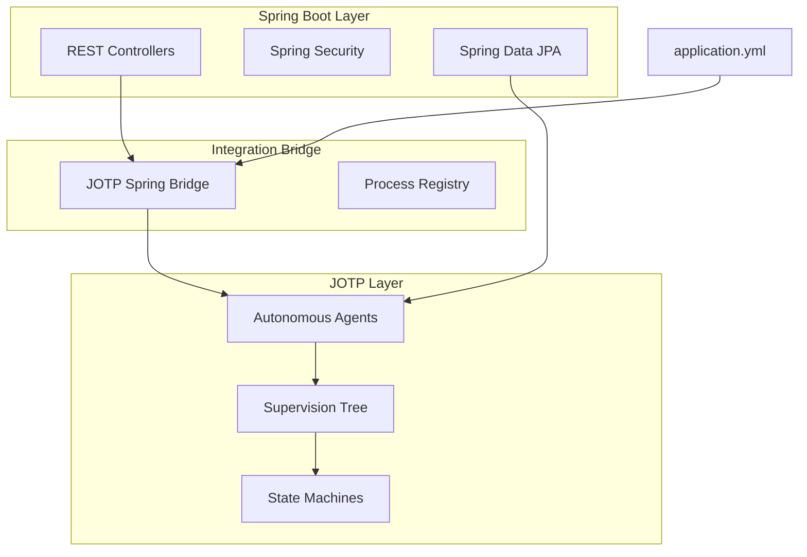

# Integrating JOTP with Spring Boot

<date>2026-03-15</date>

## Overview

Learn how to gradually migrate from traditional Spring Boot applications to JOTP's autonomous agent architecture while maintaining compatibility with Spring's ecosystem.

## Benefits

- **Gradual Migration**: Run JOTP alongside Spring Boot services
- **Fault Tolerance**: Leverage JOTP supervision trees for critical services
- **Async Processing**: Convert synchronous endpoints to autonomous agents
- **Zero Downtime**: A/B testing with traffic splitting
- **Spring Compatibility**: Keep using Spring DI, Security, and Data JPA

## Architecture



## Prerequisites

- Java 26 with `--enable-preview`
- Spring Boot 3.2+
- Maven 4.x
- JOTP core dependency

## Dependencies

Add to your `pom.xml`:

```xml
<dependencies>
    <!-- Spring Boot Starter -->
    <dependency>
        <groupId>org.springframework.boot</groupId>
        <artifactId>spring-boot-starter-web</artifactId>
        <version>3.2.0</version>
    </dependency>

    <!-- JOTP Core -->
    <dependency>
        <groupId>io.github.seanchatmangpt</groupId>
        <artifactId>jotp-core</artifactId>
        <version>1.0.0</version>
    </dependency>

    <!-- Spring Boot Actuator for monitoring -->
    <dependency>
        <groupId>org.springframework.boot</groupId>
        <artifactId>spring-boot-starter-actuator</artifactId>
    </dependency>
</dependencies>

<build>
    <plugins>
        <plugin>
            <groupId>org.apache.maven.plugins</groupId>
            <artifactId>maven-compiler-plugin</artifactId>
            <configuration>
                <release>26</release>
                <enablePreview>true</enablePreview>
            </configuration>
        </plugin>
    </plugins>
</build>
```

## Configuration

### application.yml

```yaml
spring:
  application:
    name: jotp-spring-boot-app

jotp:
  enabled: true
  supervision:
    strategy: ONE_FOR_ONE
    max-restarts: 3
    window-seconds: 30
  processes:
    thread-pool-size: 100
    mailbox-size: 1000

management:
  endpoints:
    web:
      exposure:
        include: health,metrics,jotp
  endpoint:
    health:
      show-details: always
```

### Spring Configuration Class

```java
package com.example.jotp.config;

import io.github.seanchatmangpt.jotp.*;
import org.springframework.context.annotation.*;

@Configuration
@EnableJOTP
public class JotpSpringConfig {

    @Bean
    public Supervisor orderProcessingSupervisor() {
        return Supervisor.create()
            .withStrategy(RestartStrategy.ONE_FOR_ONE)
            .withMaxRestarts(3)
            .build();
    }

    @Bean
    public ProcRegistry processRegistry() {
        return ProcRegistry.create();
    }
}
```

## Migration Phases

### Phase 1: Pilot Implementation

Convert a single service to JOTP while keeping the Spring Boot version running.

**Before (Spring Boot):**
```java
@RestController
@RequestMapping("/orders")
public class OrderController {

    @PostMapping
    public ResponseEntity<OrderResponse> createOrder(@RequestBody OrderRequest req) {
        // Synchronous processing
        validateOrder(req);
        debitPayment(req);
        reserveInventory(req);
        sendConfirmation(req);
        return ResponseEntity.ok(OrderResponse.success());
    }
}
```

**After (JOTP + Spring Boot):**
```java
@RestController
@RequestMapping("/orders")
public class OrderController {

    private final OrderProcessingSystem jotpSystem;

    @PostMapping
    public ResponseEntity<OrderResponse> createOrder(@RequestBody OrderRequest req) {
        // Route to JOTP agent
        jotpSystem.processOrder(req);

        // Return immediately (async processing)
        return ResponseEntity.accepted()
            .body(OrderResponse.submitted(req.getOrderId()));
    }

    @GetMapping("/{orderId}")
    public ResponseEntity<OrderResponse> getOrderStatus(@PathVariable String orderId) {
        // Query JOTP agent state
        return jotpSystem.getOrderStatus(orderId)
            .map(ResponseEntity::ok)
            .orElse(ResponseEntity.notFound().build());
    }
}
```

### Phase 2: Define JOTP State Machine

```java
public sealed interface OrderState {
    record Pending() implements OrderState {}
    record ProcessingPayment() implements OrderState {}
    record ReservingInventory() implements OrderState {}
    record Confirmed() implements OrderState {}
    record Failed(String reason) implements OrderState {}
}

public sealed interface OrderEvent {
    record CreateOrder(OrderRequest req) implements OrderEvent {}
    record PaymentApproved(String transactionId) implements OrderEvent {}
    record PaymentFailed(String reason) implements OrderEvent {}
    record InventoryReserved(String reservationId) implements OrderEvent {}
}
```

### Phase 3: Wrap with Supervisor

```java
@Service
public class OrderProcessingSystem {

    private final Supervisor supervisor;
    private final ProcRegistry registry;

    @PostConstruct
    public void init() {
        this.supervisor = Supervisor.create()
            .withStrategy(RestartStrategy.ONE_FOR_ONE)
            .withChild(ChildSpec.of(
                "order-processor",
                this::spawnOrderProcessor,
                RestartType.PERMANENT
            ))
            .start();
    }

    public void processOrder(OrderRequest request) {
        String orderId = request.getOrderId();

        // Spawn order-specific agent
        var orderAgent = Proc.spawn(
            new OrderContext(),
            (ctx, event) -> handleOrderEvent(ctx, event),
            null
        );

        // Register for lookup
        registry.register(orderId, orderAgent);

        // Send initialization event
        orderAgent.send(new OrderEvent.CreateOrder(request));
    }

    private Proc.StateResult<OrderContext, Void> handleOrderEvent(
        OrderContext ctx, OrderEvent event
    ) {
        return switch (event) {
            case OrderEvent.CreateOrder(var req) -> {
                ctx.setRequest(req);
                // Initiate payment...
                yield new Proc.StateResult<>(ctx, null);
            }
            case OrderEvent.PaymentApproved(var txnId) -> {
                ctx.setPaymentTransactionId(txnId);
                // Reserve inventory...
                yield new Proc.StateResult<>(ctx, null);
            }
            // ... handle other events
        };
    }
}
```

## Dual-Write Pattern

Run both Spring Boot and JOTP in parallel for validation:

```java
@RestController
public class DualWriteOrderController {

    @Value("${migration.jotp-percentage:10}")
    private int jotpTrafficPercentage;

    @PostMapping("/orders")
    public ResponseEntity<OrderResponse> createOrder(@RequestBody OrderRequest req) {
        // Determine which system handles this order
        boolean useJotp = ThreadLocalRandom.current().nextInt(100) < jotpTrafficPercentage;

        if (useJotp) {
            // Route to JOTP
            jotpSystem.processOrder(req);
            return ResponseEntity.accepted()
                .body(OrderResponse.submitted(req.getOrderId()));
        } else {
            // Route to Spring Boot
            OrderResponse response = springOrderService.createOrder(req);
            return ResponseEntity.ok(response);
        }
    }
}
```

## Testing Strategy

### Unit Tests

```java
@SpringBootTest
class OrderProcessingSystemTest {

    @Autowired
    private OrderProcessingSystem orderSystem;

    @Test
    void shouldProcessOrderSuccessfully() {
        var request = new OrderRequest("order-123", 99.99);
        orderSystem.processOrder(request);

        await().atMost(5, TimeUnit.SECONDS)
            .until(() -> orderSystem.getOrderStatus("order-123").isPresent());
    }
}
```

### Integration Tests

```java
@SpringBootTest(webEnvironment = WebEnvironment.RANDOM_PORT)
@TestPropertySource(properties = "jotp.enabled=true")
class JotpSpringIntegrationTest {

    @Autowired
    private TestRestTemplate restTemplate;

    @Test
    void shouldAcceptOrderAsynchronously() {
        var request = new OrderRequest("order-456", 149.99);
        var response = restTemplate.postForEntity("/orders", request, OrderResponse.class);

        assertThat(response.getStatusCode()).isEqualTo(HttpStatus.ACCEPTED);
    }
}
```

## Production Considerations

### Monitoring

```java
@Component
public class JotpMetricsExporter {

    private final MeterRegistry meterRegistry;

    @EventListener
    public void onProcessExit(ProcExitEvent event) {
        meterRegistry.counter("jotp.process.exits",
            "process", event.processId(),
            "reason", event.reason()
        ).increment();
    }

    @EventListener
    public void onSupervisorRestart(SupervisorRestartEvent event) {
        meterRegistry.counter("jotp.supervisor.restarts",
            "child", event.childId()
        ).increment();
    }
}
```

### Graceful Shutdown

```java
@Component
public class JotpShutdownHook {

    @Autowired
    private Supervisor orderProcessingSupervisor;

    @PreDestroy
    public void shutdown() {
        // Wait for in-flight orders to complete
        orderProcessingSupervisor.terminate(Duration.ofMinutes(2));
    }
}
```

### Health Checks

```java
@Component
public class JotpHealthIndicator implements HealthIndicator {

    @Autowired
    private ProcRegistry registry;

    @Override
    public Health health() {
        var processCount = registry.getRegisteredProcesses().size();
        var supervisorStatus = supervisor.getStatus();

        return Health.up()
            .withDetail("processes", processCount)
            .withDetail("supervisor", supervisorStatus)
            .build();
    }
}
```

## Migration Checklist

- [ ] Identify pilot service for migration
- [ ] Add JOTP dependencies to `pom.xml`
- [ ] Create Spring configuration class
- [ ] Implement state machine for business logic
- [ ] Wrap state machine in supervisor
- [ ] Create REST controller bridge
- [ ] Implement dual-write pattern
- [ ] Add monitoring and metrics
- [ ] Set up A/B testing (10% → 50% → 100%)
- [ ] Implement graceful shutdown
- [ ] Add health checks
- [ ] Document rollback plan

## Common Pitfalls

1. **Blocking Operations**: Never block in JOTP message handlers
   ```java
   // BAD
   var result = httpClient.send(request); // Blocks

   // GOOD
   httpClient.sendAsync(request)
       .thenAccept(response -> agent.send(new HttpResponse(response)));
   ```

2. **Shared Mutable State**: Avoid shared state across processes
   ```java
   // BAD
   private static List<String> cache = new ArrayList<>();

   // GOOD
   // Each process has its own state
   record ProcessState(List<String> localCache) {}
   ```

3. **Exception Handling**: Let exceptions propagate to supervisor
   ```java
   // BAD
   try {
       riskyOperation();
   } catch (Exception e) {
       log.error("Error", e); // Swallows exception
   }

   // GOOD
   riskyOperation(); // Let supervisor handle restart
   ```

## Resources

- [Spring Boot Documentation](https://spring.io/projects/spring-boot)
- [Order Processing Example](https://github.com/seanchatmangpt/jotp/blob/main/src/main/java/io/github/seanchatmangpt/jotp/examples/SpringBootIntegration.java)
- [Building Supervision Trees](./build-supervision-trees.md)
- [State Machine Workflows](./state-machine-workflow.md)
