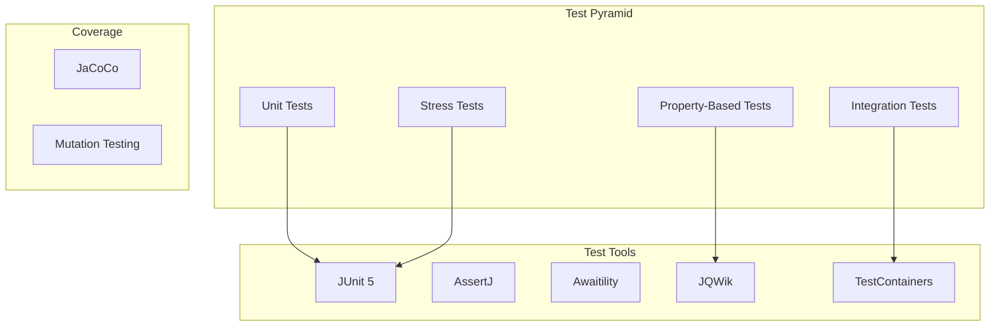

# Testing JOTP Applications

<date>2026-03-15</date>

## Overview

Learn comprehensive testing strategies for JOTP applications including unit tests, integration tests, stress tests, and property-based testing for concurrent systems.

## Benefits

- **Confidence**: Ensure reliability before production
- **Regression Prevention**: Catch bugs early
- **Documentation**: Tests serve as examples
- **Refactoring Safety**: Change code with confidence
- **Performance Validation**: Verify system under load

## Architecture



## Prerequisites

- Java 26 with `--enable-preview`
- Maven 4.x
- JOTP core dependency
- Testing frameworks

## Dependencies

Add to your `pom.xml`:

```xml
<dependencies>
    <!-- JOTP Core -->
    <dependency>
        <groupId>io.github.seanchatmangpt</groupId>
        <artifactId>jotp-core</artifactId>
        <version>1.0.0</version>
    </dependency>

    <!-- JUnit 5 -->
    <dependency>
        <groupId>org.junit.jupiter</groupId>
        <artifactId>junit-jupiter</artifactId>
        <version>5.10.2</version>
        <scope>test</scope>
    </dependency>

    <!-- AssertJ for fluent assertions -->
    <dependency>
        <groupId>org.assertj</groupId>
        <artifactId>assertj-core</artifactId>
        <version>3.25.1</version>
        <scope>test</scope>
    </dependency>

    <!-- Awaitility for async assertions -->
    <dependency>
        <groupId>org.awaitility</groupId>
        <artifactId>awaitility</artifactId>
        <version>4.2.1</version>
        <scope>test</scope>
    </dependency>

    <!-- JQWik for property-based testing -->
    <dependency>
        <groupId>net.jqwik</groupId>
        <artifactId>jqwik</artifactId>
        <version>1.8.3</version>
        <scope>test</scope>
    </dependency>

    <!-- TestContainers for integration tests -->
    <dependency>
        <groupId>org.testcontainers</groupId>
        <artifactId>testcontainers</artifactId>
        <version>1.19.4</version>
        <scope>test</scope>
    </dependency>

    <!-- Mocking framework -->
    <dependency>
        <groupId>org.mockito</groupId>
        <artifactId>mockito-core</artifactId>
        <version>5.10.0</version>
        <scope>test</scope>
    </dependency>
</dependencies>
```

## Unit Testing

### Testing Individual Processes

```java
@Test
@DisplayName("Should process messages in order")
void shouldProcessMessagesInOrder() {
    // Given: A simple counter process
    var process = Proc.spawn(
        0,
        (state, message) -> {
            if (message instanceof Integer n) {
                return new Proc.StateResult<>(state + n, null);
            }
            return new Proc.StateResult<>(state, null);
        },
        null
    );

    // When: Send messages
    process.send(1);
    process.send(2);
    process.send(3);

    // Then: Verify state
    await().atMost(5, TimeUnit.SECONDS)
        .until(() -> process.getState() == 6);
}

@Test
@DisplayName("Should handle state transitions")
void shouldHandleStateTransitions() {
    // Given: State machine
    sealed interface State {
        record Idle() implements State {}
        record Active() implements State {}
        record Completed() implements State {}
    }

    sealed interface Event {
        record Start() implements Event {}
        record Stop() implements Event {}
    }

    var machine = StateMachine.<State, Event, Void>create()
        .withInitialState(new State.Idle())
        .withTransition(State.Idle.class, Event.Start.class, (s, e, ctx) ->
            new StateMachine.Transition.NextState(new State.Active(), List.of())
        )
        .withTransition(State.Active.class, Event.Stop.class, (s, e, ctx) ->
            new StateMachine.Transition.Stop(new State.Completed(), List.of())
        )
        .build();

    // When: Send events
    machine.send(new Event.Start());
    machine.send(new Event.Stop());

    // Then: Verify final state
    await().atMost(5, TimeUnit.SECONDS)
        .until(() -> machine.getCurrentState() instanceof State.Completed);
}
```

### Testing Message Handlers

```java
@Test
@DisplayName("Should handle different message types")
void shouldHandleDifferentMessageTypes() {
    sealed interface Message {
        record Add(int value) implements Message {}
        record Multiply(int value) implements Message {}
        record Reset() implements Message {}
    }

    record CalculatorState(int value) {}

    var process = Proc.spawn(
        new CalculatorState(0),
        (state, message) -> {
            return switch (message) {
                case Message.Add(var value) ->
                    new Proc.StateResult<>(new CalculatorState(state.value() + value), null);
                case Message.Multiply(var value) ->
                    new Proc.StateResult<>(new CalculatorState(state.value() * value), null);
                case Message.Reset() ->
                    new Proc.StateResult<>(new CalculatorState(0), null);
            };
        },
        null
    );

    // When
    process.send(new Message.Add(5));
    process.send(new Message.Multiply(2));
    process.send(new Message.Add(3));

    // Then
    await().atMost(5, TimeUnit.SECONDS)
        .until(() -> process.getState().value() == 13);
}
```

### Testing Error Handling

```java
@Test
@DisplayName("Should recover from errors with supervisor")
void shouldRecoverFromErrors() {
    AtomicInteger errorCount = new AtomicInteger(0);

    var supervisor = Supervisor.create()
        .withStrategy(RestartStrategy.ONE_FOR_ONE)
        .withMaxRestarts(3)
        .onChildExit((childId, reason) -> {
            errorCount.incrementAndGet();
        })
        .build();

    // Add child that fails
    supervisor.addChild(ChildSpec.of(
        "failing-child",
        () -> Proc.spawn(
            null,
            (state, message) -> {
                if (message instanceof String s && s.equals("fail")) {
                    throw new RuntimeException("Intentional failure");
                }
                return new Proc.StateResult<>(state, null);
            },
            null
        ),
        RestartType.PERMANENT
    ));

    // When: Send failure message
    var child = supervisor.getChild("failing-child").orElseThrow();
    child.send("fail");

    // Then: Verify restart
    await().atMost(5, TimeUnit.SECONDS)
        .until(() -> errorCount.get() == 1);

    // Verify child is still running
    assertThat(supervisor.getChild("failing-child")).isPresent();
}
```

## Integration Testing

### Testing Process Communication

```java
@Test
@DisplayName("Should communicate between processes")
void shouldCommunicateBetweenProcesses() {
    // Given: Sender and receiver processes
    var receiver = Proc.spawn(
        new ArrayList<String>(),
        (messages, message) -> {
            if (message instanceof String s) {
                messages.add(s);
            }
            return new Proc.StateResult<>(messages, null);
        },
        null
    );

    var sender = Proc.spawn(
        receiver,
        (recipient, message) -> {
            if (message instanceof String s) {
                recipient.send(s);
            }
            return new Proc.StateResult<>(recipient, null);
        },
        null
    );

    // When: Send messages
    sender.send("Hello");
    sender.send("World");

    // Then: Verify receiver got messages
    await().atMost(5, TimeUnit.SECONDS)
        .until(() -> receiver.getState().size() == 2);

    assertThat(receiver.getState()).containsExactly("Hello", "World");
}
```

### Testing with TestContainers

```java
@Testcontainers
class DatabaseIntegrationTest {

    @Container
    PostgreSQLContainer<?> postgres = new PostgreSQLContainer<>("postgres:16");

    @Test
    @DisplayName("Should persist state to database")
    void shouldPersistStateToDatabase() {
        // Given: Database-backed process
        var config = new DatabaseConfig(
            postgres.getJdbcUrl(),
            postgres.getUsername(),
            postgres.getPassword(),
            10,
            30000,
            1800000
        );

        var pool = new DatabaseConnectionPool(config);
        var process = DatabaseBackedProcess.create(pool);

        // When: Process events
        process.send(new PersistEvent("test-id", "test-data"));

        // Then: Verify persistence
        try (Connection conn = pool.getConnection()) {
            Statement stmt = conn.createStatement();
            ResultSet rs = stmt.executeQuery("SELECT * FROM events WHERE id = 'test-id'");

            assertThat(rs.next()).isTrue();
            assertThat(rs.getString("data")).isEqualTo("test-data");
        }
    }
}
```

### Testing Supervision Trees

```java
@Test
@DisplayName("Should restart failed child process")
void shouldRestartFailedChildProcess() {
    // Given: Supervisor with children
    AtomicInteger restartCount = new AtomicInteger(0);

    var supervisor = Supervisor.create()
        .withStrategy(RestartStrategy.ONE_FOR_ONE)
        .onChildExit((childId, reason) -> {
            restartCount.incrementAndGet();
        })
        .build();

    // Add children
    for (int i = 0; i < 5; i++) {
        int index = i;
        supervisor.addChild(ChildSpec.of(
            "child-" + i,
            () -> Proc.spawn(
                index,
                (state, msg) -> {
                    if (msg instanceof String s && s.equals("fail")) {
                        throw new RuntimeException("Fail");
                    }
                    return new Proc.StateResult<>(state, null);
                },
                null
            ),
            RestartType.PERMANENT
        ));
    }

    // When: Fail one child
    var child2 = supervisor.getChild("child-2").orElseThrow();
    child2.send("fail");

    // Then: Verify restart
    await().atMost(5, TimeUnit.SECONDS)
        .until(() -> restartCount.get() == 1);

    // Verify other children unaffected
    var child0 = supervisor.getChild("child-0").orElseThrow();
    assertThat(child0.getState()).isEqualTo(0);
}
```

## Property-Based Testing

### Testing Process Properties

```java
@Property
@DisplayName("Should maintain state consistency")
void shouldMaintainStateConsistency(
    @ForAll List<@IntRange(min = -100, max = 100) Integer> values
) {
    // Given: Calculator process
    record CalcState(int sum, int count) {}

    var process = Proc.spawn(
        new CalcState(0, 0),
        (state, value) -> {
            if (value instanceof Integer n) {
                return new Proc.StateResult<>(
                    new CalcState(state.sum() + n, state.count() + 1),
                    null
                );
            }
            return new Proc.StateResult<>(state, null);
        },
        null
    );

    // When: Send all values
    for (Integer value : values) {
        process.send(value);
    }

    // Then: Verify properties
    await().atMost(10, TimeUnit.SECONDS)
        .until(() -> process.getState().count() == values.size());

    var finalState = process.getState();
    int expectedSum = values.stream().mapToInt(Integer::intValue).sum();

    assertThat(finalState.sum()).isEqualTo(expectedSum);
    assertThat(finalState.count()).isEqualTo(values.size());
}

@Property
@DisplayName("Should handle concurrent updates safely")
void shouldHandleConcurrentUpdates(
    @ForAll @IntRange(min = 1, max = 10) int threadCount,
    @ForAll @IntRange(min = 1, max = 100) int updatesPerThread
) {
    // Given: Shared counter process
    var counter = Proc.spawn(
        new AtomicInteger(0),
        (state, msg) -> {
            if (msg instanceof Integer n) {
                state.addAndGet(n);
            }
            return new Proc.StateResult<>(state, null);
        },
        null
    );

    // When: Concurrent updates
    ExecutorService executor = Executors.newFixedThreadPool(threadCount);
    CountDownLatch latch = new CountDownLatch(threadCount);

    for (int t = 0; t < threadCount; t++) {
        executor.submit(() -> {
            try {
                for (int i = 0; i < updatesPerThread; i++) {
                    counter.send(1);
                }
            } finally {
                latch.countDown();
            }
        });
    }

    // Then: Verify final count
    latch.await(30, TimeUnit.SECONDS);
    await().atMost(5, TimeUnit.SECONDS)
        .until(() -> counter.getState().get() == threadCount * updatesPerThread);

    executor.shutdown();
}
```

## Stress Testing

### Load Testing Processes

```java
@Test
@DisplayName("Should handle high message throughput")
void shouldHandleHighMessageThroughput() throws InterruptedException {
    // Given: Process
    var counter = Proc.spawn(
        new AtomicLong(0),
        (state, msg) -> {
            if (msg instanceof Long n) {
                state.addAndGet(n);
            }
            return new Proc.StateResult<>(state, null);
        },
        null
    );

    int threadCount = 50;
    int messagesPerThread = 10000;
    ExecutorService executor = Executors.newFixedThreadPool(threadCount);
    CountDownLatch latch = new CountDownLatch(threadCount);

    long startTime = System.nanoTime();

    // When: Send many messages concurrently
    for (int t = 0; t < threadCount; t++) {
        executor.submit(() -> {
            try {
                for (int i = 0; i < messagesPerThread; i++) {
                    counter.send(1L);
                }
            } finally {
                latch.countDown();
            }
        });
    }

    latch.await(60, TimeUnit.SECONDS);
    long duration = System.nanoTime() - startTime;

    // Then: Verify all messages processed
    await().atMost(30, TimeUnit.SECONDS)
        .until(() -> counter.getState().get() == threadCount * messagesPerThread);

    double messagesPerSecond = (threadCount * messagesPerThread * 1_000_000_000.0) / duration;
    System.out.printf("Throughput: %.2f msg/s%n", messagesPerSecond);

    assertThat(messagesPerSecond).isGreaterThan(10000);

    executor.shutdown();
}
```

### Memory Leak Testing

```java
@Test
@DisplayName("Should not leak memory over time")
void shouldNotLeakMemoryOverTime() {
    MemoryMXBean memoryBean = ManagementFactory.getMemoryMXBean();
    long initialMemory = memoryBean.getHeapMemoryUsage().getUsed();

    // Create and destroy many processes
    for (int i = 0; i < 1000; i++) {
        var process = Proc.spawn(
            new byte[1024 * 10], // 10KB state
            (state, msg) -> new Proc.StateResult<>(state, null),
            null
        );

        process.send("message");
        process.stop();

        if (i % 100 == 0) {
            // Suggest GC
            System.gc();
        }
    }

    System.gc();
    Thread.sleep(1000);

    long finalMemory = memoryBean.getHeapMemoryUsage().getUsed();
    long memoryGrowth = finalMemory - initialMemory;

    // Allow some growth but not excessive
    assertThat(memoryGrowth).isLessThan(50 * 1024 * 1024); // 50MB threshold
}
```

## Mocking and Verification

### Mocking External Dependencies

```java
@Test
@DisplayName("Should integrate with external service")
void shouldIntegrateWithExternalService() {
    // Given: Mock external service
    ExternalService mockService = mock(ExternalService.class);
    when(mockService.call(anyString()))
        .thenReturn CompletableFuture.completedFuture("result"));

    var process = ExternalServiceProcess.create(mockService);

    // When: Send request
    process.send(new ServiceRequest("test-input"));

    // Then: Verify interaction
    await().atMost(5, TimeUnit.SECONDS)
        .untilAsserted(() -> {
            verify(mockService).call("test-input");
        });
}
```

## Test Utilities

### Test Process Builder

```java
public class TestProcessBuilder {

    public static <S, M> Proc<S, M> buildTestProcess(
        S initialState,
        BiFunction<S, M, Proc.StateResult<S, Void>> handler
    ) {
        return Proc.spawn(initialState, handler, null);
    }

    public static <S, M> void sendAndWait(
        Proc<S, M> process,
        M message,
        Predicate<S> condition
    ) {
        process.send(message);
        await().atMost(5, TimeUnit.SECONDS)
            .until(() -> condition.test(process.getState()));
    }

    public static <S, M> S waitForState(
        Proc<S, M> process,
        Predicate<S> condition
    ) {
        await().atMost(5, TimeUnit.SECONDS)
            .until(() -> condition.test(process.getState()));
        return process.getState();
    }
}
```

## Best Practices

1. **Test Isolation**: Each test should be independent
2. **Avoid Thread.sleep**: Use Awaitility instead
3. **Clear Assertions**: Use descriptive assertion messages
4. **Test Edge Cases**: Empty inputs, null values, boundaries
5. **Mock External Services**: Don't depend on external systems
6. **Use TestContainers**: For real integration tests
7. **Property-Based Testing**: Find edge cases you didn't think of
8. **Stress Test**: Verify system under load
9. **Test Cleanup**: Always release resources
10. **Fast Feedback**: Keep tests fast

## Production Considerations

1. **CI/CD Integration**: Run tests on every commit
2. **Code Coverage**: Aim for >80% coverage
3. **Mutation Testing**: Use PIT to verify test quality
4. **Performance Tests**: Run nightly to catch regressions
5. **Flaky Tests**: Eliminate tests that sometimes fail
6. **Test Data Management**: Use factories for test data
7. **Environment Parity**: Test in production-like environment
8. **Monitoring**: Monitor test execution time

## Resources

- [JUnit 5 User Guide](https://junit.org/junit5/docs/current/user-guide/)
- [AssertJ Documentation](https://assertj.github.io/doc/)
- [Awaitility Documentation](https://awaitility.org/)
- [JQWik Documentation](https://jqwik.net/)
- [TestContainers Documentation](https://testcontainers.com/)
- [Testing JOTP Processes](./testing-jotp-processes.md)
- [Test Concurrent Code](./test-concurrent-code.md)
