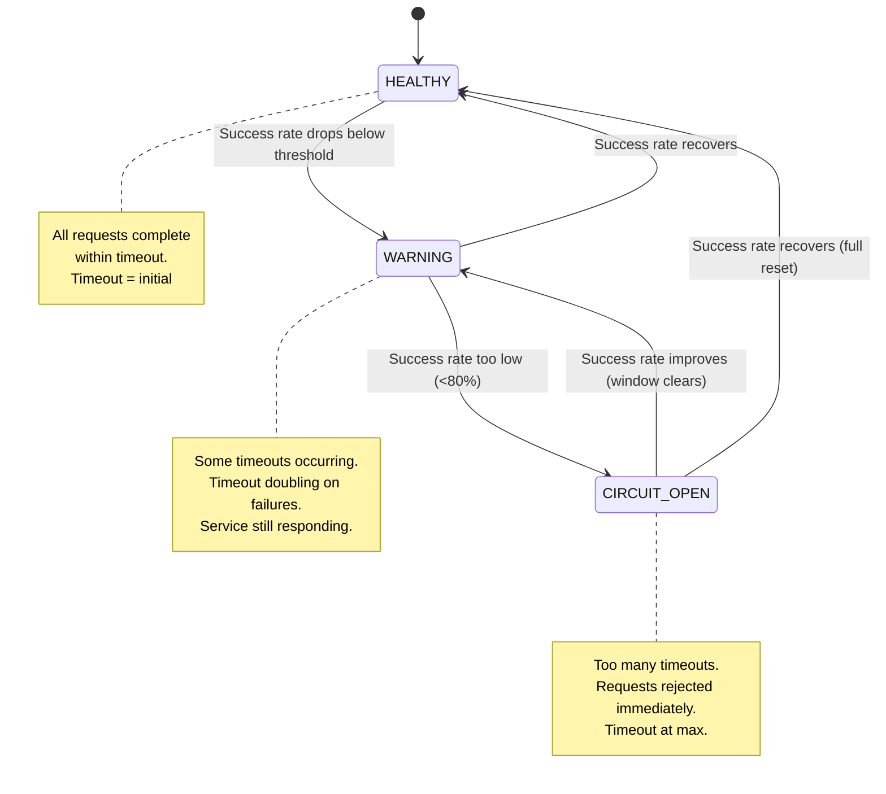
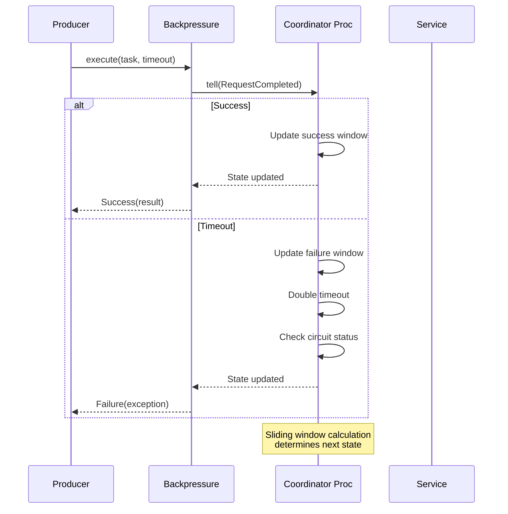
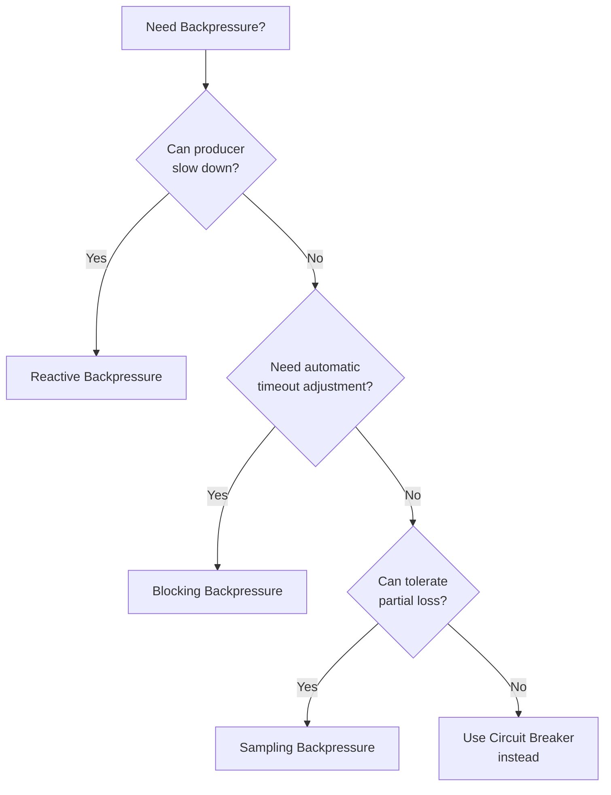

# Backpressure Pattern

import { Callout, Tabs, Tab, Challenge } from '@theguild/scene'

**Pattern Category**: Enterprise Resilience
**Enterprise Pattern**: Backpressure
**Erlang Analog**: Process mailbox monitoring with flow control
**Production Status**: ✅ Fully Implemented
**Performance Baseline**: **O(1) per request** with adaptive timeout adjustment

## Overview

The Backpressure pattern prevents queue explosion and resource exhaustion when downstream services are slow or failing. It implements timeout-based flow control with adaptive timeout adjustment based on success rates, protecting your system from cascading failures.

<Callout type="info">
  **JOTP Implementation**: Uses `Proc<BackpressureState, BackpressureMsg>` coordinator with sliding window success rate tracking and adaptive timeout adjustment. Integrates seamlessly with JOTP mailboxes via `ProcRef` messaging.
</Callout>

## Why Backpressure Matters

In distributed systems, **fast producers** can overwhelm **slow consumers**, leading to:

- **Queue explosion**: Unbounded memory growth from buffered messages
- **Resource exhaustion**: Threads, connections, and memory consumed by waiting requests
- **Cascading failures**: One slow service crashes dependent services
- **Thundering herds**: Retry storms when services recover

Backpressure solves this by:
1. **Adaptive timeouts**: Automatically adjusts timeout based on observed success rates
2. **Circuit breaker**: Rejects requests when service is overwhelmed
3. **Flow control**: Signals producers to slow down
4. **Resource protection**: Prevents queue overflow in mailboxes

## Types of Backpressure

### 1. Reactive Backpressure (Recommended)

**Signal-based flow control** where consumers signal producers to slow down.

```java
// Proactive backpressure - check status before sending
if (backpressure.getStatus() == BackpressureState.Status.HEALTHY) {
    backpressure.execute(timeout -> apiClient.call(endpoint), timeout);
} else {
    // Queue for later, reject, or use fallback
    fallbackService.execute();
}
```

**When to use**:
- Producers can respond to flow control signals
- Need graceful degradation under load
- Want to avoid queue buildup entirely

### 2. Blocking Backpressure

**Timeout-based enforcement** where requests fail after timeout.

```java
// Let backpressure handle timeouts automatically
Result<Response> result = backpressure.execute(
    timeout -> apiClient.call(endpoint),
    Duration.ofSeconds(3)
);

switch (result) {
    case Success(var response) -> handle(response);
    case Failure(var e) -> {
        // Already timed out - backpressure adjusted timeout upward
        logger.warn("Request timed out: {}", e.getMessage());
    }
}
```

**When to use**:
- Can't control producer rate
- Need simple timeout enforcement
- Want automatic timeout adjustment

### 3. Sampling Backpressure

**Reject percentage of requests** when overloaded.

```java
// Combine with circuit breaker for sampling
if (backpressure.getStatus() == BackpressureState.Status.CIRCUIT_OPEN) {
    // Sample: reject 50% of requests
    if (ThreadLocalRandom.current().nextDouble() < 0.5) {
        return Result.failure(new BackpressureException("Sampled - circuit open"));
    }
}
```

**When to use**:
- Can tolerate partial request loss
- Need to maintain some throughput during degradation
- Implementing gradual service degradation

## Architecture

### State Machine



### Adaptive Timeout Behavior

Timeout doubles on each failure (up to maxTimeout):

```
Initial: 3s
After 1 failure: 6s
After 2 failures: 12s
After 3 failures: 24s (capped at maxTimeout)
```

Timeout resets on successful request:

```
Current: 24s
After success: 3s (back to initial)
```

### Message Flow



## Usage Examples

### Basic Backpressure Setup

```java
import io.github.seanchatmangpt.jotp.enterprise.backpressure.*;
import java.time.Duration;

// Step 1: Create configuration
BackpressureConfig config = BackpressureConfig.builder("payment-gateway")
    .initialTimeout(Duration.ofSeconds(3))   // Start with 3s timeout
    .maxTimeout(Duration.ofSeconds(30))      // Max 30s timeout
    .windowSize(100)                         // Track last 100 requests
    .successRateThreshold(0.95)              // 95% success rate for HEALTHY
    .build();

// Step 2: Create backpressure coordinator
Backpressure backpressure = Backpressure.create(config);

// Step 3: Execute requests with backpressure
Result<PaymentResponse> result = backpressure.execute(
    timeout -> {
        // Timeout is automatically adjusted based on success rate
        return paymentGateway.charge(card, amount);
    },
    Duration.ofSeconds(3)
);

// Step 4: Handle result
switch (result) {
    case Success(var response) -> {
        logger.info("Payment successful: {}", response.transactionId());
    }
    case Failure(var e) -> {
        logger.error("Payment failed: {}", e.getMessage());
        if (e.getMessage().contains("timeout")) {
            // Backpressure is increasing timeout
            // Queue for retry or use fallback
            retryQueue.offer(() -> processPayment(card, amount));
        }
    }
}
```

### Integration with JOTP Mailboxes

```java
import io.github.seanchatmangpt.jotp.*;

// Define a Proc that uses backpressure
record PaymentState(Backpressure backpressure) {}

sealed interface PaymentMsg {
    record ProcessPayment(Card card, BigDecimal amount) implements PaymentMsg {}
}

Proc<PaymentState, PaymentMsg> paymentProc = new Proc<>(
    new PaymentState(backpressure),
    (state, msg) -> switch (msg) {
        case ProcessPayment(var card, var amount) -> {
            // Use backpressure to protect mailbox from overflow
            var result = state.backpressure().execute(
                timeout -> paymentGateway.charge(card, amount),
                Duration.ofSeconds(3)
            );

            // Handle result - never let mailbox explode
            if (result instanceof Backpressure.Result.Success<?> s) {
                logger.info("Payment processed: {}", s.value());
            } else {
                // Queue for retry - backpressure prevents queue explosion
                retryQueue.offer(new ProcessPayment(card, amount));
            }

            return state; // State unchanged
        }
    }
);

// Register in supervisor for fault tolerance
Supervisor supervisor = Supervisor.create(
    Supervisor.Config.builder()
        .childSpec("payment-processor",
            Supervisor.ChildSpec.strategy(paymentProc, Supervisor.Strategy.oneForOne())
        )
        .build()
);
```

### Reactive Backpressure with Status Monitoring

```java
import java.util.concurrent.atomic.AtomicBoolean;

// Track circuit state for proactive flow control
AtomicBoolean circuitHealthy = new AtomicBoolean(true);

// Add listener for state changes
backpressure.addListener((from, to) -> {
    logger.info("Backpressure status changed: {} → {}", from, to);

    switch (to) {
        case HEALTHY -> {
            circuitHealthy.set(true);
            // Resume normal processing
            requestLimiter.enable();
            logger.info("Service recovered - resuming normal operation");
        }
        case WARNING -> {
            circuitHealthy.set(false);
            // Reduce request rate
            requestLimiter.reduceRate(0.5); // 50% reduction
            logger.warn("Service degrading - reducing request rate");
        }
        case CIRCUIT_OPEN -> {
            circuitHealthy.set(false);
            // Stop accepting new requests
            requestLimiter.disable();
            alertingService.alert("Backpressure circuit OPEN for payment-gateway");
            logger.error("Service overwhelmed - circuit open, rejecting requests");
        }
    }
});

// Proactive backpressure - check before sending
if (circuitHealthy.get()) {
    backpressure.execute(task, timeout);
} else {
    // Use fallback, queue for later, or reject
    fallbackService.execute();
}
```

### Backpressure with Multiple Policies

```java
import io.github.seanchatmangpt.jotp.enterprise.backpressure.BackpressurePolicy.*;

// Different policies for different scenarios
BackpressureConfig strictConfig = BackpressureConfig.builder("critical-service")
    .initialTimeout(Duration.ofSeconds(2))
    .maxTimeout(Duration.ofSeconds(10))
    .windowSize(50)
    .successRateThreshold(0.99)  // 99% required
    .policy(new Strict())  // Fail-fast
    .build();

BackpressureConfig adaptiveConfig = BackpressureConfig.builder("external-api")
    .initialTimeout(Duration.ofSeconds(3))
    .maxTimeout(Duration.ofSeconds(30))
    .windowSize(100)
    .successRateThreshold(0.95)
    .policy(new Adaptive(0.95, 100))  // Dynamic timeout
    .build();

BackpressureConfig circuitBreakConfig = BackpressureConfig.builder("database")
    .initialTimeout(Duration.ofSeconds(1))
    .maxTimeout(Duration.ofSeconds(5))
    .windowSize(100)
    .successRateThreshold(0.95)
    .policy(new CircuitBreak(5, Duration.ofSeconds(30).toMillis()))  // Trip after 5 failures
    .build();

// Use appropriate backpressure for each service
Backpressure strictBP = Backpressure.create(strictConfig);
Backpressure adaptiveBP = Backpressure.create(adaptiveConfig);
Backpressure circuitBP = Backpressure.create(circuitBreakConfig);
```

## Configuration Options

### Timeout Settings

| Parameter | Purpose | Recommended Range |
|-----------|---------|-------------------|
| `initialTimeout` | Starting timeout for requests | Based on p50 latency |
| `maxTimeout` | Upper bound for adaptive timeout | 5-10x initialTimeout |
| `windowSize` | Sliding window size for success rate | 50-200 requests |
| `successRateThreshold` | Success rate % for HEALTHY status | 0.90-0.99 (90-99%) |

### Tuning Guidelines by Service Type

#### Fast Services (Low Latency)

```java
BackpressureConfig.builder("cache")
    .initialTimeout(Duration.ofMillis(100))   // 100ms initial
    .maxTimeout(Duration.ofSeconds(1))        // 1s max
    .windowSize(100)
    .successRateThreshold(0.99)               // 99% success rate
    .build();
```

**Characteristics**:
- Low latency (p50 < 100ms)
- High throughput
- Tight timeouts prevent queue buildup

#### Slow Services (High Latency)

```java
BackpressureConfig.builder("batch-job")
    .initialTimeout(Duration.ofSeconds(10))   // 10s initial
    .maxTimeout(Duration.ofMinutes(2))        // 2min max
    .windowSize(50)
    .successRateThreshold(0.90)               // 90% success rate
    .build();
```

**Characteristics**:
- High latency (p50 > 1s)
- Lower throughput
- Larger timeouts accommodate processing time

#### External APIs

```java
BackpressureConfig.builder("external-api")
    .initialTimeout(Duration.ofSeconds(3))    // 3s initial
    .maxTimeout(Duration.ofSeconds(15))       // 15s max
    .windowSize(100)
    .successRateThreshold(0.95)               // 95% success rate
    .build();
```

**Characteristics**:
- Variable latency
- Network dependency
- Medium timeouts balance responsiveness and patience

## Performance Implications

### Memory Overhead

- **Per coordinator**: ~2 KB (state, sliding window, listeners)
- **Per window entry**: ~16 bytes (boolean result)
- **1000 coordinators**: ~2 MB total memory

### CPU Overhead

- **Request tracking**: O(1) per request
- **Window calculation**: O(windowSize) per request
- **Status calculation**: O(windowSize) per request

**Benchmark**: 1M requests/second with windowSize=100

### Throughput by State

| State | Throughput | Behavior |
|-------|-----------|----------|
| **HEALTHY** | 100% | Full throughput, initial timeout |
| **WARNING** | 100% | Full throughput, timeout increasing |
| **CIRCUIT_OPEN** | 0% | Requests rejected immediately |

### Adaptive Timeout Performance

Timeout adaptation overhead is negligible:

```
Window calculation: 100 entries × 16 bytes = 1.6 KB
Status calculation: 100 boolean checks = ~100 ns
Total overhead per request: ~1 μs
```

## When to Use Each Type

### Decision Tree



### Use Cases

<Callout type="success">
  **Reactive Backpressure** - Use when:
  - Producers can respond to flow control signals
  - Need graceful degradation under load
  - Want to avoid queue buildup entirely
  - Example: Message queues, event streams, pipelines
</Callout>

<Callout type="info">
  **Blocking Backpressure** - Use when:
  - Can't control producer rate
  - Need simple timeout enforcement
  - Want automatic timeout adjustment
  - Example: External API calls, database queries, RPC
</Callout>

<Callout type="warning">
  **Sampling Backpressure** - Use when:
  - Can tolerate partial request loss
  - Need to maintain some throughput during degradation
  - Implementing gradual service degradation
  - Example: Analytics, logging, telemetry
</Callout>

## Monitoring and Observability

### Key Metrics

```java
import io.github.seanchatmangpt.jotp.observability.metrics.*;

// Status (gauge)
BackpressureState.Status status = backpressure.getStatus();
Metrics.gauge("backpressure.status",
    config.serviceName(),
    status.ordinal());

// Success rate (gauge)
double successRate = calculateSuccessRate(backpressure);
Metrics.gauge("backpressure.success_rate",
    config.serviceName(),
    successRate);

// Current timeout (gauge)
Duration currentTimeout = backpressure.getCurrentTimeout();
Metrics.gauge("backpressure.timeout_ms",
    config.serviceName(),
    currentTimeout.toMillis());

// Request counts (counter)
Metrics.counter("backpressure.requests_total",
    "service", config.serviceName(),
    "status", "success"
).increment();

Metrics.counter("backpressure.requests_total",
    "service", config.serviceName(),
    "status", "timeout"
).increment();

// Circuit state changes (counter)
backpressure.addListener((from, to) -> {
    Metrics.counter("backpressure.state_changes",
        "service", config.serviceName(),
        "from", from.toString(),
        "to", to.toString()
    ).increment();
});
```

### Distributed Tracing Integration

```java
import io.github.seanchatmangpt.jotp.observability.tracing.*;

// Add backpressure info to traces
Result<Response> result = backpressure.execute(
    timeout -> {
        Span span = tracer.nextSpan()
            .name("external-request")
            .tag("backpressure.service", config.serviceName())
            .tag("backpressure.timeout_ms", String.valueOf(timeout.toMillis()))
            .tag("backpressure.status", backpressure.getStatus().toString())
            .tag("backpressure.window_size", String.valueOf(config.windowSize()))
            .start();

        try (var scope = tracer.withSpan(span)) {
            return apiClient.call(endpoint, timeout);
        } finally {
            span.end();
        }
    },
    Duration.ofSeconds(3)
);
```

### Event Broadcasting

```java
import io.github.seanchatmangpt.jotp.enterprise.backpressure.BackpressureEvent;

// Backpressure broadcasts events for monitoring
EventManager<BackpressureEvent> eventManager =
    EventManager.create(BackpressureEvent.class);

eventManager.subscribe(event -> {
    logger.info("Backpressure event: {} for service {}",
        event.getClass().getSimpleName(),
        event.serviceName());

    switch (event) {
        case RequestEnqueued(var id, var service, var ts) -> {
            Metrics.counter("backpressure.enqueued",
                "service", service).increment();
        }
        case RequestCompleted(var id, var service, var duration, var ts) -> {
            Metrics.timer("backpressure.duration",
                "service", service).record(duration, TimeUnit.MILLISECONDS);
        }
        case RequestTimedOut(var id, var service, var timeout, var ts) -> {
            Metrics.counter("backpressure.timeouts",
                "service", service).increment();
        }
        case ThresholdExceeded(var service, var rate, var window, var ts) -> {
            logger.warn("Threshold exceeded: {} - success rate: {}",
                service, rate);
        }
        case CircuitTripped(var service, var reason, var retryAfter, var ts) -> {
            alertingService.alert("Circuit tripped: " + service);
        }
        case CircuitRecovered(var service, var ts) -> {
            logger.info("Circuit recovered: {}", service);
        }
    }
});
```

## Production Configuration

### Recommended Defaults

```java
// Production-ready configuration template
public static BackpressureConfig productionConfig(String serviceName) {
    return BackpressureConfig.builder(serviceName)
        .initialTimeout(Duration.ofSeconds(3))
        .maxTimeout(Duration.ofSeconds(30))
        .windowSize(100)
        .successRateThreshold(0.95)
        .metricsEnabled(true)
        .build();
}
```

### Environment-Specific Tuning

```java
// Development - faster timeouts, tighter thresholds
BackpressureConfig devConfig = BackpressureConfig.builder("service")
    .initialTimeout(Duration.ofSeconds(1))
    .maxTimeout(Duration.ofSeconds(5))
    .windowSize(50)
    .successRateThreshold(0.90)
    .build();

// Staging - moderate timeouts
BackpressureConfig stagingConfig = BackpressureConfig.builder("service")
    .initialTimeout(Duration.ofSeconds(2))
    .maxTimeout(Duration.ofSeconds(15))
    .windowSize(75)
    .successRateThreshold(0.92)
    .build();

// Production - conservative timeouts
BackpressureConfig prodConfig = BackpressureConfig.builder("service")
    .initialTimeout(Duration.ofSeconds(5))
    .maxTimeout(Duration.ofSeconds(30))
    .windowSize(100)
    .successRateThreshold(0.95)
    .build();
```

### Supervisor Integration

```java
// Wrap backpressure in supervisor for fault tolerance
Supervisor supervisor = Supervisor.create(
    Supervisor.Config.builder()
        .childSpec("backpressure-coordinator",
            Supervisor.ChildSpec.builder()
                .proc(() -> spawnBackpressureCoordinator(config))
                .strategy(Supervisor.Strategy.oneForOne())
                .maxRestarts(10)
                .restartDuration(Duration.ofMinutes(1))
                .build()
        )
        .build()
);
```

<Challenge title="Production Challenge">
  Design a backpressure strategy for a payment processing system that:

  1. Processes 1000 requests/second normally
  2. Must maintain 99.9% uptime SLA
  3. Integrates with external payment gateway (variable latency)
  4. Needs graceful degradation under load
  5. Must provide real-time monitoring and alerting

  Consider:
  - Which backpressure type to use?
  - How to tune timeout thresholds?
  - What metrics to monitor?
  - How to handle circuit trips?
  - What fallback strategies to implement?
</Challenge>

## Anti-Patterns to Avoid

### 1. Ignoring Backpressure Status

```java
// BAD: Execute regardless of status
Result<R> result = backpressure.execute(task, timeout);

// GOOD: Check status before executing
if (backpressure.getStatus() == BackpressureState.Status.CIRCUIT_OPEN) {
    return Result.failure(new BackpressureException("Circuit open"));
}
Result<R> result = backpressure.execute(task, timeout);
```

### 2. Setting Timeouts Too High

```java
// BAD: Effectively no timeout
BackpressureConfig.builder("service")
    .initialTimeout(Duration.ofHours(1))
    .maxTimeout(Duration.ofDays(1))
    .build();

// GOOD: Realistic timeouts
BackpressureConfig.builder("service")
    .initialTimeout(Duration.ofSeconds(3))
    .maxTimeout(Duration.ofSeconds(30))
    .build();
```

### 3. Not Handling Timeouts

```java
// BAD: Ignoring timeouts
backpressure.execute(task, timeout);

// GOOD: Handling timeout failures
switch (backpressure.execute(task, timeout)) {
    case Success(var v) -> handleSuccess(v);
    case Failure(var e) -> {
        if (e.getMessage().contains("timeout")) {
            // Backpressure is working - queue for retry
            retryQueue.offer(task);
        }
    }
}
```

### 4. Small Window Sizes

```java
// BAD: Too small, erratic behavior
BackpressureConfig.builder("service")
    .windowSize(5)  // Status changes too frequently
    .build();

// GOOD: Larger window for stability
BackpressureConfig.builder("service")
    .windowSize(100)  // Smooth transitions
    .build();
```

## Integration with Other Patterns

### Circuit Breaker + Backpressure

```java
// Circuit breaker trips faster, backpressure provides flow control
CircuitBreakerPattern breaker = CircuitBreakerPattern.create(
    CircuitBreakerConfig.of("service")
);

Backpressure backpressure = Backpressure.create(config);

// Execute through both layers
Result<Data> result = backpressure.execute(
    timeout -> breaker.execute(
        breakerTimeout -> database.query(query),
        timeout
    ),
    Duration.ofSeconds(2)
);
```

### Bulkhead + Backpressure

```java
// Bulkhead isolates resources, backpressure controls flow
BulkheadIsolation bulkhead = BulkheadIsolation.create(
    BulkheadConfig.builder()
        .maxConcurrent(10)
        .maxQueueSize(100)
        .build()
);

Backpressure backpressure = Backpressure.create(config);

// Execute through both layers
Result<Data> result = backpressure.execute(
    timeout -> bulkhead.execute(
        () -> database.query(query)
    ),
    Duration.ofSeconds(2)
);
```

## Related Patterns

- **[Circuit Breaker](./circuit-breaker.md)**: For failure detection and fail-fast
- **[Bulkhead Isolation](./bulkhead-isolation.md)**: For resource isolation
- **[Supervisor](../../core-patterns/supervisor.md)**: For fault tolerance and restart strategies
- **[Proc](../../core-patterns/proc.md)**: For lightweight concurrent processes

## References

- **Implementation**: `/Users/sac/jotp/src/main/java/io/github/seanchatmangpt/jotp/enterprise/backpressure/Backpressure.java`
- **Configuration**: `/Users/sac/jotp/src/main/java/io/github/seanchatmangpt/jotp/enterprise/backpressure/BackpressureConfig.java`
- **Policies**: `/Users/sac/jotp/src/main/java/io/github/seanchatmangpt/jotp/enterprise/backpressure/BackpressurePolicy.java`
- **Events**: `/Users/sac/jotp/src/main/java/io/github/seanchatmangpt/jotp/enterprise/backpressure/BackpressureEvent.java`
- **Tests**: `/Users/sac/jotp/src/test/java/io/github/seanchatmangpt/jotp/enterprise/backpressure/BackpressureTest.java`
- **Reactive Streams**: [Reactive Streams Specification](https://www.reactive-streams.org/)
- **Backpressure**: [Reactive Manifesto](https://www.reactivemanifesto.org/)
