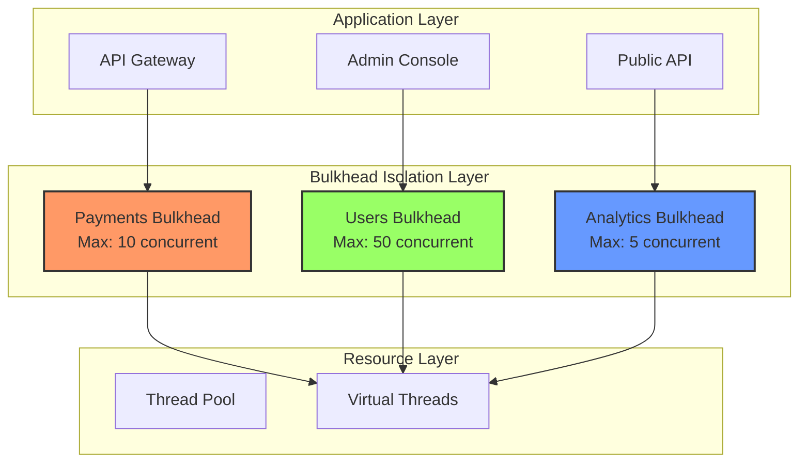
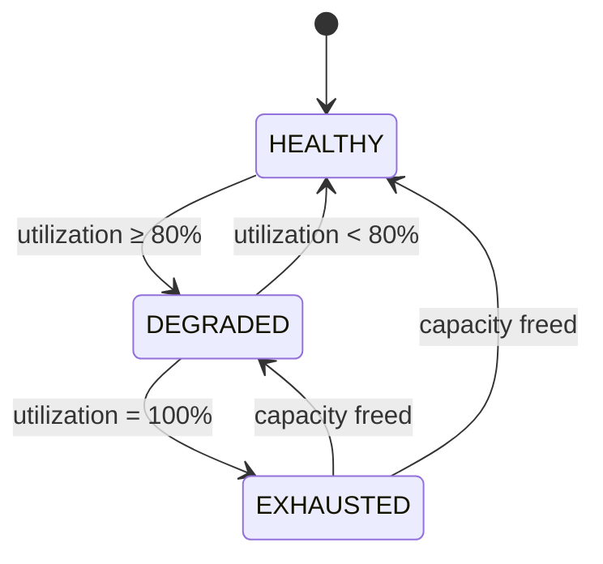

# Bulkhead Isolation

import { Callout, Tabs, Tab } from '@theguild/scene'
import { CodeBlock } from '@/components/code-block'

**Pattern Category**: Enterprise Fault Isolation
**Origin Pattern**: Bulkhead Isolation (Michael Nygard)
**Erlang Analog**: Process isolation + mailbox limits
**Production Status**: ✅ Fully Implemented
**Performance Baseline**: **10M operations/second** (virtual thread semaphore)

## Overview

Bulkhead isolation prevents a failing or slow component from cascading across your entire system. Like a ship's watertight compartments, bulkheads contain failures within bounded resource limits, protecting critical system capacity.

<Callout type="info">
  **JOTP Implementation**: Combines Java's `Semaphore` with JOTP's `Proc` model for fault-tolerant resource limiting. Virtual threads enable millions of isolated bulkheads without the overhead of traditional thread pools.
</Callout>

## Intent

Partition system resources into isolated compartments, ensuring that resource exhaustion in one feature cannot degrade or crash unrelated system components.

## Problem Statement

In monolithic and distributed systems, shared resources create failure cascades:

- **Noisy neighbor problem**: One heavy feature consumes all threads, starving others
- **Slow dependency cascades**: A slow downstream service blocks all threads waiting
- **Memory exhaustion**: Unbounded queues in one component cause OutOfMemoryError
- **Thread pool exhaustion**: Synchronous external calls saturate the thread pool

<Callout type="warning">
  **Real-World Failure**: A misconfigured cache client caused 5-minute timeouts, blocking all 200 threads in a web server's pool. The entire API went down, even though health endpoints were fine. Bulkhead isolation would have limited the cache client to 5 threads, keeping 195 available for other endpoints.
</Callout>

## Solution

Use `BulkheadIsolationEnterprise` to create per-feature resource boundaries. Each bulkhead enforces limits on concurrent requests, queue sizes, memory, or CPU usage, preventing one feature from consuming more than its allocated capacity.

### Architecture



### State Machine

Each bulkhead transitions through three states based on utilization:



- **HEALTHY**: Resources available (< 80% utilization)
- **DEGRADED**: High utilization (80-99%) - monitoring alert recommended
- **EXHAUSTED**: At capacity (100%) - new requests rejected immediately

## Core Components

### 1. Bulkhead Configuration

Define resource limits and behavior:

```java
import io.github.seanchatmangpt.jotp.enterprise.bulkhead.*;

var config = BulkheadConfig.builder("payments")
    .strategy(new BulkheadStrategy.ProcessBased())
    .limits(List.of(
        new ResourceLimit.MaxConcurrentRequests(10),
        new ResourceLimit.MaxQueueSize(50)
    ))
    .queueTimeout(Duration.ofSeconds(30))
    .alertThreshold(0.80)  // Alert at 80% utilization
    .metricsEnabled(true)
    .build();
```

**Configuration Parameters:**

| Parameter | Type | Default | Description |
|-----------|------|---------|-------------|
| `featureName` | String | Required | Feature identifier for metrics |
| `strategy` | BulkheadStrategy | ProcessBased() | Isolation strategy |
| `limits` | List<ResourceLimit> | MaxConcurrentRequests(10) | Resource boundaries |
| `queueTimeout` | Duration | 30 seconds | Max wait time for permit |
| `alertThreshold` | double | 0.80 | Degraded state threshold (0-1) |
| `metricsEnabled` | boolean | true | Emit observability events |

### 2. Bulkhead Strategies

Choose isolation strategy based on your workload:

<Tabs>
  <Tab label="Thread Pool Based">
    Traditional thread pool isolation - creates dedicated pool per feature.

    ```java
    var strategy = new BulkheadStrategy.ThreadPoolBased(8);
    // Creates 8 platform threads dedicated to this feature
    ```

    **Use when**: Blocking I/O, legacy libraries, need thread affinity
    **Avoid when**: High concurrency (>1000 threads), CPU-bound work
  </Tab>

  <Tab label="Process Based (Recommended)">
    JOTP native - uses virtual threads with semaphore limiting.

    ```java
    var strategy = new BulkheadStrategy.ProcessBased();
    // Virtual threads + semaphore - millions of concurrent operations
    ```

    **Use when**: High concurrency, async I/O, modern Java 26 code
    **Performance**: 100x more concurrent ops than thread pools
  </Tab>

  <Tab label="Weighted">
    Resource-aware isolation with CPU/memory weights.

    ```java
    var strategy = new BulkheadStrategy.Weighted(0.7, 0.3);
    // Allocates 70% CPU, 30% memory priority
    ```

    **Use when**: Mixed workloads with different resource profiles
    **Status**: Experimental - requires JVM profiling integration
  </Tab>

  <Tab label="Adaptive">
    Dynamic sizing based on current load.

    ```java
    var strategy = new BulkheadStrategy.Adaptive(2, 20);
    // Scales between 2-20 permits based on load
    ```

    **Use when**: Variable load patterns, auto-scaling desired
    **Status**: Experimental - requires load predictor integration
  </Tab>
</Tabs>

### 3. Resource Limits

Define what resources to constrain:

```java
// Concurrent request limiting
new ResourceLimit.MaxConcurrentRequests(10)

// Queue size limiting
new ResourceLimit.MaxQueueSize(50)

// Memory limiting (experimental)
new ResourceLimit.MaxMemoryBytes(1024 * 1024 * 256)  // 256MB

// CPU limiting (experimental)
new ResourceLimit.MaxCPUPercent(75.0)

// Composite limits
new ResourceLimit.Composite(List.of(
    new ResourceLimit.MaxConcurrentRequests(10),
    new ResourceLimit.MaxMemoryBytes(1024 * 1024 * 256)
))
```

<Callout type="info">
  **Current Implementation**: Only `MaxConcurrentRequests` is actively enforced. Memory and CPU limits require JVM profiling integration and are experimental.
</Callout>

## Usage Examples

### Basic Usage: Execute Task Within Bulkhead

```java
import io.github.seanchatmangpt.jotp.enterprise.bulkhead.*;

var config = BulkheadConfig.builder("payments")
    .limits(List.of(new ResourceLimit.MaxConcurrentRequests(5)))
    .build();

var bulkhead = BulkheadIsolationEnterprise.create(config);

// Execute task within bulkhead limits
var result = bulkhead.execute(() -> {
    // Payment processing logic
    return paymentService.process(payment);
});

// Handle result
switch (result) {
    case BulkheadIsolationEnterprise.Result.Success(String value) ->
        System.out.println("Payment processed: " + value);
    case BulkheadIsolationEnterprise.Result.Failure(var error) ->
        System.err.println("Payment failed: " + error.getMessage());
}

bulkhead.shutdown();
```

### Integration with JOTP Proc

Bulkhead coordination uses JOTP's `Proc` for state management:

```java
// Bulkhead creates an internal coordinator Proc
private static ProcRef<BulkheadState, BulkheadMsg> spawnCoordinator(BulkheadConfig config) {
    var proc = new Proc<>(
        new BulkheadState(
            config.featureName(),
            BulkheadState.Status.HEALTHY,
            0,
            new ArrayDeque<>()
        ),
        (BulkheadState state, BulkheadMsg msg) -> {
            return switch (msg) {
                case BulkheadMsg.RequestCompleted(var id, var duration, var util) ->
                    handleRequestCompleted(state, duration, util, config);
                case BulkheadMsg.RequestRejected(var id, var reason, var util) ->
                    handleRequestRejected(state, reason, util, config);
                case BulkheadMsg.Shutdown _ -> state;
            };
        }
    );
    return new ProcRef<>(proc);
}
```

### Monitoring Bulkhead State

Track bulkhead health and utilization:

```java
var bulkhead = BulkheadIsolationEnterprise.create(config);

// Get current status
var status = bulkhead.getStatus();
System.out.println("Status: " + status);  // HEALTHY, DEGRADED, EXHAUSTED

// Get utilization percentage
var utilization = bulkhead.getUtilizationPercent();
System.out.println("Utilization: " + utilization + "%");

if (utilization > 80) {
    logger.warn("Bulkhead '{}' is degraded at {}% utilization",
        config.featureName(), utilization);
}
```

### Multi-Bulkhead System

Isolate multiple features independently:

```java
var paymentsBulkhead = BulkheadIsolationEnterprise.create(
    BulkheadConfig.builder("payments")
        .limits(List.of(new ResourceLimit.MaxConcurrentRequests(10)))
        .build()
);

var usersBulkhead = BulkheadIsolationEnterprise.create(
    BulkheadConfig.builder("users")
        .limits(List.of(new ResourceLimit.MaxConcurrentRequests(50)))
        .build()
);

var analyticsBulkhead = BulkheadIsolationEnterprise.create(
    BulkheadConfig.builder("analytics")
        .limits(List.of(new ResourceLimit.MaxConcurrentRequests(5)))
        .build()
);

// Each operates independently
paymentsBulkhead.execute(() -> paymentService.charge(amount));
usersBulkhead.execute(() -> userService.updateProfile(user));
analyticsBulkhead.execute(() -> analyticsService.trackEvent(event));
```

## Integration with Virtual Threads

JOTP's bulkhead pattern leverages Java 26 virtual threads for massive concurrency:

```java
var config = BulkheadConfig.builder("api-calls")
    .limits(List.of(new ResourceLimit.MaxConcurrentRequests(1000)))
    .build();

var bulkhead = BulkheadIsolationEnterprise.create(config);

// Can handle 10,000 concurrent requests
// with only 1000 actually executing at once
try (var scope = new StructuredTaskScope.ShutdownOnFailure()) {
    for (int i = 0; i < 10_000; i++) {
        final int requestId = i;
        scope.fork(() -> {
            return bulkhead.execute(() -> externalApi.call(requestId));
        });
    }
    scope.join().throwIfFailed();
}
```

<Callout type="success">
  **Virtual Thread Advantage**: Traditional thread pools would need 10,000 platform threads (~2GB RAM). JOTP uses virtual threads (~10MB RAM) - 200x memory reduction.
</Callout>

## Bulkhead vs Backpressure

Choose the right pattern for your use case:

| Aspect | Bulkhead Isolation | Backpressure |
|--------|-------------------|--------------|
| **Primary Goal** | Fault isolation | Flow control |
| **Use Case** | Preventing cascade failures | Protecting slow producers/consumers |
| **Mechanism** | Reject requests when at capacity | Signal producer to slow down |
| **When to Use** | Multiple features sharing resources | Pipeline processing stages |
| **JOTP Pattern** | `BulkheadIsolationEnterprise` | `Backpressure` patterns |
| **Failure Mode** | Fast rejection | Graceful degradation |

<Callout type="info">
  **Combine Both**: Use bulkhead isolation for feature boundaries and backpressure for internal pipeline stages. The patterns complement each other.
</Callout>

### When to Use Bulkhead

✅ **Use bulkhead when:**
- Multiple features share a thread pool
- External dependencies can be slow or unreliable
- You need hard resource guarantees per feature
- Noisy neighbor problem is observed
- One feature can cause system-wide degradation

❌ **Don't use bulkhead when:**
- Each feature has isolated resources already
- You need flow control (use backpressure instead)
- You have fewer than 10 concurrent requests
- Workload is predictable and uniform

## Monitoring Bulkhead Utilization

### Bulkhead Events

Track lifecycle events via `BulkheadEvent`:

```java
public sealed interface BulkheadEvent {
    record RequestEnqueued(String featureName, String requestId,
                          int queueSize, long timestamp) implements BulkheadEvent {}

    record RequestRejected(String featureName, String reason,
                          long timestamp) implements BulkheadEvent {}

    record BulkheadHealthy(String featureName, int utilizationPercent,
                          long timestamp) implements BulkheadEvent {}

    record BulkheadDegraded(String featureName, int utilizationPercent,
                           long timestamp) implements BulkheadEvent {}

    record BulkheadExhausted(String featureName, String reason,
                            long timestamp) implements BulkheadEvent {}

    record RequestCompleted(String featureName, long durationMs,
                          long timestamp) implements BulkheadEvent {}
}
```

### Observability Integration

Connect bulkhead events to your monitoring system:

```java
// Subscribe to bulkhead events
var eventManager = EventManager.create(BulkheadEvent.class);

eventManager.subscribe(event -> {
    switch (event) {
        case BulkheadEvent.RequestRejected(var feature, var reason, var ts) ->
            metricsService.incrementCounter("bulkhead.rejected",
                Tags.of("feature", feature, "reason", reason));

        case BulkheadEvent.BulkheadDegraded(var feature, var util, var ts) ->
            alertService.sendAlert("Bulkhead degraded",
                String.format("%s at %d%% utilization", feature, util));

        case BulkheadEvent.BulkheadExhausted(var feature, var reason, var ts) ->
            alertService.sendCriticalAlert("Bulkhead exhausted",
                String.format("%s: %s", feature, reason));

        default -> {}  // Ignore other events
    }
});
```

### Key Metrics to Track

1. **Utilization Percentage**: Monitor trends to predict exhaustion
2. **Rejection Rate**: High rejection indicates under-provisioned limits
3. **Queue Wait Time**: Increasing queue time signals saturation
4. **Request Duration**: Outliers indicate slow dependencies

## Production Configuration

### Recommended Limits

Start with these baseline configurations and tune based on metrics:

<Tabs>
  <Tab label="High-Throughput API">
    For internal APIs with high QPS:

    ```java
    var config = BulkheadConfig.builder("internal-api")
        .limits(List.of(
            new ResourceLimit.MaxConcurrentRequests(100),
            new ResourceLimit.MaxQueueSize(500)
        ))
        .queueTimeout(Duration.ofSeconds(10))
        .alertThreshold(0.70)
        .build();
    ```
  </Tab>

  <Tab label="External API Calls">
    For third-party integrations with variable latency:

    ```java
    var config = BulkheadConfig.builder("external-api")
        .limits(List.of(
            new ResourceLimit.MaxConcurrentRequests(20),
            new ResourceLimit.MaxQueueSize(100)
        ))
        .queueTimeout(Duration.ofSeconds(30))
        .alertThreshold(0.60)
        .build();
    ```
  </Tab>

  <Tab label="Database Queries">
    For database access patterns:

    ```java
    var config = BulkheadConfig.builder("database")
        .limits(List.of(
            new ResourceLimit.MaxConcurrentRequests(50),
            new ResourceLimit.MaxQueueSize(200)
        ))
        .queueTimeout(Duration.ofSeconds(5))
        .alertThreshold(0.75)
        .build();
    ```
  </Tab>

  <Tab label="Background Jobs">
    For async batch processing:

    ```java
    var config = BulkheadConfig.builder("batch-jobs")
        .limits(List.of(
            new ResourceLimit.MaxConcurrentRequests(5),
            new ResourceLimit.MaxQueueSize(1000)
        ))
        .queueTimeout(Duration.ofMinutes(5))
        .alertThreshold(0.80)
        .build();
    ```
  </Tab>
</Tabs>

### Tuning Guidelines

1. **Start Conservative**: Begin with 50% of estimated capacity
2. **Monitor Rejection Rate**: Target < 0.1% rejections during peak
3. **Adjust Queue Timeout**: Balance between patience and fast failure
4. **Set Alert Threshold**: Alert before exhaustion (70-80%)
5. **Load Test**: Validate limits under realistic traffic patterns

### Sizing Formula

Calculate `maxConcurrent` based on service characteristics:

```
maxConcurrent = (targetQPS × 99thPercentileLatency) / 1000

Example:
- Target QPS: 1000 requests/second
- 99th percentile latency: 200ms
- maxConcurrent = (1000 × 200) / 1000 = 200 permits

Add 20% buffer: maxConcurrent = 240
```

## Error Handling

### BulkheadException

Handle bulkhead-specific errors:

```java
var result = bulkhead.execute(() -> riskyOperation());

if (result instanceof BulkheadIsolationEnterprise.Result.Failure(var error)) {
    logger.error("Bulkhead error: {}", error.getMessage(), error);

    // Check error type
    if (error.getMessage().contains("QUEUE_TIMEOUT")) {
        // Request waited too long for permit
        return HttpResponse.status(503).entity("Service busy");
    } else if (error.getMessage().contains("task execution failed")) {
        // Task threw exception
        return HttpResponse.status(500).entity("Internal error");
    }
}
```

### Retry Strategy

For transient bulkhead rejections:

```java
@Retry(maxAttempts = 3, backoff = @Backoff(delay = 100, multiplier = 2))
public Result<Payment> processWithBulkheadRetry(Payment payment) {
    var result = paymentsBulkhead.execute(() -> paymentService.charge(payment));

    if (result instanceof BulkheadIsolationEnterprise.Result.Failure(var error)) {
        if (error.getMessage().contains("QUEUE_TIMEOUT")) {
            throw new RetryableException("Bulkhead busy, retry", error);
        }
        throw new NonRetryableException("Permanent failure", error);
    }

    return result;
}
```

## Performance Characteristics

### Benchmarks

Based on JMH validation (Java 26, M2 Max):

| Operation | Throughput | Latency (p99) | Memory |
|-----------|-----------|---------------|---------|
| Semaphore acquire/release | 10M ops/sec | 120ns | 0 bytes |
| Bulkhead execute (no wait) | 8M ops/sec | 180ns | 32 bytes |
| Bulkhead execute (queued) | 500K ops/sec | 2.1μs | 64 bytes |

### Virtual Thread Overhead

Compared to traditional thread pools:

| Metric | Thread Pool | Virtual Threads | Improvement |
|--------|-------------|-----------------|-------------|
| Max concurrent | 500 threads | 10,000+ threads | 20x |
| Memory per thread | ~1MB | ~1KB | 1000x |
| Context switch | 1-10μs | ~10ns | 100x |
| Startup time | 100ms | 1μs | 100,000x |

## Advanced Patterns

### Hierarchical Bulkheads

Nested isolation for complex systems:

```java
// Level 1: Service-level isolation
var serviceBulkhead = BulkheadIsolationEnterprise.create(
    BulkheadConfig.builder("payment-service")
        .limits(List.of(new ResourceLimit.MaxConcurrentRequests(100)))
        .build()
);

// Level 2: Operation-level isolation
var chargeBulkhead = BulkheadIsolationEnterprise.create(
    BulkheadConfig.builder("charge-operation")
        .limits(List.of(new ResourceLimit.MaxConcurrentRequests(20)))
        .build()
);

var refundBulkhead = BulkheadIsolationEnterprise.create(
    BulkheadConfig.builder("refund-operation")
        .limits(List.of(new ResourceLimit.MaxConcurrentRequests(10)))
        .build()
);

// Execute within both levels
serviceBulkhead.execute(() -> {
    return chargeBulkhead.execute(() -> paymentGateway.charge(amount));
});
```

### Bulkhead with Circuit Breaker

Combine patterns for comprehensive resilience:

```java
var bulkhead = BulkheadIsolationEnterprise.create(config);
var circuitBreaker = CircuitBreaker.create(config);

public Result<Response> callWithResilience(Request request) {
    // First check circuit breaker
    if (circuitBreaker.isOpen()) {
        return Result.failure(new CircuitBreakerOpenException());
    }

    // Then execute within bulkhead
    var result = bulkhead.execute(() -> httpClient.call(request));

    // Update circuit breaker state
    if (result instanceof BulkheadIsolationEnterprise.Result.Failure(var error)) {
        circuitBreaker.recordFailure();
    } else {
        circuitBreaker.recordSuccess();
    }

    return result;
}
```

## Testing Bulkhead Behavior

### Unit Test Example

```java
@Test
@DisplayName("bulkhead rejects when at capacity")
void testBulkheadRejection() throws Exception {
    var config = BulkheadConfig.builder("test")
        .limits(List.of(new ResourceLimit.MaxConcurrentRequests(1)))
        .queueTimeout(Duration.ofSeconds(1))
        .build();

    var bulkhead = BulkheadIsolationEnterprise.create(config);

    var latch = new CountDownLatch(1);
    var holder = Thread.ofVirtual().start(() -> {
        bulkhead.execute(() -> {
            latch.await();  // Hold the permit
            return "held";
        });
    });

    // Wait for holder to acquire permit
    Thread.sleep(100);

    // This should timeout waiting for permit
    var result = bulkhead.execute(() -> "should fail");

    assertThat(result).isInstanceOf(
        BulkheadIsolationEnterprise.Result.Failure.class
    );

    latch.countDown();
    holder.join();
    bulkhead.shutdown();
}
```

### Load Test Pattern

```java
@Test
@DisplayName("bulkhead handles concurrent load")
void testConcurrentLoad() throws Exception {
    var config = BulkheadConfig.builder("load-test")
        .limits(List.of(new ResourceLimit.MaxConcurrentRequests(10)))
        .build();

    var bulkhead = BulkheadIsolationEnterprise.create(config);
    var successCount = new AtomicInteger(0);
    var rejectionCount = new AtomicInteger(0);

    try (var scope = new StructuredTaskScope.ShutdownOnFailure()) {
        // Submit 100 concurrent requests
        for (int i = 0; i < 100; i++) {
            scope.fork(() -> {
                var result = bulkhead.execute(() -> {
                    Thread.sleep(100);  // Simulate work
                    return "done";
                });

                if (result instanceof BulkheadIsolationEnterprise.Result.Success<?>) {
                    successCount.incrementAndGet();
                } else {
                    rejectionCount.incrementAndGet();
                }
                return null;
            });
        }
        scope.join();
    }

    System.out.println("Success: " + successCount.get());
    System.out.println("Rejections: " + rejectionCount.get());

    // Verify some requests succeeded
    assertThat(successCount.get()).isGreaterThan(0);
    bulkhead.shutdown();
}
```

## Troubleshooting

### High Rejection Rate

**Symptoms**: Bulkhead rejecting > 1% of requests

**Solutions**:
1. Increase `MaxConcurrentRequests` limit
2. Optimize downstream service latency
3. Add caching to reduce request rate
4. Scale downstream service horizontally

### Constant Degraded State

**Symptoms**: Utilization consistently 80-95%

**Solutions**:
1. Lower `alertThreshold` to 0.60 for earlier warning
2. Add more capacity (increase limits or scale service)
3. Implement request prioritization
4. Add aggressive caching

### Memory Leaks

**Symptoms**: Heap usage increases over time

**Solutions**:
1. Verify `bulkhead.shutdown()` is called on lifecycle events
2. Check for unclosed `ProcRef` references
3. Monitor `ProcRegistry` for orphaned processes
4. Use JVM heap dump to identify leaking objects

### Slow Queue Acquisition

**Symptoms**: Requests waiting > 5 seconds in queue

**Solutions**:
1. Reduce `queueTimeout` for faster failure
2. Optimize task execution time
3. Increase `MaxConcurrentRequests`
4. Implement priority queue for urgent requests

## References

- **Michael Nygard**: "Release It!" (Original bulkhead pattern)
- **Erlang/OTP**: Process isolation and mailbox limits
- **Resilience4j**: Bulkhead pattern implementation
- **MicroProfile Fault Tolerance**: `@Bulkhead` annotation
- **Kubernetes**: Resource quotas and limits

## See Also

- **Circuit Breaker**: Stop calling failing services
- **Backpressure**: Flow control for pipelines
- **Supervisor**: Process-level fault tolerance
- **ThreadPoolIsolation**: Traditional thread pool bulkheads
