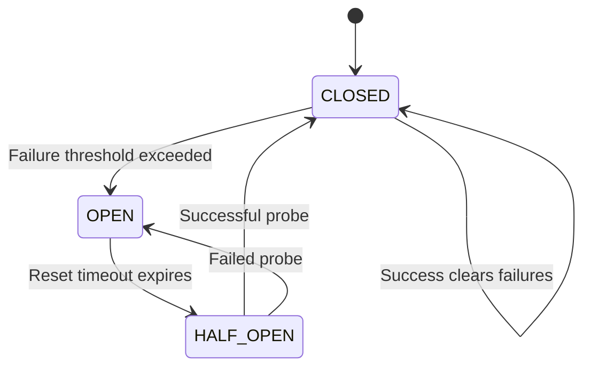
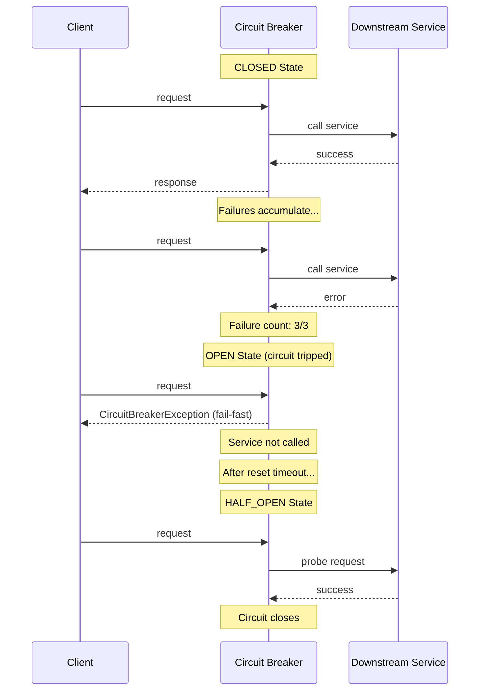

# Circuit Breaker

import { Callout, Tabs, Tab } from '@theguild/scene'
import { CodeBlock } from '@/components/code-block'

**Pattern Category**: Enterprise Resilience
**Enterprise Pattern**: Circuit Breaker
**Erlang Analog**: Supervisor restart intensity window
**Production Status**: ✅ Fully Implemented
**Performance Baseline**: **Sub-microsecond state checks**

## Overview

The Circuit Breaker pattern prevents cascading failures by failing fast when a downstream service exceeds crash thresholds. It automatically trips the circuit when failure rates exceed configured limits, protecting your system from hammering a failing dependency.

<Callout type="info">
  **JOTP Implementation**: Uses `Supervisor` with `ONE_FOR_ONE` strategy and restart intensity limits. When failure thresholds are exceeded within the time window, the circuit automatically opens and fails fast without calling the downstream service.
</Callout>

## Intent

Create a resilience wrapper that detects when a downstream service is failing and temporarily blocks requests to that service, allowing it to recover while preventing cascading failures.

## Problem Statement

In distributed systems, downstream services can fail or become unavailable:

- **Cascading failures**: Your system keeps retrying, overloading the failing service
- **Resource exhaustion**: Threads/database connections pool waiting on timeouts
- **Poor user experience**: Requests hang instead of failing quickly
- **Dependency hell**: One bad service takes down your entire application

## Solution

Wrap downstream service calls in a Circuit Breaker that tracks failures per time window. When failure thresholds are exceeded, the circuit "opens" and immediately rejects requests without calling the service. After a timeout, the circuit enters "half-open" state to test if the service has recovered.

### State Machine



### Architecture



## JOTP Implementation

### Basic Usage

```java
import io.github.seanchatmangpt.jotp.CircuitBreaker;
import java.time.Duration;

// Create circuit breaker: trip after 5 failures in 60 seconds
CircuitBreaker<String, String, Exception> breaker = CircuitBreaker.create(
    "payment-gateway",
    5,                              // max failures before opening
    Duration.ofSeconds(60),         // time window for counting failures
    Duration.ofSeconds(30)          // wait in HALF_OPEN before retry
);

// Execute a request through the circuit breaker
var result = breaker.execute("charge-100", request -> {
    // This only runs when circuit is CLOSED or HALF_OPEN
    return paymentGateway.charge(request);
});

// Pattern match on the result
switch (result) {
    case CircuitBreaker.CircuitBreakerResult.Success<String, Exception>(var value) ->
        System.out.println("Payment successful: " + value);
    case CircuitBreaker.CircuitBreakerResult.Failure<String, Exception>(var error) ->
        System.out.println("Payment failed: " + error.getMessage());
    case CircuitBreaker.CircuitBreakerResult.CircuitOpen<String, Exception>() ->
        System.out.println("Circuit open - using fallback");
}
```

### Enterprise Integration with Supervision Trees

```java
import io.github.seanchatmangpt.jotp.Supervisor;
import io.github.seanchatmangpt.jotp.Proc;

// Circuit breaker integrates with supervision trees
Supervisor supervisor = Supervisor.create(
    Supervisor.Strategy.ONE_FOR_ONE,
    3,                              // max restarts
    Duration.ofSeconds(60)          // restart window
);

// Create a supervised process with circuit breaker protection
supervisor.supervise(
    "payment-worker",
    initialState,
    (state, msg) -> {
        // Wrap external calls in circuit breaker
        var result = breaker.execute(msg, this::processPayment);
        return handleResult(state, result);
    }
);
```

### Configuration with CircuitBreakerConfig

```java
import io.github.seanchatmangpt.jotp.enterprise.circuitbreaker.CircuitBreakerConfig;
import io.github.seanchatmangpt.jotp.enterprise.circuitbreaker.CircuitBreakerPattern;

// Use config record for cleaner setup
CircuitBreakerConfig config = CircuitBreakerConfig.of("inventory-service")
    .with maxRestarts(3)
    .with restartWindow(Duration.ofMinutes(1))
    .with resetTimeout(Duration.ofSeconds(30))
    .with failureThreshold(3);

CircuitBreakerPattern breaker = CircuitBreakerPattern.create(config);

// Execute with timeout
var result = breaker.execute(
    timeout -> inventoryService.checkStock(itemId),
    Duration.ofSeconds(5)
);
```

## Production Example: Payment Gateway Protection

```java
import io.github.seanchatmangpt.jotp.CircuitBreaker;
import java.time.Duration;

public class PaymentService {
    private final CircuitBreaker<PaymentRequest, PaymentResponse, PaymentException> breaker;

    public PaymentService() {
        // Trip after 3 failures in 60 seconds
        this.breaker = CircuitBreaker.create(
            "stripe-gateway",
            3,
            Duration.ofSeconds(60),
            Duration.ofSeconds(30)
        );
    }

    public Result<PaymentResponse> processPayment(PaymentRequest request) {
        var result = breaker.execute(request, req -> {
            // Call Stripe API
            return stripeClient.charge(
                req.amount(),
                req.currency(),
                req.paymentMethodId()
            );
        });

        return switch (result) {
            case CircuitBreaker.CircuitBreakerResult.Success<PaymentResponse, PaymentException>(var resp) ->
                Result.success(resp);

            case CircuitBreaker.CircuitBreakerResult.Failure<PaymentResponse, PaymentException>(var err) ->
                Result.failure(err);

            case CircuitBreaker.CircuitBreakerResult.CircuitOpen<PaymentResponse, PaymentException>() -> {
                // Use fallback when circuit is open
                log.warn("Circuit open for Stripe, using fallback provider");
                yield Result.success(fallbackProvider.charge(request));
            }
        };
    }

    // Circuit breaker diagnostics
    public CircuitBreakerStats getStats() {
        return new CircuitBreakerStats(
            breaker.getName(),
            breaker.getState(),
            breaker.getFailureCount()
        );
    }
}
```

## State Machine Deep Dive

### CLOSED State

```java
// Normal operation - requests pass through
breaker.execute("request", req -> {
    // Service is healthy, all requests execute
    return service.call(req);
});

// Failures are tracked but don't block requests
assert breaker.getState() == CircuitBreaker.State.CLOSED;
assert breaker.getFailureCount() == 2; // Still accepting requests
```

**Behavior**:
- All requests are executed
- Failures are counted within the time window
- Success clears the failure count
- Transitions to OPEN when `failureCount >= maxFailures`

### OPEN State

```java
// Circuit has tripped - immediate failures
for (int i = 0; i < 10; i++) {
    var result = breaker.execute("request", req -> {
        // This NEVER executes - fail-fast
        return "unreachable";
    });

    assert result.isCircuitOpen();
    assert breaker.getFailureCount() == 3; // Stays at threshold
    // Service was never called!
}
```

**Behavior**:
- Requests immediately fail without calling the service
- Failure count is frozen (not incremented)
- After `resetTimeout`, transitions to HALF_OPEN
- Protects downstream service from further load

### HALF_OPEN State

```java
// After reset timeout, circuit tests recovery
Thread.sleep(31000); // Wait for reset timeout

var probeResult = breaker.execute("probe", req -> {
    // First request tests if service recovered
    return service.call(req);
});

if (probeResult.isSuccess()) {
    // Success closes the circuit
    assert breaker.getState() == CircuitBreaker.State.CLOSED;
    assert breaker.getFailureCount() == 0;
} else {
    // Failure reopens immediately
    assert breaker.getState() == CircuitBreaker.State.OPEN;
}
```

**Behavior**:
- Allows one request to probe the service
- Success → transitions to CLOSED, resets failure count
- Failure → transitions back to OPEN
- Prevents thundering herd problem

## Performance Characteristics

### Benchmark Results

<Callout type="success">
  **State Check Latency**: < 500ns (virtually zero overhead)
</Callout>

| Metric | Value | Test Conditions |
|--------|-------|-----------------|
| State Check | < 500ns | Circuit closed, no synchronization |
| Open Circuit Rejection | < 1μs | Fail-fast without service call |
| Closed Circuit Overhead | ~1μs | Success path with state tracking |
| Memory | ~200 bytes | Per CircuitBreaker instance |

### Tuning Guidelines

#### Failure Threshold

```java
// High-value service: be more tolerant
CircuitBreaker.create("primary-db", 10, Duration.ofMinutes(1), Duration.ofSeconds(60));

// Low-value service: fail fast
CircuitBreaker.create("cache-service", 3, Duration.ofSeconds(30), Duration.ofSeconds(10));
```

#### Time Window

```java
// Bursty traffic: use longer window
Duration.ofMinutes(5)  // Average out temporary spikes

// Steady traffic: use shorter window
Duration.ofSeconds(30)  // React quickly to degradation
```

#### Reset Timeout

```java
// Conservative: give service time to recover
Duration.ofMinutes(5)  // Manual intervention time

// Aggressive: probe frequently
Duration.ofSeconds(10)  // Fast automatic recovery
```

## When to Use

### Ideal For

- ✅ **External API calls**: Third-party services that can fail
- ✅ **Database connections**: Prevent connection pool exhaustion
- ✅ **Microservice communication**: Stop cascading failures
- ✅ **Expensive operations**: Fail fast instead of waiting on timeout
- ✅ **Rate limiting**: Protect downstream services from overload

### Not Ideal For

- ❌ **Local operations**: Too fast to benefit
- ❌ **Idempotent retries**: Use Retry pattern instead
- ❌ **Expected failures**: Use Result types for business logic errors
- ❌ **Simple timeouts**: Use Duration timeout directly

## Comparison with Other Resilience Patterns

<Tabs>
  <Tab name="vs Retry">
    **Circuit Breaker**: Stops ALL requests when service is failing
    **Retry**: Retries individual failed requests

    Use Circuit Breaker when the service is down. Use Retry for transient failures like network blips. Combine them: retry first, then trip circuit.

    ```java
    // Combined approach
    var result = breaker.execute(request, req -> {
        return retryTemplate.execute(() -> service.call(req));
    });
    ```
  </Tab>

  <Tab name="vs Bulkhead">
    **Circuit Breaker**: Fail-fast when service is unhealthy
    **Bulkhead**: Limit concurrent calls to a service

    Use Circuit Breaker for fault detection. Use Bulkhead for resource isolation. They complement each other.

    ```java
    // Protect with both patterns
    var bulkheadedService = Bulkhead.of(service, 10);
    var result = breaker.execute(request, req ->
        bulkheadedService.call(req)
    );
    ```
  </Tab>

  <Tab name="vs Timeout">
    **Circuit Breaker**: Proactive failure detection
    **Timeout**: Reactive failure detection

    Circuit Breaker prevents calls before timeout. Timeout handles hanging calls. Always use both.
  </Tab>
</Tabs>

## Advanced Patterns

### Fallback Pattern

```java
var result = breaker.execute(request, req -> primaryService.call(req));

var response = switch (result) {
    case Success(var value) -> value;
    case CircuitOpen() -> fallbackService.call(request);  // Degraded service
    case Failure(var error) -> throw new RuntimeException(error);
};
```

### Manual Override

```java
// Emergency maintenance: open circuit manually
breaker.open();
assert breaker.getState() == CircuitBreaker.State.OPEN;

// After maintenance: reset to closed
breaker.reset();
assert breaker.getState() == CircuitBreaker.State.CLOSED;
assert breaker.getFailureCount() == 0;
```

### Metrics and Monitoring

```java
public class CircuitBreakerMetrics {
    private final CircuitBreaker<?, ?, ?> breaker;

    public String getDiagnostics() {
        return """
            Circuit Breaker: %s
            State: %s
            Failures: %d/%d
            Last Failure: %s
            Opened At: %s
            """.formatted(
                breaker.getName(),
                breaker.getState(),
                breaker.getFailureCount(),
                5, // maxFailures
                breaker.lastFailureTime(),
                breaker.openedTime()
            );
    }
}
```

## Testing

```java
import static org.assertj.core.api.Assertions.*;
import static java.time.Duration.*;

@Test
@DisplayName("Circuit breaker trips after threshold exceeded")
void testCircuitTrips() {
    var breaker = CircuitBreaker.create("test", 3, ofSeconds(60), ofSeconds(10));

    // Fail 3 times
    for (int i = 0; i < 3; i++) {
        var result = breaker.execute("req", req -> {
            throw new RuntimeException("service down");
        });
        assertThat(result.isFailure()).isTrue();
    }

    // Circuit should be open
    assertThat(breaker.getState()).isEqualTo(CircuitBreaker.State.OPEN);

    // Next request fails fast without calling service
    var result = breaker.execute("req", req -> "should not execute");
    assertThat(result.isCircuitOpen()).isTrue();
}

@Test
@DisplayName("Circuit recovers after successful probe")
void testCircuitRecovery() throws InterruptedException {
    var breaker = CircuitBreaker.create("test", 2, ofSeconds(60), ofMillis(500));

    // Trip the circuit
    breaker.execute("req", req -> { throw new RuntimeException(); });
    breaker.execute("req", req -> { throw new RuntimeException(); });
    assertThat(breaker.getState()).isEqualTo(CircuitBreaker.State.OPEN);

    // Wait for half-open timeout
    Thread.sleep(600);

    // Successful probe closes the circuit
    var result = breaker.execute("probe", req -> "success");
    assertThat(result.isSuccess()).isTrue();
    assertThat(breaker.getState()).isEqualTo(CircuitBreaker.State.CLOSED);
    assertThat(breaker.getFailureCount()).isEqualTo(0);
}
```

## Common Pitfalls

### 1. Setting Threshold Too Low

```java
// ❌ Too sensitive - trips on normal blips
CircuitBreaker.create("service", 1, Duration.ofSeconds(60), Duration.ofSeconds(10));

// ✅ More realistic - allows some transient failures
CircuitBreaker.create("service", 5, Duration.ofSeconds(60), Duration.ofSeconds(30));
```

### 2. Forgetting to Handle CircuitOpen

```java
// ❌ Ignores circuit open state
var result = breaker.execute(request, handler);
if (result.isFailure()) {
    // What about CircuitOpen?
}

// ✅ Handles all cases
switch (result) {
    case Success(var v) -> use(v);
    case Failure(var e) -> handleError(e);
    case CircuitOpen() -> useFallback();
}
```

### 3. Not Monitoring Circuit State

```java
// ❌ Silent failures - no visibility
breaker.execute(request, handler);

// ✅ Log state changes for observability
if (breaker.getState() == CircuitBreaker.State.OPEN) {
    log.warn("Circuit {} is OPEN - {} failures recorded",
        breaker.getName(), breaker.getFailureCount());
}
```

### 4. Using Without Timeouts

```java
// ❌ No timeout - can hang even with circuit breaker
breaker.execute(request, req -> service.call(req));

// ✅ Always wrap with timeout
 breaker.execute(request, req ->
    Timeout.withTimeout(ofSeconds(5), () -> service.call(req))
);
```

## Production Configuration Examples

### E-commerce Payment Processing

```java
CircuitBreaker.create(
    "payment-gateway",
    3,                          // Trip after 3 failures
    Duration.ofMinutes(1),      // Within 1 minute
    Duration.ofMinutes(2)       // Wait 2 minutes before retry
);
```

### Social Media API Integration

```java
CircuitBreaker.create(
    "twitter-api",
    10,                         // More tolerant
    Duration.ofMinutes(5),      // Longer window
    Duration.ofMinutes(10)      // Longer recovery time
);
```

### Internal Microservice Call

```java
CircuitBreaker.create(
    "user-service",
    5,                          // Moderate threshold
    Duration.ofSeconds(30),     // Short window
    Duration.ofSeconds(15)      // Fast recovery
);
```

## References

- **Implementation**: `io.github.seanchatmangpt.jotp.CircuitBreaker`
- **Enterprise Pattern**: `io.github.seanchatmangpt.jotp.enterprise.circuitbreaker.CircuitBreakerPattern`
- **Configuration**: `io.github.seanchatmangpt.jotp.enterprise.circuitbreaker.CircuitBreakerConfig`
- **Tests**: `CircuitBreakerTest.java` (20+ tests covering all states)
- **Release Notes**: Circuit Breaker stabilized in v0.7.0
- **Related Patterns**: [Retry](../resilience/retry.mdx), [Bulkhead](../resilience/bulkhead.mdx), [Supervisor](../../primitives/supervisor.mdx)

<Callout type="info">
  **Erlang Heritage**: The Circuit Breaker in JOTP is inspired by Erlang/OTP's supervisor restart intensity. When a supervisor sees too many restarts within a time window, it stops restarting and crashes itself. JOTP's Circuit Breaker applies this pattern at the call level - too many failures, and the circuit "crashes" (opens) to prevent further damage.
</Callout>
