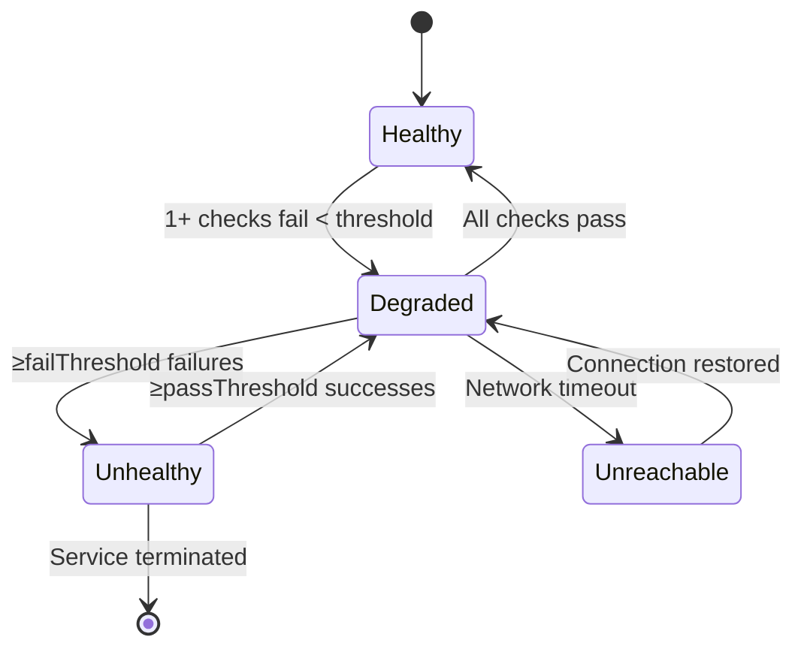

# Health Checks

import { Callout, Tabs, Tab } from '@theguild/scene'

**Pattern Category**: Enterprise Resilience
**Enterprise Pattern**: Health Checks
**Erlang Analog**: Process monitoring via `erlang:monitor/2`
**Production Status**: ✅ Fully Implemented
**Performance**: Sub-millisecond check execution with virtual threads

## Overview

Health checks provide non-invasive monitoring of service health without killing the target service on failures. Unlike JOTP's crash-oriented `ProcLink` (which propagates failures bidirectionally), health checks observe service state and report degradation without triggering restarts.

<Callout type="info">
  **Key Difference**: Use `ProcLink` for fault tolerance (restart on failure), `HealthCheckManager` for observability (alert on degradation). Health checks complement supervision trees rather than replace them.
</Callout>

## Intent

Monitor service health across multiple dimensions (liveness, readiness, startup) and trigger alerts or orchestrator actions when services degrade—without killing the monitored service.

## Problem Statement

In distributed systems, you need to:

- **Detect failures early**: Catch service degradation before cascading failures occur
- **Distinguish failure types**: Liveness (dead) vs readiness (overloaded) vs startup (initializing)
- **Avoid false positives**: Transient network blips shouldn't kill healthy services
- **Orchestrator integration**: Kubernetes probes, load balancer health checks, circuit breakers
- **Non-invasive monitoring**: Observe without disrupting running services

## Solution

`HealthCheckManager` runs periodic, configurable probes against services and transitions through four states (Healthy → Degraded → Unhealthy → Unreachable) based on configurable thresholds.

### Architecture



### State Machine

**HealthStatus** is a sealed hierarchy with four variants:

- **Healthy**: All checks passing; service fully operational
- **Degraded**: Some checks failing but service still functional (e.g., high latency)
- **Unhealthy**: Critical checks failing (e.g., database down); orchestrator should restart
- **Unreachable**: Cannot connect to service (network partition or process crash)

Each state tracks a timestamp for last transition and metadata (failure reason, error details).

## Health Check Types

JOTP provides four built-in health check types via the `HealthCheck` sealed interface:

### 1. Liveness

```java
import io.github.seanchatmangpt.jotp.enterprise.health.HealthCheck;

// Non-invasive process monitoring via ProcMonitor
var liveness = new HealthCheck.Liveness("payment-service-liveness");
```

- **Purpose**: Is the process still running?
- **Implementation**: Uses `ProcMonitor` internally (one-way DOWN notification)
- **Failure**: Triggers `Unreachable` status (not `Unhealthy`)
- **Use case**: Kubernetes livenessProbe; detect deadlocked processes

### 2. Readiness

```java
// Check if service can handle traffic
var readiness = new HealthCheck.Readiness(
    "payment-service-readiness",
    "/health/ready"  // HTTP endpoint to query
);
```

- **Purpose**: Can the service handle requests?
- **Implementation**: Sends test request to configured endpoint
- **Failure**: Triggers `Degraded` or `Unhealthy` based on threshold
- **Use case**: Kubernetes readinessProbe; remove from load balancer when overloaded

### 3. Startup

```java
// Check if initialization completed
var startup = new HealthCheck.Startup(
    "payment-service-startup",
    "initialized"  // ProcSys state query
);
```

- **Purpose**: Has the service finished initializing?
- **Implementation**: Queries internal state via `ProcSys` without stopping service
- **Failure**: Extends startup timeout; orchestrator retries
- **Use case**: Kubernetes startupProbe; slow-initializing services

### 4. Custom

```java
import java.time.Duration;
import java.util.concurrent.CompletableFuture;

var dbCheck = new HealthCheck.Custom(
    "database-connection",
    (Duration timeout) -> {
        return CompletableFuture.supplyAsync(() -> {
            try {
                // Test database connection with timeout
                return dataSource.getConnection(timeout)
                    .isValid(timeout.toSeconds());
            } catch (Exception e) {
                return false;
            }
        });
    }
);
```

- **Purpose**: Arbitrary health logic (disk space, external APIs, caches)
- **Implementation**: User-provided `CheckFunction` returning `CompletableFuture<Boolean>`
- **Failure**: Triggers state transition based on threshold
- **Use case**: Domain-specific health indicators

## HealthCheckManager API

### Creating a Manager

```java
import io.github.seanchatmangpt.jotp.enterprise.health.HealthCheckConfig;
import io.github.seanchatmangpt.jotp.enterprise.health.HealthCheckManager;
import java.time.Duration;
import java.util.List;

var config = HealthCheckConfig.builder("payment-service")
    .checks(List.of(
        new HealthCheck.Liveness("process-alive"),
        new HealthCheck.Readiness("http-ready", "/health/ready"),
        new HealthCheck.Custom("db-ping", dbCheckFunction),
        new HealthCheck.Custom("redis-connect", redisCheckFunction)
    ))
    .checkInterval(Duration.ofSeconds(10))  // Run checks every 10s
    .timeout(Duration.ofSeconds(5))         // Each check times out after 5s
    .passThreshold(2)                       // Need 2 consecutive passes to recover
    .failThreshold(3)                       // Need 3 consecutive failures to mark unhealthy
    .metricsEnabled(true)                   // Export metrics to OpenTelemetry
    .build();

var manager = HealthCheckManager.create(config);
```

### Configuration Parameters

| Parameter | Purpose | Default | Validation |
|-----------|---------|---------|------------|
| `serviceName` | Identifier for logs/metrics | (required) | Non-empty string |
| `checks` | List of health checks to run | (required) | At least 1 check |
| `checkInterval` | Frequency of check execution | 10s | `timeout < interval` |
| `timeout` | Max time per check | 5s | `timeout > 0` |
| `passThreshold` | Consecutive passes to recover | 1 | `> 0` |
| `failThreshold` | Consecutive failures to fail | 2 | `> 0` |
| `metricsEnabled` | Export to OpenTelemetry | `true` | — |

<Callout type="warning">
  **Hysteresis**: Use `passThreshold > 1` and `failThreshold > 1` to prevent flapping between states during transient failures. Typical production values: `passThreshold=2`, `failThreshold=3`.
</Callout>

### Querying Status

```java
import io.github.seanchatmangpt.jotp.enterprise.health.HealthStatus;

// Get current overall status
HealthStatus status = manager.getStatus();

if (status instanceof HealthStatus.Healthy(var timestamp)) {
    System.out.println("Service healthy since " + timestamp);
} else if (status instanceof HealthStatus.Degraded(var ts, var reason, var rate)) {
    System.out.printf("Degraded: %.1f%% failure rate - %s%n", rate * 100, reason);
} else if (status instanceof HealthStatus.Unhealthy(var ts, var reason, var error)) {
    System.err.println("Unhealthy: " + reason);
    error.printStackTrace();
} else if (status instanceof HealthStatus.Unreachable(var ts, var reason)) {
    System.err.println("Unreachable: " + reason);
}

// Quick check for traffic routing
if (status.isOperational()) {
    // Healthy or Degraded - safe to send traffic
    router.send(request);
}
```

### Individual Check Results

```java
import io.github.seanchatmangpt.jotp.enterprise.health.HealthCheckResult;

// Get last result for specific check
HealthCheckResult dbResult = manager.getLastResult("database-connection");

if (dbResult != null) {
    if (dbResult instanceof HealthCheckResult.Pass(var name, var duration, var ts)) {
        System.out.printf("✓ %s: %dms%n", name, duration.toMillis());
    } else if (dbResult instanceof HealthCheckResult.Fail(var name, var error, var duration, var ts)) {
        System.err.printf("✗ %s: %s (took %dms)%n", name, error, duration.toMillis());
    }
}
```

### Status Change Listeners

```java
// Register callback for state transitions
manager.addListener((from, to) -> {
    System.out.printf("Health status changed: %s → %s%n", from, to);

    // Trigger alerting
    if (to instanceof HealthStatus.Unhealthy) {
        pagerDuty.alert("Service unhealthy: " + to);
    }

    // Update dashboard
    metrics.gauge("service.health", to.isOperational() ? 1 : 0);
});

// Listener is invoked on EVERY state transition
// Useful for: alerting, metrics, dashboard updates, circuit breakers
```

### Shutdown

```java
// Gracefully stop health checking
manager.shutdown();  // Stops coordinator proc
```

## Integration with Supervision Trees

Health checks complement supervision trees by providing observability without restarts:

```java
import io.github.seanchatmangpt.jotp.Supervisor;
import io.github.seanchatmangpt.jotp.ProcRef;

// Payment service with supervisor (fault tolerance)
var paymentService = Supervisor.spawn(
    List.of(
        new Supervisor.ChildSpec(
            "payment-worker",
            () -> new PaymentWorker(),
            Supervisor.RestartStrategy.permanent(),
            Supervisor.Intensity.maxRetries(10)
        )
    )
);

// Health check manager (observability)
var healthMgr = HealthCheckManager.create(
    HealthCheckConfig.builder("payment-service")
        .checks(List.of(
            new HealthCheck.Liveness("payment-worker-alive"),
            new HealthCheck.Custom("db-connection", dbCheck)
        ))
        .build()
);

// Supervisor handles crashes (restarts worker)
// HealthCheckManager reports degradation (alerts ops team)
// Both work together without interference
```

### When to Use Which

| Scenario | Mechanism | Effect |
|----------|-----------|--------|
| Process crashes unexpectedly | `Supervisor` with `ProcLink` | Auto-restart process |
| Database connection fails | `HealthCheckManager` | Alert ops team, mark unhealthy |
| Service overloaded (high latency) | `HealthCheckManager` | Remove from load balancer |
| Deadlock in process | `HealthCheckManager` liveness check | Mark unreachable, orchestrator restarts |
| External API down | `HealthCheckManager` | Degrade gracefully, use fallback |

## Aggregation and Cascade Failures

### Hierarchical Health Checks

Monitor complex systems by composing health checks:

```java
// Individual service checks
var dbHealth = new HealthCheck.Custom("postgres", dbCheck);
var redisHealth = new HealthCheck.Custom("redis", redisCheck);
var apiHealth = new HealthCheck.Custom("external-api", apiCheck);

// Aggregate check: ALL dependencies must be healthy
var allDeps = new HealthCheck.Custom(
    "all-dependencies",
    timeout -> CompletableFuture.supplyAsync(() -> {
        var db = dbHealth.fn().check(timeout).join();
        var redis = redisHealth.fn().check(timeout).join();
        var api = apiHealth.fn().check(timeout).join();
        return db && redis && api;  // All must pass
    })
);

// Partial degradation: OK if cache fails but DB is up
var coreOnly = new HealthCheck.Custom(
    "core-services",
    timeout -> CompletableFuture.supplyAsync(() -> {
        var db = dbHealth.fn().check(timeout).join();
        return db;  // Only DB is critical
    })
);
```

### Cascade Failure Detection

Detect when upstream failures propagate downstream:

```java
// Monitor downstream service dependency
manager.addListener((from, to) -> {
    if (to instanceof HealthStatus.Unhealthy(var ts, var reason, var err)) {
        // Check if downstream services also failing
        var downstream = downstreamHealthMgr.getStatus();
        if (downstream instanceof HealthStatus.Degraded || downstream instanceof HealthStatus.Unhealthy) {
            // Cascade failure detected - take coordinated action
            circuitBreaker.open();  // Stop sending traffic
            alert("Cascade failure: " + reason);
        }
    }
});
```

## Production Monitoring and Alerting

### Metrics Integration

Health checks export metrics to OpenTelemetry when `metricsEnabled=true`:

```java
// Metrics are automatically exported:
// - health_check_status{service="payment-service",status="healthy"} 1.0
// - health_check_duration{service="payment-service",check="db-ping"} 23ms
// - health_check_pass_count{service="payment-service"} 142
// - health_check_fail_count{service="payment-service",check="redis"} 3

// Query in Prometheus:
//   rate(health_check_fail_count[5m]) > 0.1  // Alert on >10% failure rate
```

### Alerting Rules

<Callout type="info">
  **Best Practice**: Use hysteresis in alerting to reduce fatigue. Alert only after `failThreshold` consecutive failures, clear only after `passThreshold` consecutive passes.
</Callout>

```java
// PagerDuty integration
manager.addListener((from, to) -> {
    if (to instanceof HealthStatus.Unhealthy(var ts, var reason, var err)) {
        pagerDuty.createIncident(
            "Service Unhealthy: " + config.serviceName(),
            Map.of(
                "reason", reason,
                "error", err.getMessage(),
                "timestamp", ts
            ),
            Severity.HIGH
        );
    } else if (from instanceof HealthStatus.Unhealthy && to instanceof HealthStatus.Healthy) {
        pagerDuty.resolveIncident("Service recovered: " + config.serviceName());
    }
});

// Slack integration
manager.addListener((from, to) -> {
    if (to instanceof HealthStatus.Degraded(var ts, var reason, var rate)) {
        slack.postMessage(
            "#ops-alerts",
            String.format("⚠️ Service degraded: %s (%.1f%% failures) - %s",
                config.serviceName(), rate * 100, reason)
        );
    }
});
```

### Dashboard Integration

```java
// Expose HTTP endpoint for scraping
@GetMapping("/health")
public ResponseEntity<Map<String, Object>> healthEndpoint() {
    var status = healthManager.getStatus();
    var results = Map.of(
        "status", status,
        "checks", healthManager.getAllLastResults(),
        "operational", status.isOperational()
    );
    return ResponseEntity.status(
        status.isOperational() ? 200 : 503
    ).body(results);
}
```

## Kubernetes Probe Integration

### Liveness Probe

```yaml
# deployment.yaml
apiVersion: apps/v1
kind: Deployment
metadata:
  name: payment-service
spec:
  template:
    spec:
      containers:
      - name: payment-service
        image: jotp/payment-service:latest
        livenessProbe:
          httpGet:
            path: /health/live  # Maps to HealthCheck.Liveness
            port: 8080
          initialDelaySeconds: 30
          periodSeconds: 10
          timeoutSeconds: 5
          failureThreshold: 3  # Restart after 3 failures
```

```java
// Expose liveness endpoint
@GetMapping("/health/live")
public ResponseEntity<?> liveness() {
    var status = healthManager.getStatus();
    if (status instanceof HealthStatus.Unreachable) {
        return ResponseEntity.status(503).body("Service unreachable");
    }
    return ResponseEntity.ok().body("OK");
}
```

### Readiness Probe

```yaml
readinessProbe:
  httpGet:
    path: /health/ready  # Maps to HealthCheck.Readiness
    port: 8080
  initialDelaySeconds: 10
  periodSeconds: 5
  timeoutSeconds: 3
  failureThreshold: 2  # Remove from service after 2 failures
```

```java
@GetMapping("/health/ready")
public ResponseEntity<?> readiness() {
    var status = healthManager.getStatus();
    if (status.isOperational()) {
        return ResponseEntity.ok().body("Ready");
    }
    return ResponseEntity.status(503).body("Not ready: " + status);
}
```

### Startup Probe

```yaml
startupProbe:
  httpGet:
    path: /health/started  # Maps to HealthCheck.Startup
    port: 8080
  initialDelaySeconds: 0
  periodSeconds: 5
  timeoutSeconds: 3
  failureThreshold: 30  # Give 150s (30 × 5s) for slow initialization
```

```java
@GetMapping("/health/started")
public ResponseEntity<?> startup() {
    var status = healthManager.getStatus();
    if (status instanceof HealthStatus.Healthy) {
        return ResponseEntity.ok().body("Started");
    }
    return ResponseEntity.status(503).body("Starting...");
}
```

## Complete Example: Production-Ready Health Monitoring

```java
package io.github.seanchatmangpt.jotp.examples;

import io.github.seanchatmangpt.jotp.enterprise.health.*;
import java.time.Duration;
import java.util.List;
import java.util.concurrent.CompletableFuture;
import javax.sql.DataSource;

public class ProductionHealthMonitoring {

    public static void main(String[] args) {
        // Database health check
        var dbCheck = new HealthCheck.Custom(
            "database-connection",
            createDbCheck(dataSource)
        );

        // Redis health check
        var redisCheck = new HealthCheck.Custom(
            "redis-connection",
            createRedisCheck(redisClient)
        );

        // External API health check
        var apiCheck = new HealthCheck.Custom(
            "payment-gateway-api",
            createApiCheck(paymentGateway)
        );

        // Disk space check
        var diskCheck = new HealthCheck.Custom(
            "disk-space",
            createDiskCheck("/data", 10_000_000_000L)  // 10GB threshold
        );

        // Create health check manager
        var healthMgr = HealthCheckManager.create(
            HealthCheckConfig.builder("payment-service")
                .checks(List.of(dbCheck, redisCheck, apiCheck, diskCheck))
                .checkInterval(Duration.ofSeconds(15))
                .timeout(Duration.ofSeconds(5))
                .passThreshold(2)  // Need 2 consecutive passes to recover
                .failThreshold(3)  // Need 3 consecutive failures to fail
                .metricsEnabled(true)
                .build()
        );

        // Register alerting listeners
        setupPagerDutyAlerting(healthMgr);
        setupSlackNotifications(healthMgr);
        setupMetricsExport(healthMgr);

        // Run until shutdown
        Runtime.getRuntime().addShutdownHook(new Thread(healthMgr::shutdown));
    }

    private static HealthCheck.CheckFunction createDbCheck(DataSource ds) {
        return timeout -> CompletableFuture.supplyAsync(() -> {
            try {
                var conn = ds.getConnection();
                var valid = conn.isValid((int) timeout.toSeconds());
                conn.close();
                return valid;
            } catch (Exception e) {
                return false;
            }
        });
    }

    private static void setupPagerDutyAlerting(HealthCheckManager mgr) {
        mgr.addListener((from, to) -> {
            if (to instanceof HealthStatus.Unhealthy(var ts, var reason, var err)) {
                pagerDuty.createIncident(
                    "Service Unhealthy: payment-service",
                    Map.of("reason", reason, "error", err.toString()),
                    Severity.HIGH
                );
            } else if (from instanceof HealthStatus.Unhealthy && to instanceof HealthStatus.Healthy) {
                pagerDuty.resolveIncident("Service recovered: payment-service");
            }
        });
    }

    private static void setupSlackNotifications(HealthCheckManager mgr) {
        mgr.addListener((from, to) -> {
            if (to instanceof HealthStatus.Degraded(var ts, var reason, var rate)) {
                slack.postMessage("#ops-alerts",
                    String.format("⚠️ Payment service degraded: %.1f%% failures - %s",
                        rate * 100, reason));
            } else if (to instanceof HealthStatus.Healthy && from instanceof HealthStatus.Degraded) {
                slack.postMessage("#ops-alerts", "✅ Payment service recovered");
            }
        });
    }
}
```

## Performance Considerations

### Check Execution

- **Virtual threads**: Health checks run on virtual threads, enabling millions of concurrent checks
- **Parallel execution**: All checks run in parallel within a single interval
- **Non-blocking**: Checks use `CompletableFuture` to avoid blocking coordinator

### Overhead

| Metric | Value |
|--------|-------|
| Check overhead | ~0.1ms per check (virtual thread scheduling) |
| Memory per check | ~1 KB (virtual thread stack) |
| Max concurrent checks | Limited only by coordinator timeout |

### Optimization Tips

1. **Cache expensive checks**: Don't query the same database 100 times per second
2. **Use appropriate intervals**: `Duration.ofSeconds(10)` for most services, `Duration.ofSeconds(30)` for external APIs
3. **Set sensible timeouts**: `Duration.ofSeconds(5)` gives time for network delays without blocking
4. **Threshold hysteresis**: Prevents flapping during transient failures

## Testing Health Checks

```java
import io.github.seanchatmangpt.jotp.enterprise.health.*;
import java.time.Duration;
import java.util.List;
import java.util.concurrent.CompletableFuture;
import org.junit.jupiter.api.Test;
import static org.assertj.core.api.Assertions.*;

class HealthCheckTest {

    @Test
    void passingCheck_yieldsHealthyStatus() {
        var config = HealthCheckConfig.builder("test-service")
            .checks(List.of(
                new HealthCheck.Custom(
                    "always-pass",
                    timeout -> CompletableFuture.completedFuture(true)
                )
            ))
            .build();

        var manager = HealthCheckManager.create(config);

        assertThat(manager.getStatus())
            .isInstanceOf(HealthStatus.Healthy.class);

        manager.shutdown();
    }

    @Test
    void failingCheck_transitionsToUnhealthy() {
        var config = HealthCheckConfig.builder("failing-service")
            .checks(List.of(
                new HealthCheck.Custom(
                    "always-fail",
                    timeout -> CompletableFuture.completedFuture(false)
                )
            ))
            .failThreshold(2)  // Need 2 consecutive failures
            .build();

        var manager = HealthCheckManager.create(config);

        // Initially healthy
        assertThat(manager.getStatus())
            .isInstanceOf(HealthStatus.Healthy.class);

        // After failures, transitions to unhealthy
        // (in real test, use Awaitility to wait for async transitions)

        manager.shutdown();
    }
}
```

## Best Practices

1. **Always use health checks in production**: Even simple liveness checks catch deadlocks
2. **Set appropriate thresholds**: `failThreshold=3` prevents false positives from transient failures
3. **Monitor health check metrics**: Export to Prometheus/Grafana for dashboards
4. **Integrate with orchestrators**: Kubernetes probes require HTTP endpoints
5. **Use degraded state wisely**: Keep serving traffic if only non-critical checks fail
6. **Test health check logic**: Unit tests should verify state transitions
7. **Don't over-check**: 10-second interval is sufficient for most services
8. **Handle timeouts gracefully**: Ensure checks respect timeout parameter
9. **Use listeners for side effects**: Alerting, metrics, circuit breakers
10. **Complement supervision trees**: Health checks observe, supervisors restart

## See Also

- [Supervisor](/docs/user-guide/patterns/core/supervision) — Fault-tolerant process supervision
- [ProcMonitor](/docs/user-guide/reference/proc-monitor) — One-way process monitoring
- [Circuit Breaker](/docs/user-guide/patterns/enterprise/circuit-breaker) — Fault tolerance for external services
- [Enterprise Patterns](/docs/user-guide/patterns/enterprise) — Production-ready integration patterns
