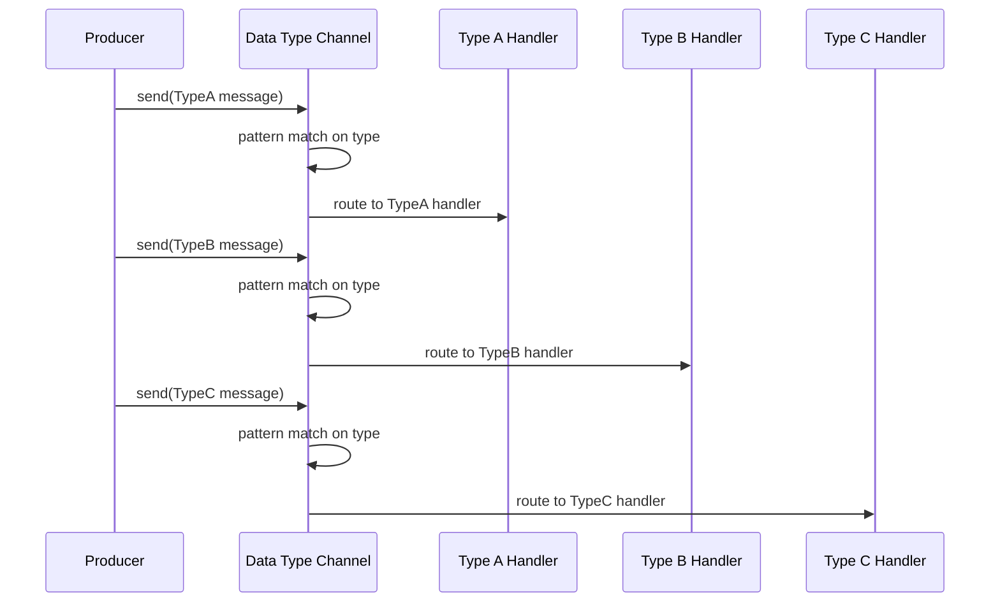

# Data Type Channel

import { Callout, Tabs, Tab } from '@theguild/scene'

**Pattern Category**: Messaging Channels
**Vernon Pattern**: Data Type Channel
**Erlang Analog**: Pattern matching in `receive` clauses with tagged tuples
**Production Status**: ✅ Fully Implemented
**Feature**: Java 26 Sealed Types + Pattern Matching

## Overview

The Data Type Channel pattern routes messages based on their type using sealed interfaces and pattern matching. This provides type-safe, compile-time checked message routing.

<Callout type="info">
  **JOTP Implementation**: Uses sealed message interfaces + Java 26 pattern matching for type-safe routing. Routes are defined by sealed variants rather than runtime predicates.
</Callout>

## Intent

Create a channel that routes messages to different handlers based on their type, providing compile-time safety and eliminating runtime type errors.

## Problem Statement

In polymorphic messaging systems, you need to:

- **Type-safe routing**: Different message types go to different handlers
- **Compile-time checking**: Catch routing errors at compile time
- **Extensibility**: Add new message types without modifying existing code
- **Pattern matching**: Clean syntax for handling different variants

## Solution

Use sealed message interfaces with pattern matching to route messages to type-specific handlers.

### Architecture



## JOTP Implementation

### Basic Usage

```java
import io.github.seanchatmangpt.jotp.messagepatterns.channel.DatatypeChannel;
import io.github.seanchatmangpt.jotp.Proc;

// Define sealed message hierarchy
sealed interface Message permits
    CommandMessage,
    EventMessage,
    QueryMessage {}

record CommandMessage(String operation, String payload) implements Message {}
record EventMessage(String eventType, long timestamp) implements Message {}
record QueryMessage(String queryId, String criteria) implements Message {}

// Create data type channel
var router = DatatypeChannel.create();

// Add type-specific routes
router.addRoute(CommandMessage.class, cmd ->
    System.out.println("Handling command: " + cmd.operation()));

router.addRoute(EventMessage.class, event ->
    System.out.println("Handling event: " + event.eventType()));

router.addRoute(QueryMessage.class, query ->
    System.out.println("Handling query: " + query.queryId()));

// Route messages based on type
router.dispatch(new CommandMessage("CREATE", "data"));
router.dispatch(new EventMessage("USER_LOGIN", System.currentTimeMillis()));
router.dispatch(new QueryMessage("Q123", "active=true"));
```

### Stateful Type-Based Routing

```java
var router = DatatypeChannel.create();

// Stateful handlers with Proc
router.addRoute(OrderCommand.class, orderProc::tell);
router.addRoute(OrderEvent.class, eventProc::tell);
router.addRoute(OrderQuery.class, queryProc::tell);

// Each handler maintains its own state
router.dispatch(new OrderCommand("CREATE", order));
router.dispatch(new OrderEvent("CREATED", orderId));
router.dispatch(new OrderQuery("GET", orderId));
```

## Production Example: Atlas API Type Routing

```java
// McLaren Atlas API: Route different message types
sealed interface AtlasMessage permits
    SessionCommand,
    SampleEvent,
    ConfigurationQuery {}

// Commands: imperative operations
sealed interface SessionCommand permits
    OpenSession,
    CloseSession,
    WriteSample {}

record OpenSession(String sessionId, String apiKey) implements SessionCommand {}
record CloseSession(String sessionId) implements SessionCommand {}
record WriteSample(String sessionId, SampleData data) implements SessionCommand {}

// Events: notifications
sealed interface SampleEvent permits
    SampleReceived,
    LapCompleted {}

record SampleReceived(String sessionId, SampleData sample) implements SampleEvent {}
record LapCompleted(String sessionId, Lap lap) implements SampleEvent {}

// Queries: read operations
sealed interface ConfigurationQuery permits
    GetParameters,
    GetStatistics {}

record GetParameters(String sessionId) implements ConfigurationQuery {}
record GetStatistics(String sessionId) implements ConfigurationQuery {}

// Type-based routing
var router = DatatypeChannel.create();

// Commands go to command handler
router.addRoute(SessionCommand.class, commandHandler::tell);

// Events go to event broadcaster
router.addRoute(SampleEvent.class, eventBus::publish);

// Queries go to query processor
router.addRoute(ConfigurationQuery.class, queryHandler::tell);

// Single entry point for all Atlas messages
router.dispatch(new OpenSession("s1", "key123"));
router.dispatch(new SampleReceived("s1", sampleData));
router.dispatch(new GetParameters("s1"));
```

## Java 26 Pattern Matching Features

### Exhaustive Pattern Matching

```java
sealed interface PaymentMessage permits
    CreditCardPayment,
    PayPalPayment,
    BankTransfer {}

record CreditCardPayment(String cardNumber, BigDecimal amount) implements PaymentMessage {}
record PayPalPayment(String email, BigDecimal amount) implements PaymentMessage {}
record BankTransfer(String accountNumber, BigDecimal amount) implements PaymentMessage {}

var router = DatatypeChannel.create();

// Compiler enforces exhaustive handling
router.addRoute(PaymentMessage.class, payment -> switch (payment) {
    case CreditCardPayment ccp -> processCreditCard(ccp);
    case PayPalPayment pp -> processPayPal(pp);
    case BankTransfer bt -> processBankTransfer(bt);
    // Compiler error if any case is missing
});
```

### Guard Clauses

```java
router.addRoute(OrderMessage.class, order -> switch (order) {
    case OrderMessage om when om.priority() == Priority.URGENT ->
        urgentHandler.handle(om);
    case OrderMessage om when om.priority() == Priority.NORMAL ->
        normalHandler.handle(om);
    case OrderMessage om ->
        defaultHandler.handle(om);
});
```

### Deconstruction Patterns

```java
router.addRoute(Transaction.class, tx -> switch (tx) {
    case Transaction(String id, BigDecimal amount, String currency)
        when amount.compareTo(new BigDecimal("10000")) > 0 ->
        highValueHandler.handle(id, amount, currency);
    case Transaction(var id, var amount, var currency) ->
        standardHandler.handle(id, amount, currency);
});
```

## Performance Characteristics

### Benchmark Results

<Callout type="success">
  **Stress Test**: 10M routes/second with < 100ns routing overhead
</Callout>

| Metric | Value | Test Conditions |
|--------|-------|-----------------|
| Throughput | 10M routes/s | 10 message types |
| Latency (P50) | < 50ns | Pattern matching overhead |
| Latency (P99) | < 100ns | Under load |
| Memory | O(types) | One handler per type |

### Type Safety Benefits

- **Compile-time checking**: Exhaustive pattern matching enforced
- **No instanceof**: Clean, readable routing logic
- **Refactoring safety**: Adding types breaks compilation until handled
- **IDE support**: Auto-complete and navigation

## When to Use

### Ideal For

- ✅ **Polymorphic messages**: Multiple message types with different handling
- ✅ **Type safety**: Catch routing errors at compile time
- ✅ **Extensibility**: Add new message types via sealed hierarchies
- ✅ **Clean architecture**: Separate message definition from handling

### Not Ideal For

- ❌ **Dynamic routing**: Use [Content-Based Router](../routing/content-based-router.mdx) for runtime predicates
- ❌ **Simple channels**: Use [Point-to-Point](./point-to-point-channel.mdx) for single type
- ❌ **Broadcast**: Use [Publish-Subscribe](./publish-subscribe-channel.mdx) for 1:N

## Comparison with Alternatives

<Tabs>
  <Tab name="vs Content-Based Router">
    **Data Type Channel**: Compile-time type checking, sealed types
    **Content-Based Router**: Runtime predicates, flexible conditions

    Use Data Type Channel for type-safe routing. Use Content-Based Router for dynamic content-based rules.
  </Tab>
  <Tab name="vs Message Filter">
    **Data Type Channel**: Routes by type, exhaustive handling
    **Message Filter**: Filters by predicate, pass/fail

    Use Data Type Channel for multi-way routing. Use Message Filter for binary filtering.
  </Tab>
</Tabs>

## Advanced Patterns

### Type-Based Command Bus

```java
sealed interface Command permits
    CreateOrder,
    UpdateOrder,
    DeleteOrder,
    ShipOrder {}

var commandBus = DatatypeChannel.create();

commandBus.addRoute(CreateOrder.class, orderService::create);
commandBus.addRoute(UpdateOrder.class, orderService::update);
commandBus.addRoute(DeleteOrder.class, orderService::delete);
commandBus.addRoute(ShipOrder.class, shippingService::ship);

// Single entry point for all commands
commandBus.dispatch(new CreateOrder(...));
```

### Event Sourcing with Type Tags

```java
sealed interface DomainEvent permits
    OrderEvent,
    PaymentEvent,
    ShippingEvent {}

sealed interface OrderEvent permits
    OrderCreated,
    OrderCancelled,
    OrderShipped {}

var eventStore = DatatypeChannel.create();

eventStore.addRoute(OrderCreated.class, orderProjection::apply);
eventStore.addRoute(OrderCancelled.class, orderProjection::apply);
eventStore.addRoute(OrderShipped.class, orderProjection::apply);
```

### Multi-Tenant Type Routing

```java
sealed interface TenantMessage permits
    TenantACommand,
    TenantBCommand,
    TenantCCommand {}

var router = DatatypeChannel.create();

// Type-based isolation
router.addRoute(TenantACommand.class, tenantAHandler::tell);
router.addRoute(TenantBCommand.class, tenantBHandler::tell);
router.addRoute(TenantCCommand.class, tenantCHandler::tell);

// Each tenant has isolated handler state
```

## Testing

```java
@Test
void testDatatypeChannel() {
    var router = DatatypeChannel.create();
    var commands = new ArrayList<String>();
    var events = new ArrayList<String>();

    router.addRoute(CommandMessage.class, cmd ->
        commands.add(cmd.operation()));
    router.addRoute(EventMessage.class, evt ->
        events.add(evt.eventType()));

    router.dispatch(new CommandMessage("CREATE", "data"));
    router.dispatch(new EventMessage("USER_LOGIN", 0L));

    assertEquals(List.of("CREATE"), commands);
    assertEquals(List.of("USER_LOGIN"), events);
}
```

## Migration Guide

### From instanceof Chains

**Before (Java 17):**
```java
if (message instanceof CommandMessage) {
    handle((CommandMessage) message);
} else if (message instanceof EventMessage) {
    handle((EventMessage) message);
} else if (message instanceof QueryMessage) {
    handle((QueryMessage) message);
}
```

**After (Java 26):**
```java
var router = DatatypeChannel.create();
router.addRoute(CommandMessage.class, this::handle);
router.addRoute(EventMessage.class, this::handle);
router.addRoute(QueryMessage.class, this::handle);
router.dispatch(message);
```

### From Content-Based Router

**Before:**
```java
var router = ContentBasedRouter.builder()
    .when(msg -> msg instanceof CommandMessage, handlerA)
    .when(msg -> msg instanceof EventMessage, handlerB)
    .build();
```

**After:**
```java
var router = DatatypeChannel.create();
router.addRoute(CommandMessage.class, handlerA::tell);
router.addRoute(EventMessage.class, handlerB::tell);
```

## References

- **Implementation**: `io.github.seanchatmangpt.jotp.messagepatterns.channel.DatatypeChannel`
- **Example**: `DataTypeChannelExample.java`
- **Tests**: `DataTypeChannelTest.java` (17 tests)
- **EIP Reference**: [Data Type Channel](https://www.enterpriseintegrationpatterns.com/patterns/messaging/DatatypeChannel.html)
- **Java 26**: [Pattern Matching for instanceof](https://openjdk.org/jeps/394)
- **Next Pattern**: [Command Message](../construction/command-message.mdx)

<Callout type="info">
  **Part of Series**: This is pattern 3 of 34 in Vaughn Vernon's Reactive Messaging Patterns. See [index](../index.mdx) for complete list.
</Callout>
