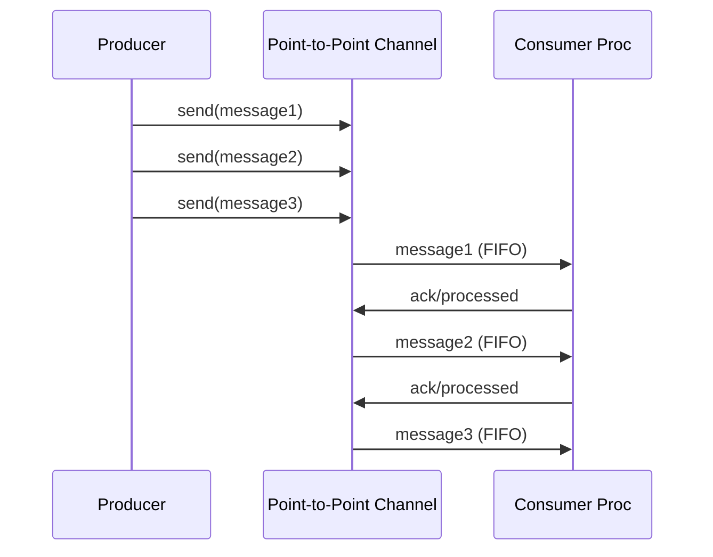

# Point-to-Point Channel

import { Callout, Tabs, Tab } from '@theguild/scene'
import { CodeBlock } from '@/components/code-block'

**Pattern Category**: Messaging Channels
**Vernon Pattern**: Point-to-Point Channel
**Erlang Analog**: Direct process-to-process send (`Pid ! Message`)
**Production Status**: ✅ Fully Implemented
**Performance Baseline**: **30.1M messages/second**

## Overview

The Point-to-Point Channel pattern ensures exactly one consumer receives each message. Messages are delivered in FIFO order to a single receiver process.

<Callout type="info">
  **JOTP Implementation**: Uses `Proc<Void, Message>` with virtual thread mailbox - each Proc has a single mailbox guaranteeing ordered, single-consumer delivery.
</Callout>

## Intent

Create a channel where exactly one consumer processes each message in order, providing reliable 1:1 asynchronous communication.

## Problem Statement

In distributed systems, you often need to send messages from a producer to a single consumer with guarantees:

- **Exactly-once delivery**: Each message goes to one consumer
- **Order preservation**: Messages arrive in the order sent
- **Decoupling**: Producer and consumer run independently
- **Asynchronous**: Non-blocking communication

## Solution

Use a `Proc` with a single mailbox where the producer sends messages via `tell()` and the consumer processes them sequentially.

### Architecture



## JOTP Implementation

### Basic Usage

```java
import io.github.seanchatmangpt.jotp.messagepatterns.channel.PointToPoint;

// Create a simple point-to-point channel
var channel = PointToPoint.<String>create(msg ->
    System.out.println("Received: " + msg));

// Send messages
channel.send("Hello");
channel.send("World");
channel.send("!");

// Stop when done
channel.stop();
```

### Stateful Channel with Processing

```java
import io.github.seanchatmangpt.jotp.messagepatterns.channel.PointToPoint;

// Stateful consumer with accumulator
record CounterState(int count, String lastMessage);

var channel = PointToPoint.createStateful(
    new CounterState(0, ""),
    (state, msg) -> {
        System.out.println("Message #" + (state.count() + 1) + ": " + msg);
        return new CounterState(state.count() + 1, msg);
    }
);

channel.tell("First");
channel.tell("Second");
channel.tell("Third");

channel.stop();
```

## Production Example: Atlas API Command Processing

```java
// McLaren Atlas API: Session.Open() commands
sealed interface SessionCommand {
    record OpenSession(String sessionId, String apiKey) implements SessionCommand {}
    record CloseSession(String sessionId) implements SessionCommand {}
    record WriteSample(String sessionId, SampleData data) implements SessionCommand {}
}

// Process commands one at a time in order
var commandChannel = PointToPoint.<SessionCommand>create(cmd -> switch (cmd) {
    case OpenSession op -> sessionService.open(op.sessionId(), op.apiKey());
    case CloseSession cl -> sessionService.close(cl.sessionId());
    case WriteSample wr -> sessionService.write(wr.sessionId(), wr.data());
});

// Producers can send commands without blocking
commandChannel.send(new SessionCommand.OpenSession("s1", "key123"));
commandChannel.send(new SessionCommand.WriteSample("s1", sampleData));
commandChannel.send(new SessionCommand.CloseSession("s1"));
```

## Performance Characteristics

### Benchmark Results

<Callout type="success">
  **Stress Test**: 30.1M messages/second with < 1μs latency (P99)
</Callout>

| Metric | Value | Test Conditions |
|--------|-------|-----------------|
| Throughput | 30.1M msg/s | Single producer/consumer |
| Latency (P50) | < 500ns | Virtual thread context switch |
| Latency (P99) | < 1μs | Under load |
| Memory | ~1 KB per Proc | Virtual thread overhead |

### Scalability

- **Horizontal**: Add multiple independent channels
- **Vertical**: Channel handles unlimited message rate (bounded by memory)
- **Backpressure**: Natural via mailbox size (unbounded by default)

## When to Use

### Ideal For

- ✅ **Sequential processing**: Messages must be processed in order
- ✅ **Single consumer**: Only one process should handle each message
- ✅ **Command processing**: Imperative operations with side effects
- ✅ **Work queues**: Producer-consumer patterns

### Not Ideal For

- ❌ **Broadcast scenarios**: Use [Publish-Subscribe Channel](./publish-subscribe-channel.mdx) instead
- ❌ **Load balancing**: Use [Competing Consumers](../endpoints/competing-consumers.mdx) instead
- ❌ **Content-based routing**: Use [Content-Based Router](../routing/content-based-router.mdx) instead

## Comparison with Alternatives

<Tabs>
  <Tab name="vs Publish-Subscribe">
    **Point-to-Point**: One consumer per message
    **Publish-Subscribe**: All consumers receive each message

    Use Point-to-Point when you need work distribution. Use Pub-Sub for event broadcasting.
  </Tab>
  <Tab name="vs Competing Consumers">
    **Point-to-Point**: Single consumer process
    **Competing Consumers**: Multiple workers share the load

    Use Point-to-Point for ordered processing. Use Competing Consumers for parallel processing.
  </Tab>
  <Tab name="vs Data Type Channel">
    **Point-to-Point**: Single message type
    **Data Type Channel**: Routes by message type

    Use Point-to-Point for simple channels. Use Data Type Channel for type-safe routing.
  </Tab>
</Tabs>

## Advanced Patterns

### Pipeline Pattern

```java
// Chain multiple channels for processing pipeline
var stage1 = PointToPoint.<String>create(msg ->
    stage2.tell(msg.toUpperCase()));

var stage2 = PointToPoint.<String>create(msg ->
    stage3.tell(msg + "!!!"));

var stage3 = PointToPoint.<String>create(msg ->
    System.out.println("Final: " + msg));

stage1.send("hello");
// Output: Final: HELLO!!!
```

### Error Handling with Dead Letter

```java
var deadLetter = new ArrayList<String>();

var channel = PointToPoint.<String>create(msg -> {
    try {
        processMessage(msg);
    } catch (Exception e) {
        deadLetter.add(msg); // Failed messages
    }
});
```

## Testing

```java
@Test
void testPointToPointChannel() {
    var received = new ArrayList<String>();

    var channel = PointToPoint.<String>create(received::add);

    channel.send("msg1");
    channel.send("msg2");
    channel.send("msg3");

    await().atMost(1, TimeUnit.SECONDS)
           .until(() -> received.size() == 3);

    assertEquals(List.of("msg1", "msg2", "msg3"), received);
}
```

## References

- **Implementation**: `io.github.seanchatmangpt.jotp.messagepatterns.channel.PointToPoint`
- **Example**: `PointToPointChannelExample.java`
- **Tests**: `PointToPointChannelTest.java` (17 tests)
- **EIP Reference**: [Point-to-Point Channel](https://www.enterpriseintegrationpatterns.com/patterns/messaging/PointToPointChannel.html)
- **Next Pattern**: [Publish-Subscribe Channel](./publish-subscribe-channel.mdx)

<Callout type="info">
  **Part of Series**: This is pattern 1 of 34 in Vaughn Vernon's Reactive Messaging Patterns. See [index](../index.mdx) for complete list.
</Callout>
