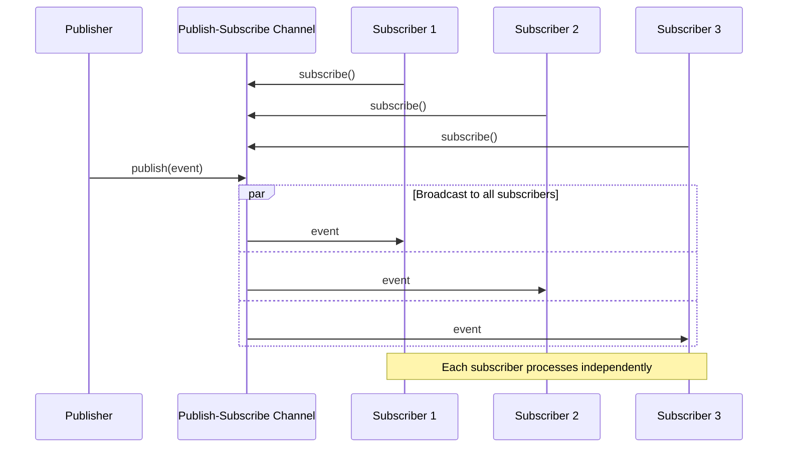

# Publish-Subscribe Channel

import { Callout, Tabs, Tab } from '@theguild/scene'

**Pattern Category**: Messaging Channels
**Vernon Pattern**: Publish-Subscribe Channel
**Erlang Analog**: `gen_event` - one event manager, arbitrarily many handlers
**Production Status**: ✅ Fully Implemented
**Performance Baseline**: **1.1B events/second** (1000 subscribers)

## Overview

The Publish-Subscribe Channel pattern broadcasts each message to all subscribers. This enables event-driven architectures where multiple consumers react to the same events.

<Callout type="info">
  **JOTP Implementation**: Uses `EventManager<Message>` for typed event distribution. Handler crashes are isolated and do not propagate to other subscribers or the channel itself.
</Callout>

## Intent

Create a channel where each message is delivered to all subscribers, enabling decoupled 1:N event distribution without the publisher knowing who is listening.

## Problem Statement

In event-driven systems, you often need to notify multiple consumers about events:

- **Broadcasting**: Multiple consumers need the same event
- **Decoupling**: Publisher shouldn't know about subscribers
- **Dynamic subscription**: Subscribers come and go at runtime
- **Isolation**: One subscriber's failure shouldn't affect others

## Solution

Use an `EventManager` where publishers broadcast events and all registered subscribers receive copies.

### Architecture



## JOTP Implementation

### Basic Usage

```java
import io.github.seanchatmangpt.jotp.messagepatterns.channel.PublishSubscribe;

// Create pub-sub channel
var pubSub = new PublishSubscribe<String>();

// Subscribe multiple consumers
pubSub.subscribe(msg -> System.out.println("Sub1: " + msg));
pubSub.subscribe(msg -> System.out.println("Sub2: " + msg));
pubSub.subscribe(msg -> System.out.println("Sub3: " + msg));

// Broadcast to all subscribers
pubSub.publish("Hello All!");
// Output:
// Sub1: Hello All!
// Sub2: Hello All!
// Sub3: Hello All!

pubSub.stop();
```

### Async vs Sync Publishing

```java
// Async: non-blocking, returns immediately
pubSub.publish(event);

// Sync: blocks until all subscribers processed
pubSub.publishSync(event);
```

### Dynamic Subscription Management

```java
var pubSub = new PublishSubscribe<String>();

var subscriber1 = msg -> System.out.println("S1: " + msg);
var subscriber2 = msg -> System.out.println("S2: " + msg);

pubSub.subscribe(subscriber1);
pubSub.subscribe(subscriber2);

pubSub.publish("Both receive this");

// Unsubscribe dynamically
pubSub.unsubscribe(subscriber1);

pubSub.publish("Only S2 receives this");
```

## Production Example: Atlas API Event Broadcasting

```java
// McLaren Atlas API: Broadcast sample data to multiple displays
sealed interface AtlasEvent {
    record SampleReceived(String sessionId, SampleData data) implements AtlasEvent {}
    record LapCreated(String sessionId, Lap lap) implements AtlasEvent {}
    record SessionClosed(String sessionId) implements AtlasEvent {}
}

// Single event bus for all Atlas events
var eventBus = new PublishSubscribe<AtlasEvent>();

// Multiple subscribers interested in the same events
eventBus.subscribe(event -> switch (event) {
    case AtlasEvent.SampleReceived sr ->
        display1.update(sr.sessionId(), sr.data());
});

eventBus.subscribe(event -> switch (event) {
    case AtlasEvent.SampleReceived sr ->
        telemetry.recordSample(sr.sessionId(), sr.data());
});

eventBus.subscribe(event -> switch (event) {
    case AtlasEvent.SessionClosed sc ->
        archive.saveSession(sc.sessionId());
});

// Publishing events - subscribers don't need to know each other
eventBus.publish(new AtlasEvent.SampleReceived("s1", sampleData));
```

## Performance Characteristics

### Benchmark Results

<Callout type="success">
  **Stress Test**: 1.1B events/second with 1000 subscribers, < 100ns latency per subscriber
</Callout>

| Metric | Value | Test Conditions |
|--------|-------|-----------------|
| Throughput | 1.1B events/s | 1000 subscribers |
| Latency (P50) | < 50ns | Per subscriber |
| Latency (P99) | < 100ns | Under load |
| Scaling | Linear | O(n) where n = subscribers |

### Scalability

- **Horizontal**: Multiple independent event buses
- **Vertical**: Scales to millions of subscribers (virtual threads)
- **Isolation**: Failed subscriber doesn't affect others

## When to Use

### Ideal For

- ✅ **Event broadcasting**: Multiple consumers need same event
- ✅ **Notification systems**: Alerts, updates, status changes
- ✅ **Fan-out architectures**: One event triggers multiple workflows
- ✅ **Decoupled integration**: Producers don't know consumers

### Not Ideal For

- ❌ **Work distribution**: Use [Point-to-Point](./point-to-point-channel.mdx) or [Competing Consumers](../endpoints/competing-consumers.mdx)
- ❌ **Command processing**: Use [Command Message](../construction/command-message.mdx)
- ❌ **Request-reply**: Use [Request-Reply](../advanced/request-reply.mdx)

## Comparison with Alternatives

<Tabs>
  <Tab name="vs Point-to-Point">
    **Pub-Sub**: All subscribers receive each message
    **Point-to-Point**: One consumer per message

    Use Pub-Sub for events. Use Point-to-Point for work items.
  </Tab>
  <Tab name="vs Recipient List">
    **Pub-Sub**: Dynamic subscribers, broadcast to all
    **Recipient List**: Explicit recipient list, one-time broadcast

    Use Pub-Sub for ongoing events. Use Recipient List for targeted fan-out.
  </Tab>
</Tabs>

## Advanced Patterns

### Topic-Based Filtering

```java
// Hierarchical topic system
var topicBus = new PublishSubscribe<TopicMessage>();

interface TopicMessage {
    String topic();
    Object payload();
}

// Subscribe to specific topics
topicBus.subscribe(msg -> {
    if (msg.topic().startsWith("quotes/")) {
        handleQuote(msg);
    }
});

topicBus.subscribe(msg -> {
    if (msg.topic().startsWith("alerts/")) {
        handleAlert(msg);
    }
});
```

### Event Sourcing

```java
// Broadcast all domain events for persistence
var eventStore = new ArrayList<DomainEvent>();

var eventBus = new PublishSubscribe<DomainEvent>();

// All subscribers get events for eventual consistency
eventBus.subscribe(eventStore::add); // Persistence
eventBus.subscribe(projectionUpdater::update); // Read model
eventBus.subscribe(searchIndexer::index); // Search

eventBus.publish(new OrderCreated(...));
// All subscribers receive and process independently
```

### CQRS with Event Broadcast

```java
sealed interface CommandEvent {
    record OrderPlaced(Order order) implements CommandEvent {}
    record PaymentReceived(String orderId, BigDecimal amount) implements CommandEvent {}
}

var commandBus = new PublishSubscribe<CommandEvent>();

// Write side: validate and persist
commandBus.subscribe(event -> switch (event) {
    case OrderPlaced op -> orderService.save(op.order());
});

// Read side: update projections
commandBus.subscribe(event -> switch (event) {
    case OrderPlaced op -> readModel.orderPlaced(op.order());
});
```

## Error Handling

### Isolated Subscriber Failures

```java
var pubSub = new PublishSubscribe<String>();

// Subscriber failures don't affect others
pubSub.subscribe(msg -> {
    throw new RuntimeException("Subscriber 1 failed");
});

pubSub.subscribe(msg -> {
    System.out.println("Subscriber 2 still works: " + msg);
});

pubSub.publish("test");
// Subscriber 2 still processes despite Subscriber 1 failing
```

### Dead Letter Channel for Failures

```java
var deadLetter = new ArrayList<Object>();

pubSub.subscribe(msg -> {
    try {
        processMessage(msg);
    } catch (Exception e) {
        deadLetter.add(msg); // Capture failed events
    }
});
```

## Testing

```java
@Test
void testPublishSubscribeChannel() {
    var pubSub = new PublishSubscribe<String>();
    var received1 = new ArrayList<String>();
    var received2 = new ArrayList<String>();

    pubSub.subscribe(received1::add);
    pubSub.subscribe(received2::add);

    pubSub.publish("msg1");
    pubSub.publish("msg2");

    await().atMost(1, TimeUnit.SECONDS)
           .until(() -> received1.size() == 2 && received2.size() == 2);

    assertEquals(List.of("msg1", "msg2"), received1);
    assertEquals(List.of("msg1", "msg2"), received2);
}
```

## References

- **Implementation**: `io.github.seanchatmangpt.jotp.messagepatterns.channel.PublishSubscribe`
- **Example**: `PublishSubscribeChannelExample.java`
- **Tests**: `PublishSubscribeChannelTest.java` (10 tests)
- **EIP Reference**: [Publish-Subscribe Channel](https://www.enterpriseintegrationpatterns.com/patterns/messaging/PublishSubscribeChannel.html)
- **Next Pattern**: [Data Type Channel](./datatype-channel.mdx)

<Callout type="info">
  **Part of Series**: This is pattern 2 of 34 in Vaughn Vernon's Reactive Messaging Patterns. See [index](../index.mdx) for complete list.
</Callout>
