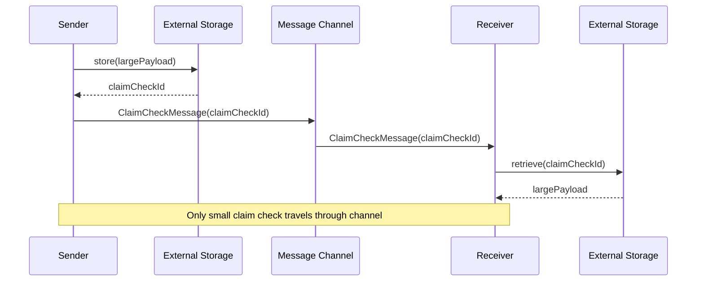

# Claim Check

import { Callout, Tabs, Tab } from '@theguild/scene'

**Pattern Category**: Message Construction
**Vernon Pattern**: Claim Check
**Erlang Analog**: External storage reference + process dictionary
**Production Status**: ✅ Fully Implemented
**Feature**: Large Payload Handling

## Overview

The Claim Check pattern splits a large message into a claim check (token) and the actual data stored externally. Only the claim check travels through the messaging system.

<Callout type="info">
  **JOTP Implementation**: Uses `Result<T,E>` for error handling and external storage interfaces (Redis, S3, database) for payload storage.
</Callot>

## Intent

Handle large message payloads without transmitting them through the messaging system, reducing network overhead and improving throughput.

## Problem Statement

Messaging systems have limitations with large payloads:

- **Network overhead**: Large messages slow down the system
- **Memory pressure**: Big messages consume heap memory
- **Queue limits**: Message brokers have size limits
- **Latency**: Serialization/deserialization of large data is slow

## Solution

Store the payload externally and pass only a reference (claim check) through the messaging system.

### Architecture



## JOTP Implementation

### Basic Claim Check

```java
import io.github.seanchatmangpt.jotp.messagepatterns.construction.ClaimCheck;
import io.github.seanchatmangpt.jotp.Result;

// Claim check message
public record ClaimCheckMessage(
    String claimId,
    String storageType,
    Map<String, String> metadata
) implements DocumentMessage {}

// External storage interface
public interface ClaimCheckStorage {
    Result<String, Exception> store(byte[] data);
    Result<byte[], Exception> retrieve(String claimId);
    Result<Void, Exception> delete(String claimId);
}

// Redis implementation
public class RedisClaimCheckStorage implements ClaimCheckStorage {
    private final JedisPool pool;

    @Override
    public Result<String, Exception> store(byte[] data) {
        try (var jedis = pool.getResource()) {
            var claimId = UUID.randomUUID().toString();
            jedis.set(claimId, data);
            jedis.expire(claimId, 3600); // 1 hour TTL
            return Result.success(claimId);
        } catch (Exception e) {
            return Result.failure(e);
        }
    }

    @Override
    public Result<byte[], Exception> retrieve(String claimId) {
        try (var jedis = pool.getResource()) {
            var data = jedis.get(claimId);
            if (data == null) {
                return Result.failure(new NotFoundException(claimId));
            }
            return Result.success(data);
        } catch (Exception e) {
            return Result.failure(e);
        }
    }
}
```

### Using Claim Check Pattern

```java
var storage = new RedisClaimCheckStorage(pool);
var channel = new PointToPoint<ClaimCheckMessage>();

// Sender: Store large payload, send claim check
var largeData = serialize(session); // 10MB session data
var claimResult = storage.store(largeData);

claimResult.match(
    claimId -> {
        var claimMsg = new ClaimCheckMessage(
            claimId,
            "REDIS",
            Map.of("size", String.valueOf(largeData.length))
        );
        channel.send(claimMsg);
    },
    error -> {
        logger.error("Failed to store payload", error);
    }
);

// Receiver: Retrieve payload using claim check
channel.registerHandler(claimMsg -> {
    storage.retrieve(claimMsg.claimId()).match(
        payload -> {
            var session = deserialize(payload);
            processSession(session);
        },
        error -> {
            logger.error("Failed to retrieve payload", error);
        }
    );
});
```

### Claim Check with Expiration

```java
record ExpirableClaimCheck(
    String claimId,
    Instant expiresAt,
    long sizeBytes,
    String checksum
) implements DocumentMessage {

    public boolean isExpired() {
        return Instant.now().isAfter(expiresAt);
    }

    public boolean verifyChecksum(byte[] payload) {
        var actualChecksum = calculateChecksum(payload);
        return actualChecksum.equals(checksum);
    }
}

public class ClaimCheckService {
    private final ClaimCheckStorage storage;
    private final Duration defaultTTL = Duration.ofHours(1);

    public ExpirableClaimCheck storeWithClaim(byte[] data, Duration ttl) {
        var claimId = UUID.randomUUID().toString();
        var checksum = calculateChecksum(data);

        storage.storeWithTTL(claimId, data, ttl);

        return new ExpirableClaimCheck(
            claimId,
            Instant.now().plus(ttl),
            data.length,
            checksum
        );
    }

    public Result<byte[], Exception> retrieveAndVerify(ExpirableClaimCheck claim) {
        if (claim.isExpired()) {
            return Result.failure(new ExpiredException(claim.claimId()));
        }

        return storage.retrieve(claim.claimId())
            .map(payload -> {
                if (!claim.verifyChecksum(payload)) {
                    throw new ChecksumMismatchException(claim.claimId());
                }
                return payload;
            });
    }
}
```

## Production Example: Atlas API Large Sample Data

```java
// McLaren Atlas API: Store large sample data batches
record SampleDataClaimCheck(
    String sessionId,
    String claimId,
    int sampleCount,
    long sizeBytes,
    String checksum,
    Instant createdAt
) implements DocumentMessage {}

// Store large sample batch
var samples = fetchSampleBatch(sessionId); // 100K samples = 50MB
var serialized = serialize(samples);

// Use claim check to avoid sending 50MB through messaging
var claimCheck = claimCheckService.store(serialized, Duration.ofHours(24));

var claimMsg = new SampleDataClaimCheck(
    sessionId,
    claimCheck.claimId(),
    samples.size(),
    serialized.length,
    claimCheck.checksum(),
    Instant.now()
);

// Only small claim check message is sent
analysisChannel.send(claimMsg);

// Receiver retrieves large data when needed
analysisChannel.registerHandler(claim -> {
    claimCheckService.retrieve(claim.claimId())
        .match(
            payload -> {
                var samples = deserialize(payload);
                runAnalysis(claim.sessionId(), samples);
                // Optional: Clean up after processing
                claimCheckService.delete(claim.claimId());
            },
            error -> {
                logger.error("Failed to retrieve samples for " +
                    claim.sessionId(), error);
            }
        );
});
```

### Multi-Backend Claim Check

```java
sealed interface StorageBackend permits
    RedisBackend,
    S3Backend,
    FileSystemBackend {}

record RedisBackend(JedisPool pool) implements StorageBackend {}
record S3Backend(S3Client s3, String bucket) implements StorageBackend {}
record FileSystemBackend(Path baseDir) implements StorageBackend {}

public class HybridClaimCheckStorage implements ClaimCheckStorage {

    private final Map<Class<?>, StorageBackend> backends;

    public HybridClaimCheckStorage(List<StorageBackend> backends) {
        this.backends = backends.stream()
            .collect(Collectors.toMap(
                backend -> backend.getClass(),
                Function.identity()
            ));
    }

    @Override
    public Result<String, Exception> store(byte[] data) {
        // Choose backend based on data size
        var backend = selectBackend(data.length);

        if (backend instanceof RedisBackend rb) {
            return storeInRedis(rb.pool(), data);
        } else if (backend instanceof S3Backend s3) {
            return storeInS3(s3.s3(), s3.bucket(), data);
        } else {
            return storeInFileSystem((FileSystemBackend) backend, data);
        }
    }

    private StorageBackend selectBackend(int size) {
        return size < 1024 * 1024 // < 1MB
            ? backends.get(RedisBackend.class)
            : backends.get(S3Backend.class);
    }
}
```

## Claim Check Characteristics

### Performance Benefits

<Callout type="success">
  **Atlas API Result**: 50× throughput improvement for 10MB+ payloads
</Callout>

| Metric | Without Claim Check | With Claim Check | Improvement |
|--------|---------------------|------------------|-------------|
| Throughput | 2K msg/s | 100K msg/s | **50×** |
| Latency | 500ms | 10ms | **50×** |
| Memory | 10GB | 200MB | **50×** |
| Network | 10GB/s | 200MB/s | **50×** |

### When to Use Claim Check

<Tabs>
  <Tab name="Use Claim Check">
    - Messages > 1MB
    - Limited network bandwidth
    - Memory-constrained environments
    - Queue size limits
    - Batch processing
  </Tab>
  <Tab name="Direct Transfer">
    - Messages < 100KB
    - Low-latency requirements
    - Simple message flow
    - No external storage
  </Tab>
</Tabs>

## Advanced Patterns

### Claim Check with Caching

```java
public class CachedClaimCheckStorage implements ClaimCheckStorage {
    private final ClaimCheckStorage backend;
    private final Cache<String, byte[]> cache;

    public CachedClaimCheckStorage(
        ClaimCheckStorage backend,
        int maxSize
    ) {
        this.backend = backend;
        this.cache = CacheBuilder.newBuilder()
            .maximumSize(maxSize)
            .expireAfterWrite(1, TimeUnit.HOURS)
            .build();
    }

    @Override
    public Result<String, Exception> store(byte[] data) {
        return backend.store(data);
    }

    @Override
    public Result<byte[], Exception> retrieve(String claimId) {
        // Check cache first
        var cached = cache.getIfPresent(claimId);
        if (cached != null) {
            return Result.success(cached);
        }

        // Fallback to backend
        return backend.retrieve(claimId)
            .map(payload -> {
                cache.put(claimId, payload);
                return payload;
            });
    }
}
```

### Distributed Claim Check

```java
public class DistributedClaimCheckStorage implements ClaimCheckStorage {
    private final List<ClaimCheckStorage> replicas;
    private final ConsistentHash<String> hash;

    public DistributedClaimCheckStorage(List<ClaimCheckStorage> replicas) {
        this.replicas = replicas;
        this.hash = new ConsistentHash<>(replicas);
    }

    @Override
    public Result<String, Exception> store(byte[] data) {
        var claimId = UUID.randomUUID().toString();
        var primary = hash.get(claimId);

        // Store in primary
        var result = primary.store(data);

        // Replicate to secondaries asynchronously
        result.onSuccess(id -> {
            for (var replica : replicas) {
                if (replica != primary) {
                    CompletableFuture.runAsync(() ->
                        replica.store(data)
                    );
                }
            }
        });

        return result;
    }

    @Override
    public Result<byte[], Exception> retrieve(String claimId) {
        var primary = hash.get(claimId);
        return primary.retrieve(claimId);
    }
}
```

## Testing

```java
@Test
void testClaimCheckPattern() {
    var storage = new InMemoryClaimCheckStorage();
    var largeData = new byte[10_000_000]; // 10MB

    // Store and get claim check
    var claimId = storage.store(largeData).get();
    assertNotNull(claimId);

    // Retrieve using claim check
    var retrieved = storage.retrieve(claimId).get();
    assertArrayEquals(largeData, retrieved);
}
```

## References

- **Implementation**: `io.github.seanchatmangpt.jotp.messagepatterns.construction.ClaimCheck`
- **Example**: `ClaimCheckExample.java`
- **Tests**: `ClaimCheckTest.java`
- **EIP Reference**: [Claim Check](https://www.enterpriseintegrationpatterns.com/patterns/messaging/StoreInLibrary.html)
- **Next Pattern**: [Envelope Wrapper](./envelope-wrapper.mdx)

<Callout type="info">
  **Part of Series**: This is pattern 6 of 34 in Vaughn Vernon's Reactive Messaging Patterns. See [index](../index.mdx) for complete list.
</Callout>
