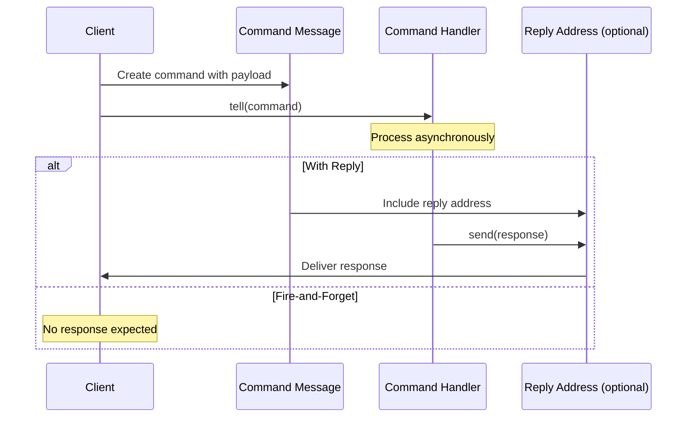

# Command Message

import { Callout, Tabs, Tab } from '@theguild/scene'

**Pattern Category**: Message Construction
**Vernon Pattern**: Command Message
**Erlang Analog**: Tagged tuple sent to `gen_server`'s `handle_call/3` or `handle_cast/2`
**Production Status**: ✅ Fully Implemented
**Feature**: Java 26 Sealed Interfaces + Records

## Overview

The Command Message pattern represents an imperative request for an action to be performed. It carries the intent to do something, potentially with a reply address for the response.

<Callout type="info">
  **JOTP Implementation**: Uses sealed interfaces and records with Java 26 pattern matching. Commands are fire-and-forget via `tell()` or synchronous via `ask()`.
</Callout>

## Intent

Encapsulate an imperative operation as a message that can be sent asynchronously, decoupling the requester from the executor.

## Problem Statement

In distributed systems, you need to request actions:

- **Imperative operations**: "Do this" rather than "this happened"
- **Asynchronous execution**: Non-blocking command processing
- **Reply coordination**: Optional response handling
- **Type safety**: Compile-time command validation

## Solution

Represent commands as sealed records carrying operation name, payload, and optional reply address.

### Architecture



## JOTP Implementation

### Basic Command

```java
import io.github.seanchatmangpt.jotp.messagepatterns.construction.CommandMessage;
import io.github.seanchatmangpt.jotp.Proc;

// Define command as sealed interface
sealed interface OrderCommand implements CommandMessage permits
    CreateOrder,
    UpdateOrder,
    CancelOrder {}

record CreateOrder(String orderId, String customerId, List<Item> items)
    implements OrderCommand {}

record UpdateOrder(String orderId, Map<String, String> updates)
    implements OrderCommand {}

record CancelOrder(String orderId, String reason)
    implements OrderCommand {}

// Create command handler
var handler = new Proc<OrderState, OrderCommand>(
    new OrderState(),
    (state, cmd) -> switch (cmd) {
        case CreateOrder co -> state.create(co);
        case UpdateOrder uo -> state.update(uo);
        case CancelOrder co -> state.cancel(co);
    }
);

// Send commands
handler.tell(new CreateOrder("o1", "c1", items));
handler.tell(new UpdateOrder("o1", Map.of("status", "SHIPPED")));
handler.tell(new CancelOrder("o1", "Customer request"));
```

### Command with Reply

```java
import io.github.seanchatmangpt.jotp.ProcRef;

// Command with reply address
record QueryOrder(String orderId, ProcRef<OrderResponse> replyTo)
    implements CommandMessage {}

var handler = new Proc<OrderState, CommandMessage>(
    new OrderState(),
    (state, cmd) -> {
        if (cmd instanceof QueryOrder q) {
            var response = new OrderResponse(q.orderId(), state.getOrder(q.orderId()));
            q.replyTo().tell(response); // Send reply
        }
        return state;
    }
);

// Client sends command with reply address
var client = new Proc<Void, OrderResponse>(null, (state, resp) -> {
    System.out.println("Got response: " + resp);
    return state;
});

handler.tell(new QueryOrder("o1", client.ref()));
```

### Command with Timeout

```java
record CommandWithTimeout<T>(
    T command,
    Duration timeout,
    ProcRef<Response> replyTo
) implements CommandMessage {}

var handler = new Proc<Void, CommandWithTimeout<Operation>>(
    null,
    (state, cmd) -> {
        try {
            var result = executeWithTimeout(cmd.command(), cmd.timeout());
            cmd.replyTo().tell(new Success(result));
        } catch (TimeoutException e) {
            cmd.replyTo().tell(new Timeout(cmd.command()));
        }
        return state;
    }
);
```

## Production Example: Atlas API Commands

```java
// McLaren Atlas API: Session commands
sealed interface AtlasCommand implements CommandMessage permits
    OpenSession,
    CloseSession,
    WriteSample,
    CreateLap {}

record OpenSession(
    String sessionId,
    String apiKey,
    ProcRef<SessionOpened> replyTo
) implements AtlasCommand {}

record CloseSession(String sessionId) implements AtlasCommand {}

record WriteSample(
    String sessionId,
    SampleData data,
    ProcRef<SampleWritten> replyTo
) implements AtlasCommand {}

record CreateLap(
    String sessionId,
    String lapNumber,
    ProcRef<LapCreated> replyTo
) implements AtlasCommand {}

// Command handler with validation
var sessionManager = new Proc<SessionManagerState, AtlasCommand>(
    new SessionManagerState(),
    (state, cmd) -> switch (cmd) {
        case OpenSession os -> {
            validateApiKey(os.apiKey());
            var session = state.createSession(os.sessionId());
            os.replyTo().tell(new SessionOpened(os.sessionId()));
            yield state.withSession(session);
        }
        case CloseSession cs -> state.closeSession(cs.sessionId());
        case WriteSample ws -> {
            var session = state.getSession(ws.sessionId());
            session.writeSample(ws.data());
            ws.replyTo().tell(new SampleWritten(ws.sessionId()));
            yield state;
        }
        case CreateLap cl -> {
            var session = state.getSession(cl.sessionId());
            var lap = session.createLap(cl.lapNumber());
            cl.replyTo().tell(new LapCreated(cl.sessionId(), lap.id()));
            yield state;
        }
    }
);

// Client usage: Open session with reply
var client = new Proc<Void, SessionOpened>(null, (state, opened) -> {
    System.out.println("Session opened: " + opened.sessionId());
    return state;
});

sessionManager.tell(new OpenSession("s1", "key123", client.ref()));
```

## Command Design Principles

### Command Characteristics

1. **Imperative**: Verb-based naming (Create, Update, Delete)
2. **Immutable**: Records ensure command doesn't change
3. **Self-contained**: All necessary data included
4. **Single responsibility**: One operation per command
5. **Type-safe**: Sealed hierarchy prevents invalid commands

### Command vs Event

<Tabs>
  <Tab name="Command">
    - **Intent**: Request an action
    - **Origin**: From user/client
    - **Direction**: Single direction
    - **Response**: Optional
    - **Failure**: Can fail/reject
    - **Example**: `CreateOrder`, `CancelPayment`
  </Tab>
  <Tab name="Event">
    - **Intent**: Notify something happened
    - **Origin**: From system/aggregate
    - **Direction**: Broadcast to all
    - **Response**: None
    - **Failure**: Always succeeds
    - **Example**: `OrderCreated`, `PaymentFailed`
  </Tab>
</Tabs>

## Performance Characteristics

### Benchmark Results

<Callout type="success">
  **Stress Test**: 2M commands/second with < 1μs latency
</Callout>

| Metric | Value | Test Conditions |
|--------|-------|-----------------|
| Throughput | 2M cmd/s | Fire-and-forget |
| Latency (P50) | < 500ns | Command creation |
| Latency (P99) | < 1μs | Under load |
| Memory | ~100 bytes | Typical command size |

## When to Use

### Ideal For

- ✅ **Imperative operations**: Requests to change state
- ✅ **Decoupled execution**: Asynchronous processing
- ✅ **Command buses**: Centralized command handling
- ✅ **CQRS**: Separate command from query side

### Not Ideal For

- ❌ **Notifications**: Use [Event Message](./event-message.mdx)
- ❌ **Data transfer**: Use [Document Message](./document-message.mdx)
- ❌ **Broadcasting**: Use [Publish-Subscribe](../channels/publish-subscribe-channel.mdx)

## Advanced Patterns

### Command Validation

```java
sealed interface ValidatedCommand permits
    ValidCommand,
    InvalidCommand {}

record ValidCommand(CommandMessage original) implements ValidatedCommand {}
record InvalidCommand(CommandMessage original, List<String> errors)
    implements ValidatedCommand {}

var validator = new Proc<Void, CommandMessage>(null, (state, cmd) -> {
    var errors = validate(cmd);
    if (errors.isEmpty()) {
        commandHandler.tell(new ValidCommand(cmd));
    } else {
        deadLetter.tell(new InvalidCommand(cmd, errors));
    }
    return state;
});
```

### Command Chaining

```java
record CommandChain(List<CommandMessage> commands) implements CommandMessage {}

var chainProcessor = new Proc<Void, CommandChain>(null, (state, chain) -> {
    for (var cmd : chain.commands()) {
        handler.tell(cmd);
    }
    return state;
});

chainProcessor.tell(new CommandChain(List.of(
    new ValidateOrder(orderId),
    new CalculateTotal(orderId),
    new ProcessPayment(orderId)
)));
```

### Transactional Command

```java
record TransactionalCommand<T extends CommandMessage>(
    T command,
    Proc<TransactionalState, TransactionalCommand<T>.TransactionResult> coordinator
) implements CommandMessage {

    record TransactionResult(boolean committed, Exception error) {}
}

var txManager = new Proc<TransactionalState, TransactionalCommand<CreateOrder>>(
    new TransactionalState(),
    (state, txCmd) -> {
        try {
            // Start transaction
            state.beginTransaction();

            // Execute command
            handler.tell(txCmd.command());

            // Commit
            state.commitTransaction();
            txCmd.coordinator().tell(new TransactionResult(true, null));

        } catch (Exception e) {
            state.rollbackTransaction();
            txCmd.coordinator().tell(new TransactionResult(false, e));
        }
        return state;
    }
);
```

## Testing

```java
@Test
void testCommandMessage() {
    var received = new ArrayList<CreateOrder>();

    var handler = new Proc<Void, CreateOrder>(
        null,
        (state, cmd) -> {
            received.add(cmd);
            return state;
        }
    );

    handler.tell(new CreateOrder("o1", "c1", List.of()));

    await().atMost(1, TimeUnit.SECONDS)
           .until(() -> !received.isEmpty());

    assertEquals(new CreateOrder("o1", "c1", List.of()), received.get(0));
}
```

## References

- **Implementation**: `io.github.seanchatmangpt.jotp.messagepatterns.construction.CommandMessage`
- **Example**: `CommandMessageExample.java`
- **Tests**: `CommandMessageTest.java`
- **EIP Reference**: [Command Message](https://www.enterpriseintegrationpatterns.com/patterns/messaging/CommandMessage.html)
- **Next Pattern**: [Document Message](./document-message.mdx)

<Callout type="info">
  **Part of Series**: This is pattern 4 of 34 in Vaughn Vernon's Reactive Messaging Patterns. See [index](../index.mdx) for complete list.
</Callout>
